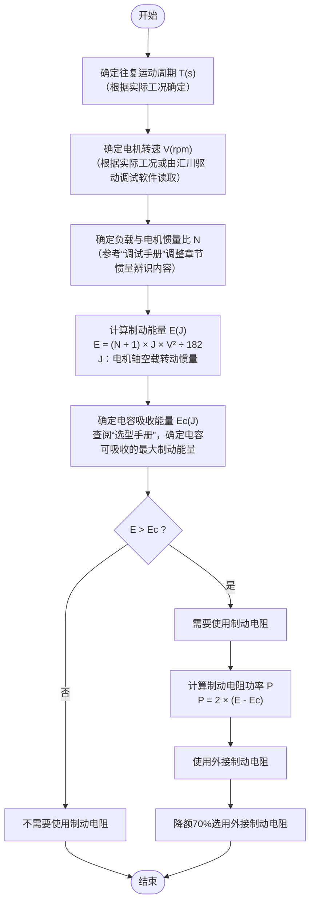

# 磁吸爬壁机器人电控总览

## 1.爬壁机器人的硬件部分
### 1.1 主控
主控使用的是汇川的PLC  
型号： EASY系列 H5U
```text
H5U是汇川自主开发的新一代小型PLC产品，支持""EtherCAT""总线通信，具备强大的运
动控制和分布式I/O控制功能，可通过FB/FC功能实现工艺的封装和复用，通过
RS485、CAN、以太网和EtherCAT接口可以实现多层次网络通信。
Easy系列全场景紧凑型中小型控制器全系列共8个机型，满足用户对中小型自动化设
备各种需求，适用于严苛体积、多轴运控、温度控制和通信组网等场景。
```


 制动电阻选型流程图如下


主控选用的设备与驱动器的厂家一致
Modbus RTU已经配置完毕


### 1.2 驱动器

 