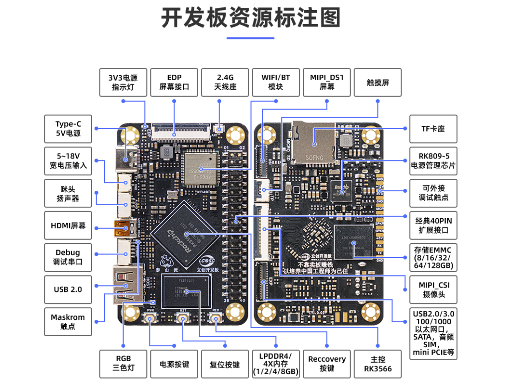
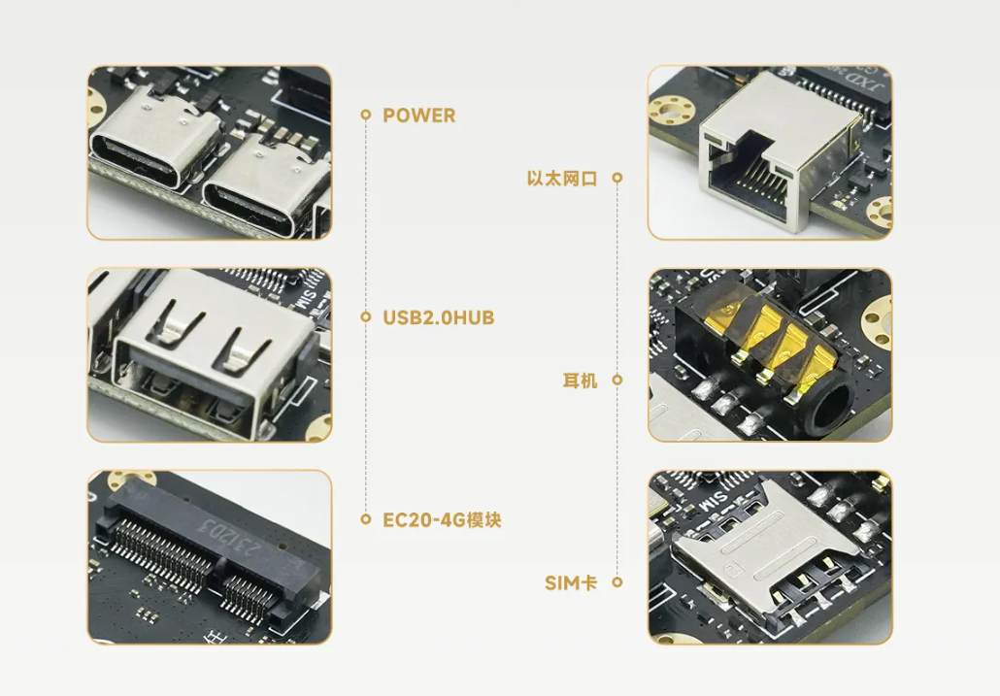
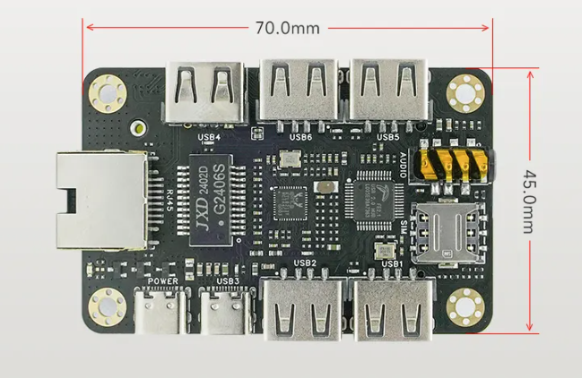
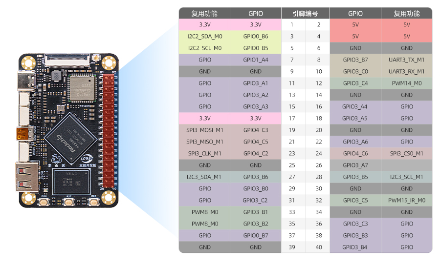

# 智能安全帽项目需求分析
## 1.项目介绍
### 1.1 项目功能及预览图
就现在掌握的情况而言，智能安全帽是一个基于泰山派的智能设备，它可以监测用户的安全状态，如是否在危险区域、是否在危险环境等。  
从技术的手法上来看，我认为这个项目与正在筹划的**机器人遥控器**属于**矛盾一致**的产品  
智能安全帽的**项目预览图**如下：  


### 1.2 项目技术难点
现在掌技术难点主要有以下几个方面：
```
1.电池的续航能力以及防爆  
2.摄像头防抖  
3.网络与定位稳定性  
```

## 2.项目硬件实现总览
### 2.1 总控制系统
鉴于本人以前的经验，我觉得RK3566系列芯片的开发板就可以。  
我现在的想法是泰山派  
[手册](https://wiki.lckfb.com/zh-hans/tspi-rk3566/download-center.html )。  

  
  
  

### 2.2 传感器
传感器列表如下
```
1.IMU  
2.相机 
3.4G通讯模块  
4.麦克风+喇叭
```

现在的供电变为了**5V2A**的**USB type-C**的接口  
已有合适的设备(焊机识别项目的技术基础)  

1. 摄像头  
    [参考的设备](https://item.taobao.com/item.htm?_u=p207tmorq669a7&id=690216988471&skuId=6146127114418)  
    建议是买两个，一个定焦一个可变焦距做测试  

2. 通讯与传感器  
    梁山派拥有经典的40pin接口  
    [来自别的设备的参考文献](https://doc.embedfire.com/linux/rk356x/quick_start/zh/latest/quick_start/40pin/gpio/gpio.html)  
      
    同时拓展版拥有4G功能能够完成通讯之需求  
    通讯以及按钮的输入可以解决，不行的话外接CH340.  

3. 麦克风与喇叭  
    麦克风与喇叭在供电上可以使用与控制板一致的电池供电方式    
    使用**I2c**作为通讯，不行就**USB**（可能负载能力不够，再解决）
    
4. 有距图传  
    图传部分使用5.8G定向+模拟信号的方式，现已基本解决。（I2S）

5. 无线图传  
    无线图传部分与巡检机器人的类似，详见相关技术文档。  

6. 实体按钮
    实体按钮现阶段暂计划装备两个，一个开关一个拍照按钮。

# 3.项目软件实现总览

## 3.1 图像传输的思路  
> [!NOTE]  
本部分详见巡检机器人的**4G图像传输**问题
>

## 3.2 远程界面  
>[!IMPORTANT]  
这一部分详细的技术实现取决于是否调用**AI大模型**的进度，暂不做规划
>
界面的规划部分，现阶段打算和**焊机视觉参数识别系统**，以及**自研遥控器**的保持一致。
