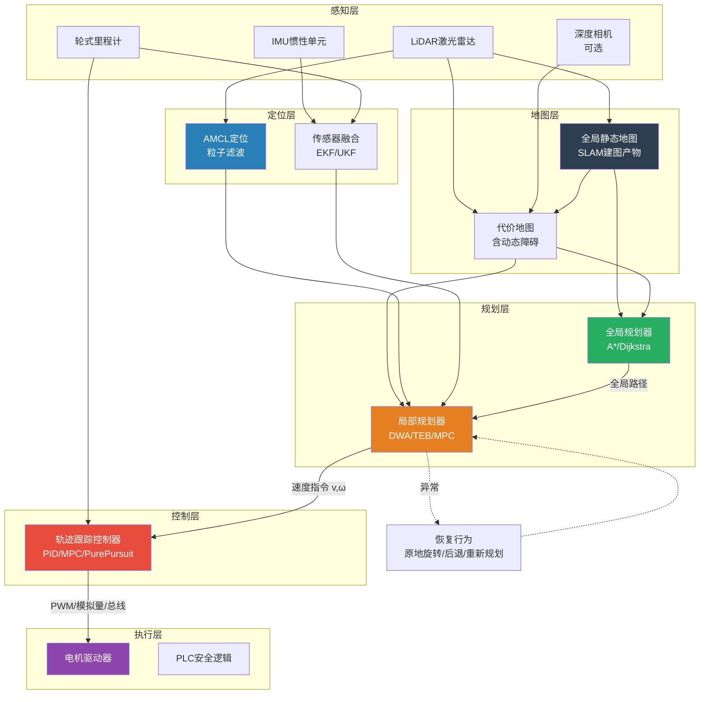
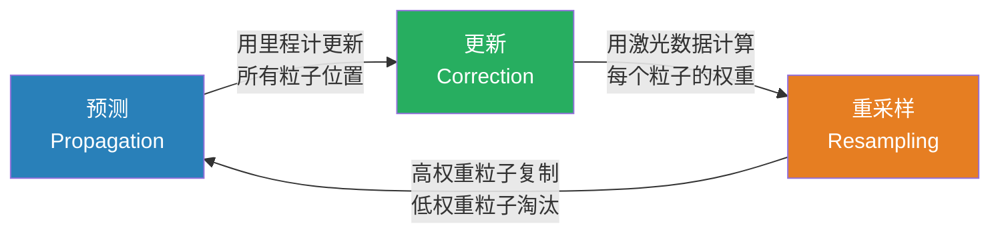
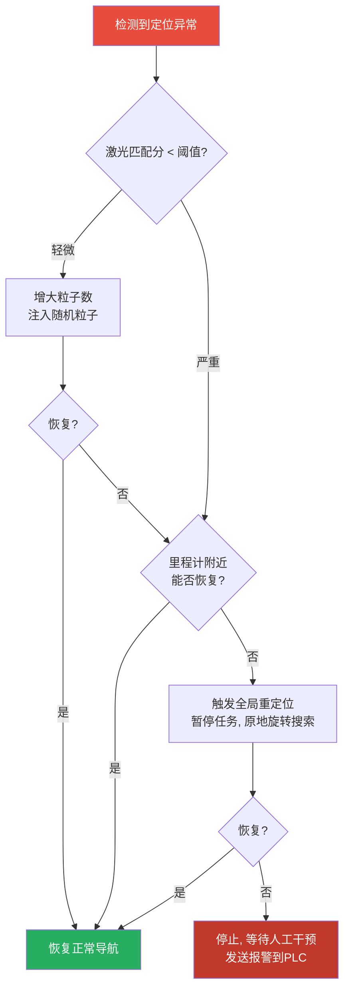
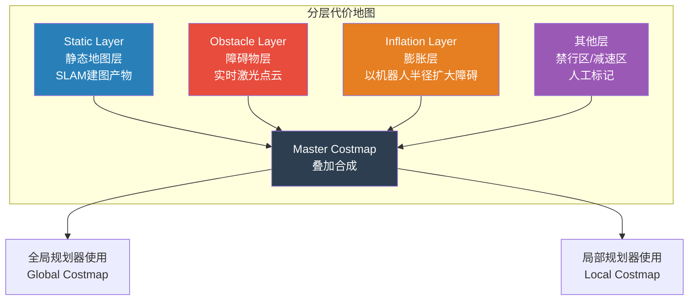
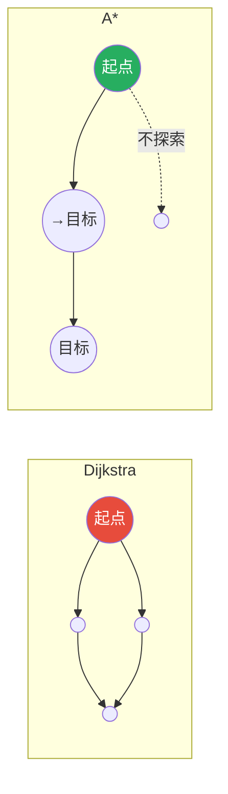
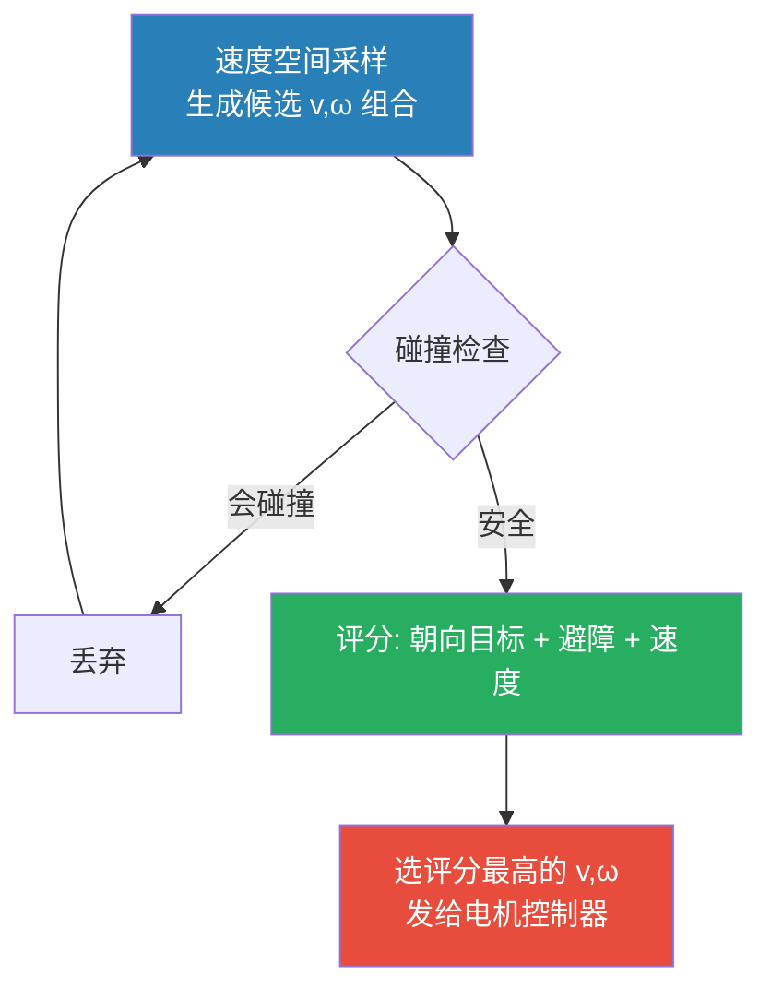
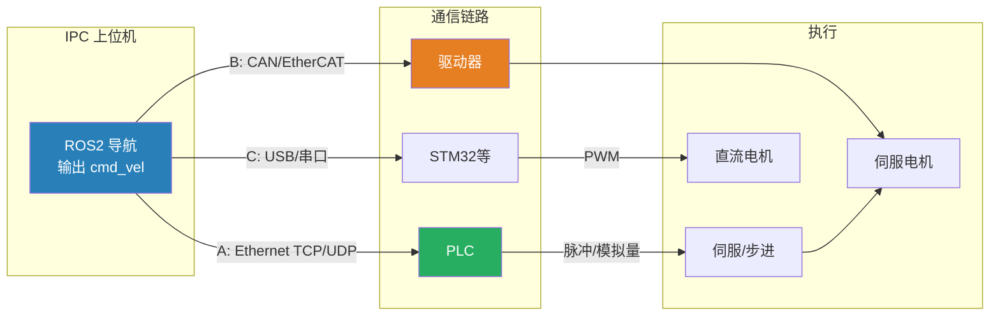
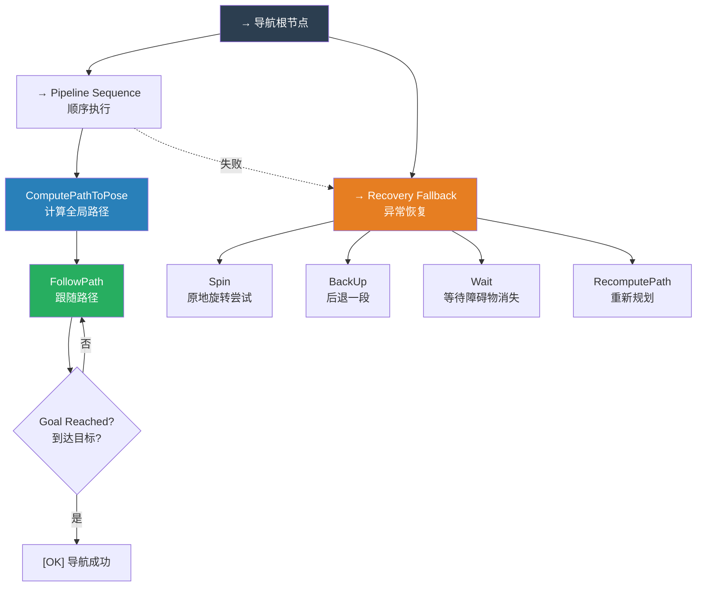
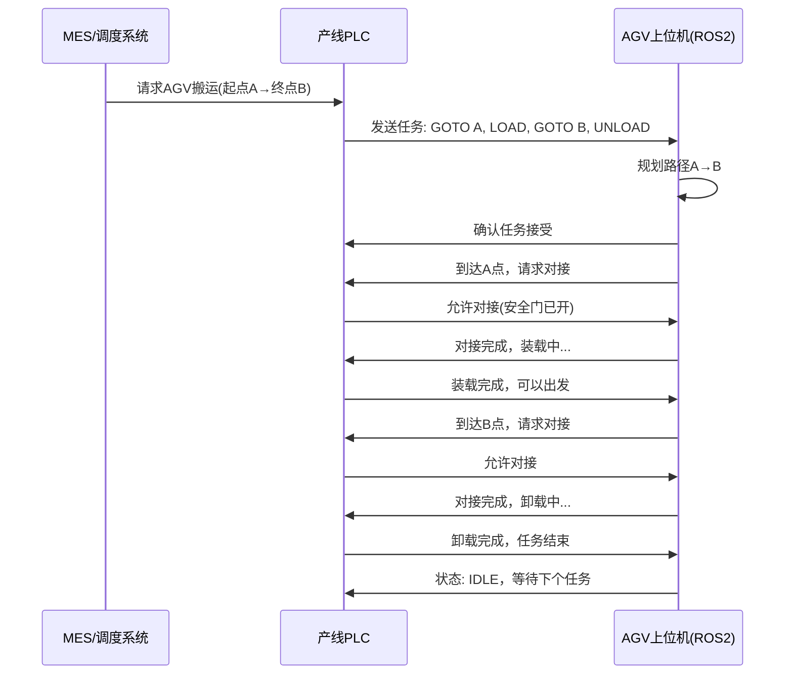

# AGV自主导航完全指南 —— 从建图到让车跑起来

> 🚀 你已经写出了激光SLAM、搞定了建图，现在地图有了，**怎么让车真正自主走起来？** 本指南从你熟悉的工控和电机控制视角出发，系统性地讲解AGV自主导航的完整技术栈——定位、路径规划、避障、运动控制、行为调度，以及如何与PLC体系对接。

---

## 目录

- [1. 全景图：AGV自主导航到底包含哪些模块](#1-全景图agv自主导航到底包含哪些模块)
  - [1.1 导航架构总览](#11-导航架构总览)
  - [1.2 类比PLC程序的思维方式](#12-类比plc程序的思维方式)
- [2. 定位：我现在在哪](#2-定位我现在在哪)
  - [2.1 为什么有地图了还需要定位](#21-为什么有地图了还需要定位)
  - [2.2 AMCL 蒙特卡洛定位](#22-amcl-蒙特卡洛定位)
  - [2.3 初始位姿的给定与全局定位](#23-初始位姿的给定与全局定位)
  - [2.4 定位丢失的检测与恢复](#24-定位丢失的检测与恢复)
  - [2.5 轮式里程计：你最熟悉的部分](#25-轮式里程计你最熟悉的部分)
- [3. 代价地图：机器人眼中的世界](#3-代价地图机器人眼中的世界)
  - [3.1 什么是代价地图](#31-什么是代价地图)
  - [3.2 静态层与动态层的分层设计](#32-静态层与动态层的分层设计)
  - [3.3 膨胀层与机器人足迹](#33-膨胀层与机器人足迹)
  - [3.4 代价地图的更新机制](#34-代价地图的更新机制)
- [4. 全局路径规划：从A点到B点的最优路线](#4-全局路径规划从a点到b点的最优路线)
  - [4.1 A* 算法与 Dijkstra](#41-a-算法与-dijkstra)
  - [4.2 其他全局规划算法一览](#42-其他全局规划算法一览)
  - [4.3 工业AGV中的路径规划特点](#43-工业agv中的路径规划特点)
- [5. 局部路径规划与实时避障](#5-局部路径规划与实时避障)
  - [5.1 为什么需要局部规划](#51-为什么需要局部规划)
  - [5.2 DWA 动态窗口法详解](#52-dwa-动态窗口法详解)
  - [5.3 TEB 时间弹性带算法](#53-teb-时间弹性带算法)
  - [5.4 MPC 模型预测控制](#54-mpc-模型预测控制)
  - [5.5 三种局部规划器的对比与选型](#55-三种局部规划器的对比与选型)
- [6. 运动控制：把路径变成电机指令](#6-运动控制把路径变成电机指令)
  - [6.1 差速轮运动学模型](#61-差速轮运动学模型)
  - [6.2 舵轮运动学模型](#62-舵轮运动学模型)
  - [6.3 轨迹跟踪控制器](#63-轨迹跟踪控制器)
  - [6.4 从ROS指令到PLC/驱动器](#64-从ros指令到plc驱动器)
- [7. 行为调度与状态机](#7-行为调度与状态机)
  - [7.1 导航状态机（Nav2行为树）](#71-导航状态机nav2行为树)
  - [7.2 异常恢复策略](#72-异常恢复策略)
  - [7.3 与产线PLC的任务交互](#73-与产线plc的任务交互)
- [8. ROS2 Nav2 实战搭建](#8-ros2-nav2-实战搭建)
  - [8.1 最小导航系统需要哪些组件](#81-最小导航系统需要哪些组件)
  - [8.2 配置文件编写指南](#82-配置文件编写指南)
  - [8.3 启动导航](#83-启动导航)
  - [8.4 发送导航目标](#84-发送导航目标)
- [9. 调试与性能优化](#9-调试与性能优化)
  - [9.1 常见问题与排查](#91-常见问题与排查)
  - [9.2 参数调优的优先级](#92-参数调优的优先级)
  - [9.3 性能benchmark指标](#93-性能benchmark指标)
- [10. 工业AGV产线落地清单](#10-工业agv产线落地清单)

---

## 1. 全景图：AGV自主导航到底包含哪些模块

### 1.1 导航架构总览



> 🔑 **从工控视角理解**：这张图本质上是一个**级联控制架构**——
> - 全局规划 = 工艺路径（类似MES给PLC的生产任务）
> - 局部规划 = 轨迹生成（类似运动控制器的插补器）
> - 运动控制 = 伺服闭环（类似你熟悉的PID三环控制）
> - 代价地图 = 安全联锁（类似安全门、光栅的信号）

### 1.2 类比PLC程序的思维方式

如果你把AGV导航系统看作一个巨大的PLC程序，各模块的对应关系如下：

| PLC 概念 | AGV 导航 |
|:---|:---|
| **主程序 OB1** 循环扫描 | ROS2 Node 的 spin 循环（传感器回调→状态更新→控制输出）|
| **功能块 FB** | Nav2 的 Plugin 机制（规划器、控制器、恢复行为） |
| **全局变量 DB** | TF 坐标变换树 + 代价地图 |
| **中断 OB** | 激光雷达/急停按钮的回调（高优先级） |
| **运动控制 MC** | 轨迹跟踪控制器 → 速度指令 |
| **安全逻辑** | 代价地图膨胀层 + 急停 + 安全PLC联动 |
| **HMI 人机界面** | Rviz2 可视化 + 调度系统任务接口 |

---

## 2. 定位：我现在在哪

### 2.1 为什么有地图了还需要定位

有了SLAM建好的地图，机器人在上面移动时，需要不停地回答一个问题：**"我在地图的哪个位置？"**

这个问题比你想象的要难——因为：

1. **轮式里程计会漂移**：轮胎打滑、地面不平、编码器累积误差，走10米可能漂移5-10cm
2. **激光数据有噪声**：动态障碍物、玻璃反射、传感器本身噪声
3. **全局定位（绑架问题）**：如果人为搬动AGV到另一个位置，它完全没有先验

**解决方案**：将里程计（高频、有漂移）和激光匹配（低频、绝对参考）融合——这正是卡尔曼滤波/粒子滤波的拿手好戏。

### 2.2 AMCL 蒙特卡洛定位

**AMCL（Adaptive Monte Carlo Localization）** 是2D激光定位的工业标准算法。

#### 核心思想

用一堆**粒子**（particle）来表示机器人可能的位置：

```
粒子 1: (x=5.1, y=3.2, θ=0.01), 权重 0.82 ✓
粒子 2: (x=5.0, y=3.3, θ=0.03), 权重 0.75 ✓
粒子 3: (x=5.2, y=3.1, θ=0.00), 权重 0.88 ✓
...
粒子 500: (x=7.8, y=1.2, θ=1.57), 权重 0.01 ✗
```

每个粒子就是一个位姿假设。AMCL循环做三件事：



**详细过程**：

**Step 1——预测（Motion Update）**：用里程计的增量 $(\Delta x, \Delta y, \Delta \theta)$ 更新每个粒子，并叠加运动噪声：

$$
\begin{bmatrix} x_i \\ y_i \\ \theta_i \end{bmatrix}_{t+1} =
\begin{bmatrix} x_i \\ y_i \\ \theta_i \end{bmatrix}_t +
\begin{bmatrix} \Delta x \cos\theta_i - \Delta y \sin\theta_i \\
\Delta x \sin\theta_i + \Delta y \cos\theta_i \\ \Delta \theta \end{bmatrix}
+ \boldsymbol{\eta}_{\text{motion}}
$$

**Step 2——更新（Measurement Update）**：对每个粒子，模拟"如果我在这里，激光应该看到什么"，与真实激光数据比较，计算似然权重 $w_i$。越接近真实观测的粒子权重越高。

**Step 3——重采样（Resampling）**：按权重随机抽取粒子，高权重粒子被复制，低权重被淘汰。如果粒子太集中（有效粒子数太少），注入随机粒子维持多样性。

**最终定位输出**：所有粒子的加权平均（或最大权重粒子簇的均值）。

> 🔧 **类比工控**：AMCL 就像编码器的**信号滤波**——原始编码器信号有抖动（粒子分散），经过滤波后得到平滑的位置信号（粒子簇的均值）。区别在于，这里不是低通滤波，而是贝叶斯滤波。

#### 关键参数

| 参数 | 含义 | 推荐值 | 对效果的影响 |
|:---|:---|:---|:---|
| `min_particles` | 最小粒子数 | 500 | 太少→定位不准；太多→CPU爆炸 |
| `max_particles` | 最大粒子数 | 2000 | 自适应调整的粒子数上限 |
| `update_min_d` | 平移多少米后更新 | 0.1m | 太小→频繁更新；太大→定位滞后 |
| `update_min_a` | 旋转多少弧度后更新 | 0.2rad | 同上 |
| `laser_likelihood_max_dist` | 激光最大匹配距离 | 2.0m | 超过此距离的激光点不参与评分 |
| `recovery_alpha_slow` | 慢恢复系数 | 0.001 | 粒子权重被"平均化"的速率 |
| `recovery_alpha_fast` | 快恢复系数 | 0.1 | 快速应对定位丢失 |

### 2.3 初始位姿的给定与全局定位

这是产线上最常被忽视的问题。

**场景1：已知初始位姿（最常见）**

AGV每天早上在上料点开机，初始位姿是已知的。在 Rviz2 中手动给定初始位姿，或通过固定的停靠点（Docking Station）自动初始化。

**场景2：全局定位（Kidnapped Robot）**

AGV被人工搬到未知位置后重新开机。AMCL 需要在整个地图上"盲搜"——此时需要大量粒子（5000-10000）均匀分布在地图上，全局搜索可能需要 10-30 秒才能收敛。

> 🏭 **产线经验**：在工业场景中，尽量避免让AGV做全局定位。给每个上料口/充电桩设置**固定的初始位姿**，AGV开机后自动以该位姿启动AMCL，几秒内就能收敛。如果确实被搬动过，人工通过HMI拖动初始位姿箭头比自动全局定位快得多。

### 2.4 定位丢失的检测与恢复

**如何判断定位丢了**：

1. **粒子发散**：粒子簇的标准差持续增大
2. **激光匹配分数骤降**：观测似然突然远低于正常水平
3. **里程计与激光定位的偏差持续增大**

**恢复策略（按优先级）**：



### 2.5 轮式里程计：你最熟悉的部分

作为电气工程师，轮式里程计的硬件你应该非常熟悉——编码器信号（ABZ相）、电机转速、减速比。这里只强调几个与导航相关的要点：

**差速轮里程计模型**：

$$
\begin{bmatrix} \dot{x} \\ \dot{y} \\ \dot{\theta} \end{bmatrix} =
\begin{bmatrix} \frac{R}{2}\cos\theta & \frac{R}{2}\cos\theta \\
\frac{R}{2}\sin\theta & \frac{R}{2}\sin\theta \\
\frac{R}{L} & -\frac{R}{L}
\end{bmatrix}
\begin{bmatrix} \omega_L \\ \omega_R \end{bmatrix}
$$

其中 $R$ 是轮子半径，$L$ 是轮距，$\omega_L, \omega_R$ 是左右轮角速度。

> ⚠️ **关键参数——轮距 $L$**：轮距的标定误差会直接导致旋转估计的累积偏差。建议做一次**原地旋转标定**——让AGV原地旋转恰好10圈，记录编码器累计角度，反算真实轮距。

---

## 3. 代价地图：机器人眼中的世界

### 3.1 什么是代价地图

代价地图（Costmap）是一张**带有通行代价的栅格地图**。与SLAM建图得到的"0=空闲, 1=占用, -1=未知"的占用栅格地图不同，代价地图给每个栅格分配一个 **0-255 的代价分数**：

| 代价 | 含义 | 对应区域 |
|:---|:---|:---|
| **0** | 自由空间，通行无代价 | 开阔地面 |
| **1-127** | 有代价但可通行 | 靠近障碍物但不致命 |
| **128-252** | 高代价，尽量避免 | 膨胀区内部 |
| **253-254** | 致命障碍 | 紧贴障碍物的膨胀区 |
| **255** | 绝对不可通行 | 激光检测到的实际障碍物 |
| **-1** 或 特殊标记 | 未知区域 | 未探索区域（可配置为可通行或不可通行） |

### 3.2 静态层与动态层的分层设计

代价地图采用**插件式分层**架构——每一层独立维护自己的栅格信息，最终按规则叠加：



**静态地图层（Static Layer）**：
- 来源：SLAM离线建图结果（pgm/yaml或自定义格式）
- 作用：提供环境的"骨架"——墙壁、柱子、固定设备

**障碍物层（Obstacle Layer）**：
- 来源：实时激光雷达数据
- 作用：检测动态障碍物（行人、叉车、临时堆放的货物）
- 关键：障碍物的**清除机制**——障碍物离开了，代价地图也要及时清除

**膨胀层（Inflation Layer）**：
- 来源：对静态层和障碍物层的处理
- 作用：将障碍物"膨胀"一个机器人半径，确保规划出的路径与障碍物保持安全距离

> 🏭 **产线技巧**：在生产线的固定通道上，可以用**禁行区（Keepout Zone）** 层标记叉车专用区域或人员密集区，让AGV规划时主动避开。这比依赖实时激光检测更可靠。

### 3.3 膨胀层与机器人足迹

**机器人足迹（Footprint）** 是AGV在地面上的投影轮廓：

```python
# 常见AGV的足迹定义（ROS2 格式）
footprint: "[[0.5, 0.4], [0.5, -0.4], [-0.5, -0.4], [-0.5, 0.4]]"
# 含义：矩形 1.0m × 0.8m，中心在机器人坐标系原点
```

**膨胀半径** = 机器人内切圆半径 + **安全余量**：

```
膨胀半径 = max(footprint宽度/2, footprint长度/2) + 安全余量

例如: 800mm × 1000mm 的AGV
- 内切圆半径 ≈ 400mm
- 安全余量: 室内 50-100mm, 室外 100-200mm
- 膨胀半径 = 400 + 50 = 450mm
```

> ⚠️ 膨胀半径设太小 → 规划路径贴墙走，稍有不慎就撞；设太大 → 看似宽的通道也规划不过去。**建议先在仿真中调好**再去产线。

### 3.4 代价地图的更新机制

代价地图不是无脑全量刷新的——那会消耗大量CPU。更新策略：

- **静态层**：只在初始化时加载一次
- **障碍物层**：每收到一帧激光数据就更新（10Hz）
- **膨胀层**：当静态层或障碍物层变化后重新计算

**局部代价地图 vs 全局代价地图**：

| | 全局代价地图 | 局部代价地图 |
|:---|:---|:---|
| **尺寸** | 覆盖整个厂区（如 100m × 80m） | 在机器人周围（如 5m × 5m） |
| **分辨率** | 粗（5cm/格） | 细（2-5cm/格） |
| **更新频率** | 低（1Hz 或按需） | 高（5-10Hz） |
| **使用者** | 全局规划器 | 局部规划器 |

---

## 4. 全局路径规划：从A点到B点的最优路线

> 📚 **本文姊妹篇**：《[全局路径规划深度解析 —— 算法原理与ROS2 Nav2实战](/posts/global-path-planning)》已发布，从Dijkstra/A\*/JPS/Theta\*/RRT\* 到 Smac Planner 的完整推导、代价地图交互、路径平滑算法对比、Nav2 插件开发手把手教程及产线调优。本节提供概览，详细推导请移步姊妹篇。

### 4.1 A* 算法与 Dijkstra

如果在PLC里写过最短路径搜索（比如自动仓储的巷道优化），你对这类算法已经有直觉。

#### Dijkstra 算法：保证最优但慢

从起点出发，像水波扩散一样向外搜索，直到碰到终点：

```
1. 起点代价=0, 其他所有节点代价=∞
2. 选择代价最小的未访问节点 u
3. 更新 u 的所有邻居: cost[v] = min(cost[v], cost[u] + edge_cost)
4. 标记 u 已访问
5. 重复2-4直到终点被访问
```

#### A* 算法：更快但需要好的启发函数

在 Dijkstra 基础上加了**启发函数**（Heuristic），优先探索"看起来离目标更近"的方向：

$$
f(n) = g(n) + h(n)
$$

- $g(n)$：从起点到节点 $n$ 的实际代价（与Dijkstra一致）
- $h(n)$：从节点 $n$ 到目标的估计代价（**启发式**）
- $f(n)$：节点 $n$ 的总评分，越小越优先探索

**常用启发函数**：

$$
h(n) = \sqrt{(x_n - x_g)^2 + (y_n - y_g)^2} \quad \text{（欧几里得距离）}
$$

> 🔑 **A* 找到最优路径的条件**：$h(n)$ 必须 **≤ 真实代价**（可容许启发式）。欧几里得距离永远小于等于实际行走距离，所以是安全的。



**A\* 在工业AGV中的实际用法**：大多数情况下，全局规划器用 A* 跑在全局代价地图的降采样版本上（分辨率 5-10cm/格），路径点再用平滑算法（如 B-spline）处理，避免折线拐角。

### 4.2 其他全局规划算法一览

| 算法 | 核心思想 | 优点 | 缺点 | 适用场景 |
|:---|:---|:---|:---|:---|
| **Dijkstra** | 无启发式广度优先 | 保证最优 | 慢，探索过多 | 网格规模小 |
| **A\*** | 加启发式的Dijkstra | 快，保证最优 | 需要好的启发函数 | ✅ 工业AGV主力 |
| **RRT** | 随机采样+树扩展 | 高维空间有效 | 路径不光滑，非最优 | 机械臂运动规划 |
| **RRT\*** | RRT + 渐进最优 | 渐近最优 | 收敛慢 | 汽车/无人机 |
| **Theta\*** | A* + 任意角度 | 路径更短更自然 | 计算量更大 | 要求路径质量的场景 |
| **Smac Planner** | 混合A* + Dubin曲线 | 考虑运动学约束 | 参数调优复杂 | Nav2 推荐方案 |

### 4.3 工业AGV中的路径规划特点

与学术demo不同，工业AGV有几个特殊需求：

**1. 路径必须可被精确跟踪**

A* 给出的折线路径（45°或90°转角），实际AGV无法完美跟踪。需要做**路径平滑**：

```
原始A*路径: ──┬──  (直角拐弯)
              │
平滑后路径: ──╯   (贝塞尔/样条平滑)
```

**2. 多AGV协同的路径规划**

在多AGV环境中，还需要**交通管制**（Traffic Control）——避免死锁和碰撞：
- 路口互斥锁（类似PLC的信号量）
- 路径预留机制
- 优先级调度

**3. 路径的持久化与复用**

工业AGV的路线通常是固定的几条（A→B→C→D）。与其每次动态规划，不如将常用路线**预先计算并缓存**，AGV只需"回放"路线。

> 🏭 **产线经验**：如果AGV只有固定的几条任务路线（如产线配送），建议**预定义路径点**（Waypoints），AGV沿着预设点顺序走。这比完全动态规划更可靠，也更容易与PLC/MES对接。

---

## 5. 局部路径规划与实时避障

> 📚 **本文姊妹篇**：《[局部路径规划与实时避障深度解析 —— DWA/TEB/MPC 原理与ROS2 Nav2实战](/posts/local-path-planning)》已发布，完整推导DWA速度采样评分的每一步、TEB时间弹性带的非线性优化建模、MPC模型预测控制的NMPC求解，ROS2 Nav2 Controller Server完整配置与自定义Critic插件开发，以及产线避障实战场景分析。本节提供概览，全部细节请移步姊妹篇。

### 5.1 为什么需要局部规划

全局规划给出了一条从A到B的宏观路线，但：

- 全局规划不关心**动态障碍物**（突然出现的行人/叉车）
- 全局规划不考虑**机器人当前速度**（在做规划时机器人已经前进了）
- 全局规划不考虑**运动学约束**（最大速度、加速度、最小转弯半径）

**局部规划器**在全局路径的引导下，实时生成短期（1-3秒内）的速度指令，兼顾以下目标：

1. **跟随全局路径**：不能偏离太远
2. **避开障碍物**：对动态障碍物快速响应
3. **满足运动学约束**：不发出AGV做不到的运动指令
4. **平滑运动**：不能突然加速/减速/转向

### 5.2 DWA 动态窗口法详解

**DWA（Dynamic Window Approach）** 是应用最广泛的局部规划器。

#### 核心思想

在**速度空间**中采样，评估每个采样速度的好坏，选最优的执行：



#### 动态窗口

"动态窗口"指的是 AGV **在当前速度下能到达的下一时刻速度范围**。受限于：

$$
\begin{aligned}
V_s &: \text{速度空间限制（物理最大值）} \\
V_a &: \text{加速度限制（从当前速度v出发可到达的速度）} \\
V_d &: \text{减速度限制（能在障碍物前停下的速度）}
\end{aligned}
$$

**最终速度窗口**：

$$
V_r = V_s \cap V_a \cap V_d
$$

一个具体的例子（差速AGV）：

```
当前速度: v=0.5 m/s, ω=0.1 rad/s
最大线速度: 1.5 m/s
最大线加速度: 0.5 m/s²
dt=0.1s 后可达的速度范围:
  v ∈ [0.5-0.5×0.1, 0.5+0.5×0.1] = [0.45, 0.55] m/s
  ω ∈ [0.1-1.0×0.1, 0.1+1.0×0.1] = [0.0, 0.2] rad/s
```

#### 评分函数

对每个候选速度 $(v, \omega)$ 计算综合评分：

$$
\text{score}(v, \omega) = \alpha \cdot \text{heading}(v, \omega) + \beta \cdot \text{clearance}(v, \omega) + \gamma \cdot \text{velocity}(v, \omega)
$$

| 评分项 | 含义 | 计算方式 |
|:---|:---|:---|
| **heading** | 朝向目标的程度 | 模拟前进一段距离后，机器人朝向与目标方向的夹角 |
| **clearance** | 与障碍物的距离 | 在该速度轨迹上，离最近障碍物的距离（越远越好） |
| **velocity** | 前进速度 | 直接就是 $v$（鼓励快速前进） |

$\alpha, \beta, \gamma$ 是权重，需要根据实际场景调优。

> 🔧 **与控制工程的类比**：DWA 的评分函数就像 MPC（模型预测控制）的**代价函数**——你模拟了多个控制输入的效果，选代价最小的。区别在于 DWA 不做连续优化，而是离散采样后比较。

### 5.3 TEB 时间弹性带算法

**TEB（Timed Elastic Band）** 是DWA的"升级版"，核心区别：

| | DWA | TEB |
|:---|:---|:---|
| **优化方式** | 离散采样 → 评分 | 连续非线性优化 |
| **规划视野** | 短（1-2秒） | 较长（3-5秒） |
| **轨迹表示** | 圆弧片段 | 一系列时间戳位姿点 |
| **约束处理** | 硬约束（碰撞直接丢弃） | 软约束（惩罚项） |
| **计算量** | 低 | 较高 |

**TEB 的核心思想**：将机器人的短时轨迹建模为一串带时间戳的位姿序列（"橡皮筋"），同时优化：

1. **路径跟随**：轨迹点沿着全局路径
2. **避障**：轨迹点远离障碍物
3. **速度/加速度约束**：相邻轨迹点之间的速度变化不能太剧烈
4. **时间最优**：在满足约束的前提下，尽量缩短时间

**何时用 TEB 而非 DWA**：
- ✅ 机器人有最小转弯半径限制（如汽车式AGV）
- ✅ 需要在狭窄空间中做精细避障
- ✅ 对轨迹光滑度要求高（如搬运易碎物品）
- ❌ 计算资源有限（如用 Raspberry Pi 跑导航）

### 5.4 MPC 模型预测控制

作为控制工程师，MPC 你应该最亲切。

**MPC for AGV navigation** 直接将机器人运动学模型嵌入优化：

**优化问题（每个控制周期）**：

$$
\begin{aligned}
\min_{\mathbf{u}_0, ..., \mathbf{u}_{N-1}} \quad & \sum_{k=0}^{N-1} \left( \|\mathbf{x}_k - \mathbf{x}_k^{\text{ref}}\|_Q^2 + \|\mathbf{u}_k\|_R^2 \right) + \|\mathbf{x}_N - \mathbf{x}_N^{\text{ref}}\|_{Q_f}^2 \\
\text{s.t.} \quad & \mathbf{x}_{k+1} = f(\mathbf{x}_k, \mathbf{u}_k) \quad \text{（运动学模型）} \\
& \mathbf{x}_k \in \mathcal{X}_{\text{free}} \quad \text{（无碰约束）} \\
& \mathbf{u}_k \in \mathcal{U} \quad \text{（速度/加速度约束）}
\end{aligned}
$$

这与你在过程控制中用的MPC**完全一样**——只是状态是位姿 $(x, y, \theta)$ 而不是温度/压力/流量。

> 🔧 **优缺点**：MPC 是三种方法中最"正确"的（理论上最优），但也是计算量最大的。在嵌入式平台上用MPC做实时导航仍是一个挑战。工业AGV中MPC更多用于**高速场景**（如 > 2m/s 的室外无人车）。

### 5.5 三种局部规划器的对比与选型

| | DWA | TEB | MPC |
|:---|:---|:---|:---|
| **计算开销** | ⭐ 低 | ⭐⭐ 中 | ⭐⭐⭐ 高 |
| **轨迹质量** | ⭐⭐ | ⭐⭐⭐ | ⭐⭐⭐⭐ |
| **调参难度** | ⭐⭐ 中 | ⭐⭐⭐ 中高 | ⭐⭐⭐⭐ 高 |
| **适合AGV类型** | 差速轮 | 差速轮/舵轮/汽车式 | 全部 |
| **适合速度** | < 1.5 m/s | < 2.0 m/s | 任意 |
| **ROS2 Nav2支持** | ✅ 原生 | ✅ 原生 | ⚠️ 第三方 |
| **推荐场景** | ✅ 室内仓储AGV | ✅ 高精度搬运 | 高速室外无人车 |

> 🏭 **产线建议**：**从DWA入手**。90%的室内AGV场景DWA完全够用。先把DWA调好让车跑起来，跑的过程中如果发现轨迹不够平滑、拐弯太生硬、避障太保守，再切到TEB。不要一上来就追求"高级"算法——参数都调不明白。

---

## 6. 运动控制：把路径变成电机指令

> 📚 **本文姊妹篇**：《[AGV运动控制深度解析 —— 从cmd_vel到电机指令的完整链路](/posts/motion-control)》已发布，完整覆盖差速/舵轮/麦克纳姆轮运动学推导、速度环PID整定、ros2_control硬件接口开发（含完整C++ Modbus驱动代码）、CANopen/EtherCAT/Modbus/脉冲五种通信方案代码实现、里程计标定方法、以及PLC安全架构（含结构化文本ST代码）。本节提供概览，全部工程细节请移步姊妹篇。

### 6.1 差速轮运动学模型

这是最常见的AGV底盘形式，两轮独立驱动：

$$
\dot{\mathbf{x}} = \begin{bmatrix} \dot{x} \\ \dot{y} \\ \dot{\theta} \end{bmatrix} =
\begin{bmatrix} \frac{R}{2}\cos\theta & \frac{R}{2}\cos\theta \\
\frac{R}{2}\sin\theta & \frac{R}{2}\sin\theta \\
\frac{R}{L} & -\frac{R}{L} \end{bmatrix}
\begin{bmatrix} \omega_L \\ \omega_R \end{bmatrix}
$$

**逆运动学**（从目标速度 $v, \omega$ 到轮速）：

$$
\begin{bmatrix} \omega_L \\ \omega_R \end{bmatrix} =
\frac{1}{R}
\begin{bmatrix} 1 & L/2 \\ 1 & -L/2 \end{bmatrix}
\begin{bmatrix} v \\ \omega \end{bmatrix}
$$

转换为电机转速（rpm）：

$$
n_L = \frac{60}{2\pi} \cdot \frac{\omega_L}{i}, \quad n_R = \frac{60}{2\pi} \cdot \frac{\omega_R}{i}
$$

其中 $i$ 是减速比。**这个公式你应该非常熟悉**。

### 6.2 舵轮运动学模型

舵轮（Steering Wheel）AGV更像汽车——一个驱动转向轮 + 若干从动轮。运动学约束为阿克曼转向：

$$
\dot{x} = v\cos\theta, \quad \dot{y} = v\sin\theta, \quad \dot{\theta} = \frac{v}{L}\tan\phi
$$

其中 $\phi$ 是转向角，$L$ 是轴距。

**注意**：舵轮AGV有**最小转弯半径** $R_{\min} = L / \tan\phi_{\max}$。DWA 和 TEB 都需要配置这个约束，否则规划器可能给出AGV做不出来的转弯。

### 6.3 轨迹跟踪控制器

局部规划器输出的是参考速度 $(v_{\text{ref}}, \omega_{\text{ref}})$ 或参考轨迹点。**控制器**负责把这个转化为电机的实际指令。

#### 方案A：直接速度控制

最简单的方式——直接用局部规划器的输出：

```
目标线速度 v_cmd = v_ref (前馈) + Kp_v * (v_ref - v_actual) (反馈)
目标角速度 ω_cmd = ω_ref (前馈) + Kp_ω * (ω_ref - ω_actual) (反馈)

然后通过逆运动学转为轮速 → 发给电机驱动器
```

这里的 $Kp_v, Kp_ω$ 就是你在伺服驱动里天天调的 **速度环PI参数**。

#### 方案B：Pure Pursuit（纯追踪）

用几何方法跟踪路径——在参考路径上找一个"前瞻点"（Look-ahead Point），计算到达该点需要的曲率：

$$
\kappa = \frac{2 \cdot |y_{\text{error}}|}{L_d^2}
$$

其中 $L_d$ 是前瞻距离，$y_{\text{error}}$ 是横向误差。然后 $\omega = v \cdot \kappa$。

> 🔧 **类比**：这就像人类开车——盯着前方一段距离的路面，而不是盯着前轮正下方的路面。

#### 方案C：Stanley 控制器

用于**舵轮AGV**（汽车式），结合横向误差和航向误差：

$$
\phi = \theta_e + \arctan\left(\frac{k \cdot y_e}{v}\right)
$$

其中 $\theta_e$ 是航向误差，$y_e$ 是横向误差，$k$ 是增益。

#### 方案D：MPC 控制器

将轨迹跟踪也建模为MPC问题——这是**性能最优**但实现最复杂的方式。

### 6.4 从ROS指令到PLC/驱动器

这是电气工程师最关心的环节——**怎么把ROS算出来的速度指令发到实际的电机上？**



#### 方案A：上位机 ↔ PLC（推荐工业方案）

```python
# ROS2 侧：发布 /cmd_vel 的同时，通过 Modbus TCP 发给PLC
import minimalmodbus

class AGVModbusDriver:
    def __init__(self, port='/dev/ttyUSB0', slave_id=1):
        self.instrument = minimalmodbus.Instrument(port, slave_id)
        self.instrument.serial.baudrate = 115200
    
    def send_velocity(self, v_linear, v_angular):
        """发送速度指令到PLC"""
        # 寄存器映射（与PLC侧约定）：
        # 40001: 线速度 (mm/s, INT16)
        # 40002: 角速度 (mrad/s, INT16)
        # 40003: 控制字 (BIT0=使能, BIT1=急停)
        self.instrument.write_register(40001, int(v_linear * 1000))
        self.instrument.write_register(40002, int(v_angular * 1000))
        self.instrument.write_register(40003, 0x0001)  # 使能
```

```iecst
// PLC 侧（Codesys/ TwinCAT）：接收Modbus TCP并控制电机
PROGRAM AGV_MotionControl
VAR
    // Modbus 接收
    v_target: REAL;    // 目标线速度 m/s
    w_target: REAL;    // 目标角速度 rad/s
    
    // 逆运动学计算
    wheel_radius: REAL := 0.15;  // 轮半径 150mm
    wheel_base: REAL := 0.60;    // 轮距 600mm
    ratio: REAL := 20.0;         // 减速比
    left_speed_rpm: REAL;
    right_speed_rpm: REAL;
    
    // 速度PID
    pid_left: FB_PID;
    pid_right: FB_PID;
    
    // 电机输出
    left_analog_out: INT;   // 0-10V 对应 0-3000rpm
    right_analog_out: INT;
END_VAR

// 逆运动学: (v, ω) → (ω_L, ω_R)
left_speed_rpm := (v_target + w_target * wheel_base / 2.0) / wheel_radius * 60.0 / (2.0 * 3.14159) * ratio;
right_speed_rpm := (v_target - w_target * wheel_base / 2.0) / wheel_radius * 60.0 / (2.0 * 3.14159) * ratio;

// PID 速度环
pid_left(Setpoint := left_speed_rpm, Actual := encoder_left_speed);
pid_right(Setpoint := right_speed_rpm, Actual := encoder_right_speed);

// 输出到驱动器
left_analog_out := REAL_TO_INT(pid_left.Output * 32767 / 10.0);  // ±10V
right_analog_out := REAL_TO_INT(pid_right.Output * 32767 / 10.0);
```

#### 方案B：ROS2 直连驱动器（EtherCAT/CANopen）

ROS2 有 `ros2_control` 框架可以直接通过工业总线控制电机——但这要求电机驱动器有对应的 ROS2 硬件接口驱动。对汇川、台达等国产驱动器，可能没有现成的 ROS2 driver，需要自己写。

> 🏭 **产线建议**：对工业AGV，推荐**方案A（ROS2 → 协议网关 → PLC）**。好处是PLC继续承担安全逻辑（急停、安全门、光栅），ROS2只负责"算"（导航），不直接控制执行器。这样的安全架构更容易通过CE/UL认证。

---

## 7. 行为调度与状态机

> 📚 **本文姊妹篇**：《[AGV行为调度与状态机深度解析 —— 从Nav2行为树到产线任务编排](/posts/behavior-scheduling)》已发布，从PLC SFC/Grafcet到行为树的完整演进逻辑、Nav2默认行为树节点逐一解剖（含Tick时序追踪）、Spin/BackUp/Wait恢复行为详解与自定义插件开发（含C++代码）、MES→PLC→AGV三层任务调度架构、多AGV交通管制与死锁检测、固定循环与动态派发任务编排。本节提供概览，全部细节请移步姊妹篇。

### 7.1 导航状态机（Nav2行为树）

Nav2 使用**行为树（Behavior Tree）** 而非传统的有限状态机（FSM）来管理导航流程：



> 🔧 **与PLC编程的类比**：行为树 ≈ **顺序功能图（SFC/Grafcet）** + **异常处理OB**。Pipeline Sequence 是正常的步进流程；Recovery Fallback 是异常处理分支。区别在于行为树是**自顶向下**的tick驱动（每周期从根节点开始评估），而SFC是**状态转移**驱动。

### 7.2 异常恢复策略

工业AGV最怕的不是跑得慢，而是**卡住不动**。以下是最常见的卡住场景和恢复策略：

| 卡住场景 | 原因 | 恢复行为 | PLC侧安全监控 |
|:---|:---|:---|:---|
| 前方突然出现障碍物 | 行人穿过 | Wait(3s) → 如还在→RecomputePath | 声光报警 |
| 路径被永久阻挡 | 叉车停路中间 | Wait(5s)→BackUp→RecomputePath→仍不通→请求人工 | 超时报警 |
| 定位漂移误判碰撞 | 里程计漂了 | Spin→重新确认位置→RecomputePath | 激光区域检测 |
| 走到死胡同 | 规划失败 | BackUp→RecomputePath→仍失败→全局重规划 | 任务超时报警 |
| 电机故障/过流 | 硬件问题 | 急停 | 驱动器报警信号 |
| 通信中断 | 网络/WiFi | 减速停车 | 心跳超时检测 |

> 🏭 **铁律**：PLC 永远拥有**最终控制权**。ROS2 IPC 挂了，PLC 必须能独立执行安全停车。不要设计成"ROS2挂了PLC就没法控制电机"的架构。

### 7.3 与产线PLC的任务交互

一个典型的产线AGV任务交互流程：



**通信协议建议**：

| 层级 | 协议 | 内容 |
|:---|:---|:---|
| MES ↔ PLC | OPC UA / Modbus TCP | 生产任务下发 |
| PLC ↔ AGV | Modbus TCP / TCP Socket | 任务指令 + 状态反馈 + 安全联锁 |
| 频率 | 10-50Hz | — |
| 超时 | 500ms（超时触发安全停车） | — |

---

## 8. ROS2 Nav2 实战搭建

### 8.1 最小导航系统需要哪些组件

要让AGV在ROS2 Nav2下跑起来，你需要提供以下节点/组件：

```
                    ┌──────────────────┐
                    │   Nav2 导航框架   │
                    │                  │
 map_server ───────►│  Global Costmap  │──► Global Planner (A*/Smac)
 (静态地图)          │                  │
                    │  Local Costmap   │──► Local Planner (DWA/TEB)
 laser_scan ───────►│                  │
 (激光数据)          │  AMCL Location   │──► Controller (PID/PurePursuit)
                    │                  │
 /odom ────────────►│  Behavior Tree   │──► Recovery Actions
 (里程计)            │                  │
                    └────────┬─────────┘
                             │ /cmd_vel (v, ω)
                             ▼
                    ┌──────────────────┐
                    │  你的电机驱动节点  │──► 电机
                    └──────────────────┘
```

**你必须提供的**：
1. **TF 变换树**：`map → odom → base_link → laser_link`
2. **`/odom` 话题**：里程计数据（`nav_msgs/Odometry`）
3. **`/scan` 话题**：激光数据（`sensor_msgs/LaserScan`）
4. **速度执行器**：接收 `/cmd_vel` 并驱动电机
5. **静态地图**：SLAM建图产出的 pgm + yaml

### 8.2 配置文件编写指南

Nav2 的配置集中在 `nav2_params.yaml`，以下是最关键的部分：

```yaml
# ==========================================
# nav2_params.yaml 关键配置
# ==========================================

amcl:
  ros__parameters:
    # 粒子滤波器
    min_particles: 500
    max_particles: 2000
    # 更新阈值
    update_min_d: 0.1        # 平移0.1m更新
    update_min_a: 0.2        # 旋转0.2rad更新
    # 激光模型
    laser_model_type: likelihood_field
    laser_likelihood_max_dist: 2.0
    # 初始位姿协方差（已知初始位姿时设小，全局定位时设大）
    initial_pose: [0.0, 0.0, 0.0]
    set_initial_pose: false   # 改为true强制给定初始位姿

global_costmap:
  ros__parameters:
    # 全局代价地图尺寸（覆盖整个厂区）
    width: 2000      # 100m / 0.05m = 2000格
    height: 1600     # 80m / 0.05m
    resolution: 0.05 # 5cm/格
    robot_radius: 0.4
    plugins: ["static_layer", "obstacle_layer", "inflation_layer"]
    
local_costmap:
  ros__parameters:
    # 局部代价地图尺寸（围绕机器人）
    width: 100       # 5m / 0.05m
    height: 100
    resolution: 0.05
    robot_radius: 0.4
    plugins: ["obstacle_layer", "inflation_layer"]
    # 障碍物层
    obstacle_layer:
      observation_sources: laser
      laser:
        topic: /scan
        max_obstacle_height: 2.0
        clearing: true
        marking: true

planner_server:
  ros__parameters:
    planner_plugins: ["GridBased"]
    GridBased:
      plugin: "nav2_smac_planner/SmacPlanner2D"
      tolerance: 0.5            # 目标容差 0.5m
      downsample_costmap: true  # 降采样加速
      downsampling_factor: 2

controller_server:
  ros__parameters:
    controller_plugins: ["FollowPath"]
    FollowPath:
      plugin: "dwb_core::DWBLocalPlanner"
      # DWA 参数
      min_vel_x: -0.1     # 允许小幅后退
      max_vel_x: 1.0      # 最大线速度 1m/s
      max_vel_theta: 1.5  # 最大角速度 1.5rad/s
      acc_lim_x: 0.5      # 线加速度
      acc_lim_theta: 1.0  # 角加速度
      # 评分权重
      critics: ["RotateToGoal", "Oscillation", "BaseObstacle", "GoalAlign",
                "PathAlign", "PathDist", "GoalDist"]
      PathAlign.scale: 32.0
      GoalDist.scale: 24.0
      PathDist.scale: 32.0
      GoalAlign.scale: 24.0

behavior_server:
  ros__parameters:
    # 恢复行为
    local_costmap_topic: local_costmap/costmap_raw
    global_costmap_topic: global_costmap/costmap_raw
    cycle_frequency: 10.0
    # Spin 恢复
    spin:
      plugin: "nav2_behaviors/Spin"
    # BackUp 恢复
    back_up:
      plugin: "nav2_behaviors/BackUp"
    # Wait 恢复
    wait:
      plugin: "nav2_behaviors/Wait"
```

### 8.3 启动导航

```bash
# 1. 启动地图服务器（加载SLAM建好的地图）
ros2 run nav2_map_server map_server --ros-args \
  -p yaml_filename:=/path/to/map.yaml

# 2. 启动AMCL定位
ros2 run nav2_amcl amcl --ros-args \
  --params-file /path/to/nav2_params.yaml

# 3. 启动 Nav2 核心
ros2 launch nav2_bringup navigation_launch.py \
  params_file:=/path/to/nav2_params.yaml \
  map:=/path/to/map.yaml

# 4. 初始化位姿（在Rviz2中点击"2D Pose Estimate"）
```

### 8.4 发送导航目标

```python
#!/usr/bin/env python3
"""向Nav2发送导航目标"""

import rclpy
from rclpy.node import Node
from geometry_msgs.msg import PoseStamped
from nav2_msgs.action import NavigateToPose
from rclpy.action import ActionClient


class AGVNavCommander(Node):
    def __init__(self):
        super().__init__('agv_nav_commander')
        self.nav_client = ActionClient(self, NavigateToPose, 'navigate_to_pose')
    
    def send_goal(self, x, y, yaw_deg):
        """发送导航目标（地图坐标系）"""
        from scipy.spatial.transform import Rotation
        
        goal = NavigateToPose.Goal()
        goal.pose.header.frame_id = 'map'
        goal.pose.pose.position.x = x
        goal.pose.pose.position.y = y
        
        # 四元数方向
        q = Rotation.from_euler('z', yaw_deg, degrees=True).as_quat()
        goal.pose.pose.orientation.z = q[2]
        goal.pose.pose.orientation.w = q[3]
        
        self.nav_client.wait_for_server()
        future = self.nav_client.send_goal_async(goal)
        future.add_done_callback(self.goal_response_callback)
    
    def goal_response_callback(self, future):
        goal_handle = future.result()
        if not goal_handle.accepted:
            self.get_logger().error('导航目标被拒绝！')
            return
        self.get_logger().info('导航目标已接受，AGV出发！')
        goal_handle.get_result_async().add_done_callback(self.result_callback)
    
    def result_callback(self, future):
        result = future.result().result
        self.get_logger().info(f'导航完成！耗时: {result.total_elapsed_time}')


# 使用
# commander = AGVNavCommander()
# commander.send_goal(x=5.0, y=3.0, yaw_deg=90)
```

---

## 9. 调试与性能优化

### 9.1 常见问题与排查

| 问题 | 可能原因 | 检查方法 |
|:---|:---|:---|
| **AGV不走** | `/cmd_vel` 未发出或被阻塞 | `ros2 topic echo /cmd_vel` |
| **AGV走歪** | 轮距参数不对 | 做原地旋转标定 |
| **AGV撞墙** | 膨胀半径太小；激光视野有盲区 | 增大膨胀半径；加装侧向激光 |
| **AGV频繁停下重规划** | 代价地图更新太激进 | 增大障碍物清除时间；降低激光灵敏度 |
| **定位跳变** | 粒子数不足；环境特征太少 | 增大粒子数；在空旷区域加反光板 |
| **CPU 100%** | 代价地图分辨率太高；粒子数太多 | 降采样；减少粒子数 |
| **导航到不了目标** | 目标容差太小；目标在障碍物里 | 增大容差；检查目标点合法性 |

### 9.2 参数调优的优先级

按这个顺序调，不要同时调多个参数：

```
1. 先调运动控制（PID速度环）        ← 车能走稳是第一优先级
2. 再调里程计参数（轮距、轮径）      ← 定位的基础
3. 调AMCL粒子数 & 更新阈值          ← 定位准确
4. 调代价地图膨胀半径                ← 安全距离
5. 调DWA速度/加速度限制              ← 运动性能
6. 调DWA评分权重                     ← 运动品质
7. 调恢复行为参数                    ← 异常处理
```

### 9.3 性能benchmark指标

| 指标 | 目标值 | 测试方法 |
|:---|:---|:---|
| **定位精度** | < 5cm, < 2° | 让AGV走到标记点，用卷尺量偏差 |
| **路径跟踪误差** | < 10cm | 在直线上走20m，量最大横向偏差 |
| **避障反应时间** | < 200ms | 突然在人前方1m处放下纸箱，测量停车距离 |
| **导航CPU占用** | < 50%（IPC） | `htop` 观察 |
| **定位恢复时间** | < 5s（已知初始位姿） | 模拟定位丢失后自动恢复 |
| **停车精度** | < 3cm, < 2° | 10次自动导航到同一点，量散布 |

---

## 10. 工业AGV产线落地清单

在你的AGV正式上产线之前，确认以下每一项：

```
□ 硬件
  □ 激光雷达安装牢固，水平校准完成
  □ 所有编码器信号正常，里程计标定完成
  □ 急停按钮回路正常（按急停→PLC→电机断电）
  □ 安全PLC独立于导航IPC，可独立停车
  □ 声光报警器正常工作
  □ 电池电量监测与低电量自动回充

□ 地图与定位
  □ SLAM地图覆盖所有运行区域
  □ 地图精度验证（关键点位误差 < 5cm）
  □ AMCL初始位姿自动设置（停靠点）
  □ 定位丢失自动恢复机制已测试

□ 导航
  □ DWA/TEB参数离线仿真验证
  □ 所有常用路径实测通过（至少10次/路径）
  □ 动态避障测试（行人突然出现）
  □ 最窄通道可以通过（至少重复20次）

□ 通信
  □ PLC ↔ IPC 通信稳定（丢包率 < 0.1%）
  □ 通信超时 → 安全停车 机制已验证
  □ MES任务下发 → AGV执行 → 反馈 全链路打通

□ 安全
  □ 安全PLC独立于ROS2（IPC挂了不影响安全回路）
  □ 安全光栅/激光区域扫描仪正常工作
  □ 最大速度机械限位（即使ROS2发出异常指令也不会超速）
  □ 碰撞传感器/触边正常工作

□ 运维
  □ 标定结果至少3份备份
  □ 关键日志自动保存与远程查看
  □ 操作手册 + 常见故障处理SOP 已编写
  □ 操作人员已培训
```

---

> 📝 *本指南与本站姊妹篇《[激光SLAM入门完全指南](/posts/lidar-slam-guide)》和《[激光SLAM数学基础详解](/posts/lidar-slam-math)》构成完整知识体系：建图 → 数学 → 导航。*
>
> *让AGV真正跑起来，80%的工作不在算法而在工程——通信、标定、安全、可靠性。这正是电气工程师的核心优势所在。*
