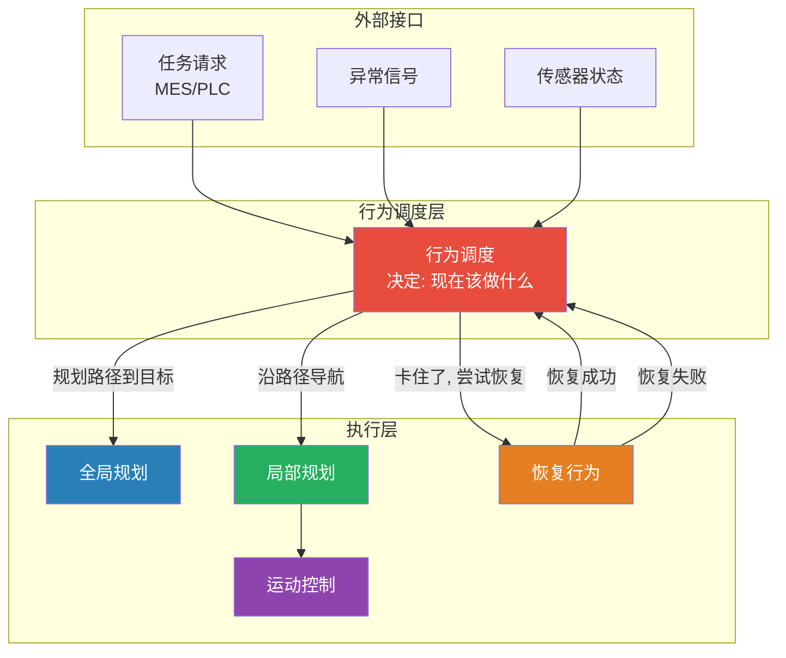
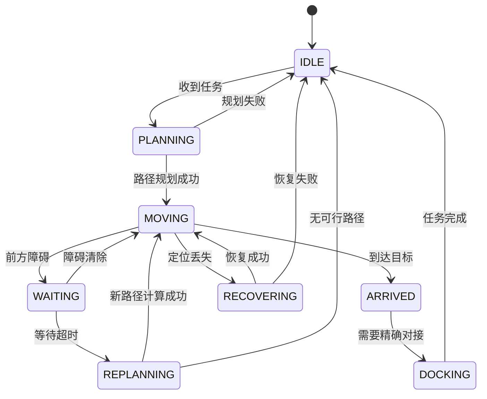
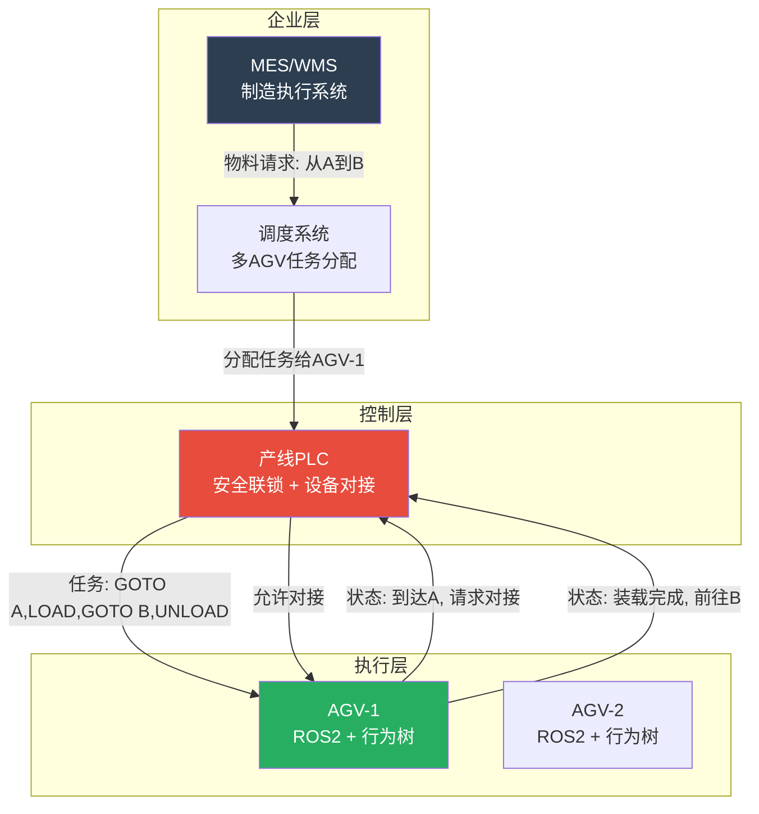

# AGV行为调度与状态机深度解析 —— 从Nav2行为树到产线任务编排

> 🧠 如果说SLAM是眼睛、规划器是大脑、运动控制是手脚——那么**行为调度就是AGV的前额叶皮层**。它决定"现在该做什么"、"遇到问题怎么办"、"任务完成后下一个是什么"。本指南从你最熟悉的PLC状态机（SFC/Grafcet）出发，系统讲解AGV行为调度的完整设计与实现。

---

## 目录

- [1. 行为调度在AGV系统中的角色](#1-行为调度在agv系统中的角色)
  - [1.1 为什么需要行为调度](#11-为什么需要行为调度)
  - [1.2 一个直观的例子：AGV的一次送货任务](#12-一个直观的例子agv的一次送货任务)
  - [1.3 与PLC编程的思维映射](#13-与plc编程的思维映射)
- [2. 有限状态机 FSM——你已掌握的基础](#2-有限状态机-fsm你已掌握的基础)
  - [2.1 FSM的基本概念](#21-fsm的基本概念)
  - [2.2 用FSM实现AGV控制：简单但脆弱](#22-用fsm实现agv控制简单但脆弱)
  - [2.3 FSM的局限性：为什么Nav2不用它](#23-fsm的局限性为什么nav2不用它)
- [3. 行为树 Behavior Tree——现代AGV的标准](#3-行为树-behavior-tree现代agv的标准)
  - [3.1 行为树的核心概念](#31-行为树的核心概念)
  - [3.2 节点类型详解](#32-节点类型详解)
  - [3.3 Tick 机制：每周期从根节点重新评估](#33-tick-机制每周期从根节点重新评估)
  - [3.4 行为树 vs FSM 的根本区别](#34-行为树-vs-fsm-的根本区别)
- [4. Nav2 默认行为树深度解剖](#4-nav2-默认行为树深度解剖)
  - [4.1 导航主树](#41-导航主树)
  - [4.2 恢复子树](#42-恢复子树)
  - [4.3 每个节点的作用与成功/失败条件](#43-每个节点的作用与成功失败条件)
  - [4.4 行为树在导航中的实际执行轨迹](#44-行为树在导航中的实际执行轨迹)
- [5. 恢复行为详解](#5-恢复行为详解)
  - [5.1 Spin 原地旋转恢复](#51-spin-原地旋转恢复)
  - [5.2 BackUp 后退恢复](#52-backup-后退恢复)
  - [5.3 Wait 等待恢复](#53-wait-等待恢复)
  - [5.4 自定义恢复行为插件](#54-自定义恢复行为插件)
  - [5.5 恢复行为的编排策略](#55-恢复行为的编排策略)
- [6. 任务调度与产线集成](#6-任务调度与产线集成)
  - [6.1 AGV任务的层级结构](#61-agv任务的层级结构)
  - [6.2 MES/调度系统 ↔ PLC ↔ AGV 三层架构](#62-mes调度系统--plc--agv-三层架构)
  - [6.3 任务管理器的实现](#63-任务管理器的实现)
  - [6.4 充电与待命调度](#64-充电与待命调度)
- [7. 多AGV协同调度](#7-多agv协同调度)
  - [7.1 交通管制的三种方案](#71-交通管制的三种方案)
  - [7.2 路口互斥锁实现](#72-路口互斥锁实现)
  - [7.3 死锁预防与检测](#73-死锁预防与检测)
- [8. 产线任务编排实战](#8-产线任务编排实战)
  - [8.1 固定循环任务](#81-固定循环任务)
  - [8.2 动态派发任务](#82-动态派发任务)
  - [8.3 异常中断与恢复](#83-异常中断与恢复)
- [9. 调试与可视化](#9-调试与可视化)
  - [9.1 Groot2：行为树的可视化编辑器](#91-groot2行为树的可视化编辑器)
  - [9.2 行为树运行时监控](#92-行为树运行时监控)

---

## 1. 行为调度在AGV系统中的角色

### 1.1 为什么需要行为调度

你已经有了SLAM（知道自己在哪）、全局规划（知道怎么走）、局部规划（知道怎么避开障碍物）、运动控制（知道怎么驱动电机）。但谁来决定**什么时候调用哪个模块**？

这就是**行为调度**——它是整个导航系统的"总指挥"：



**行为调度回答的问题**：

1. **正常流程**：目标来了 → 计算路径 → 沿路径走 → 到达 → 报告完成
2. **遇到障碍**：前方有人 → 尝试从侧面绕 → 绕不过去就等待 → 等太久就换路
3. **异常情况**：定位丢了 → 原地旋转重新定位 → 找不到就报警
4. **任务切换**：当前任务被取消 → 安全停车 → 接受新任务
5. **资源管理**：电量低 → 完成当前任务 → 拒绝新任务 → 去充电

### 1.2 一个直观的例子：AGV的一次送货任务

```
任务: 从上料点A搬运物料到下料点B

1. 收到任务 "GOTO_A → LOAD → GOTO_B → UNLOAD"
2. 行为调度器解析任务:
   ├── 当前状态: IDLE
   ├── 目标状态: 完成送货
   └── 规划子任务序列:
       ① GOTO 上料点A
       ② 对接传送带，装载物料
       ③ GOTO 下料点B
       ④ 对接传送带，卸载物料
3. 执行 ① GOTO_A:
   a. 调用全局规划器 → 得到路径
   b. 调用局部规划器 → 开始沿路径移动
   c. 每50ms检查: 到目标了? 有障碍? 定位OK?
   d. 第120秒: 前方出现叉车
      → 局部规划器自动减速等待
      → 等待5秒后叉车离开 → 继续前进
   e. 第150秒: 到达上料点A
      → 报告 PLC: "到位, 请求对接"
   f. PLC 回复: "允许对接"
4. 执行 ② LOAD:
   a. 对接传送带（精确位置控制）
   b. 等待物料装载完成信号
   c. PLC 回复: "装载完成"
5. 执行 ③ GOTO_B: ...（类似①）
6. 执行 ④ UNLOAD: ...（类似②）
7. 报告 MES: "任务完成"
8. 回到 IDLE，等待下一个任务
```

### 1.3 与PLC编程的思维映射

作为PLC工程师，行为调度是你最容易理解的部分——它本质上就是**主程序（OB1）+ 顺序功能图（SFC）+ 中断处理（OB）**：

| PLC 概念 | AGV 行为调度 |
|:---|:---|
| **主程序 OB1** | 行为树的 Root Tick（每周期从根节点重新评估） |
| **顺序功能图 SFC** | Sequence 节点（顺序执行子任务） |
| **条件跳转** | Fallback 节点（优先级选择：A不行就B） |
| **并行分支** | Parallel 节点（同时做多件事） |
| **功能块 FB** | Behavior Tree Plugin（可复用的行为单元） |
| **全局数据块 DB** | Blackboard（行为树的共享数据区） |
| **中断 OB** | 传感器回调（高优先级事件） |
| **超时 TON** | Timeout 装饰器节点 |
| **循环 FOR** | Retry 装饰器节点 |

> 🔑 **核心差异**：SFC 是**状态转移驱动**的——"当条件满足时从状态A转移到状态B"。行为树是**Tick驱动**的——"每个周期从根节点开始，重新决定应该处于什么状态"。

---

## 2. 有限状态机 FSM——你已掌握的基础

### 2.1 FSM的基本概念

有限状态机由三个要素组成：

```
FSM = (状态, 事件, 转移)
```

**一个简单的AGV状态机（你在PLC里可能已经写过类似的）**：



### 2.2 用FSM实现AGV控制：简单但脆弱

以下是用结构化文本（ST）写的一个简化AGV FSM：

```iecst
// ================================================================
//  AGV 导航状态机 —— 结构化文本 (IEC 61131-3)
//  这是一个教学示例，展示FSM的思路和局限性
// ================================================================

PROGRAM AGV_Navigation_FSM
VAR
    eState: (IDLE, PLANNING, MOVING, WAITING, REPLANNING, 
             ARRIVED, DOCKING, RECOVERING, ERROR) := IDLE;
    
    // 触发信号
    bTaskReceived: BOOL;
    bPathFound: BOOL;
    bAtGoal: BOOL;
    bObstacleDetected: BOOL;
    bLocalizationLost: BOOL;
    bDockingComplete: BOOL;
    
    // 超时
    tonWaitTimeout: TON;
    tonRecoveryTimeout: TON;
    
    // 输出
    bStartPlanning: BOOL;
    bStartMoving: BOOL;
    bStartDocking: BOOL;
    bAlertOperator: BOOL;
END_VAR

CASE eState OF
    IDLE:
        bStartPlanning := FALSE;
        bStartMoving := FALSE;
        bAlertOperator := FALSE;
        IF bTaskReceived THEN
            eState := PLANNING;
            bStartPlanning := TRUE;
        END_IF;
    
    PLANNING:
        IF bPathFound THEN
            eState := MOVING;
            bStartPlanning := FALSE;
            bStartMoving := TRUE;
        ELSIF NOT bTaskReceived THEN  // 任务被取消
            eState := IDLE;
        END_IF;
    
    MOVING:
        IF bAtGoal THEN
            eState := ARRIVED;
            bStartMoving := FALSE;
        ELSIF bObstacleDetected THEN
            eState := WAITING;
            tonWaitTimeout(IN := TRUE, PT := T#5S);
        ELSIF bLocalizationLost THEN
            eState := RECOVERING;
            tonRecoveryTimeout(IN := TRUE, PT := T#15S);
        END_IF;
    
    WAITING:
        IF NOT bObstacleDetected THEN
            eState := MOVING;
            tonWaitTimeout(IN := FALSE);
        ELSIF tonWaitTimeout.Q THEN
            eState := REPLANNING;
            tonWaitTimeout(IN := FALSE);
        END_IF;
    
    REPLANNING:
        IF bPathFound THEN
            eState := MOVING;
        ELSE
            eState := ERROR;
            bAlertOperator := TRUE;
        END_IF;
    
    ARRIVED:
        IF bTaskReceived THEN  // 需要对接
            eState := DOCKING;
            bStartDocking := TRUE;
        ELSE
            eState := IDLE;  // 简单到达任务
        END_IF;
    
    DOCKING:
        IF bDockingComplete THEN
            eState := IDLE;
        END_IF;
    
    RECOVERING:
        IF NOT bLocalizationLost THEN
            eState := MOVING;
            tonRecoveryTimeout(IN := FALSE);
        ELSIF tonRecoveryTimeout.Q THEN
            eState := ERROR;
            bAlertOperator := TRUE;
        END_IF;
    
    ERROR:
        bAlertOperator := TRUE;
        // 需要人工复位
        IF bReset THEN
            eState := IDLE;
            bAlertOperator := FALSE;
        END_IF;
END_CASE;
```

### 2.3 FSM的局限性：为什么Nav2不用它

上面的代码看起来清晰有条理，但问题来了——如果你想增加一个新行为，比如"在电量低于30%时完成当前任务后自动去充电"：

在FSM中，你需要在**每一个状态**中检查电量——这会导致状态爆炸：

```
原来的状态: IDLE, PLANNING, MOVING, ...
增加"低电量"后:
  IDLE_LOW_BATTERY, PLANNING_LOW_BATTERY, MOVING_LOW_BATTERY, ...
  (每个状态 × 2 = 状态数翻倍！)

如果再增加"通信中断"条件:
  IDLE_LOW_BATTERY_COMM_LOST, ...
  (状态数再次翻倍！)

这就是"状态爆炸"——FSM的状态数随条件组合指数增长。
```

Nav2 的导航逻辑远比简单的"走到目标"复杂——它包含路径规划、路径跟随、障碍物处理、定位恢复、目标接近处理、对接行为...如果用FSM，状态数量会超过100个，维护和调试都极其困难。

**这就是为什么现代机器人框架（Nav2、MoveIt2、ROS2 Task Framework）都选择了行为树。**

---

## 3. 行为树 Behavior Tree——现代AGV的标准

### 3.1 行为树的核心概念

行为树是一种**分层、模块化**的任务编排方式。它由多种节点组成一棵树，每个周期从根节点开始"自顶向下"评估。

```
         [→] 根节点
          |
    ┌─────┴─────┐
   [→] Seq    [?] Fallback
    |             |
  ┌─┴─┐       ┌──┴──┐
 [A] [B]     [C]   [D]
```

**三种运行状态（Return Status）**：

| 状态 | 含义 | 类比PLC |
|:---|:---|:---|
| **SUCCESS** ✅ | 该节点成功完成 | 功能块输出OK |
| **FAILURE** ❌ | 该节点失败 | 功能块输出ERROR |
| **RUNNING** 🔄 | 该节点还在执行中 | 功能块正在执行，尚未完成 |

> 🔑 每个节点在执行后必须返回这三种状态之一。父节点根据子节点的返回状态决定下一步行为。

### 3.2 节点类型详解

#### 控制节点（Control Nodes）——决定执行顺序

**① Sequence [→] —— 顺序执行**

从左到右依次执行子节点。任何一个子节点失败，整棵树停止并返回FAILURE。

```
[→] Sequence
 ├── A: 规划路径           ← 先执行
 ├── B: 沿路径导航         ← A成功后执行
 └── C: 到达确认           ← B成功后执行

规则:
- A返回SUCCESS → 执行B
- A返回FAILURE → Sequence返回FAILURE（B和C不执行）
- A返回RUNNING → Sequence返回RUNNING（等待A完成）
- A成功→B运行中→Sequence返回RUNNING
- A成功→B成功→C成功→Sequence返回SUCCESS
```

**类比PLC SFC**：Sequence = 串行步，必须前一步完成后才能进入下一步。

**② Fallback [?] —— 优先级选择（"或"逻辑）**

从左到右依次尝试子节点。任何一个子节点成功，整棵树立即返回SUCCESS。

```
[?] Fallback （"尝试恢复"）
 ├── A: 原地旋转恢复       ← 先尝试
 ├── B: 后退恢复           ← A失败后尝试
 ├── C: 等待恢复           ← B失败后尝试
 └── D: 报警               ← 全部失败后报警

规则:
- A返回SUCCESS → Fallback返回SUCCESS（不执行B,C,D）
- A返回FAILURE → 尝试B
- A返回RUNNING → Fallback返回RUNNING（等待A完成）
- 全部FAILURE → Fallback返回FAILURE
```

**类比PLC**：Fallback = "尝试多个恢复方案，谁先成功用谁"。

**③ Parallel [⇉] —— 并行执行**

同时执行所有子节点。可配置成功阈值（如"至少N个子节点成功"）。

```
[⇉] Parallel (success_threshold=1)
 ├── A: 声光报警（持续）
 └── B: 减速停车

规则:
- A和B同时tick
- 只要1个成功 → Parallel返回SUCCESS
```

**④ ReactiveSequence —— 反应式序列**

和Sequence类似，但每个tick都会重新检查前面的节点是否仍然返回成功——不满足就打断后面节点的执行并重新开始。

#### 装饰器节点（Decorator Nodes）——修改子节点行为

| 装饰器 | 作用 | 类比 |
|:---|:---|:---|
| **Inverter** | 反转子节点结果（SUCCESS↔FAILURE） | NOT 逻辑 |
| **Retry** | 子节点失败后重试N次 | FOR循环 |
| **Timeout** | 子节点执行超过N秒 → FAILURE | TON 定时器 |
| **RateController** | 限制子节点被tick的频率 | 采样器 |
| **KeepRunningUntilFailure** | 反复tick子节点直到它失败 | WHILE循环 |
| **ForceSuccess** | 无论子节点返回什么都返回SUCCESS | 强制覆盖 |
| **ForceFailure** | 无论子节点返回什么都返回FAILURE | 强制覆盖 |
| **Delay** | 延迟N秒后再tick子节点 | TON延时接通 |
| **RunOnce** | 子节点只执行一次，之后直接返回之前的结果 | 上升沿触发 |

#### 动作节点（Action Nodes）——做具体的事情

这是行为树的"叶子节点"——真正干活的地方：

```
ComputePathToPose  — 调用全局规划器，计算路径
FollowPath         — 调用局部规划器，沿路径移动
Spin               — 原地旋转
BackUp             — 后退
Wait               — 等待
DriveOnHeading     — 沿特定方向直行
ClearCostmap       — 清除代价地图
```

#### 条件节点（Condition Nodes）——检查条件

```
isPathValid          — 路径是否还有效
isGoalReached        — 是否到达目标
isBatteryLow         — 电量是否低
isStopped            — 是否已停车
isLocalizationOK     — 定位是否正常
```

### 3.3 Tick 机制：每周期从根节点重新评估

这是行为树与FSM最根本的区别。

```
Tick周期: 50ms (20Hz)

每次Tick的流程:
  1. 从根节点开始
  2. 每个节点根据其类型和子节点状态决定行为
  3. 如果某个节点上次返回RUNNING，这次会被继续tick
  4. 如果条件发生变化（如突然检测到障碍物），Fallback节点
     可能会改变执行路径
  
关键: 行为树不维护"当前在哪个状态"的显式变量。
      状态隐含在"哪些节点正在返回RUNNING"中。
```

**一个具体的Tick序列示例**：

```
时间 0ms:   根节点 Tick
  → Sequence Tick → ComputePathToPose Tick → RUNNING
  整棵树返回 RUNNING

时间 50ms:  根节点 Tick  
  → Sequence Tick → ComputePathToPose Tick → RUNNING
  (规划还在跑，继续等待)

时间 100ms: 根节点 Tick
  → Sequence Tick → ComputePathToPose Tick → SUCCESS!
  → Sequence 继续 → FollowPath Tick → RUNNING
  整棵树返回 RUNNING

时间 150ms: 根节点 Tick
  → Sequence Tick → FollowPath Tick → RUNNING
  (沿路径走，持续返回RUNNING直到到达或失败)

时间 5s:    障碍物突然出现
  → FollowPath 内部检测到无法前进 → FAILURE
  → Sequence → FAILURE (整条导航链路失败)
  → 触发 Fallback → 开始恢复行为
```

### 3.4 行为树 vs FSM 的根本区别

| 维度 | 有限状态机 FSM | 行为树 Behavior Tree |
|:---|:---|:---|
| **结构** | 状态 + 转移箭头 | 树形节点层级 |
| **决策方式** | 条件满足 → 状态转移（被动等待） | 每周期从根节点重新Tick（主动评估） |
| **可扩展性** | ⭐⭐ 新增条件导致状态爆炸 | ⭐⭐⭐⭐⭐ 加子树即可 |
| **可复用性** | ⭐⭐ 状态和转移耦合 | ⭐⭐⭐⭐⭐ 子树可独立复用 |
| **可读性** | ⭐⭐⭐ 简单系统很清晰 | ⭐⭐⭐⭐ 树形结构直观 |
| **调试** | ⭐⭐⭐ 看当前状态 | ⭐⭐⭐⭐⭐ 看整棵树的tick状态 |
| **实时反应** | ⭐⭐ 需要显式处理每个状态的异常 | ⭐⭐⭐⭐⭐ 自动从根节点重新评估 |
| **学习曲线** | ⭐⭐⭐⭐⭐ PLC工程师秒懂 | ⭐⭐⭐ 概念新颖但直观 |

> 🎯 **一句话总结**：FSM告诉你"你现在在哪个状态，什么条件下跳到哪个状态"。行为树告诉你"每个周期，根据当前情况，最应该执行什么动作"。

---

## 4. Nav2 默认行为树深度解剖

### 4.1 导航主树

Nav2 默认的导航行为树（简化为理解用）：

```
[→] PipelineSequence
│
├── [?] 恢复降级
│   ├── [→] 清除代价地图
│   │   ├── ClearEntireCostmap
│   │   └── ComputePathToPose          ← 重新规划
│   ├── Spin                           ← 原地旋转
│   ├── BackUp                         ← 后退
│   └── Wait                           ← 等待
│
└── [→] 正常导航流程
    ├── ComputePathToPose              ← 1. 计算全局路径
    ├── [?] 检查路径有效性
    │   └── isPathValid
    ├── FollowPath                     ← 2. 跟随路径
    ├── [?] 进度检查
    │   └── isProgressing
    └── [?] 目标到达判断
        └── isGoalReached
```

> ⚠️ 注意：恢复降级（Recovery Fallback）被放在了**正常流程之外**，作为一个独立的Fallback分支。只有当正常流程（PipelineSequence）的**所有步骤都返回FAILURE**时，恢复流程才会被触发。

### 4.2 恢复子树

恢复是指当AGV无法正常导航时，尝试的一系列"救援行动"。Nav2默认定义了4种恢复行为，按优先级排列：

```
[?] RecoveryFallback
├── Spin       — 优先级1: 原地旋转, 刷新代价地图
├── BackUp     — 优先级2: 后退一段距离
├── Wait       — 优先级3: 原地等待
└── (系统内置)  — 优先级4: 重新全局规划
```

**每个恢复行为的内部细节**：

**Spin**：
```
[→] SpinSequence
├── [→] 清除局部代价地图
├── Spin (旋转360°或180°)
└── [?] 超时检查(15s)
```

**BackUp**：
```
[→] BackUpSequence  
├── [→] 清除局部代价地图
├── BackUp (后退0.5-1.0m)
└── [?] 超时检查
```

**Wait**：
```
[→] WaitSequence
├── Wait (等待5-10s)
└── [?] 超时检查
```

### 4.3 每个节点的作用与成功/失败条件

| 节点 | 类型 | 作用 | 返回SUCCESS条件 | 返回FAILURE条件 |
|:---|:---|:---|:---|:---|
| **ComputePathToPose** | Action | 调用全局规划器计算路径 | 路径找到且长度 > 0 | 规划失败/超时 |
| **FollowPath** | Action | 调用局部规划器跟踪路径 | 到达路径终点 | 卡住/超时/定位丢失 |
| **Spin** | Action | 原地旋转指定角度 | 旋转完成 | 超时/被障碍阻挡 |
| **BackUp** | Action | 直线后退指定距离 | 后退完成 | 超时/被障碍阻挡 |
| **Wait** | Action | 原地等待指定时长 | 等待时间到 | —（永不失败） |
| **isPathValid** | Condition | 检查当前路径是否有效 | 路径无碰撞 | 路径上有新障碍 |
| **isGoalReached** | Condition | 检查是否到达目标 | 距离<容差且角度<容差 | 未到达 |
| **isStopped** | Condition | 检查AGV是否已停下 | 速度 < 0.01 m/s | 仍在移动 |
| **isBatteryLow** | Condition | 检查电量 | 电量 < 阈值 | 电量充足 |
| **ClearEntireCostmap** | Action | 清除全部代价地图层 | 清除完成 | — |
| **RateController** | Decorator | 限制子节点tick频率 | — | — |

### 4.4 行为树在导航中的实际执行轨迹

让我们跟踪一次完整的导航任务——看看行为树在50ms的tick节奏下是如何运转的：

```
任务: AGV从位置(0,0)导航到(10,5)

Tick#1   (t=0ms):
  根节点 → PipelineSequence Tick
    → ComputePathToPose Tick → 开始规划...
    返回 RUNNING
  整棵树返回 RUNNING

Tick#2-10 (t=50-450ms):
  ComputePathToPose 持续 RUNNING (规划计算中...)
  整棵树返回 RUNNING

Tick#11 (t=500ms):
  ComputePathToPose → SUCCESS (找到路径, 200个路径点)
  PipelineSequence 继续 → FollowPath Tick → 开始沿路径移动
  返回 RUNNING

Tick#12-100 (t=550ms-5s):
  FollowPath 持续 RUNNING (AGV在走)
  isProgressing → SUCCESS (一直在前进)
  整棵树返回 RUNNING

Tick#101 (t=5.05s):
  突然: 前方有行人!
  FollowPath 检测到代价地图上有致命障碍 → FAILURE
  PipelineSequence → FAILURE
  
  根节点检测到 PipelineSequence 失败
  → 触发 RecoveryFallback
    → Spin Tick → 开始原地旋转
    返回 RUNNING

Tick#102-120 (t=5.1s-6s):
  Spin 持续 RUNNING (原地旋转中)
  返回 RUNNING

Tick#121 (t=6.05s):
  Spin → SUCCESS (旋转完成, 代价地图刷新)
  RecoveryFallback → SUCCESS
  
  根节点: 恢复成功! 重新开始导航流程
  → PipelineSequence 重新Tick
    → ComputePathToPose → 重新规划绕过行人
    → SUCCESS
    → FollowPath → RUNNING
  返回 RUNNING

... (继续导航)

Tick#2000 (t=100s):
  FollowPath → SUCCESS (到达路径终点)
  PipelineSequence 继续 → isGoalReached → SUCCESS ✓
  PipelineSequence → SUCCESS
  根节点 → SUCCESS
  导航完成!
```

> 🎯 **关键洞察**：在整个100秒的导航过程中，行为树被tick了2000次。每次tick都是从根节点重新评估——这正是它比FSM更"反应式"的原因。环境一变化，下一周期行为树就会自然"切换"到正确的分支。

---

## 5. 恢复行为详解

### 5.1 Spin 原地旋转恢复

**适用场景**：
- 代价地图膨胀层中出现了"幽灵障碍"（已经离开的人留下的短暂残影）
- 定位漂移导致机器人以为自己在障碍物中
- 需要刷新局部代价地图

**Nav2默认行为**：

```yaml
behavior_server:
  ros__parameters:
    spin:
      plugin: "nav2_behaviors/Spin"
      simulate_ahead_time: 2.0     # 前瞻模拟时长
      max_rotational_vel: 1.0      # 最大旋转速度 rad/s
      min_rotational_vel: 0.4      # 最小旋转速度
      rotational_acc_lim: 3.2      # 旋转加速度
```

**Spin的C++核心逻辑（简化）**：

```cpp
// Spin 行为的简化伪代码
nav2_behaviors::Status Spin::onRun() {
    // 获取当前朝向
    double current_yaw = getCurrentYaw();
    double target_yaw = current_yaw + M_PI;  // 旋转180°
    double start_time = now();
    
    while (true) {
        // 检查超时
        if (now() - start_time > timeout_) {
            return Status::FAILED;
        }
        
        // 计算剩余旋转角度
        double remaining = normalizeAngle(target_yaw - getCurrentYaw());
        
        if (abs(remaining) < 0.05) {  // 旋转到位
            // 停止
            sendVelocity(0.0, 0.0);
            return Status::SUCCEEDED;
        }
        
        // 以角速度旋转
        double w = clamp(remaining * 2.0, -max_rot_vel_, max_rot_vel_);
        sendVelocity(0.0, w);
        
        sleep(50ms);
    }
}
```

### 5.2 BackUp 后退恢复

**适用场景**：
- AGV卡在墙角，前方无路但后方有空
- 前进路径被永久阻挡，需要退出狭窄通道重新规划

```yaml
behavior_server:
  ros__parameters:
    back_up:
      plugin: "nav2_behaviors/BackUp"
      simulate_ahead_time: 2.0
      max_vel_x: -0.3         # 后退速度 (负值=向后)
      min_vel_x: -0.1
      acc_lim_x: 0.5
      distance: 0.5           # 后退距离 (m)
```

> ⚠️ **产线注意**：后退时没有后向视野（如果只有前向激光雷达），必须确保后退距离不超过AGV后方已知的安全距离。如果AGV后有朝后的激光雷达，应该用该传感器数据检查后方安全。

### 5.3 Wait 等待恢复

**适用场景**：
- 检测到动态障碍物（如过路的工人），短时间等待它自行离开
- 在路口等待其他AGV先通过

```yaml
behavior_server:
  ros__parameters:
    wait:
      plugin: "nav2_behaviors/Wait"
      wait_duration: 5.0      # 等待时间 (s)
```

### 5.4 自定义恢复行为插件

当默认的Spin/BackUp/Wait不够用时，你可以写自己的恢复行为。例如：**"绕行最小障碍物"恢复**——不旋转也不后退，而是尝试以小的代价绕开前方障碍。

```cpp
// custom_recovery.hpp
#ifndef CUSTOM_DETOUR_RECOVERY_HPP_
#define CUSTOM_DETOUR_RECOVERY_HPP_

#include "nav2_behaviors/timed_behavior.hpp"
#include "nav2_core/behavior.hpp"

namespace custom_behaviors {

class DetourRecovery : public nav2_behaviors::TimedBehavior<nav2_core::Behavior> {
public:
    DetourRecovery() = default;
    
    // 配置：从YAML读取参数
    void onConfigure() override;
    
    // 核心逻辑：在cycle()中循环执行，直到返回SUCCESS/FAILED
    nav2_behaviors::Status onRun(
        const std::shared_ptr<const nav2_behaviors::Behavior::Action::Goal> command
    ) override;
    
    // 周期性更新：每50ms调用一次
    nav2_behaviors::Status onCycleUpdate() override;

private:
    double detour_offset_;     // 绕行偏移量 (m)
    double detour_speed_;      // 绕行速度 (m/s)
    bool obstacle_detected_;
};

}  // namespace custom_behaviors

#endif
```

```cpp
// custom_recovery.cpp
#include "custom_recovery.hpp"
#include "nav2_util/geometry_utils.hpp"

namespace custom_behaviors {

void DetourRecovery::onConfigure() {
    auto node = node_.lock();
    
    nav2_behaviors::TimedBehavior::onConfigure();
    
    node->declare_parameter("detour_offset", 1.0);
    node->declare_parameter("detour_speed", 0.3);
    
    detour_offset_ = node->get_parameter("detour_offset").as_double();
    detour_speed_ = node->get_parameter("detour_speed").as_double();
}

nav2_behaviors::Status DetourRecovery::onRun(
    const std::shared_ptr<const nav2_behaviors::Behavior::Action::Goal> /*command*/)
{
    // 1. 分析前方障碍物分布
    // 2. 判断绕行方向（左绕 or 右绕）
    // 3. 生成绕行子目标点
    // 4. 导航到子目标点
    // 5. 成功后返回SUCCEEDED
    
    obstacle_detected_ = true;
    
    RCLCPP_INFO(logger_, "DetourRecovery: 开始侧向绕行 %.1fm", detour_offset_);
    
    return nav2_behaviors::Status::RUNNING;
}

nav2_behaviors::Status DetourRecovery::onCycleUpdate() {
    // 发送绕行速度指令
    auto cmd_vel = std::make_unique<geometry_msgs::msg::Twist>();
    
    // 横向移动（假设AGV支持）或小半径转弯
    cmd_vel->linear.x = detour_speed_;
    cmd_vel->linear.y = 0.3;  // 侧向移动
    cmd_vel->angular.z = 0.0;
    
    vel_pub_->publish(std::move(cmd_vel));
    
    // 检查绕行是否完成
    // (实际代码需要检测是否已绕开障碍)
    
    return nav2_behaviors::Status::RUNNING;
}

}  // namespace custom_behaviors

// 注册为 Nav2 Behavior 插件
#include "pluginlib/class_list_macros.hpp"
PLUGINLIB_EXPORT_CLASS(custom_behaviors::DetourRecovery, nav2_core::Behavior)
```

### 5.5 恢复行为的编排策略

恢复行为按照Fallback的优先级顺序依次尝试。一个好的恢复策略应该遵循"从小到大、从快到慢"的原则：

```
推荐的恢复编排（优先级从高到低）:

1. Wait 5s          — 最快的恢复：等障碍物自己消失
2. Spin 180°        — 刷新代价地图，消除幽灵障碍
3. BackUp 0.5m      — 退出狭窄空间
4. RecomputePath    — 重新全局规划，换条路
5. Wait 30s + Spin  — 组合恢复：长时间等待后重新定位
6. Emergency Stop    — 所有恢复失败 → 停车报警
```

```yaml
# nav2_params.yaml 中自定义恢复编排
behavior_server:
  ros__parameters:
    # 自定义恢复插件列表
    local_costmap_topic: local_costmap/costmap_raw
    global_costmap_topic: global_costmap/costmap_raw
    cycle_frequency: 10.0
    
    recovery_plugins: ["spin", "back_up", "wait", "detour_recovery"]
    
    spin:
      plugin: "nav2_behaviors/Spin"
    back_up:
      plugin: "nav2_behaviors/BackUp"
    wait:
      plugin: "nav2_behaviors/Wait"
    detour_recovery:
      plugin: "custom_behaviors::DetourRecovery"
      detour_offset: 1.0
      detour_speed: 0.3
```

---

## 6. 任务调度与产线集成

### 6.1 AGV任务的层级结构

一个完整的AGV任务不是简单的"从A走到B"，而是多层级的：

```
Mission: 送货任务 (订单#2024)
│
├── Job 1: 前往上料点A
│   ├── Task 1.1: 规划路径到A
│   ├── Task 1.2: 沿路径导航
│   └── Task 1.3: 到达确认
│
├── Job 2: 装载物料
│   ├── Task 2.1: 与传送带对接
│   ├── Task 2.2: 等待装载完成信号
│   └── Task 2.3: 确认装载
│
├── Job 3: 前往下料点B
│   ├── Task 3.1: 规划路径到B
│   ├── Task 3.2: 沿路径导航
│   └── Task 3.3: 到达确认
│
├── Job 4: 卸载物料
│   ├── Task 4.1: 与传送带对接
│   ├── Task 4.2: 等待卸载完成信号
│   └── Task 4.3: 确认卸载
│
└── Job 5: 报告完成, 回待命点
    ├── Task 5.1: 导航到待命点
    └── Task 5.2: 上报MES任务完成
```

### 6.2 MES/调度系统 ↔ PLC ↔ AGV 三层架构



### 6.3 任务管理器的实现

```python
#!/usr/bin/env python3
"""
AGV 任务管理器
负责接收、排队、执行、监控任务
"""

import rclpy
from rclpy.node import Node
from rclpy.action import ActionClient
from nav2_msgs.action import NavigateToPose
from action_msgs.msg import GoalStatus
from geometry_msgs.msg import PoseStamped
from enum import Enum
import json
from collections import deque


class TaskStatus(Enum):
    PENDING = "pending"         # 等待执行
    EXECUTING = "executing"     # 执行中
    COMPLETED = "completed"     # 已完成
    FAILED = "failed"           # 失败
    CANCELLED = "cancelled"     # 已取消


class AGVTask:
    """单个AGV任务"""
    def __init__(self, task_id, task_type, params):
        self.task_id = task_id
        self.task_type = task_type  # "navigate", "dock", "wait", "charge"
        self.params = params        # 任务参数
        self.status = TaskStatus.PENDING
        self.retry_count = 0
        self.max_retries = 3


class AGVTaskManager(Node):
    """
    AGV 任务管理器
    
    功能:
    1. 接收来自PLC/调度系统的任务
    2. 将任务排队
    3. 按顺序执行任务
    4. 监控任务状态
    5. 处理异常（重试/跳过/报警）
    """
    
    def __init__(self):
        super().__init__('agv_task_manager')
        
        # 任务队列
        self.task_queue = deque()
        self.current_task = None
        
        # Nav2 导航客户端
        self.nav_client = ActionClient(self, NavigateToPose, 'navigate_to_pose')
        
        # PLC 通信（Modbus TCP 示例）
        self.plc_connected = False
        
        # 定时器：50ms周期检查任务状态
        self.timer = self.create_timer(0.05, self.task_loop)
        
        # 接收任务的服务/话题
        self.task_sub = self.create_subscription(
            String, '/agv/task_request', self.on_task_received, 10)
        
        self.get_logger().info("任务管理器已启动")
    
    def on_task_received(self, msg):
        """接收新任务"""
        try:
            task_data = json.loads(msg.data)
            task = AGVTask(
                task_id=task_data['id'],
                task_type=task_data['type'],
                params=task_data['params']
            )
            self.task_queue.append(task)
            self.get_logger().info(
                f"收到新任务: {task.task_id} ({task.task_type})"
            )
        except Exception as e:
            self.get_logger().error(f"解析任务失败: {e}")
    
    def task_loop(self):
        """任务主循环——每50ms调用"""
        # 如果没有正在执行的任务, 从队列取下一个
        if self.current_task is None and len(self.task_queue) > 0:
            self.current_task = self.task_queue.popleft()
            self.current_task.status = TaskStatus.EXECUTING
            self.execute_task(self.current_task)
        
        # 检查当前任务是否需要重试
        if (self.current_task is not None and
            self.current_task.status == TaskStatus.FAILED):
            if self.current_task.retry_count < self.current_task.max_retries:
                self.get_logger().warn(
                    f"任务 {self.current_task.task_id} 失败, "
                    f"第 {self.current_task.retry_count + 1} 次重试"
                )
                self.current_task.retry_count += 1
                self.current_task.status = TaskStatus.EXECUTING
                self.execute_task(self.current_task)
            else:
                self.get_logger().error(
                    f"任务 {self.current_task.task_id} 已达最大重试次数, 放弃"
                )
                self.report_to_plc(self.current_task.task_id, "FAILED")
                self.current_task = None
    
    def execute_task(self, task):
        """执行具体任务"""
        if task.task_type == "navigate":
            self._execute_navigate(task)
        elif task.task_type == "dock":
            self._execute_dock(task)
        elif task.task_type == "wait":
            self._execute_wait(task)
        elif task.task_type == "charge":
            self._execute_charge(task)
        else:
            self.get_logger().error(f"未知任务类型: {task.task_type}")
            task.status = TaskStatus.FAILED
    
    def _execute_navigate(self, task):
        """执行导航任务"""
        goal = NavigateToPose.Goal()
        goal.pose.header.frame_id = 'map'
        goal.pose.pose.position.x = task.params['x']
        goal.pose.pose.position.y = task.params['y']
        goal.pose.pose.orientation.w = 1.0
        
        self.nav_client.wait_for_server()
        
        send_goal_future = self.nav_client.send_goal_async(
            goal,
            feedback_callback=self._nav_feedback_callback
        )
        send_goal_future.add_done_callback(
            lambda future: self._nav_goal_response_callback(future, task)
        )
    
    def _nav_goal_response_callback(self, future, task):
        """导航目标响应回调"""
        goal_handle = future.result()
        if not goal_handle.accepted:
            self.get_logger().error(f"导航目标被拒绝: {task.task_id}")
            task.status = TaskStatus.FAILED
            return
        
        self.get_logger().info(f"导航目标已接受: {task.task_id}")
        goal_handle.get_result_async().add_done_callback(
            lambda future: self._nav_result_callback(future, task)
        )
    
    def _nav_result_callback(self, future, task):
        """导航结果回调"""
        result = future.result().result
        self.get_logger().info(f"导航完成: {task.task_id}")
        task.status = TaskStatus.COMPLETED
        self.report_to_plc(task.task_id, "COMPLETED")
        self.current_task = None
    
    def _execute_dock(self, task):
        """执行对接任务（调用精确位置控制）"""
        # 切换到位置模式，做精确对接
        self.get_logger().info(f"执行对接: {task.task_id}")
        # ... 对接逻辑 ...
    
    def _execute_wait(self, task):
        """执行等待任务"""
        duration = task.params.get('duration', 5.0)
        self.get_logger().info(f"等待 {duration}s")
        self.create_timer(duration, lambda: self._on_wait_done(task))
    
    def _on_wait_done(self, task):
        task.status = TaskStatus.COMPLETED
        self.current_task = None
    
    def _execute_charge(self, task):
        """执行充电任务"""
        # 1. 导航到充电桩
        # 2. 对接充电触点
        # 3. 等待充电完成
        # 4. 离开充电桩
        self.get_logger().info(f"充电任务: {task.task_id}")
    
    def report_to_plc(self, task_id, status):
        """向PLC报告任务状态"""
        # 通过 Modbus TCP 或 TCP Socket 发送状态
        # plc.write_register(ADDR_TASK_STATUS, status_code)
        self.get_logger().info(f"→ PLC: 任务{task_id}状态={status}")


def main():
    rclpy.init()
    manager = AGVTaskManager()
    rclpy.spin(manager)
    rclpy.shutdown()

if __name__ == '__main__':
    main()
```

### 6.4 充电与待命调度

```python
class BatteryManager:
    """
    电池管理——自动充电调度
    
    策略:
    - 电量 > 50%: 正常接任务
    - 电量 20%-50%: 完成当前任务后回充电桩
    - 电量 < 20%: 立即中断, 去充电
    """
    
    LOW_BATTERY_THRESHOLD = 0.20    # 20%
    MID_BATTERY_THRESHOLD = 0.50    # 50%
    
    def __init__(self, task_manager):
        self.task_manager = task_manager
        self.battery_level = 1.0
        self.charging = False
    
    def check_and_schedule(self):
        """检查电量并决策"""
        if self.battery_level < self.LOW_BATTERY_THRESHOLD:
            # 紧急: 立即去充电
            self.task_manager.interrupt_current_task()
            self.task_manager.inject_priority_task(
                AGVTask("charge_urgent", "charge", 
                       {"station": "charge_station_1"})
            )
        elif self.battery_level < self.MID_BATTERY_THRESHOLD:
            # 完成当前任务后去充电
            self.task_manager.set_post_task(
                AGVTask("charge_scheduled", "charge",
                       {"station": "charge_station_1"})
            )
```

---

## 7. 多AGV协同调度

### 7.1 交通管制的三种方案

| 方案 | 描述 | 实现复杂度 | 适用规模 |
|:---|:---|:---|:---|
| **纯反应式** | AGV各自独立导航，靠局部规划器避让 | ⭐ | 1-3台 |
| **路口互斥** | 路口和窄通道加"红绿灯" | ⭐⭐ | 3-10台 |
| **集中式调度** | 中央调度器统一分配路径和时间窗 | ⭐⭐⭐⭐ | 10-100台 |

### 7.2 路口互斥锁实现

```python
#!/usr/bin/env python3
"""
交通管制——路口互斥锁
类似 PLC 中的信号量 (Semaphore)
"""

import rclpy
from rclpy.node import Node
import time


class IntersectionManager(Node):
    """
    路口管理器
    
    每个路口是一个"资源"，AGV需要先获取锁才能通过。
    类比: PLC中的互锁逻辑——同一时间只有一个设备可以进入危险区。
    """
    
    def __init__(self):
        super().__init__('intersection_manager')
        
        # 路口定义
        self.intersections = {
            'cross_A': {'locked_by': None, 'waiting_queue': []},
            'cross_B': {'locked_by': None, 'waiting_queue': []},
            'narrow_passage_1': {'locked_by': None, 'waiting_queue': []},
        }
    
    def request_access(self, intersection_id, agv_id):
        """请求通过路口"""
        inter = self.intersections[intersection_id]
        
        if inter['locked_by'] is None:
            # 路口空闲，直接通过
            inter['locked_by'] = agv_id
            self.get_logger().info(f"路口 {intersection_id} 分配给 AGV-{agv_id}")
            return True
        elif inter['locked_by'] == agv_id:
            # 已经持有锁
            return True
        else:
            # 被其他AGV占用，加入等待队列
            if agv_id not in inter['waiting_queue']:
                inter['waiting_queue'].append(agv_id)
            self.get_logger().info(
                f"AGV-{agv_id} 在 {intersection_id} 等待 (当前: AGV-{inter['locked_by']})"
            )
            return False
    
    def release_access(self, intersection_id, agv_id):
        """释放路口"""
        inter = self.intersections[intersection_id]
        
        if inter['locked_by'] == agv_id:
            self.get_logger().info(f"AGV-{agv_id} 释放 {intersection_id}")
            inter['locked_by'] = None
            
            # 从等待队列中取下一个
            if inter['waiting_queue']:
                next_agv = inter['waiting_queue'].pop(0)
                inter['locked_by'] = next_agv
                self.get_logger().info(
                    f"路口 {intersection_id} 分配给等待中的 AGV-{next_agv}"
                )
```

### 7.3 死锁预防与检测

多AGV系统中，最常见的故障是**死锁**——两辆AGV互相等待对方释放路口：

```
场景: 死锁
  AGV-A 持有路口1, 等待路口2
  AGV-B 持有路口2, 等待路口1
  → 谁都动不了
```

**预防策略**：

1. **全序资源分配**：所有路口有全局优先级，AGV必须按优先级顺序请求
2. **超时释放**：持有路口超过N秒自动释放
3. **集中式死锁检测**：中央调度器建立等待图，检测环路

```python
class DeadlockDetector:
    """
    死锁检测器
    
    方法: 构建资源等待图，检测是否有环路
    类比: PLC中的互锁环路检测
    """
    
    def __init__(self):
        self.wait_graph = {}  # {agv_id: [intersection_ids_it_waits_for]}
    
    def update_wait_relation(self, agv_id, waiting_for):
        self.wait_graph[agv_id] = waiting_for
    
    def detect_deadlock(self):
        """
        DFS检测等待图中的环路
        有环 = 死锁
        """
        visited = set()
        rec_stack = set()
        
        def dfs(node):
            visited.add(node)
            rec_stack.add(node)
            
            for neighbor in self.wait_graph.get(node, []):
                if neighbor not in visited:
                    if dfs(neighbor):
                        return True
                elif neighbor in rec_stack:
                    return True  # 发现环路!
            
            rec_stack.discard(node)
            return False
        
        for agv in self.wait_graph:
            if agv not in visited:
                if dfs(agv):
                    return True  # 死锁!
        return False
    
    def resolve_deadlock(self):
        """
        解除死锁: 让优先级最低的AGV释放所有路口并后退
        """
        # 简单策略: 随机选一个AGV强制释放
        victim = list(self.wait_graph.keys())[0]
        return {
            'action': 'force_release',
            'agv_id': victim,
            'command': 'release_all_and_backup'
        }
```

---

## 8. 产线任务编排实战

### 8.1 固定循环任务

产线上最常见的场景——AGV反复执行同样的路线：

```python
class FixedCycleScheduler:
    """
    固定循环调度器
    
    场景: 产线配送AGV, 始终在上料点A → 工位B → 工位C → 上料点A 之间循环
    """
    
    def __init__(self, task_manager):
        self.task_manager = task_manager
        self.cycle = [
            {"type": "navigate", "params": {"x": 2.0, "y": 1.0}, "name": "去上料点A"},
            {"type": "dock",   "params": {"station": "feeder_A"}, "name": "对接上料"},
            {"type": "wait",   "params": {"duration": 3.0}, "name": "等待装料"},
            {"type": "navigate", "params": {"x": 10.0, "y": 5.0}, "name": "去工位B"},
            {"type": "dock",   "params": {"station": "station_B"}, "name": "对接工位B"},
            {"type": "navigate", "params": {"x": 15.0, "y": 5.0}, "name": "去工位C"},
            {"type": "dock",   "params": {"station": "station_C"}, "name": "对接工位C"},
        ]
        self.current_step = 0
    
    def start_cycle(self):
        """开始循环"""
        self.current_step = 0
        self._execute_next_step()
    
    def _on_step_complete(self, task_id):
        """当前步骤完成，执行下一个"""
        self.current_step += 1
        if self.current_step >= len(self.cycle):
            self.current_step = 0  # 循环
        self._execute_next_step()
    
    def _execute_next_step(self):
        step = self.cycle[self.current_step]
        task = AGVTask(
            task_id=f"cycle_{self.current_step}",
            task_type=step['type'],
            params=step['params']
        )
        self.task_manager.submit_task(task)
```

### 8.2 动态派发任务

当产线有多个工位随机发出请求时，需要动态调度：

```python
class DynamicDispatcher:
    """
    动态派发调度器
    
    场景: 多个工位随机请求AGV送货
    策略: 先到先服务 (FIFO) + 优先级队列
    """
    
    def __init__(self):
        self.priority_queue = []  # [(priority, timestamp, task)]
        self.agv_status = {}     # {agv_id: (position, status)}
    
    def submit_request(self, from_location, to_location, priority=0):
        """工位提交搬运请求"""
        task = {
            'from': from_location,
            'to': to_location,
            'priority': priority,
            'timestamp': time.time()
        }
        heapq.heappush(self.priority_queue, (-priority, task['timestamp'], task))
    
    def dispatch(self):
        """分配任务给空闲AGV"""
        if not self.priority_queue:
            return
        
        # 找空闲AGV
        idle_agvs = [aid for aid, status in self.agv_status.items()
                     if status == 'IDLE']
        
        if idle_agvs:
            _, _, task = heapq.heappop(self.priority_queue)
            agv_id = self._find_nearest_agv(idle_agvs, task['from'])
            
            # 发送任务给AGV
            self._send_task_to_agv(agv_id, task)
            self.agv_status[agv_id] = 'BUSY'
    
    def _find_nearest_agv(self, idle_agvs, target):
        """找离目标最近的空闲AGV"""
        return min(idle_agvs, key=lambda aid: 
            self._distance(self.agv_status[aid][0], target))
```

### 8.3 异常中断与恢复

生产环境中，任务可能被各种原因打断——急停、缺料、质检不合格。行为调度需要优雅地处理这些：

```python
class TaskInterruptionHandler:
    """
    任务中断与恢复处理器
    
    场景:
    1. 急停按钮按下 → 立即停车, 保存任务状态
    2. 急停恢复 → 询问操作员: 继续? 重来? 取消?
    3. 缺料 → 暂停当前任务, 去待命点等待
    4. 来料 → 恢复任务
    """
    
    def __init__(self, task_manager):
        self.task_manager = task_manager
        self.suspended_task = None
        self.suspended_pose = None
    
    def on_emergency_stop(self):
        """急停处理"""
        # 1. 保存当前任务和位置
        self.suspended_task = self.task_manager.current_task
        self.suspended_pose = self.task_manager.get_current_pose()
        
        # 2. 取消所有正在执行的任务
        self.task_manager.cancel_all_tasks()
        
        # 3. 通知PLC
        self.task_manager.report_to_plc("ALL", "ESTOP")
    
    def on_emergency_recover(self):
        """急停恢复——询问操作员"""
        if self.suspended_task:
            choice = self._ask_operator(
                f"急停前正在执行任务: {self.suspended_task.task_id}\n"
                f"位置: {self.suspended_pose}\n"
                "选择: [1]继续任务 [2]重新开始 [3]取消任务"
            )
            if choice == 1:
                # 从断点继续（需要AGV还在原来位置附近）
                self.task_manager.resubmit_task(self.suspended_task)
            elif choice == 2:
                # 重新开始整个任务
                self.task_manager.resubmit_task_from_beginning(
                    self.suspended_task
                )
            else:
                # 取消
                self.suspended_task = None
```

---

## 9. 调试与可视化

### 9.1 Groot2：行为树的可视化编辑器

**Groot2** 是行为树的专用可视化工具，可以离线编辑和在线监控：

```bash
# 安装 Groot2
sudo apt install ros-humble-groot2

# 启动 Groot2
groot2
```

**Groot2 的功能**：

- **Editor 模式**：拖拽式编辑行为树，生成 `.xml` 文件
- **Monitor 模式**：连接到运行中的行为树，实时查看每个节点的状态（绿色=SUCCESS，红色=FAILURE，蓝色=RUNNING，灰色=IDLE）
- **Replay 模式**：回放录制的行为树日志

### 9.2 行为树运行时监控

Nav2 发布了行为树的运行时状态话题：

```bash
# 查看行为树日志
ros2 topic echo /behavior_tree_log

# 查看行为树事件
ros2 topic echo /behavior_tree_event

# 在 Rviz2 中查看行为状态
# 添加 → By Topic → /behavior_tree_log
```

```python
#!/usr/bin/env python3
"""行为树状态监控脚本"""

import rclpy
from rclpy.node import Node
from nav2_msgs.msg import BehaviorTreeLog

class BehaviorTreeMonitor(Node):
    def __init__(self):
        super().__init__('bt_monitor')
        self.sub = self.create_subscription(
            BehaviorTreeLog, '/behavior_tree_log',
            self.on_bt_log, 10)
        
        # 统计
        self.node_status = {}
    
    def on_bt_log(self, msg):
        """收到行为树日志"""
        for event in msg.event_log:
            node_name = event.node_name
            prev_status = event.previous_status
            current_status = event.current_status
            
            # 状态变化
            if prev_status != current_status:
                self.get_logger().info(
                    f"[{node_name}] {prev_status} → {current_status}"
                )
            
            self.node_status[node_name] = current_status
        
        # 每10秒输出一次全树状态
        if msg.timestamp.sec % 10 == 0:
            self.get_logger().info("=== 行为树状态 ===")
            for name, status in self.node_status.items():
                status_str = ['IDLE', 'RUNNING', 'SUCCESS', 'FAILURE'][status]
                self.get_logger().info(f"  {name}: {status_str}")

def main():
    rclpy.init()
    monitor = BehaviorTreeMonitor()
    rclpy.spin(monitor)

if __name__ == '__main__':
    main()
```

---

> 📝 *本文件是AGV导航知识体系的"指挥官"——前六篇文档分别讲了建图、数学、全局规划、局部规划、运动控制、手眼标定，本文讲如何把所有这些模块**编排**成一个能自主完成复杂任务的完整系统。*
>
> *如果你写过PLC的顺序功能图（SFC），行为树就是它的"升级版"——更灵活、更模块化、更适合处理实时变化的环境。*
>
> *核心参考：Nav2 Behavior Tree 源码（`nav2_behavior_tree`）、BehaviorTree.CPP 框架文档、Colledanchise & Ögren "Behavior Trees in Robotics and AI" (2018)。*
