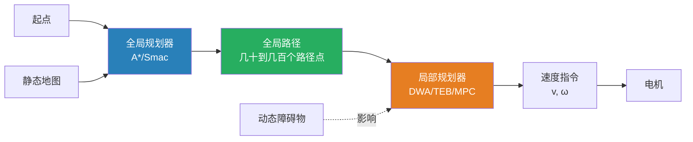
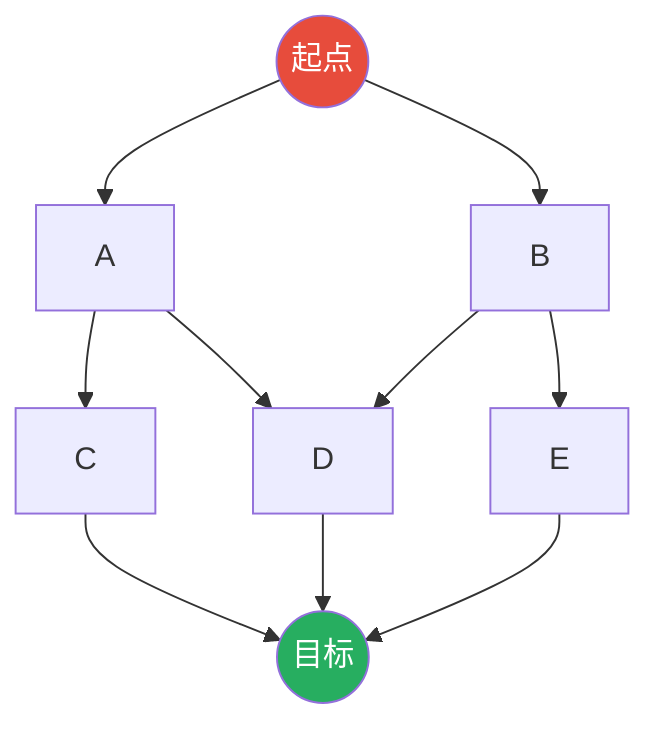

# 全局路径规划深度解析 —— 算法原理与ROS2 Nav2实战

> 🗺️ 本文件是《[AGV自主导航完全指南](/posts/agv-autonomous-navigation)》的路径规划姊妹篇。深入解剖全局路径规划的每一个算法细节，从离散搜索到连续优化，从ROS1 move_base 到 ROS2 Nav2 Smac Planner，手把手教你写一个能用的全局规划器。

---

## 目录

- [1. 全局规划在导航中的角色](#1-全局规划在导航中的角色)
  - [1.1 输入与输出](#11-输入与输出)
  - [1.2 与局部规划器的分工](#12-与局部规划器的分工)
  - [1.3 一个好规划器的标准](#13-一个好规划器的标准)
- [2. 图搜索基础](#2-图搜索基础)
  - [2.1 环境到图的离散化](#21-环境到图的离散化)
  - [2.2 图的数据结构](#22-图的数据结构)
  - [2.3 搜索算法的通用框架](#23-搜索算法的通用框架)
- [3. 经典算法逐层剖析](#3-经典算法逐层剖析)
  - [3.1 Dijkstra —— 最优但慢的基准](#31-dijkstra--最优但慢的基准)
  - [3.2 A\* —— 工业级的主力](#32-a--工业级的主力)
  - [3.3 Jump Point Search —— A\*的对称性优化](#33-jump-point-search--a的对称性优化)
  - [3.4 Theta\* —— 任意角度的路径](#34-theta--任意角度的路径)
  - [3.5 RRT与RRT\* —— 采样派的代表](#35-rrt与rrt--采样派的代表)
  - [3.6 Smac Planner —— Nav2的旗舰](#36-smac-planner--nav2的旗舰)
- [4. 算法对比与选型决策树](#4-算法对比与选型决策树)
- [5. 代价地图：规划器的"眼睛"](#5-代价地图规划器的眼睛)
  - [5.1 栅格代价到图边代价的映射](#51-栅格代价到图边代价的映射)
  - [5.2 代价地图的降采样策略](#52-代价地图的降采样策略)
  - [5.3 禁行区、减速区和偏好通道](#53-禁行区减速区和偏好通道)
- [6. 路径后处理：从锯齿到光滑](#6-路径后处理从锯齿到光滑)
  - [6.1 为什么要做路径平滑](#61-为什么要做路径平滑)
  - [6.2 道格拉斯-普克抽稀](#62-道格拉斯-普克抽稀)
  - [6.3 B样条平滑](#63-b样条平滑)
  - [6.4 梯度下降法平滑](#64-梯度下降法平滑)
  - [6.5 四种平滑算法的效果对比](#65-四种平滑算法的效果对比)
- [7. ROS2 Nav2 规划器插件开发](#7-ros2-nav2-规划器插件开发)
  - [7.1 Nav2 Planner 插件接口](#71-nav2-planner-插件接口)
  - [7.2 手写一个 A\* 规划器插件](#72-手写一个-a-规划器插件)
  - [7.3 注册与加载插件](#73-注册与加载插件)
  - [7.4 Smac Planner 参数详解](#74-smac-planner-参数详解)
- [8. 性能优化实战](#8-性能优化实战)
  - [8.1 规划时间的解剖](#81-规划时间的解剖)
  - [8.2 代价地图降采样](#82-代价地图降采样)
  - [8.3 缓存与增量规划](#83-缓存与增量规划)
  - [8.4 多线程规划](#84-多线程规划)
- [9. 产线场景实战](#9-产线场景实战)
  - [9.1 窄通道规划策略](#91-窄通道规划策略)
  - [9.2 高动态环境下的重规划](#92-高动态环境下的重规划)
  - [9.3 多AGV路径协调](#93-多agv路径协调)
- [10. 调试工具与可视化](#10-调试工具与可视化)

---

## 1. 全局规划在导航中的角色

### 1.1 输入与输出

全局路径规划器（Global Planner）在整个导航栈中处于"大脑"的位置：

```
输入:
  ├── 静态地图 (occupancy grid, 来自 map_server)
  ├── 全局代价地图 (global costmap, 5cm/格, 覆盖全厂区)
  ├── 起点位姿 (机器人当前定位, 来自 AMCL)
  └── 目标位姿 (任务下发, 来自调度系统/MES)

输出:
  └── 全局路径 (nav_msgs/Path)
       └── 一系列位姿点 (x, y, θ), 从起点到终点
           约 50-500 个路径点, 点间距 0.1-0.5m
```

> 🔑 **关键认知**：全局规划器不直接控制机器人。它只画一条"宏观路线"，具体怎么走、怎么避开动态障碍物，由局部规划器（DWA/TEB/MPC）负责。

### 1.2 与局部规划器的分工

| | 全局规划器 | 局部规划器 |
|:---|:---|:---|
| **规划视野** | 全地图（100m × 80m） | 机器人周围（5m × 5m） |
| **更新频率** | 低频（1Hz 或按需） | 高频（5-20Hz） |
| **障碍物处理** | 主要避开静态障碍（墙壁） | 处理动态障碍（行人/车辆） |
| **输出** | 路径点序列（Path） | 速度指令（cmd_vel） |
| **计算时间** | 10-500ms | < 5ms |
| **类比工控** | MES的工艺路线 | 伺服的位置插补 |



### 1.3 一个好规划器的标准

| 标准 | 含义 | 量化指标 |
|:---|:---|:---|
| **完备性** | 有解时一定能找到 | 100% 成功率 |
| **最优性** | 找到的是最短/最小代价路径 | 路径长度与理论最优的偏差 < 5% |
| **实时性** | 规划时间可接受 | < 300ms（AGV不能等太久） |
| **可行性** | 路径能被跟踪执行 | 曲率连续，无不可达的急转弯 |
| **鲁棒性** | 环境变化时稳定 | 同样起终点多次规划结果一致 |

---

## 2. 图搜索基础

### 2.1 环境到图的离散化

AGV运行在连续空间中，但搜索算法需要**离散的图结构**。最常用的离散化方式：

**占据栅格地图（Occupancy Grid Map）**：

```
真实环境                   栅格地图 (0.05m/格)
┌──────────────┐          ┌──┬──┬──┬──┬──┐
│              │          │  │  │  │  │  │
│    ┌───┐     │          │  │██│██│██│  │
│    │   │     │   ──►    │  │██│  │██│  │
│    │   │     │          │  │██│  │██│  │
│    └───┘     │          │  │██│██│██│  │
│              │          │  │  │  │  │  │
└──────────────┘          └──┴──┴──┴──┴──┘

                            □ = 空闲 (cost=0)
                            ██ = 占用 (cost=254)
                            每个格子是图的一个节点
                            相邻格子之间有边 (4-连通或8-连通)
```

**连通方式**：

| 连通方式 | 邻居数 | 边代价 | 路径特征 | 适用场景 |
|:---|:---|:---|:---|:---|
| **4-连通** | 上下左右 4个 | 正交边=1 | 曼哈顿路径，多直角 | 简单，但不自然 |
| **8-连通** | 含对角线 8个 | 正交边=1，对角边=√2 | 可走斜线，仍不够光滑 | ✅ 最常用 |
| **16/32-连通** | 更细的角度 | 按实际距离计算 | 更接近真实路径 | Smac Planner用 |

### 2.2 图的数据结构

在C++/Python中实现图搜索时，核心数据结构：

```python
from dataclasses import dataclass
from typing import Optional, Tuple
import heapq

@dataclass
class Node:
    """栅格地图中的一个节点"""
    x: int          # 栅格坐标X
    y: int          # 栅格坐标Y
    g: float = float('inf')   # 从起点到当前节点的实际代价
    h: float = 0.0            # 启发式：当前节点到目标的估计代价
    f: float = float('inf')   # g + h
    parent: Optional['Node'] = None  # 父节点（用于回溯路径）
    
    def __lt__(self, other):
        """用于优先队列排序（按f值）"""
        return self.f < other.f

class PriorityQueue:
    """最小堆优先队列"""
    def __init__(self):
        self._heap = []
        self._count = 0
    
    def push(self, item, priority):
        heapq.heappush(self._heap, (priority, self._count, item))
        self._count += 1
    
    def pop(self):
        return heapq.heappop(self._heap)[2]
    
    def empty(self):
        return len(self._heap) == 0
```

### 2.3 搜索算法的通用框架

几乎所有的栅格图搜索算法都遵循这个模板：

```python
def graph_search(start, goal, costmap):
    """
    图搜索通用框架
    """
    # 1. 初始化
    open_set = PriorityQueue()      # 待探索节点（按f值排序）
    closed_set = set()              # 已探索节点
    g_cost = {}                     # 每个节点的最优g值
    
    start_node = Node(start.x, start.y, g=0)
    open_set.push(start_node, start_node.f)
    g_cost[(start.x, start.y)] = 0
    
    # 2. 主循环
    while not open_set.empty():
        current = open_set.pop()
        
        # 到达目标？
        if (current.x, current.y) == (goal.x, goal.y):
            return reconstruct_path(current)
        
        if (current.x, current.y) in closed_set:
            continue
        closed_set.add((current.x, current.y))
        
        # 3. 扩展邻居
        for neighbor in get_neighbors(current, costmap):
            if neighbor in closed_set:
                continue
            
            # 计算经过current到达neighbor的代价
            tentative_g = current.g + edge_cost(current, neighbor, costmap)
            
            # 找到更优路径？
            if tentative_g < g_cost.get(neighbor, float('inf')):
                g_cost[neighbor] = tentative_g
                node = Node(neighbor[0], neighbor[1],
                           g=tentative_g,
                           h=heuristic(neighbor, goal),  # ← 算法区别在此
                           parent=current)
                node.f = node.g + node.h
                open_set.push(node, node.f)
    
    return None  # 无解
```

> 🔑 **各种算法的核心区别就在于 `heuristic()` 函数的定义以及 `get_neighbors()` 的邻居集合。**

---

## 3. 经典算法逐层剖析

### 3.1 Dijkstra —— 最优但慢的基准

#### 算法特点

Dijkstra 不使用启发式（$h(n) = 0$），等于在图上做**广度优先的代价传播**。

$$
f(n) = g(n) + \cancel{h(n)} = g(n)
$$



Dijkstra 的探索像水波扩散——从起点开始一圈一圈向外扩展，**不偏向任何方向**，直到碰到目标。

| 性质 | 说明 |
|:---|:---|
| **最优** | ✅ 保证找到最短路径 |
| **完备** | ✅ 有解一定能找到 |
| **时间复杂度** | $O(V \log V + E)$（使用优先队列） |
| **空间复杂度** | $O(V)$ |
| **探索范围** | ⚠️ 太大——几乎探索了起点周围所有方向 |

在100m×80m的厂区地图上（5cm分辨率 = 2000×1600 = 320万格），Dijkstra 可能探索超过100万格——太慢了。

#### 适用场景

- ✅ 网格规模 < 10,000 格
- ✅ 需要绝对最短路径
- ✅ 没有好的启发函数（如迷宫里）
- ❌ 大范围工业场景

### 3.2 A\* —— 工业级的主力

#### 核心公式

A\* 在 Dijkstra 的基础上增加启发函数，**有方向地搜索**：

$$
\boxed{f(n) = g(n) + h(n)}
$$

| 项 | 含义 | 来源 |
|:---|:---|:---|
| $g(n)$ | 从起点到 $n$ 的实际代价 | 实际走过的路径累加 |
| $h(n)$ | 从 $n$ 到目标的**估计**代价 | 启发函数 |
| $f(n)$ | 总评分（越小越优先探索） | — |

#### 启发函数的选择

| 启发函数 | 公式 | 最适用于 | 保证最优？ |
|:---|:---|:---|:---|
| **欧几里得距离** | $\sqrt{(x_n-x_g)^2 + (y_n-y_g)^2}$ | 8-连通栅格 | ✅ 是（$h \le \text{真实代价}$） |
| **曼哈顿距离** | $\|x_n-x_g\| + \|y_n-y_g\|$ | 4-连通栅格 | ✅ 是 |
| **切比雪夫距离** | $\max(\|x_n-x_g\|, \|y_n-y_g\|)$ | 8-连通（作为上界） | ❌ 高估，不保证最优 |
| **对角距离** | $\sqrt{2}\cdot\min(dx,dy) + \|dx-dy\|$ | 8-连通最精确 | ✅ 是 |

> 🔑 **保证最优的条件**：$h(n)$ 必须是**可容许的（admissible）**——永远不高估真实代价；且是**一致的（consistent）**——满足三角不等式 $h(n) \le c(n, n') + h(n')$。

#### A\* 的完整实现

```python
def a_star(start_xy, goal_xy, costmap):
    """
    A* 路径搜索

    参数:
        start_xy: (x, y) 起点栅格坐标
        goal_xy: (x, y) 目标栅格坐标
        costmap: 2D numpy array, 0=空闲, 1-254=代价, 255=致命障碍

    返回:
        path: [(x, y), ...] 路径点列表，或 None
    """
    height, width = costmap.shape
    
    def heuristic(x, y):
        """对角距离启发式（8-连通最优）"""
        dx = abs(x - goal_xy[0])
        dy = abs(y - goal_xy[1])
        return 1.414 * min(dx, dy) + abs(dx - dy)
    
    def get_neighbors(x, y):
        """8-连通邻居"""
        neighbors = []
        for dx in [-1, 0, 1]:
            for dy in [-1, 0, 1]:
                if dx == 0 and dy == 0:
                    continue
                nx, ny = x + dx, y + dy
                if 0 <= nx < width and 0 <= ny < height:
                    # 致命障碍跳过
                    if costmap[ny, nx] >= 253:
                        continue
                    # 对角线移动需要两个相邻正交格都可通过
                    if dx != 0 and dy != 0:
                        if (costmap[ny, x+dx] >= 253 or
                            costmap[y+dy, nx] >= 253):
                            continue
                    neighbors.append((nx, ny))
        return neighbors
    
    def edge_cost(frm, to):
        """边代价 = 距离 × 栅格代价因子"""
        dx, dy = to[0] - frm[0], to[1] - frm[1]
        dist = 1.414 if (dx != 0 and dy != 0) else 1.0
        # 将栅格代价映射到边代价：cost=0 → 1.0, cost=254 → ∞
        cell_cost = costmap[to[1], to[0]]
        cost_factor = 1.0 + (cell_cost / 255.0) * 10.0  # 最大惩罚10倍
        return dist * cost_factor
    
    open_set = PriorityQueue()
    closed_set = set()
    g_cost = {}
    parent = {}
    
    start_node = Node(start_xy[0], start_xy[1], g=0)
    start_node.h = heuristic(start_xy[0], start_xy[1])
    start_node.f = start_node.h
    open_set.push(start_node, start_node.f)
    g_cost[start_xy] = 0
    
    while not open_set.empty():
        current = open_set.pop()
        cur_xy = (current.x, current.y)
        
        if cur_xy == goal_xy:
            return reconstruct_path(cur_xy, parent)
        
        if cur_xy in closed_set:
            continue
        closed_set.add(cur_xy)
        
        for nb in get_neighbors(current.x, current.y):
            if nb in closed_set:
                continue
            
            tentative_g = current.g + edge_cost(cur_xy, nb)
            prev_g = g_cost.get(nb, float('inf'))
            
            if tentative_g < prev_g:
                g_cost[nb] = tentative_g
                parent[nb] = cur_xy
                
                node = Node(nb[0], nb[1], g=tentative_g)
                node.h = heuristic(nb[0], nb[1])
                node.f = node.g + node.h
                open_set.push(node, node.f)
    
    return None  # 无路径


def reconstruct_path(goal_xy, parent):
    """从goal回溯到start"""
    path = [goal_xy]
    cur = goal_xy
    while cur in parent:
        cur = parent[cur]
        path.append(cur)
    path.reverse()
    return path
```

#### Dijkstra vs A\* 探索范围对比

```
Dijkstra 探索范围（无方向性）        A* 探索范围（有方向性）
    
    · · · · · · · · · · ·              · · · · · · · · · · ·
    · · · ░░░░░░░░░ · · ·              · · · · · · · · · · ·
    · · ░░░░░░░░░░░░ · ·              · · · · · · · · · · ·
    · ░░░░░░S░░░░░░░░ ·              · · · · · · · · · · ·
    · · ░░░░░░░░░░░░ · ·              · · · · · G · · · · ·
    · · · ░░░░░░░░░ · · ·              · · · · ░ · · · · ·
    · · · · · · G · · · ·              · · · ░ · · · · · ·
    · · · · · · · · · · ·              · · ░ · · · · · · ·
                                        · ░ · · · · · · · ·
    ░ = 已探索                          ░ S · · · · · · · ·
    S = 起点, G = 目标    S = 起点, G = 目标
```

A\* 的探索范围**集中在起点到目标方向**，大大减少了计算量。

### 3.3 Jump Point Search —— A\*的对称性优化

#### 核心思想

A\* 在空旷区域会逐一探索每个格子——但实际上在这些区域，最优路径就是直线。**JPS（Jump Point Search）** 通过"跳跃"跳过不需要探索的中间节点：

```
A* 探索:                  JPS 探索:
S → → → → → → G          S ════════→ G
  ↓ ↓ ↓ ↓ ↓ ↓ ↑            (只探索拐弯点)
  ↓ ↓ ↓ ↓ ↓ ↓ ↑
  → → → → → → ↑
```

JPS的**跳点规则**（以向右移动为例）：

1. **强制邻居**：如果前进方向的侧前方有障碍物但侧方是空地，当前位置必须停留（这是一个跳点）
2. **直线跳跃**：没遇到强制邻居就一直向前跳

```
强制邻居示意:
  □ ██     ← 右前方有障碍物，侧方是空地
  □ → □    ← 当前位置是跳点！必须在这里分叉
  □ □ □
```

> ⚠️ JPS 只适用于**均匀代价**的栅格地图（所有空地代价相同）。在 AGV 的代价地图中（有膨胀代价梯度），JPS 的优势基本消失——这也是为什么工业AGV很少用JPS。

### 3.4 Theta\* —— 任意角度的路径

#### A\* 的问题

A\* 的路径受限于栅格的 8-连通结构，产生"锯齿"路径：

```
A* 路径:                        理想路径:
S                                S
  ╲                               ╲
   ╲___                            ╲
       ╲___                         ╲___
           ╲___G                         ╲___G
(只能走45°倍数方向)              (任意角度直线)
```

#### Theta\* 的改进

Theta\* 在扩展节点时，检查当前节点是否可以直接"看到"父节点的父节点（视线畅通）。如果能，就跳过中间节点（就像人类在空旷处直接走直线）：

```python
def theta_star_expand(current, neighbor, parent):
    """Theta* 的扩展逻辑"""
    grandparent = parent.get(current)
    
    if grandparent and line_of_sight(grandparent, neighbor):
        # 直接从祖父节点到邻居（跳过父节点）
        # 路径更直，代价更小
        new_g = g_cost[grandparent] + distance(grandparent, neighbor)
        if new_g < g_cost.get(neighbor, float('inf')):
            g_cost[neighbor] = new_g
            parent[neighbor] = grandparent  # ← 父指针直接跨越
    else:
        # 正常 A* 扩展
        pass
```

**视线检查（Line of Sight）** 用 Bresenham 画线算法——沿直线逐格子检查碰撞。

> 🏭 **实际效果**：Theta* 在开阔空间（仓库主通道）效果显著，但在迷宫般的产线隔间里优势不大。

### 3.5 RRT与RRT\* —— 采样派的代表

栅格搜索在高维空间（如带方向的3D位姿规划）会爆炸。**RRT（Rapidly-exploring Random Tree）** 用随机采样代替离散栅格：

```
RRT 生长过程:

迭代1:  S                      迭代10:  S──┐
                                          │
迭代50: S──┐                     迭代200: S──┐
           ├──┐                              ├──┐
           │  ╲                              │  ╲
           │   G                             │   ├──G
           │                                 │   │
           └──                               └───┘
```

#### RRT\* 的渐进最优性

标准 RRT 找到的只是"可行"路径（非最优）。**RRT\*** 在每次添加新节点后，会**重新连接**周围节点以缩短路径：

```python
def rrt_star_rewire(tree, new_node, radius):
    """RRT* 的重连接步骤"""
    for near_node in tree.nodes_within_radius(new_node, radius):
        # 如果经过 new_node 到达 near_node 更短
        if new_node.cost + distance(new_node, near_node) < near_node.cost:
            near_node.parent = new_node
            near_node.cost = new_node.cost + distance(new_node, near_node)
```

> 🔧 **与工控的类比**：RRT 就像人工试教——操作员在示教器上大致拖动机器人到目标位姿；RRT\* 则是示教完成后的路径优化。

| 算法 | 最优性 | 路径质量 | 高维空间 | 工业AGV适用性 |
|:---|:---|:---|:---|:---|
| RRT | ❌ 非最优 | ⭐⭐ | ✅ 有效 | ❌ 路径太差 |
| RRT\* | ✅ 渐进最优 | ⭐⭐⭐⭐ | ✅ 有效 | ⚠️ 机械臂路径规划 |

> 💡 **关键结论**：对于 2D 平面上的 AGV，栅格搜索（A\*/Dijkstra）优于采样方法（RRT/RRT\*）。RRT\* 的优势在高维空间（6-DOF 机械臂）才体现出来。

### 3.6 Smac Planner —— Nav2的旗舰

**Smac Planner** 是 ROS2 Nav2 中推荐使用的全局规划器，全称 **S**tate Lattice based **M**otion primitives with **A**\* **C**ost-aware search。

#### 核心创新：运动基元（Motion Primitives）

传统 A\* 的邻居只有 8 个方向（45° 步进）。Smac Planner 预定义了一组**运动基元**——考虑机器人运动学约束的短轨迹片段：

```
8-连通 A* 的邻居:              Smac Planner 的运动基元:
                                
    □ □ □                          ╱ │ ╲
    □ S □                         ◯──S──◯
    □ □ □                          ╲ │ ╱
                                  /  │  \
  只有8个方向                     ◯   ◯   ◯
                                /    │    \
                              几十个方向，含曲线
```

每个运动基元是一段考虑了**最小转弯半径**的短弧或直线。这保证了：规划出的路径 AGV 在运动学上就是可执行的，无需后处理。

#### Smac Planner 2D 的搜索策略

```python
# Smac Planner 伪代码（简化）
def smac_search(start, goal, motion_primitives, costmap):
    """
    基于运动基元的混合 A* 搜索
    """
    open_set = PriorityQueue()
    
    # 关键区别：节点包含连续位姿 + 运动学约束
    # node = (x_continuous, y_continuous, theta_angle)
    start_node = SmacNode(start.x, start.y, start.theta, g=0)
    start_node.h = obstacle_aware_heuristic(start_node, goal)
    open_set.push(start_node, start_node.f)
    
    while not open_set.empty():
        current = open_set.pop()
        
        # 到达目标区域？
        if distance(current, goal) < tolerance:
            return reconstruct_path_smac(current)
        
        # 用运动基元扩展
        for primitive in motion_primitives:
            # 模拟沿此基元运动一段距离
            next_pose = primitive.apply(current.pose)
            
            # 检查碰撞（连续碰撞检测，不仅是栅格检查）
            if not collision_check_continuous(current.pose, next_pose, costmap):
                continue
            
            # A* 代价 + 启发式
            new_g = current.g + primitive.cost
            if new_g < g_cost[next_pose]:
                g_cost[next_pose] = new_g
                node = SmacNode(next_pose, g=new_g)
                node.h = heuristic(next_pose, goal)
                node.f = node.g + node.h
                open_set.push(node, node.f)
```

#### Smac Planner 的优势总结

| 特性 | 传统 A\* | Smac Planner |
|:---|:---|:---|
| **路径角度** | 仅45° 倍数 | 连续任意角度 |
| **运动学约束** | ❌ 不考虑 | ✅ 内建最小转弯半径 |
| **碰撞检测** | 仅在栅格中心 | ✅ 连续碰撞检测 |
| **路径平滑** | 需要后处理 | 天然光滑 |
| **计算速度** | ⭐⭐⭐⭐ 快 | ⭐⭐⭐ 中等 |
| **适合场景** | 差速AGV | ✅ 舵轮AGV / 汽车式 |

---

## 4. 算法对比与选型决策树

### 综合对比表

| 算法 | 最优性 | 速度 | 路径光滑 | 运动学约束 | 工业成熟度 | Nav2支持 |
|:---|:---|:---|:---|:---|:---|:---|
| **Dijkstra** | ✅ 全局最优 | ⭐ | ⭐ | ❌ | ⭐⭐⭐ | ✅ 原生 |
| **A\*** | ✅ 全局最优 | ⭐⭐⭐⭐ | ⭐ | ❌ | ⭐⭐⭐⭐⭐ | ✅ 原生 |
| **JPS** | ✅ 全局最优 | ⭐⭐⭐⭐⭐ | ⭐ | ❌ | ⭐⭐ | ❌ |
| **Theta\*** | ✅ 最优（更短） | ⭐⭐⭐ | ⭐⭐⭐ | ❌ | ⭐ | ❌ |
| **RRT\*** | ⚠️ 渐进最优 | ⭐⭐⭐ | ⭐⭐ | ❌ | ⭐⭐ | ❌ |
| **Smac 2D** | ✅ 运动学最优 | ⭐⭐⭐ | ⭐⭐⭐⭐⭐ | ✅ | ⭐⭐⭐⭐ | ✅ 推荐 |
| **Smac Hybrid** | ✅ 最优 | ⭐⭐ | ⭐⭐⭐⭐⭐ | ✅ | ⭐⭐⭐ | ✅ |

### 选型决策树

```mermaid
graph TD
    Q1{AGV类型?} -->|差速轮<br/>可原地旋转| Q2{环境大小?}
    Q1 -->|舵轮/汽车式<br/>有转弯半径| SMAC[Smac Planner 2D<br/>⭐⭐⭐⭐⭐]
    
    Q2 -->|小型 < 5000m²| Q3{代价是否均匀?}
    Q2 -->|大型 > 5000m²| ASTAR[A* 搜索<br/>+ 路径平滑后处理<br/>⭐⭐⭐⭐]
    
    Q3 -->|均匀| Q4{需要最短路径?}
    Q3 -->|不均匀(有膨胀)| ASTAR
    
    Q4 -->|是| THETA[Theta* 任意角度<br/>⭐⭐⭐]
    Q4 -->|一般| ASTAR
    
    style SMAC fill:#27ae60,color:#fff
    style ASTAR fill:#2980b9,color:#fff
    style THETA fill:#e67e22,color:#fff
```

> 🏭 **产线建议**：如果不确定选什么，**从 Nav2 的 Smac Planner 2D 开始**。它是目前 Nav2 官方推荐的主力规划器，参数合理，文档齐全，默认配置就能跑出不错的效果。

---

## 5. 代价地图：规划器的"眼睛"

### 5.1 栅格代价到图边代价的映射

代价地图的每个栅格有一个 0-255 的代价值。规划器如何理解这个值？

**线性映射（Nav2默认）**：

$$
\text{edge\_cost} = \text{distance} \times \left( 1.0 + \frac{\text{cost}}{255} \times \text{penalty\_factor} \right)
$$

其中 $\text{penalty\_factor}$ 默认为 10.0（最大代价栅格走1米相当于走11米）。

**效果**：
- 代价 0（完全自由） → 边代价 = 距离 × 1.0
- 代价 128（膨胀区中间） → 边代价 = 距离 × 6.0
- 代价 254（膨胀区内边缘） → 边代价 = 距离 × 11.0
- 代价 255（致命障碍） → 不可通过

这意味着规划器会"尽量绕开"高代价区域——路径可能会稍长，但更安全。

### 5.2 代价地图的降采样策略

全局代价地图通常 5cm/格。对于 100m × 80m 的厂区 = 2000 × 1600 = **320万格**。如果 A\* 直接在这上面跑，即使有启发函数，探索量也很可观。

**降采样（Downsampling）**——Nav2 Smac Planner 的做法：

```
原始代价地图 (5cm/格)          降采样后 (10cm/格)
┌──┬──┬──┬──┐                 ┌──────┬──────┐
│0 │0 │0 │0 │                 │      │      │
├──┼──┼──┼──┤                 │  0   │  0   │
│0 │128│128│0 │    ──►         │      │      │
├──┼──┼──┼──┤                 ├──────┼──────┤
│0 │128│128│0 │                 │      │      │
├──┼──┼──┼──┤                 │ 128  │  0   │
│0 │0 │0 │0 │                 │      │      │
└──┴──┴──┴──┘                 └──────┴──────┘

降采样规则: 取 2×2 窗口中的最大代价（保守策略）
```

| 降采样因子 | 格数变化 | 搜索加速 | 精度损失 | 推荐 |
|:---|:---|:---|:---|:---|
| 1 (不降采样) | 320万 | 1× | 无 | 小型地图 |
| 2 | 80万 | ~4× | 轻微 | ✅ 大型厂区 |
| 4 | 20万 | ~16× | 明显 | 超大型/初始粗略规划 |
| 8 | 5万 | ~64× | 显著 | 仅用于可行性快速判断 |

### 5.3 禁行区、减速区和偏好通道

在工业环境中，很多时候你不想让规划器"自由发挥"——有些区域是禁区，有些需要减速，有些则希望AGV优先走。

#### 方案A：利用代价地图的 Layer 机制

在代价地图中添加**自定义层**：

```yaml
# nav2_params.yaml 中增加 keepout_filter layer
global_costmap:
  ros__parameters:
    plugins: ["static_layer", "obstacle_layer", "inflation_layer",
              "keepout_filter"]
    keepout_filter:
      plugin: "nav2_costmap_2d/KeepoutFilter"
      filter_info_topic: "/keepout_zones"
      enabled: true
```

然后在 `/keepout_zones` 话题上发布禁行区多边形：

```python
# 发布禁行区
from nav2_msgs.msg import CostmapFilterInfo

zone = CostmapFilterInfo()
zone.header.frame_id = "map"
zone.type = CostmapFilterInfo.KEEPOUT   # 完全禁止
# 或 zone.type = CostmapFilterInfo.SPEED_RESTRICTION  # 仅减速
```

#### 方案B：在代价地图中直接画禁区

```python
import numpy as np

def add_keepout_zone(costmap, polygon_vertices, lethal=True):
    """
    在代价地图中直接标记禁行区

    参数:
        costmap: 原始代价地图 (2D numpy array)
        polygon_vertices: [(x1,y1), (x2,y2), ...] 多边形顶点（栅格坐标）
        lethal: True=致命障碍(255), False=高代价(200)
    """
    from skimage.draw import polygon
    
    rr, cc = polygon(
        [v[1] for v in polygon_vertices],
        [v[0] for v in polygon_vertices],
        shape=costmap.shape
    )
    costmap[rr, cc] = 255 if lethal else 200
    return costmap
```

#### 方案C：偏好通道（Preferred Lanes）

如果想让AGV优先走某条通道，可以降低该通道栅格的代价值：

```python
def add_preferred_lane(costmap, lane_centerline, width_cells, discount=0.5):
    """
    在代价地图中添加偏好通道（降低代价）
    
    参数:
        costmap: 代价地图
        lane_centerline: 通道中线点列表
        width_cells: 通道宽度（栅格数）
        discount: 代价折扣因子 (0.0=完全偏好, 1.0=无影响)
    """
    for i in range(len(lane_centerline) - 1):
        p1, p2 = lane_centerline[i], lane_centerline[i+1]
        # 沿中线画一条宽度为 width_cells 的带状区域
        # ... 实现略
        inside_mask = get_band_mask(p1, p2, width_cells)
        costmap[inside_mask] = (costmap[inside_mask] * discount).astype(np.uint8)
    
    return costmap
```

> 🏭 **产线经验**：与其用复杂的偏好通道，不如直接**预定义固定路线**（Waypoints）。对于产线场景——固定上料口、固定下料口、固定路线——预定义路线的可靠性和确定性远高于动态规划。

---

## 6. 路径后处理：从锯齿到光滑

### 6.1 为什么要做路径平滑

A\* 输出的路径是**离散栅格序列**，直接发给局部规划器有两个问题：

1. **锯齿路径**：路径点沿栅格边界走，折线多
2. **不必要的高密度**：一条直线上可能有几十个路径点

```
A* 原始路径:               期望输出:
  ┌──┐                         ╱
  │  ╲                        ╱
  │   ╲      ──►             ╱
  │    ╲                    ╱
  └─────┘                  ╱
```

### 6.2 道格拉斯-普克抽稀

**Douglas-Peucker 算法**是最经典的路径简化算法——去掉共线或近似共线的中间点：

```python
import numpy as np

def douglas_peucker(path, epsilon):
    """
    道格拉斯-普克路径抽稀算法

    参数:
        path: [(x, y), ...] 路径点列表
        epsilon: 允许的最大点到线段距离

    返回:
        简化后的路径
    """
    if len(path) <= 2:
        return path

    # 找离首尾连线最远的点
    dmax = 0
    index = 0
    start, end = np.array(path[0]), np.array(path[-1])
    line_vec = end - start
    line_len_sq = np.dot(line_vec, line_vec)

    for i in range(1, len(path) - 1):
        point = np.array(path[i])
        if line_len_sq == 0:
            d = np.linalg.norm(point - start)
        else:
            t = max(0, min(1, np.dot(point - start, line_vec) / line_len_sq))
            projection = start + t * line_vec
            d = np.linalg.norm(point - projection)
        if d > dmax:
            dmax = d
            index = i

    # 如果最远点距离 > epsilon，在该点递归
    if dmax > epsilon:
        left = douglas_peucker(path[:index+1], epsilon)
        right = douglas_peucker(path[index:], epsilon)
        return left[:-1] + right
    else:
        return [path[0], path[-1]]

# 使用示例
path = [(0,0), (1,0), (2,0), (2,0), (3,0), (3,1), (3,2)]  # 锯齿
simplified = douglas_peucker(path, epsilon=0.5)
# 结果: [(0,0), (3,0), (3,2)] —— 简化了50%+
```

**epsilon 选择指南**：

| epsilon | 效果 | 适用场景 |
|:---|:---|:---|
| 0.3 格 | 保留细节，简化有限 | 迷宫环境 |
| 1.0 格 | 平衡 | ✅ 推荐默认 |
| 2.0 格 | 大幅简化，可能切角 | 开阔仓库 |
| 5.0 格 | 过于激进 | 不推荐 |

### 6.3 B样条平滑

抽稀后的路径仍然可能是折线。**B样条（B-Spline）** 用光滑曲线拟合路径点：

```python
import numpy as np
from scipy.interpolate import splprep, splev

def bspline_smooth(path, num_points=200, smoothing=0.5):
    """
    B样条路径平滑

    参数:
        path: [(x, y), ...] 路径点
        num_points: 输出路径点数
        smoothing: 平滑程度（0=完全过点, 1=最大平滑）

    返回:
        平滑后的路径
    """
    path_arr = np.array(path)
    
    # 使用 scipy 的样条拟合
    tck, u = splprep(
        [path_arr[:, 0], path_arr[:, 1]],
        s=smoothing * len(path),  # s 控制平滑程度
        k=3                       # 三次B样条
    )
    
    # 均匀采样
    u_new = np.linspace(0, 1, num_points)
    x_smooth, y_smooth = splev(u_new, tck)
    
    return list(zip(x_smooth, y_smooth))
```

**B样条的优缺点**：

| 优点 | 缺点 |
|:---|:---|
| ✅ 数学性质优良（C²连续） | ⚠️ 可能偏离原始路径（穿墙风险） |
| ✅ 参数化控制平滑程度 | ⚠️ 计算量比抽稀大 |
| ✅ Scipy 一行代码 | ⚠️ 需要后检查碰撞 |

> ⚠️ **重要**：平滑后必须**重新做碰撞检测**！B样条可能会让路径"切过"膨胀区的角落。如果检测到碰撞，减小 `smoothing` 参数或回退到原始路径。

### 6.4 梯度下降法平滑

一种更"工程"的方法——把路径平滑建模为优化问题：

$$
\min_{\mathbf{p}_1, ..., \mathbf{p}_n} \quad
\underbrace{\sum_i \|\mathbf{p}_i - \mathbf{p}_i^{\text{orig}}\|^2}_{\text{接近原始路径}} +
\alpha \underbrace{\sum_i \|\mathbf{p}_{i+1} - 2\mathbf{p}_i + \mathbf{p}_{i-1}\|^2}_{\text{平滑性（二阶差分的平方和）}}
$$

第一项确保不偏离原始路径太远，第二项惩罚路径的"曲率"。$\alpha$ 平衡两者。

```python
def gradient_descent_smooth(path, alpha=0.5, iterations=100, 
                            costmap=None):
    """
    梯度下降法路径平滑

    参数:
        path: 原始路径点
        alpha: 平滑权重（越大越光滑，但可能偏离原始路径）
        iterations: 迭代次数
        costmap: 可选，用于碰撞约束

    返回:
        平滑后的路径
    """
    points = np.array(path, dtype=float)
    n = len(points)
    
    for _ in range(iterations):
        gradient = np.zeros_like(points)
        
        # 1. 原始路径吸引项
        gradient += 2.0 * (points - np.array(path))
        
        # 2. 平滑项（二阶差分）
        for i in range(1, n - 1):
            gradient[i] += alpha * 2.0 * (
                2.0 * points[i] - points[i-1] - points[i+1]
            )
        
        # 3. （可选）障碍物排斥项
        if costmap is not None:
            for i in range(n):
                gx, gy = int(points[i, 0]), int(points[i, 1])
                if 0 <= gx < costmap.shape[1] and 0 <= gy < costmap.shape[0]:
                    if costmap[gy, gx] > 200:  # 进入高代价区
                        # 向自由空间的方向推
                        gradient[i] += 10.0 * np.array([1.0, 0.0])
        
        # 梯度下降
        points -= 0.01 * gradient
    
    return points.tolist()
```

> 🔧 **与控制的类比**：这个优化问题和你在伺服控制中做的**轨迹生成**完全同源——都是让参考轨迹在"跟随性"和"平滑性"之间做权衡。

### 6.5 四种平滑算法的效果对比

```
原始A*路径:  ┌───┐
             │   ╲
             │    ╲___
             │        ╲___
             └────────────┘

Douglas-Peucker:  ─┐    ╲
  (抽稀, ε=1.0)     │     ╲___
                    │         ╲___
                    └─────────────┘
                    去掉了共线冗余点

B-Spline:         ╭──╮
  (smoothing=0.3)  │   ╲___
                   │       ╲___
                   ╰───────────┘
                   拐角处圆滑过渡

梯度下降:          ╭──╮
  (α=0.5)          │   ╲___
                   │       ╲___
                   ╰───────────┘
                   效果类似B样条，但可控性更好
```

**推荐流程**：

```
A* 原始路径 → Douglas-Peucker 抽稀 → 梯度下降/B样条平滑 → 碰撞复查 → 发布
```

---

## 7. ROS2 Nav2 规划器插件开发

### 7.1 Nav2 Planner 插件接口

Nav2 的规划器架构基于 **pluginlib**，所有规划器必须继承 `nav2_core::GlobalPlanner` 接口：

```cpp
// nav2_core/include/nav2_core/global_planner.hpp
namespace nav2_core {

class GlobalPlanner {
public:
    virtual ~GlobalPlanner() {}
    
    // 配置插件参数
    virtual void configure(
        const rclcpp_lifecycle::LifecycleNode::WeakPtr & parent,
        std::string name,
        std::shared_ptr<tf2_ros::Buffer> tf,
        std::shared_ptr<nav2_costmap_2d::Costmap2DROS> costmap_ros
    ) = 0;
    
    // 清理
    virtual void cleanup() = 0;
    virtual void activate() = 0;
    virtual void deactivate() = 0;
    
    // 核心接口：计算路径
    virtual nav_msgs::msg::Path createPlan(
        const geometry_msgs::msg::PoseStamped & start,
        const geometry_msgs::msg::PoseStamped & goal
    ) = 0;
};
```

### 7.2 手写一个 A\* 规划器插件

下面是一个最小可用的 C++ A\* 规划器插件：

```cpp
// my_astar_planner.hpp
#ifndef MY_ASTAR_PLANNER_HPP_
#define MY_ASTAR_PLANNER_HPP_

#include "nav2_core/global_planner.hpp"
#include "nav2_costmap_2d/costmap_2d_ros.hpp"
#include "nav2_util/geometry_utils.hpp"
#include "rclcpp/rclcpp.hpp"
#include "nav_msgs/msg/path.hpp"
#include <queue>
#include <unordered_map>
#include <cmath>

namespace my_astar_planner {

struct Node {
    unsigned int x, y;   // 栅格坐标
    float g_cost;        // 从起点到当前的实际代价
    float h_cost;        // 启发式代价
    float f_cost() const { return g_cost + h_cost; }
    unsigned int parent_x, parent_y;
    
    bool operator>(const Node& other) const {
        return f_cost() > other.f_cost();
    }
};

class MyAStarPlanner : public nav2_core::GlobalPlanner {
public:
    MyAStarPlanner() = default;
    
    void configure(
        const rclcpp_lifecycle::LifecycleNode::WeakPtr & parent,
        std::string name,
        std::shared_ptr<tf2_ros::Buffer> tf,
        std::shared_ptr<nav2_costmap_2d::Costmap2DROS> costmap_ros
    ) override;
    
    void cleanup() override;
    void activate() override;
    void deactivate() override;
    
    nav_msgs::msg::Path createPlan(
        const geometry_msgs::msg::PoseStamped & start,
        const geometry_msgs::msg::PoseStamped & goal
    ) override;

private:
    // 启发式函数：对角距离
    float heuristic(unsigned int x1, unsigned int y1,
                    unsigned int x2, unsigned int y2);
    
    // 获取8连通邻居
    std::vector<Node> getNeighbors(const Node& current);
    
    // 世界坐标 → 栅格坐标
    bool worldToMap(double wx, double wy, 
                    unsigned int& mx, unsigned int& my);
    
    // 栅格坐标 → 世界坐标
    void mapToWorld(unsigned int mx, unsigned int my,
                    double& wx, double& wy);
    
    // 从父指针链重建路径
    nav_msgs::msg::Path reconstructPath(
        const Node& goal_node,
        const std::unordered_map<unsigned int, 
            std::unordered_map<unsigned int, Node>>& parent_map);
    
    // 节点到键的编码（用于unordered_map）
    unsigned int packKey(unsigned int x, unsigned int y) {
        return (y << 16) | x;  // 假设地图 < 65536格
    }
    
    // 成员变量
    std::shared_ptr<nav2_costmap_2d::Costmap2DROS> costmap_ros_;
    nav2_costmap_2d::Costmap2D* costmap_;
    std::shared_ptr<tf2_ros::Buffer> tf_;
    rclcpp::Logger logger_{rclcpp::get_logger("MyAStarPlanner")};
    double tolerance_;        // 目标容差 (m)
    bool allow_unknown_;      // 是否允许经过未知区域
};

}  // namespace my_astar_planner

#endif  // MY_ASTAR_PLANNER_HPP_
```

```cpp
// my_astar_planner.cpp
#include "my_astar_planner.hpp"

namespace my_astar_planner {

void MyAStarPlanner::configure(
    const rclcpp_lifecycle::LifecycleNode::WeakPtr & parent,
    std::string name,
    std::shared_ptr<tf2_ros::Buffer> tf,
    std::shared_ptr<nav2_costmap_2d::Costmap2DROS> costmap_ros)
{
    auto node = parent.lock();
    
    costmap_ros_ = costmap_ros;
    costmap_ = costmap_ros_->getCostmap();
    tf_ = tf;
    
    // 从参数服务器读取参数
    node->declare_parameter(name + ".tolerance", 0.5);
    node->declare_parameter(name + ".allow_unknown", false);
    
    tolerance_ = node->get_parameter(name + ".tolerance").as_double();
    allow_unknown_ = node->get_parameter(name + ".allow_unknown").as_bool();
    
    RCLCPP_INFO(logger_, "MyAStarPlanner configured (tolerance=%.2f)", tolerance_);
}

void MyAStarPlanner::cleanup() {
    RCLCPP_INFO(logger_, "MyAStarPlanner cleaned up");
}

void MyAStarPlanner::activate() {
    RCLCPP_INFO(logger_, "MyAStarPlanner activated");
}

void MyAStarPlanner::deactivate() {
    RCLCPP_INFO(logger_, "MyAStarPlanner deactivated");
}

float MyAStarPlanner::heuristic(
    unsigned int x1, unsigned int y1,
    unsigned int x2, unsigned int y2)
{
    // 对角距离 —— 8-连通栅格的最精确启发式
    float dx = std::abs(static_cast<float>(x1) - static_cast<float>(x2));
    float dy = std::abs(static_cast<float>(y1) - static_cast<float>(y2));
    return 1.414f * std::min(dx, dy) + std::abs(dx - dy);
}

std::vector<Node> MyAStarPlanner::getNeighbors(const Node& current) {
    std::vector<Node> neighbors;
    
    // 8-连通
    const int dx[8] = {-1, 0, 1, -1, 1, -1, 0, 1};
    const int dy[8] = {-1, -1, -1, 0, 0, 1, 1, 1};
    const float cost[8] = {1.414f, 1.0f, 1.414f, 1.0f, 
                           1.0f, 1.414f, 1.0f, 1.414f};
    
    unsigned int size_x = costmap_->getSizeInCellsX();
    unsigned int size_y = costmap_->getSizeInCellsY();
    
    for (int i = 0; i < 8; i++) {
        int nx = static_cast<int>(current.x) + dx[i];
        int ny = static_cast<int>(current.y) + dy[i];
        
        // 边界检查
        if (nx < 0 || nx >= static_cast<int>(size_x) ||
            ny < 0 || ny >= static_cast<int>(size_y)) {
            continue;
        }
        
        unsigned int ux = static_cast<unsigned int>(nx);
        unsigned int uy = static_cast<unsigned int>(ny);
        
        // 碰撞检查
        unsigned char cell_cost = costmap_->getCost(ux, uy);
        if (cell_cost == nav2_costmap_2d::LETHAL_OBSTACLE) {
            continue;
        }
        if (!allow_unknown_ && cell_cost == nav2_costmap_2d::NO_INFORMATION) {
            continue;
        }
        
        // 对角线移动需要相邻正交格也可通过（防止切角穿墙）
        if (dx[i] != 0 && dy[i] != 0) {
            unsigned char cost1 = costmap_->getCost(current.x + dx[i], current.y);
            unsigned char cost2 = costmap_->getCost(current.x, current.y + dy[i]);
            if (cost1 == nav2_costmap_2d::LETHAL_OBSTACLE ||
                cost2 == nav2_costmap_2d::LETHAL_OBSTACLE) {
                continue;
            }
        }
        
        Node neighbor;
        neighbor.x = ux;
        neighbor.y = uy;
        // 边代价 = 距离 × 代价因子
        float cost_factor = 1.0f + (cell_cost / 255.0f) * 10.0f;
        neighbor.g_cost = cost[i] * cost_factor;
        neighbors.push_back(neighbor);
    }
    
    return neighbors;
}

bool MyAStarPlanner::worldToMap(double wx, double wy,
                                 unsigned int& mx, unsigned int& my) {
    return costmap_->worldToMap(wx, wy, mx, my);
}

void MyAStarPlanner::mapToWorld(unsigned int mx, unsigned int my,
                                 double& wx, double& wy) {
    costmap_->mapToWorld(mx, my, wx, wy);
}

nav_msgs::msg::Path MyAStarPlanner::createPlan(
    const geometry_msgs::msg::PoseStamped & start,
    const geometry_msgs::msg::PoseStamped & goal)
{
    nav_msgs::msg::Path plan;
    plan.header.stamp = costmap_ros_->now();
    plan.header.frame_id = costmap_ros_->getGlobalFrameID();
    
    // 1. 世界坐标 → 栅格坐标
    unsigned int start_x, start_y, goal_x, goal_y;
    if (!worldToMap(start.pose.position.x, start.pose.position.y,
                    start_x, start_y)) {
        RCLCPP_ERROR(logger_, "起点超出地图范围");
        return plan;
    }
    if (!worldToMap(goal.pose.position.x, goal.pose.position.y,
                    goal_x, goal_y)) {
        RCLCPP_ERROR(logger_, "目标超出地图范围");
        return plan;
    }
    
    // 2. 检查目标是否可到达
    if (costmap_->getCost(goal_x, goal_y) == nav2_costmap_2d::LETHAL_OBSTACLE) {
        RCLCPP_ERROR(logger_, "目标在障碍物内");
        return plan;
    }
    
    // 3. A* 搜索
    std::priority_queue<Node, std::vector<Node>, std::greater<Node>> open_set;
    std::unordered_map<unsigned int, 
        std::unordered_map<unsigned int, Node>> parent_map;
    std::unordered_map<unsigned int,
        std::unordered_map<unsigned int, float>> g_cost_map;
    
    Node start_node{start_x, start_y, 0.0f, heuristic(start_x, start_y, goal_x, goal_y), 0, 0};
    open_set.push(start_node);
    g_cost_map[start_y][start_x] = 0.0f;
    
    bool found = false;
    Node goal_node;
    
    while (!open_set.empty()) {
        Node current = open_set.top();
        open_set.pop();
        
        // 到达目标？（检查在容差范围内）
        float dist_to_goal = std::hypot(
            static_cast<float>(current.x) - static_cast<float>(goal_x),
            static_cast<float>(current.y) - static_cast<float>(goal_y)
        );
        if (dist_to_goal <= tolerance_ / costmap_->getResolution()) {
            goal_node = current;
            found = true;
            break;
        }
        
        // 扩展邻居
        for (auto& nb : getNeighbors(current)) {
            float new_g = current.g_cost + nb.g_cost;
            auto& g_row = g_cost_map[nb.y];
            
            if (g_row.find(nb.x) == g_row.end() || new_g < g_row[nb.x]) {
                g_row[nb.x] = new_g;
                nb.g_cost = new_g;
                nb.h_cost = heuristic(nb.x, nb.y, goal_x, goal_y);
                nb.parent_x = current.x;
                nb.parent_y = current.y;
                
                parent_map[nb.y][nb.x] = current;
                open_set.push(nb);
            }
        }
    }
    
    if (!found) {
        RCLCPP_WARN(logger_, "A* 未找到路径!");
        return plan;
    }
    
    // 4. 重建路径
    plan = reconstructPath(goal_node, parent_map);
    
    RCLCPP_INFO(logger_, "找到路径，共 %zu 个路径点", plan.poses.size());
    return plan;
}

nav_msgs::msg::Path MyAStarPlanner::reconstructPath(
    const Node& goal_node,
    const std::unordered_map<unsigned int,
        std::unordered_map<unsigned int, Node>>& parent_map)
{
    nav_msgs::msg::Path path;
    path.header.stamp = costmap_ros_->now();
    path.header.frame_id = costmap_ros_->getGlobalFrameID();
    
    // 回溯：从 goal → start
    std::vector<std::pair<unsigned int, unsigned int>> grid_path;
    
    unsigned int cx = goal_node.x;
    unsigned int cy = goal_node.y;
    
    while (true) {
        grid_path.push_back({cx, cy});
        
        auto it_y = parent_map.find(cy);
        if (it_y == parent_map.end()) break;
        auto it_x = it_y->second.find(cx);
        if (it_x == it_y->second.end()) break;
        
        cx = it_x->second.x;
        cy = it_x->second.y;
    }
    
    // 反转并转换为世界坐标
    for (auto it = grid_path.rbegin(); it != grid_path.rend(); ++it) {
        geometry_msgs::msg::PoseStamped pose;
        pose.header = path.header;
        
        double wx, wy;
        mapToWorld(it->first, it->second, wx, wy);
        pose.pose.position.x = wx;
        pose.pose.position.y = wy;
        pose.pose.position.z = 0.0;
        
        // 方向：指向下一个路径点
        // (简化处理——生产代码应计算实际方向)
        pose.pose.orientation.w = 1.0;
        
        path.poses.push_back(pose);
    }
    
    return path;
}

}  // namespace my_astar_planner

// 导出插件
#include "pluginlib/class_list_macros.hpp"
PLUGINLIB_EXPORT_CLASS(my_astar_planner::MyAStarPlanner, nav2_core::GlobalPlanner)
```

### 7.3 注册与加载插件

**1) 创建插件描述文件 `plugins.xml`**：

```xml
<library path="my_astar_planner">
  <class type="my_astar_planner::MyAStarPlanner" 
         base_class_type="nav2_core::GlobalPlanner">
    <description>我的A*全局规划器</description>
  </class>
</library>
```

**2) 在 `CMakeLists.txt` 中注册**：

```cmake
cmake_minimum_required(VERSION 3.5)
project(my_astar_planner)

find_package(nav2_core REQUIRED)
find_package(nav2_costmap_2d REQUIRED)
find_package(rclcpp REQUIRED)
find_package(pluginlib REQUIRED)

add_library(my_astar_planner SHARED 
  src/my_astar_planner.cpp)

target_include_directories(my_astar_planner PUBLIC
  $<BUILD_INTERFACE:${CMAKE_CURRENT_SOURCE_DIR}/include>
  $<INSTALL_INTERFACE:include>)

ament_target_dependencies(my_astar_planner
  nav2_core nav2_costmap_2d rclcpp pluginlib)

pluginlib_export_plugin_description_file(nav2_core plugins.xml)

install(TARGETS my_astar_planner
  ARCHIVE DESTINATION lib
  LIBRARY DESTINATION lib
  RUNTIME DESTINATION bin)
```

**3) 在 `nav2_params.yaml` 中使用**：

```yaml
planner_server:
  ros__parameters:
    planner_plugins: ["MyAStarPlanner"]
    MyAStarPlanner:
      plugin: "my_astar_planner::MyAStarPlanner"
      tolerance: 0.5
      allow_unknown: false
```

### 7.4 Smac Planner 参数详解

如果不想自己写，直接用 Nav2 的 Smac Planner，这里是关键参数：

```yaml
planner_server:
  ros__parameters:
    planner_plugins: ["GridBased"]
    GridBased:
      plugin: "nav2_smac_planner/SmacPlanner2D"
      
      # === 搜索参数 ===
      tolerance: 0.5              # 目标容差 (m)，到达即停止
      downsample_costmap: true    # 是否降采样全局代价地图
      downsampling_factor: 2      # 降采样因子（2→分辨率减半）
      
      # === 运动基元参数 ===
      angle_quantization_bins: 72 # 角度离散化桶数（72→5°精度）
      
      # === 代价函数权重（调整路径偏好） ===
      cost_travel_multiplier: 2.0 # 旅行代价放大系数（>1 → 偏好绕远）
      allow_unknown: false        # 是否允许经过未知区域
      max_iterations: -1          # 最大迭代次数 (-1=无限制)
      max_on_approach_iterations: 1000  # 接近目标时的最大迭代
      
      # === 路径平滑参数 ===
      smooth_path: true           # 是否平滑路径
      smoother:
        max_iterations: 1000      # 平滑迭代次数
        w_smooth: 0.3             # 平滑权重
        w_data: 0.2               # 数据保真权重
        tolerance: 1e-10          # 收敛容差
```

> 🔑 **最重要参数**：`angle_quantization_bins` 和 `downsampling_factor`。
> - 增加角度桶数 → 路径更光滑，但规划更慢
> - 增加降采样因子 → 速度大幅提升，但细节丢失
> - 建议 72 和 2，平衡质量和速度

---

## 8. 性能优化实战

### 8.1 规划时间的解剖

一个典型的全局规划调用，时间花在哪里？

```
规划时间分解（100m×80m厂区, 5cm分辨率 A*）:

├── 代价地图获取与转换: 5ms   (5%)
├── 坐标转换(世界→栅格): 1ms   (1%)
├── A* 搜索: 60ms             (60%) ← 主要开销
├── 路径重建: 5ms              (5%)
├── 路径平滑: 20ms             (20%)
└── 发布消息: 9ms              (9%)
────────────────────────────────
总计: ~100ms
```

**优化的优先级**：

1. **降采样代价地图**：直接减半搜索空间 → A\* 部分减少 75%
2. **换更快的启发式**：对角距离已是最优
3. **缓存路径**：相同起终点复用
4. **并行化**：搜索和发布可以异步

### 8.2 代价地图降采样

不是所有场景都需要 5cm 的分辨率做全局规划。AGV 的膨胀半径可能是 40cm——5cm 的分辨率过于精细。

```python
def downsample_costmap(costmap_2d, factor=2):
    """
    降采样代价地图

    参数:
        costmap_2d: 原始代价地图 (Costmap2D对象)
        factor: 降采样因子 (2=每2×2合并为1格)

    返回:
        降采样后的 numpy array
    """
    import numpy as np
    
    orig = costmap_2d  # shape: (height, width)
    h, w = orig.shape
    new_h, new_w = h // factor, w // factor
    
    # 方法1：取最大值（保守，推荐）
    downsampled = np.zeros((new_h, new_w), dtype=np.uint8)
    for i in range(new_h):
        for j in range(new_w):
            patch = orig[i*factor:(i+1)*factor, j*factor:(j+1)*factor]
            downsampled[i, j] = np.max(patch)
    
    # 方法2：如果最大代价 > 200 就标记为致命（更快但更保守）
    # downsampled[i, j] = 255 if np.any(patch >= 200) else np.mean(patch)
    
    return downsampled
```

### 8.3 缓存与增量规划

工业AGV的路线通常变化不大——产线上料口→下料口就那么几条路。

**缓存策略**：

```python
from functools import lru_cache
import hashlib

class PathCache:
    """
    路径缓存管理器
    缓存 (起点, 终点, 地图哈希) → 路径
    """
    
    def __init__(self, max_size=100):
        self.cache = {}
        self.max_size = max_size
    
    def _key(self, start, goal, costmap):
        """生成缓存键"""
        # 将起点/终点离散化到 10cm 精度（容忍小偏差）
        sx = round(start[0] * 10)
        sy = round(start[1] * 10)
        gx = round(goal[0] * 10)
        gy = round(goal[1] * 10)
        
        # 代价地图哈希（仅哈希障碍物区域的轮廓）
        map_hash = hashlib.md5(
            (costmap > 200).tobytes()  # 只关心致命障碍
        ).hexdigest()[:8]
        
        return f"{sx}_{sy}_{gx}_{gy}_{map_hash}"
    
    def get(self, start, goal, costmap):
        key = self._key(start, goal, costmap)
        return self.cache.get(key)
    
    def put(self, start, goal, costmap, path):
        key = self._key(start, goal, costmap)
        if len(self.cache) >= self.max_size:
            # LRU 淘汰
            oldest = next(iter(self.cache))
            del self.cache[oldest]
        self.cache[key] = path
```

### 8.4 多线程规划

全局规划是**计算密集型**操作，不应阻塞主循环：

```cpp
// 在规划服务中异步执行
class PlannerServer {
    std::future<nav_msgs::msg::Path> async_plan(
        const PoseStamped& start, const PoseStamped& goal)
    {
        return std::async(std::launch::async, [this, start, goal]() {
            return this->planner_->createPlan(start, goal);
        });
    }
};
```

> ⚠️ Nav2 默认已经实现了异步规划——规划请求在独立的线程池中执行。不需要额外改动。

---

## 9. 产线场景实战

### 9.1 窄通道规划策略

窄通道（如货架巷道，宽 1.2m，AGV 宽 1.0m）是全局规划最容易失败的地方。

**问题**：膨胀后的代价地图中，通道只有 2-4 格宽。A\* 可能因为"对角线切角保护"而无法通过。

**解决方案**：

1. **减小膨胀半径**（在窄通道区域）
2. **使用独立的窄通道代价地图**——膨胀半径减小到 10cm
3. **干脆用预定义路径**——窄通道里AGV本来就只能走直线

```yaml
# 为窄通道创建专用代价地图
narrow_passage_costmap:
  ros__parameters:
    inflation_layer:
      inflation_radius: 0.1     # 窄通道专用的小膨胀半径
      cost_scaling_factor: 3.0   # 代价衰减更快
```

### 9.2 高动态环境下的重规划

产线上行人和叉车频繁经过，代价地图变化快，需要在**规划速度**和**路径稳定性**之间平衡：

| 策略 | 描述 | 优点 | 缺点 |
|:---|:---|:---|:---|
| **固定周期重规划** | 每N秒重新规划 | 简单 | 浪费计算 |
| **代价地图变化触发** | 当前路径被阻塞时重规划 | 按需触发 | 可能滞后 |
| **增量修复** | 只修复被阻塞段 | 高效 | 实现复杂 |
| **多路径预计算** | 预先计算备用路径 | 切换迅速 | 内存占用 |

推荐组合：**代价地图变化触发 + 多路径预计算**。平时沿主路径走，主路径被阻塞时秒切备用路径。

### 9.3 多AGV路径协调

当多台AGV共享同一空间时，全局规划还要考虑**AGV之间的避让**。

**方案对比**：

| 方案 | 描述 | 复杂度 | 适合AGV数量 |
|:---|:---|:---|:---|
| **无协调** | 各自独立规划，靠局部规划避让 | ⭐ | 1-3台 |
| **时间窗预约** | AGV在路口预约通行时间段 | ⭐⭐⭐ | 3-20台 |
| **集中式调度** | 中央调度器统一规划所有AGV路径 | ⭐⭐⭐⭐ | 10-100台 |
| **分布式协商** | AGV之间通信协商优先级 | ⭐⭐⭐⭐⭐ | 任意 |

> 🏭 **产线建议**：2-3 台 AGV 的简单场景——无协调 + 局部避障足够。5 台以上的复杂场景——务必上**集中式调度系统**，不要试图让AGV自己协调。

---

## 10. 调试工具与可视化

### Rviz2 中查看规划过程

```bash
# 启动 Rviz2，添加以下显示项：
# 1. Map: /map (静态地图)
# 2. Global Costmap: /global_costmap/costmap
# 3. Global Plan: /plan (全局路径)
# 4. Local Plan: /local_plan (局部路径)
# 5. Particle Cloud: /particle_cloud (AMCL粒子)

ros2 run rviz2 rviz2
```

### 用脚本测试规划器

```python
#!/usr/bin/env python3
"""全局规划器测试脚本"""

import rclpy
from rclpy.node import Node
from nav2_msgs.action import ComputePathToPose
from rclpy.action import ActionClient
from geometry_msgs.msg import PoseStamped
import time


class PlannerTester(Node):
    def __init__(self):
        super().__init__('planner_tester')
        self.client = ActionClient(self, ComputePathToPose, 'compute_path_to_pose')
    
    def test_plan(self, start_x, start_y, goal_x, goal_y):
        """测试从起点到终点的规划"""
        goal = ComputePathToPose.Goal()
        goal.start.header.frame_id = 'map'
        goal.start.pose.position.x = start_x
        goal.start.pose.position.y = start_y
        goal.start.pose.orientation.w = 1.0
        
        goal.goal.header.frame_id = 'map'
        goal.goal.pose.position.x = goal_x
        goal.goal.pose.position.y = goal_y
        goal.goal.pose.orientation.w = 1.0
        
        self.client.wait_for_server()
        
        t0 = time.time()
        future = self.client.send_goal_async(goal)
        rclpy.spin_until_future_complete(self, future)
        
        result = future.result()
        plan = result.result.path
        
        elapsed = (time.time() - t0) * 1000
        path_len = len(plan.poses)
        
        self.get_logger().info(
            f"规划完成: {path_len}个路径点, 耗时{elapsed:.0f}ms"
        )
        return plan


def main():
    rclpy.init()
    tester = PlannerTester()
    
    # 测试多个起终点
    test_cases = [
        (0.0, 0.0, 10.0, 5.0),
        (0.0, 0.0, 50.0, 30.0),
        (-20.0, -10.0, 20.0, 15.0),
    ]
    
    for start_x, start_y, goal_x, goal_y in test_cases:
        tester.test_plan(start_x, start_y, goal_x, goal_y)
    
    rclpy.shutdown()

if __name__ == '__main__':
    main()
```

### 路径质量可视化

```python
def visualize_path_quality(plan, costmap):
    """
    统计路径的质量指标并可视化
    """
    import matplotlib.pyplot as plt
    
    poses = plan.poses
    xs = [p.pose.position.x for p in poses]
    ys = [p.pose.position.y for p in poses]
    
    # 计算路径的曲率分布
    curvatures = []
    for i in range(1, len(xs) - 1):
        # 三点定圆法计算曲率
        p1 = np.array([xs[i-1], ys[i-1]])
        p2 = np.array([xs[i], ys[i]])
        p3 = np.array([xs[i+1], ys[i+1]])
        curvatures.append(compute_curvature(p1, p2, p3))
    
    fig, axes = plt.subplots(1, 2, figsize=(12, 5))
    
    # 左图：路径叠加在代价地图上
    axes[0].imshow(costmap, cmap='gray_r', origin='lower')
    axes[0].plot(xs, ys, 'g-', linewidth=2, label='路径')
    axes[0].set_title('Global Plan on Costmap')
    
    # 右图：曲率分布
    axes[1].plot(range(len(curvatures)), curvatures, 'b-')
    axes[1].axhline(y=0.5, color='r', linestyle='--', label='最大允许曲率')
    axes[1].set_title('路径曲率分布')
    axes[1].set_ylabel('曲率 (1/m)')
    axes[1].legend()
    
    plt.tight_layout()
    plt.show()
```

---

> 📝 *本文件是《[AGV自主导航完全指南](/posts/agv-autonomous-navigation)》中全局规划章节的深度展开。建议先阅读导航总览建立整体概念，再回到本文抠算法细节。*
>
> *核心参考：Nav2 Smac Planner 源码（`nav2_smac_planner`）、《人工智能：一种现代方法》第3-4章（搜索算法）、ROS2 Navigation2 官方文档。*
