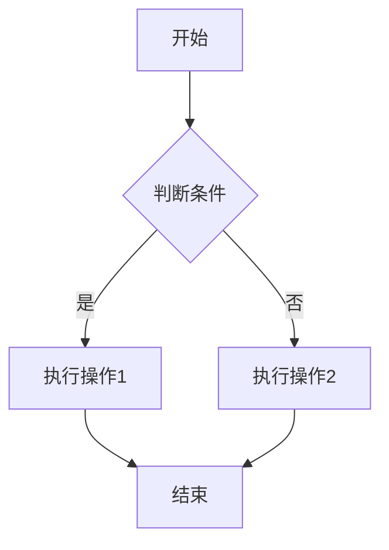
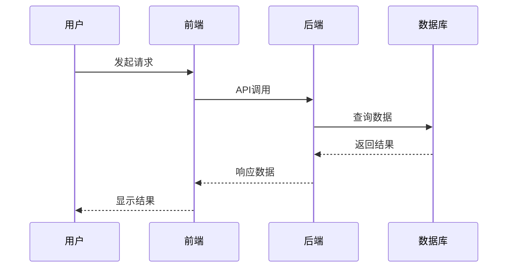
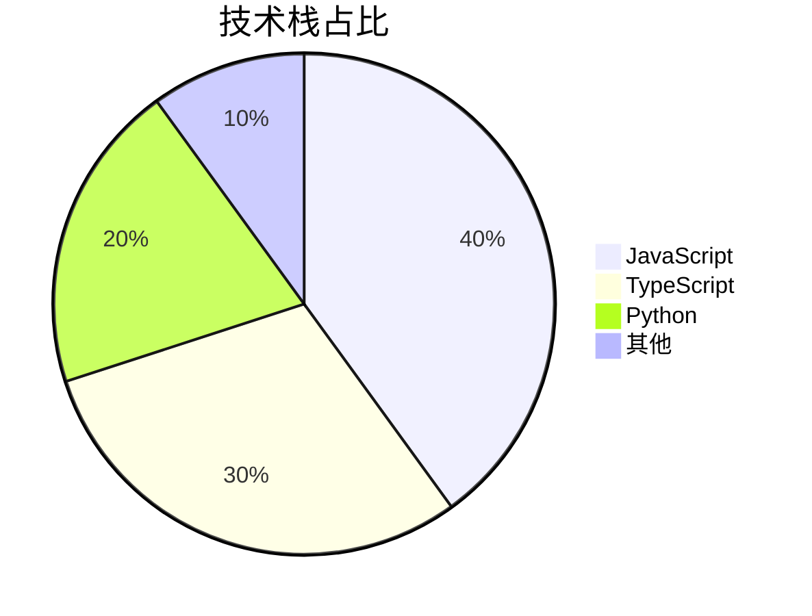
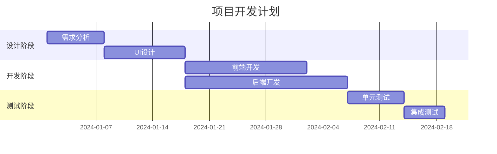
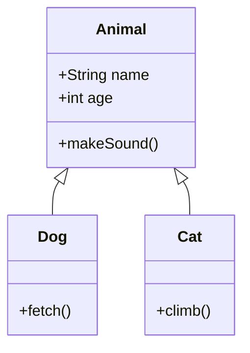
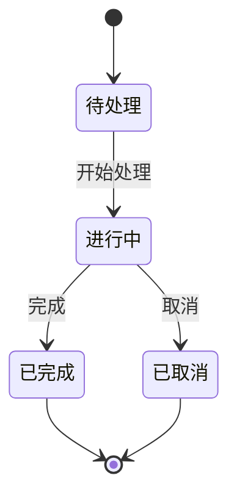
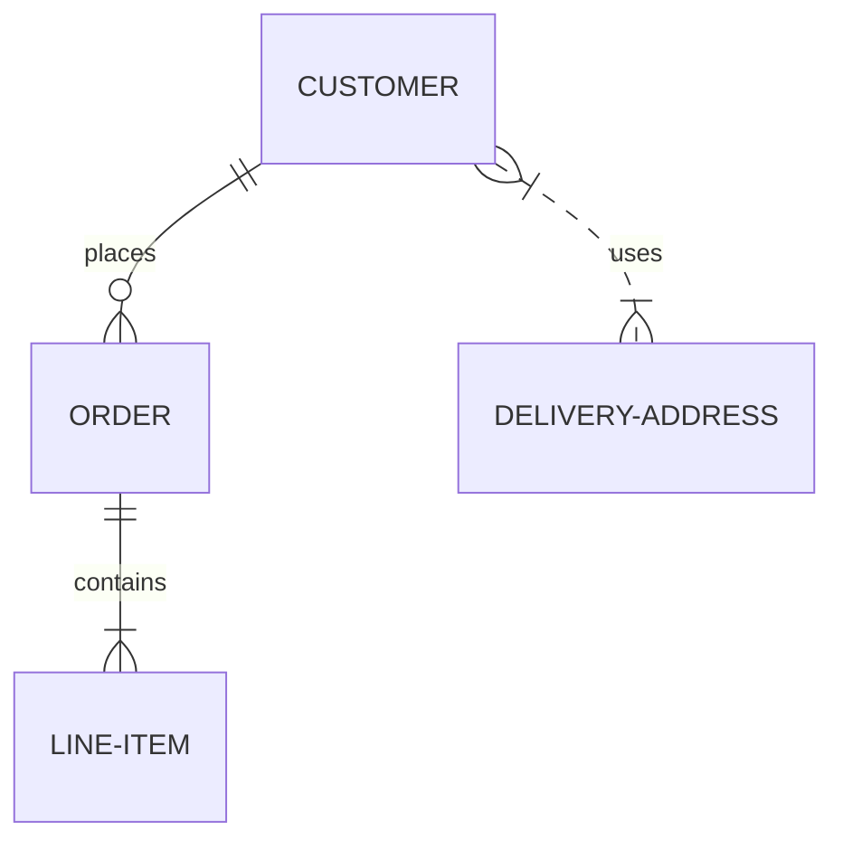

# Markdown 完整写作教程

> 📖 本教程将详细介绍 Markdown 的所有功能，每个功能都配有可直接复制的示例代码。

## 目录

- [基础语法](#基础语法)
  - [标题](#标题)
  - [段落和换行](#段落和换行)
  - [文本强调](#文本强调)
  - [列表](#列表)
  - [链接](#链接)
  - [图片](#图片)
  - [代码](#代码)
  - [表格](#表格)
  - [引用块](#引用块)
  - [水平线](#水平线)
- [进阶语法](#进阶语法)
  - [任务列表](#任务列表)
  - [删除线](#删除线)
  - [下划线](#下划线)
  - [高亮文本](#高亮文本)
  - [脚注](#脚注)
  - [表情符号](#表情符号)
  - [自动链接](#自动链接)
- [高级功能](#高级功能)
  - [数学公式](#数学公式)
  - [流程图和图表](#流程图和图表)
  - [HTML 标签](#html-标签)
  - [转义字符](#转义字符)
- [Astro 博客特殊功能](#astro-博客特殊功能)
  - [Front-matter 配置](#front-matter-配置)
  - [ admonition 提示框](#admonition-提示框)
  - [GitHub 卡片](#github-卡片)
  - [Mermaid 图表](#mermaid-图表)
- [最佳实践](#最佳实践)

---

## 基础语法

### 标题

Markdown 支持六级标题，使用 `#` 符号表示：

```markdown
# 一级标题（通常用于文章标题）
## 二级标题（章节标题）
### 三级标题（小节标题）
#### 四级标题
##### 五级标题
###### 六级标题
```

**效果展示：**

# 一级标题
## 二级标题
### 三级标题
#### 四级标题
##### 五级标题
###### 六级标题

> 💡 **提示：** 建议在 `#` 后添加一个空格，这样兼容性更好。

---

### 段落和换行

**段落：** 用空行分隔不同的段落。

```markdown
这是第一段文字。

这是第二段文字，与第一段之间有一个空行。
```

**效果：**

这是第一段文字。

这是第二段文字，与第一段之间有一个空行。

**换行：** 在行尾添加两个空格然后回车，或者使用 `<br>` 标签。

```markdown
第一行文字  
第二行文字（行尾有两个空格）

或者使用 HTML：<br>
强制换行
```

**效果：**

第一行文字  
第二行文字（行尾有两个空格）

或者使用 HTML：<br>
强制换行

---

### 文本强调

**粗体：** 使用双星号或双下划线。

```markdown
**这是粗体文本**
__这也是粗体文本__
```

**效果：**

**这是粗体文本**
__这也是粗体文本__

**斜体：** 使用单星号或单下划线。

```markdown
*这是斜体文本*
_这也是斜体文本_
```

**效果：**

*这是斜体文本*
_这也是斜体文本_

**粗斜体：** 使用三个星号或下划线。

```markdown
***这是粗斜体文本***
___这也是粗斜体文本___
```

**效果：**

***这是粗斜体文本***
___这也是粗斜体文本___

**混合使用：**

```markdown
这是**粗体**和*斜体*的组合，还可以***粗斜体***
```

**效果：**

这是**粗体**和*斜体*的组合，还可以***粗斜体***

---

### 列表

#### 无序列表

使用 `-`、`*` 或 `+` 作为列表标记：

```markdown
- 第一项
- 第二项
  - 嵌套项目 1
  - 嵌套项目 2
- 第三项
```

**效果：**

- 第一项
- 第二项
  - 嵌套项目 1
  - 嵌套项目 2
- 第三项

#### 有序列表

使用数字加点号：

```markdown
1. 第一项
2. 第二项
   1. 嵌套项目 1
   2. 嵌套项目 2
3. 第三项
```

**效果：**

1. 第一项
2. 第二项
   1. 嵌套项目 1
   2. 嵌套项目 2
3. 第三项

> 💡 **提示：** 有序列表的数字不需要连续，Markdown 会自动排序。

#### 定义列表

```markdown
术语一
: 定义一

术语二
: 定义二
```

**效果：**

术语一
: 定义一

术语二
: 定义二

---

### 链接

**基本链接：**

```markdown
[链接文字](URL地址)
```

**示例：**

```markdown
[Astro 官方文档](https://docs.astro.build/)
[Google](https://www.google.com)
```

**效果：**

[Astro 官方文档](https://docs.astro.build/)
[Google](https://www.google.com)

**带标题的链接：**

```markdown
[链接文字](URL地址 "悬停时显示的标题")
```

**示例：**

```markdown
[Astro](https://astro.build/ "Astro 官方网站")
```

**效果：**

[Astro](https://astro.build/ "Astro 官方网站")

**参考式链接：**

```markdown
这是一个[参考链接][1]。

[1]: https://example.com "示例网站"
```

**效果：**

这是一个[参考链接][1]。

[1]: https://example.com "示例网站"

**自动链接：**

```markdown
<https://www.example.com>
<email@example.com>
```

**效果：**

<https://www.example.com>
<email@example.com>

---

### 图片

**基本图片：**

```markdown

```

**示例：**

```markdown

```

**效果：**


**带标题的图片：**

```markdown

```

**示例：**

```markdown

```

**效果：**


**本地图片：**

```markdown


```

**可调整大小的图片（使用 HTML）：**

```html

```

---

### 代码

**行内代码：** 使用反引号 `` ` `` 包裹。

```markdown
使用 `console.log()` 输出信息。
安装命令：`npm install astro`
```

**效果：**

使用 `console.log()` 输出信息。
安装命令：`npm install astro`

**代码块：** 使用三个反引号包裹，可以指定语言。

````markdown
```javascript
function hello() {
  console.log("Hello, World!");
}
```

```python
def hello():
    print("Hello, World!")
```

```bash
npm install astro
pnpm dev
```
````

**效果：**

```javascript
function hello() {
  console.log("Hello, World!");
}
```

```python
def hello():
    print("Hello, World!")
```

```bash
npm install astro
pnpm dev
```

**支持的常见语言标识符：**

- `javascript` / `js`
- `typescript` / `ts`
- `python` / `py`
- `html`
- `css`
- `bash` / `shell`
- `json`
- `markdown` / `md`
- `java`
- `c` / `cpp`
- `go`
- `rust`
- `sql`
- `yaml` / `yml`

**不带语言标识的代码块：**

````markdown
```
这是纯文本代码块
没有语法高亮
```
````

**效果：**

```
这是纯文本代码块
没有语法高亮
```

---

### 表格

**基本表格：**

```markdown
| 表头1 | 表头2 | 表头3 |
|-------|-------|-------|
| 单元格1 | 单元格2 | 单元格3 |
| 单元格4 | 单元格5 | 单元格6 |
```

**效果：**

| 表头1 | 表头2 | 表头3 |
|-------|-------|-------|
| 单元格1 | 单元格2 | 单元格3 |
| 单元格4 | 单元格5 | 单元格6 |

**对齐方式：**

```markdown
| 左对齐 | 居中对齐 | 右对齐 |
|:-------|:--------:|-------:|
| 内容1 | 内容2 | 内容3 |
| 内容4 | 内容5 | 内容6 |
```

**效果：**

| 左对齐 | 居中对齐 | 右对齐 |
|:-------|:--------:|-------:|
| 内容1 | 内容2 | 内容3 |
| 内容4 | 内容5 | 内容6 |

> 💡 **提示：** 
> - `:---` 或 `:--` 表示左对齐
> - `:---:` 或 `:-:-` 表示居中对齐
> - `---:` 或 `--:` 表示右对齐

**复杂表格示例：**

```markdown
| 功能 | 支持程度 | 说明 |
|:-----|:--------:|:-----|
| 基础语法 | ✅ | 完全支持 |
| 高级语法 | ✅ | 大部分支持 |
| 扩展功能 | ⚠️ | 部分支持 |
```

**效果：**

| 功能 | 支持程度 | 说明 |
|:-----|:--------:|:-----|
| 基础语法 | ✅ | 完全支持 |
| 高级语法 | ✅ | 大部分支持 |
| 扩展功能 | ⚠️ | 部分支持 |

---

### 引用块

**基本引用：**

```markdown
> 这是一段引用文字。
> 可以跨越多行。
```

**效果：**

> 这是一段引用文字。
> 可以跨越多行。

**嵌套引用：**

```markdown
> 第一层引用
>> 第二层引用
>>> 第三层引用
```

**效果：**

> 第一层引用
>> 第二层引用
>>> 第三层引用

**引用中包含其他元素：**

```markdown
> ## 引用中的标题
> 
> 这是引用中的段落，包含**粗体**和*斜体*。
> 
> - 列表项 1
> - 列表项 2
> 
> ```javascript
> console.log("引用中的代码");
> ```
```

**效果：**

> ## 引用中的标题
> 
> 这是引用中的段落，包含**粗体**和*斜体*。
> 
> - 列表项 1
> - 列表项 2
> 
> ```javascript
> console.log("引用中的代码");
> ```

---

### 水平线

使用三个或更多的 `-`、`*` 或 `_`：

```markdown
---

***

___
```

**效果：**

---

***

___

---

## 进阶语法

### 任务列表

```markdown
- [ ] 未完成的任务
- [x] 已完成的任务
- [ ] 另一个待办事项
  - [x] 子任务 1
  - [ ] 子任务 2
```

**效果：**

- [ ] 未完成的任务
- [x] 已完成的任务
- [ ] 另一个待办事项
  - [x] 子任务 1
  - [ ] 子任务 2

---

### 删除线

使用双波浪线 `~~`：

```markdown
~~这段文字已被删除~~
原价：~~¥999~~ 现价：¥599
```

**效果：**

~~这段文字已被删除~~
原价：~~¥999~~ 现价：¥599

---

### 下划线

使用 HTML 标签：

```markdown
<u>这是带下划线的文本</u>
```

**效果：**

<u>这是带下划线的文本</u>

---

### 高亮文本

使用双等号 `==`（部分 Markdown 解析器支持）：

```markdown
==这是高亮文本==
重要内容需要==重点标记==
```

**效果：**

==这是高亮文本==
重要内容需要==重点标记==

> ⚠️ **注意：** 标准 Markdown 不支持高亮，这取决于具体的解析器。在 Astro 中可能需要额外配置。

---

### 脚注

```markdown
这是一个带有脚注的句子[^1]。
这是另一个脚注[^note]。

[^1]: 这是第一个脚注的内容。
[^note]: 这是命名脚注的内容。
```

**效果：**

这是一个带有脚注的句子[^1]。
这是另一个脚注[^note]。

[^1]: 这是第一个脚注的内容。
[^note]: 这是命名脚注的内容。

---

### 表情符号

可以直接输入 Unicode 表情或使用短代码：

```markdown
😀 😃 😄 😁 😆
🎉 🎊 🎈 🎁 🎀
❤️ 💔 💕 💖 💗
✅ ❌ ⚠️ ℹ️ 💡
```

**效果：**

😀 😃 😄 😁 😆
🎉 🎊 🎈 🎁 🎀
❤️ 💔 💕 💖 💗
✅ ❌ ⚠️ ℹ️ 💡

**常用表情短代码（如果解析器支持）：**

```markdown
:smile: :heart: :star: :thumbsup: :rocket:
```

---

### 自动链接

URL 和邮箱地址会自动转换为链接：

```markdown
访问 https://www.example.com 获取更多信息。
联系邮箱：user@example.com
```

**效果：**

访问 https://www.example.com 获取更多信息。
联系邮箱：user@example.com

---

## 高级功能

### 数学公式

使用 LaTeX 语法编写数学公式（需要 Mermaid 或 MathJax 支持）。

**行内公式：** 使用 `$...$`

```markdown
质能方程：$E = mc^2$
二次方程：$ax^2 + bx + c = 0$
```

**效果：**

质能方程：$E = mc^2$
二次方程：$ax^2 + bx + c = 0$

**块级公式：** 使用 `$$...$$`

```markdown
$$
\int_{a}^{b} f(x) dx = F(b) - F(a)
$$

$$
\sum_{i=1}^{n} i = \frac{n(n+1)}{2}
$$
```

**效果：**

$$
\int_{a}^{b} f(x) dx = F(b) - F(a)
$$

$$
\sum_{i=1}^{n} i = \frac{n(n+1)}{2}
$$

**复杂公式示例：**

```markdown
$$
f(x) = \begin{cases} 
x^2 & \text{if } x > 0 \\
0 & \text{if } x = 0 \\
-x^2 & \text{if } x < 0
\end{cases}
$$
```

**效果：**

$$
f(x) = \begin{cases} 
x^2 & \text{if } x > 0 \\
0 & \text{if } x = 0 \\
-x^2 & \text{if } x < 0
\end{cases}
$$

---

### 流程图和图表

#### Mermaid 流程图

````markdown

````

**效果：**


#### 时序图

````markdown

````

**效果：**


#### 饼图

````markdown

````

**效果：**


#### 甘特图

````markdown

````

**效果：**


---

### HTML 标签

Markdown 兼容 HTML，可以直接使用 HTML 标签：

**自定义样式：**

```html
<p style="color: red; font-weight: bold;">红色粗体文字</p>
```

**效果：**

<p style="color: red; font-weight: bold;">红色粗体文字</p>

**折叠内容：**

```html
<details>
<summary>点击展开查看详情</summary>

这里是隐藏的内容，默认不显示。

- 列表项 1
- 列表项 2

```javascript
console.log("折叠中的代码");
```
</details>
```

**效果：**

<details>
<summary>点击展开查看详情</summary>

这里是隐藏的内容，默认不显示。

- 列表项 1
- 列表项 2

```javascript
console.log("折叠中的代码");
```
</details>

**视频嵌入：**

```html
<video width="600" controls>
  <source src="video.mp4" type="video/mp4">
  您的浏览器不支持视频播放。
</video>
```

**音频嵌入：**

```html
<audio controls>
  <source src="audio.mp3" type="audio/mpeg">
  您的浏览器不支持音频播放。
</audio>
```

**iframe 嵌入：**

```html
<iframe 
  width="560" 
  height="315" 
  src="https://www.youtube.com/embed/dQw4w9WgXcQ" 
  frameborder="0" 
  allowfullscreen>
</iframe>
```

---

### 转义字符

如果需要显示 Markdown 的特殊字符，使用反斜杠 `\` 进行转义：

```markdown
\# 这不是标题
\* 这不是列表
\` 这不是代码
\[ 这不是链接
\| 这不是表格
```

**效果：**

\# 这不是标题
\* 这不是列表
\` 这不是代码
\[ 这不是链接
\| 这不是表格

**可转义的字符：**

- `\` 反斜杠
- `` ` `` 反引号
- `*` 星号
- `_` 下划线
- `{}` 花括号
- `[]` 方括号
- `()` 圆括号
- `#` 井号
- `+` 加号
- `-` 减号
- `.` 点号
- `!` 感叹号
- `|` 竖线

---

## Astro 博客特殊功能

### Front-matter 配置

每篇文章开头都需要 YAML front-matter 配置：

```yaml
---
title: 文章标题
published: 2024-04-07
description: 文章简短描述
image: ./cover.webp
tags: ["标签1", "标签2"]
category: 分类名称
draft: false
author: 作者名
updated: 2024-04-08
encrypted: false
password: ""
licenseName: CC BY-NC-SA 4.0
licenseUrl: https://creativecommons.org/licenses/by-nc-sa/4.0/
sourceLink: https://example.com/source
lang: zh_CN
pinned: false
priority: 0
alias: /custom-url
---
```

**字段说明：**

| 字段 | 类型 | 必填 | 说明 |
|------|------|------|------|
| `title` | String | ✅ | 文章标题 |
| `published` | Date | ✅ | 发布日期 (YYYY-MM-DD) |
| `description` | String | ❌ | 文章描述，用于 SEO |
| `image` | String | ❌ | 封面图片路径 |
| `tags` | Array | ❌ | 文章标签数组 |
| `category` | String | ❌ | 文章分类 |
| `draft` | Boolean | ❌ | 是否为草稿（true 不发布） |
| `author` | String | ❌ | 作者名称 |
| `updated` | Date | ❌ | 最后更新日期 |
| `encrypted` | Boolean | ❌ | 是否加密文章 |
| `password` | String | ❌ | 文章密码 |
| `licenseName` | String | ❌ | 许可证名称 |
| `licenseUrl` | String | ❌ | 许可证链接 |
| `sourceLink` | String | ❌ | 原文链接 |
| `lang` | String | ❌ | 语言代码 |
| `pinned` | Boolean | ❌ | 是否置顶 |
| `priority` | Number | ❌ | 置顶优先级（数字越小越靠前） |
| `alias` | String | ❌ | 自定义 URL 别名 |

---

### Admonition 提示框

使用指令语法创建漂亮的提示框：

**信息提示框：**

```markdown
:::info
这是一个信息提示框，用于提供额外信息。
:::
```

**效果：**

:::info
这是一个信息提示框，用于提供额外信息。
:::

**成功提示框：**

```markdown
:::tip
这是一个成功提示框，表示操作成功或建议。
:::
```

**效果：**

:::tip
这是一个成功提示框，表示操作成功或建议。
:::

**警告提示框：**

```markdown
:::warning
这是一个警告提示框，提醒用户注意潜在问题。
:::
```

**效果：**

:::warning
这是一个警告提示框，提醒用户注意潜在问题。
:::

**危险提示框：**

```markdown
:::danger
这是一个危险提示框，表示严重警告或错误。
:::
```

**效果：**

:::danger
这是一个危险提示框，表示严重警告或错误。
:::

**带标题的提示框：**

```markdown
:::tip 提示标题
这是带有自定义标题的提示框。
:::
```

**效果：**

:::tip 提示标题
这是带有自定义标题的提示框。
:::

**提示框中可以使用其他 Markdown 语法：**

```markdown
:::info 详细说明

这是一个信息提示框，包含：

- **列表项 1**
- *列表项 2*

```javascript
const code = "提示框中的代码";
```

[相关链接](https://example.com)
:::
```

**效果：**

:::info 详细说明

这是一个信息提示框，包含：

- **列表项 1**
- *列表项 2*

```javascript
const code = "提示框中的代码";
```

[相关链接](https://example.com)
:::

---

### GitHub 卡片

自动渲染 GitHub 仓库信息卡片：

```markdown
::github{repo="withastro/astro"}
```

**效果：**

::github{repo="withastro/astro"}

**其他示例：**

```markdown
::github{repo="facebook/react"}
::github{repo="microsoft/vscode"}
::github{repo="vuejs/core"}
```

---

### Mermaid 图表

除了前面展示的流程图，还支持更多类型的图表：

#### 类图

````markdown

````

**效果：**


#### 状态图

````markdown

````

**效果：**


#### 实体关系图

````markdown

````

**效果：**


---

## 最佳实践

### 1. 文件组织

```
src/content/posts/
├── category-1/
│   ├── post-1/
│   │   ├── cover.webp      # 封面图片
│   │   └── index.md        # 文章内容
│   └── post-2.md
└── category-2/
    └── post-3/
        ├── image-1.png
        ├── image-2.jpg
        └── index.md
```

### 2. 图片管理

- 小图片（图标、截图）放在文章同级目录
- 大图片（封面、横幅）使用 WebP 格式压缩
- 网络图片确保链接稳定可靠
- 为所有图片添加有意义的 alt 文本

### 3. 代码块规范

- 始终指定语言标识符以获得语法高亮
- 保持代码简洁，突出关键部分
- 长代码考虑使用折叠或分段展示

### 4. 链接检查

- 定期检查外部链接是否有效
- 内部链接使用相对路径
- 为新窗口打开的链接添加说明

### 5. SEO 优化

- 填写详细的 description
- 使用合适的 tags 和 category
- 为图片添加 alt 文本
- 合理使用标题层级（H1-H6）

### 6. 可读性提升

- 段落不要太长（3-5 行为宜）
- 适当使用列表和表格整理信息
- 重要内容使用粗体或提示框突出
- 保持统一的格式风格

### 7. 版本控制

- 使用 `updated` 字段记录更新时间
- 重大修改在文首添加更新日志
- 保留历史版本的备份

---

## 常见问题

### Q1: 如何插入视频？

A: 使用 HTML `<video>` 标签或 iframe 嵌入：

```html
<video width="600" controls>
  <source src="./video.mp4" type="video/mp4">
</video>
```

### Q2: 如何让图片居中？

A: 使用 HTML 包裹：

```html
<div align="center">
  
</div>
```

### Q3: 如何实现文字颜色？

A: 使用 HTML span 标签：

```html
<span style="color: red;">红色文字</span>
<span style="color: #00ff00;">绿色文字</span>
```

### Q4: 如何创建锚点链接？

A: 标题会自动生成锚点，也可以手动创建：

```markdown
## 章节标题 {#custom-id}

[跳转到章节](#custom-id)
```

### Q5: 如何实现代码折叠？

A: 使用 HTML details 标签：

```html
<details>
<summary>点击查看代码</summary>

```javascript
// 折叠的代码
console.log("Hello");
```
</details>
```

### Q6: 表格太宽怎么办？

A: 可以考虑：
- 简化表格内容
- 使用横向滚动（主题通常自动支持）
- 拆分为多个小表格
- 改用列表形式

### Q7: 如何添加自定义 CSS？

A: 在 Markdown 中使用 HTML style 属性：

```html
<div style="background: #f0f0f0; padding: 20px; border-radius: 8px;">
  自定义样式的内容
</div>
```

### Q8: 如何实现多栏布局？

A: 使用 CSS Grid 或 Flexbox：

```html
<div style="display: grid; grid-template-columns: 1fr 1fr; gap: 20px;">
  <div>左侧内容</div>
  <div>右侧内容</div>
</div>
```

---

## 快速参考卡片

### 常用语法速查

```markdown
# 标题
**粗体** *斜体* ***粗斜体***
[链接](URL) 
- 列表项
1. 有序列表
> 引用
`行内代码`
```语言
代码块
```
| 表格 | 列 |
|------|----|
| 数据 | 值 |
--- 水平线
~~删除线~~
- [ ] 任务列表
```

### Emoji 速查

```
😀 😃 😄 😁 😆 😅 🤣 😂 🙂 🙃
👍 👎 👏 🙌 🤝 ✊ 👊 🤛 🤜
❤️ 🧡 💛 💚 💙 💜 🖤 🤍
✅ ❌ ⚠️ ℹ️ 💡 🔥 ⭐ 🌟
📝 📚 📖 🔗 📎 📌 📍 📊
🚀 💻 🖥️ 📱 ⌨️ 🖱️ 🎯 🎨
```

---

## 总结

Markdown 是一种简洁高效的标记语言，掌握它可以大大提升写作效率。本教程涵盖了：

✅ **基础语法**：标题、段落、强调、列表、链接、图片、代码、表格、引用  
✅ **进阶功能**：任务列表、删除线、脚注、表情符号  
✅ **高级特性**：数学公式、Mermaid 图表、HTML 嵌入  
✅ **Astro 专属**：Front-matter、Admonition、GitHub 卡片  

**学习建议：**

1. 从基础语法开始练习
2. 逐步尝试高级功能
3. 参考优秀文章的写法
4. 保持练习，熟能生巧

**资源推荐：**

- [Markdown 官方指南](https://daringfireball.net/projects/markdown/)
- [Astro 文档](https://docs.astro.build/)
- [Mermaid 官方文档](https://mermaid.js.org/)
- [GitHub Flavored Markdown](https://github.github.com/gfm/)

---

> 🎉 恭喜！你已经完成了 Markdown 完整教程的学习。现在可以开始创作精彩的文章了！

[^1]: 脚注会在页面底部自动渲染
[^note]: 可以使用任意名称作为脚注标识
