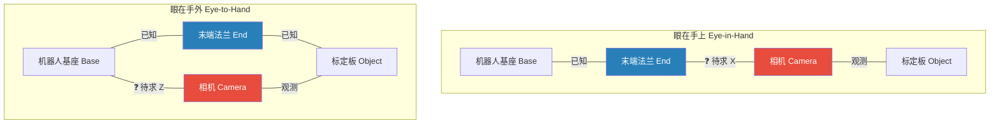
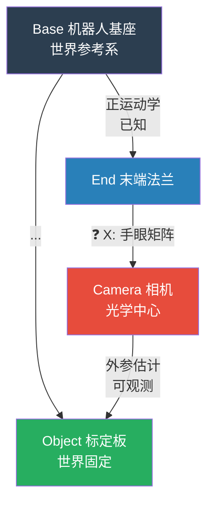
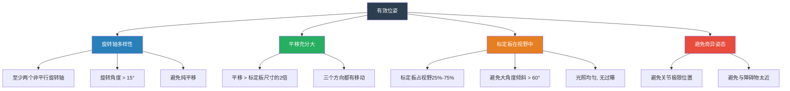
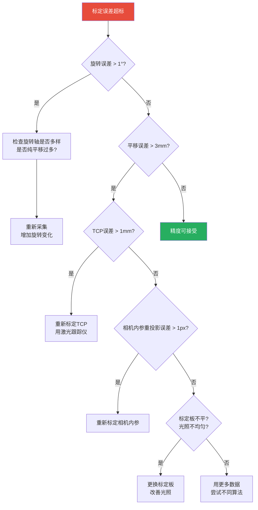

# 工业机械臂手眼标定完全教程 —— 从原理推导到产线落地

> 🤖 本教程面向工业机器人工程师、自动化产线调试人员和视觉应用开发者。假设你已熟悉机械臂的基本操作（示教器、坐标系概念、TCP标定）和至少一种工业相机的基本使用。本文将从最基础的"为什么要做手眼标定"讲起，一直讲到产线落地的全套规范。

---

## 目录

- [1. 什么是手眼标定](#1-什么是手眼标定)
  - [1.1 两种配置：眼在手上 vs 眼在手外](#11-两种配置眼在手上-vs-眼在手外)
  - [1.2 手眼标定到底在求什么](#12-手眼标定到底在求什么)
  - [1.3 一个直观的例子](#13-一个直观的例子)
- [2. 数学建模](#2-数学建模)
  - [2.1 坐标系定义](#21-坐标系定义)
  - [2.2 问题形式化：AX = XB 与 AX = ZB](#22-问题形式化ax--xb-与-ax--zb)
  - [2.3 为什么至少需要两组运动](#23-为什么至少需要两组运动)
- [3. 主流求解算法详解](#3-主流求解算法详解)
  - [3.1 综述](#31-综述)
  - [3.2 Tsai-Lenz 两步法（1989）](#32-tsai-lenz-两步法1989)
  - [3.3 Park 法（1994）—— 基于李代数](#33-park-法1994--基于李代数)
  - [3.4 Navy 法 —— 基于四元数](#34-navy-法--基于四元数)
  - [3.5 Dual Quaternion 法（1999）](#35-dual-quaternion-法1999)
  - [3.6 四种方法的对比与选择](#36-四种方法的对比与选择)
  - [3.7 同时求解 rotation 和 translation 为什么不行](#37-同时求解-rotation-和-translation-为什么不行)
- [4. 数据采集规范](#4-数据采集规范)
  - [4.1 标定板的选择与使用](#41-标定板的选择与使用)
  - [4.2 采集多少组数据？](#42-采集多少组数据)
  - [4.3 机器人位姿的选取策略](#43-机器人位姿的选取策略)
  - [4.4 逐步骤操作流程](#44-逐步骤操作流程)
  - [4.5 数据质量自查清单](#45-数据质量自查清单)
- [5. 完整代码实现](#5-完整代码实现)
  - [5.1 Python + OpenCV 实现 Tsai-Lenz 法](#51-python--opencv-实现-tsai-lenz-法)
  - [5.2 使用 OpenCV 内置函数](#52-使用-opencv-内置函数)
  - [5.3 使用 SciPy 旋转工具](#53-使用-scipy-旋转工具)
- [6. 标定结果验证与误差分析](#6-标定结果验证与误差分析)
  - [6.1 定量评估指标](#61-定量评估指标)
  - [6.2 交叉验证法](#62-交叉验证法)
  - [6.3 常见的误差来源与对策](#63-常见的误差来源与对策)
  - [6.4 标定精度不够时的排查流程图](#64-标定精度不够时的排查流程图)
- [7. 产线落地实战](#7-产线落地实战)
  - [7.1 自动化标定流程设计（PLC联动）](#71-自动化标定流程设计plc联动)
  - [7.2 标定结果的持久化与校验](#72-标定结果的持久化与校验)
  - [7.3 常见故障与恢复策略](#73-常见故障与恢复策略)
  - [7.4 从手眼标定到视觉引导抓取](#74-从手眼标定到视觉引导抓取)
- [8. 附录](#8-附录)
  - [8.1 完整 Python 脚本](#81-完整-python-脚本)
  - [8.2 标定数据记录模板](#82-标定数据记录模板)
  - [8.3 推荐阅读](#83-推荐阅读)

---

## 1. 什么是手眼标定

### 1.1 两种配置：眼在手上 vs 眼在手外

手眼标定（Hand-Eye Calibration）解决的核心问题是：**当相机（"眼"）看到目标物体时，机器人（"手"）应该怎么移动才能抓取它？**

根据相机安装位置，分为两种配置：



| | 眼在手上（Eye-in-Hand） | 眼在手外（Eye-to-Hand） |
|:---|:---|:---|
| **相机安装位置** | 机械臂末端法兰上 | 固定在工作空间上方/侧面 |
| **待求解** | 相机→末端的变换 $X = T_{E \to C}$ | 相机→基座的变换 $Z = T_{B \to C}$ |
| **数学形式** | $AX = XB$ | $AX = ZB$ |
| **典型应用** | 移动抓取、焊缝跟踪、精密装配 | 传送带分拣、上下料、码垛 |
| **精度** | 相机靠近目标，精度高 | 固定安装，稳定性好 |
| **灵活性** | 可达任意视角 | 视野固定 |

> 🏭 **产线经验**：如果你的产线是做料框分拣（Bin Picking），几乎一定是 Eye-in-Hand；如果是传送带跟踪分拣，几乎一定是 Eye-to-Hand。选错了配置，后续的软件架构会完全不同。

### 1.2 手眼标定到底在求什么

以 **Eye-in-Hand** 为例，你在示教器上能看到机器人末端位姿 $T_{B \to E}$（Base → End，即正运动学输出），相机能看到标定板的位姿 $T_{C \to O}$（Camera → Object）。

**你要求的是**：相机坐标系相对于机器人末端坐标系的固定变换 $X = [R_X \mid \mathbf{t}_X]$，使得：

$$
T_{B \to O} = T_{B \to E} \cdot X \cdot T_{C \to O}^{-1}
$$

一旦求出 $X$，相机看到的任何目标位姿 $T_{C \to \text{target}}$，都能换算成机器人的抓取位姿：

$$
\boxed{T_{B \to \text{grasp}} = T_{B \to E} \cdot X \cdot T_{C \to \text{target}}}
$$

> 🔑 **一句话总结**：手眼标定就是求相机在机器人末端上的"安装偏置"。

### 1.3 一个直观的例子

想象你手里拿了一台手机（相机），手机固定在手掌的一个3D打印夹具上。你现在：

1. 手臂伸到位置A，手机拍一张棋盘格照片 → 记录机器人位姿 $A_1$ 和标定板位姿 $B_1$
2. 手臂伸到位置B，手机再拍一张 → 记录 $A_2$ 和 $B_2$
3. ...重复10-15次

两次运动之间的变换：

- 机器人末端从位置1到位置2的变换：$A = A_{12} = A_1^{-1}A_2$
- 标定板在相机中的"运动"（其实是机器人动，标定板不动）：$B = B_{12} = B_1 B_2^{-1}$

这两个变换满足 **$AX = XB$**。$A$ 和 $B$ 都是已知的（$A$ 从机器人控制器读取，$B$ 从相机图像计算），$X$ 是未知的（相机在夹具上的安装偏置）。

---

## 2. 数学建模

### 2.1 坐标系定义

工业机器人环境中至少有 5 个坐标系需要理解：



记法约定：$T_{A \to B}$ 表示从坐标系 $A$ 到坐标系 $B$ 的刚体变换，即：

$$
\mathbf{p}_B = T_{A \to B} \cdot \mathbf{p}_A
$$

（点 $\mathbf{p}$ 在 $A$ 坐标系中的坐标乘以 $T_{A \to B}$，得到该点在 $B$ 坐标系中的坐标。）

### 2.2 问题形式化：AX = XB 与 AX = ZB

#### Eye-in-Hand：AX = XB

固定标定板，移动机器人到 $n$ 个不同位姿。对第 $i$ 次和第 $j$ 次之间的运动：

$$
\underbrace{T_{E_i \to E_j}}_{A} \cdot \underbrace{T_{E \to C}}_{X} = \underbrace{T_{E \to C}}_{X} \cdot \underbrace{T_{C_i \to C_j}}_{B}
$$

即：

$$
\boxed{AX = XB}
$$

其中：
- $A = T_{E_i \to E_j} = T_{B \to E_i}^{-1} \cdot T_{B \to E_j}$（机器人末端的相对运动）
- $B = T_{C_i \to C_j}$（相机观测到的标定板的"逆运动"）

展开为旋转和平移两部分的方程：

$$
\begin{cases}
R_A R_X = R_X R_B \\
R_A \mathbf{t}_X + \mathbf{t}_A = R_X \mathbf{t}_B + \mathbf{t}_X
\end{cases}
$$

> ⚠️ **关键细节**：$B$ 是 $T_{C_i \to C_j}$，它是**标定板**在相机坐标系下的"相对运动"。站在相机的角度看，标定板好像在反向运动。你需要确认你的相机外参函数返回的是 $T_{C \to O}$（相机→标定板）还是 $T_{O \to C}$（标定板→相机），两者互为逆，搞错会导致标定完全失败。

#### Eye-to-Hand：AX = ZB

相机固定，标定板安装在机器人末端，移动机器人到 $n$ 个不同位姿：

$$
\underbrace{T_{B \to E_i}}_{A} \cdot \underbrace{T_{E \to O}}_{B} = \underbrace{T_{B \to C}}_{Z} \cdot \underbrace{T_{C \to O_i}}_{?}
$$

更标准的形式（与 Eye-in-Hand 统一）：

$$
\boxed{AX = ZB}
$$

其中：
- $A = T_{B \to E_i}$（机器人的末端位姿）
- $B = T_{C \to O_i}$（相机观测到的标定板位姿）
- $X = T_{E \to O}$（标定板在末端上的安装偏置，通常已知）
- $Z = T_{B \to C}$（待求的相机在世界坐标系下的外参）

> 🔧 **工控思维**：你可以在PLC侧建立一个数据结构来管理所有变换关系：
> ```
> STRUCT TransformChain:
>   T_BaseToEnd: ARRAY[1..16] OF REAL  // 4x4 齐次矩阵，行优先
>   T_CamToObj: ARRAY[1..16] OF REAL   // 相机外参
>   T_HandEye: ARRAY[1..16] OF REAL    // 标定结果 X 或 Z
> END_STRUCT
> ```
> 在每次视觉引导抓取时，PLC或上位机只需要做一次矩阵乘法链：`T_BaseToGrasp = T_BaseToEnd * T_HandEye * T_CamToObj_inv`

### 2.3 为什么至少需要两组运动

**一组运动不够**。$AX = XB$ 中，固定 $A$ 和 $B$，要求解 $X$。从旋转部分看：$R_A R_X = R_X R_B$，这是一组**相似变换**关系。如果只有一对 $(R_A, R_B)$，$R_X$ 有无穷多解（旋转轴与 $R_A$ 的旋转轴对齐即可）。

**两组非平行旋转轴的运动**才能唯一确定 $R_X$。这就是为什么：

- 在实际采集中，你需要让机器人的**旋转轴方向多样化**
- 所有位姿不能只是在一个平面内平移

---

## 3. 主流求解算法详解

### 3.1 综述

手眼标定方程 $AX = XB$ 的求解方法按年代排列如下：

| 方法 | 年份 | 旋转表示 | 核心思想 |
|:---|:---|:---|:---|
| **Shiu & Ahmad** | 1989 | 轴角 | 分步解旋转和平移 |
| **Tsai & Lenz** | 1989 | 轴角 | **最经典**，两步法，工程界事实标准 |
| **Park** | 1994 | 李代数 $\mathfrak{so}(3)$ | 数学上更优雅 |
| **Daniilidis (Dual Quaternion)** | 1999 | 对偶四元数 | 同时求解旋转和平移 |
| **Horaud & Dornaika** | 1995 | 四元数 | 非线性优化 |

以下详细讲解最常用的三种。

### 3.2 Tsai-Lenz 两步法（1989）

**这是工业界使用最广泛的方法**，OpenCV 的 `calibrateHandEye` 默认也包含此实现。

#### 第一步：求解旋转 $R_X$

将旋转方程 $R_A R_X = R_X R_B$ 改写为轴角形式。设：

- $R_A$ 对应旋转轴 $\mathbf{n}_A$，角度 $\theta_A$
- $R_B$ 对应旋转轴 $\mathbf{n}_B$，角度 $\theta_B$

相似变换的性质：**相似矩阵具有相同的特征值（旋转角度相同），特征向量被变换矩阵旋转。**

因此 $\theta_A = \theta_B$（这是数据质量的一个检验标准——如果两者角度差很大，说明那组数据有问题）。

令 $\mathbf{p}_A = 2\sin(\theta_A/2) \cdot \mathbf{n}_A$（其实是轴角的某种变体），利用罗德里格斯公式可以推导出：

$$
(\mathbf{p}_A + \mathbf{p}_B) \times \mathbf{p}_X = \mathbf{p}_B - \mathbf{p}_A
$$

其中 $\mathbf{p}_X$ 是 $R_X$ 对应的修正轴角参数，$\times$ 是叉积。

写成线性方程组的形式：对每一对运动 $(i,j)$，构建：

$$
\text{Skew}(\mathbf{p}_{A,ij} + \mathbf{p}_{B,ij}) \cdot \mathbf{p}_X = \mathbf{p}_{B,ij} - \mathbf{p}_{A,ij}
$$

其中 $\text{Skew}(\mathbf{v})$ 是向量 $\mathbf{v}$ 的反对称矩阵：

$$
\text{Skew}(\mathbf{v}) = \begin{bmatrix}
0 & -v_z & v_y \\
v_z & 0 & -v_x \\
-v_y & v_x & 0
\end{bmatrix}
$$

堆叠所有运动对，得到一个 $3n \times 3$ 的超定线性方程组：

$$
\underbrace{\begin{bmatrix}
\text{Skew}(\mathbf{p}_{A,1} + \mathbf{p}_{B,1}) \\
\text{Skew}(\mathbf{p}_{A,2} + \mathbf{p}_{B,2}) \\
\vdots
\end{bmatrix}}_{M_{3n \times 3}}
\cdot
\mathbf{p}_X =
\underbrace{\begin{bmatrix}
\mathbf{p}_{B,1} - \mathbf{p}_{A,1} \\
\mathbf{p}_{B,2} - \mathbf{p}_{A,2} \\
\vdots
\end{bmatrix}}_{\mathbf{b}_{3n \times 1}}
$$

用最小二乘求解：$\mathbf{p}_X = (M^T M)^{-1} M^T \mathbf{b}$，或直接 `np.linalg.lstsq(M, b)`。

最后从 $\mathbf{p}_X$ 恢复 $R_X$：

$$
\theta_X = 2 \arctan(\|\mathbf{p}_X\|), \quad \mathbf{n}_X = \frac{\mathbf{p}_X}{\|\mathbf{p}_X\|}
$$

用罗德里格斯公式从 $(\mathbf{n}_X, \theta_X)$ 得到 $R_X$。

#### 第二步：求解平移 $\mathbf{t}_X$

固定 $R_X$ 后，平移方程：

$$
R_A \mathbf{t}_X + \mathbf{t}_A = R_X \mathbf{t}_B + \mathbf{t}_X
$$

整理为：

$$
(R_A - I) \mathbf{t}_X = R_X \mathbf{t}_B - \mathbf{t}_A
$$

堆叠所有运动对：

$$
\underbrace{\begin{bmatrix}
R_{A,1} - I \\
R_{A,2} - I \\
\vdots
\end{bmatrix}}_{N_{3n \times 3}}
\cdot
\mathbf{t}_X =
\underbrace{\begin{bmatrix}
R_X \mathbf{t}_{B,1} - \mathbf{t}_{A,1} \\
R_X \mathbf{t}_{B,2} - \mathbf{t}_{A,2} \\
\vdots
\end{bmatrix}}_{\mathbf{c}_{3n \times 1}}
$$

同样用最小二乘求解。

> 💡 **为什么分两步？** $R_A$ 和 $R_B$ 都有误差，如果放在一起做非线性优化，旋转和平移的误差会交叉污染。Tsai-Lenz 的分步思想牺牲了一点点理论最优性，换来了更好的数值稳定性和对异常值的鲁棒性。在产线上，**稳定 > 理论最优**。

### 3.3 Park 法（1994）—— 基于李代数

Park 法的核心思想：**在 $\mathfrak{so}(3)$ 李代数空间中求解旋转**。

从 $R_A R_X = R_X R_B$，两边取对数映射到李代数：

$$
R_A = R_X R_B R_X^T \quad \Longrightarrow \quad \boldsymbol{\phi}_A = R_X \boldsymbol{\phi}_B
$$

其中 $\boldsymbol{\phi}_A = \log(R_A)^{\vee}$，$\boldsymbol{\phi}_B = \log(R_B)^{\vee}$ 是李代数向量。

**这意味着**：旋转轴 $\boldsymbol{\phi}_A$ 是 $\boldsymbol{\phi}_B$ 经过 $R_X$ 旋转得到的。因此求解 $\boldsymbol{\phi}_A = R_X \boldsymbol{\phi}_B$ 本质上是一个**点云配准问题**——找一个旋转 $R_X$ 使两组三维向量对齐。

这正是 **Orthogonal Procrustes Problem**，可以用 SVD 一步求解：

对 $\{(\boldsymbol{\phi}_{B,k}, \boldsymbol{\phi}_{A,k})\}_{k=1}^n$，构造互协方差矩阵：

$$
M = \sum_{k=1}^n \boldsymbol{\phi}_{A,k} \boldsymbol{\phi}_{B,k}^T
$$

SVD 分解 $M = U\Sigma V^T$，则：

$$
\boxed{R_X = U \begin{bmatrix} 1 & 0 & 0 \\ 0 & 1 & 0 \\ 0 & 0 & \det(UV^T) \end{bmatrix} V^T}
$$

平移的求解与 Tsai-Lenz 相同。

> 🎯 **对比**：Tsai-Lenz 用轴角参数做线性最小二乘，Park 在李代数空间做 SVD。Park 法在数学上更简洁优雅，但当运动角度小（$\theta \to 0$）时，对数映射的数值稳定性不如 Tsai-Lenz 的轴角参数化。这也是为什么工业界更偏好 Tsai-Lenz——它对产线上"不敢让机器人做大角度摆动"的场景更鲁棒。

### 3.4 Navy 法 —— 基于四元数

Navy 法（因美国海军研究实验室得名）将旋转方程 $R_A R_X = R_X R_B$ 用四元数表示：

$$
\mathbf{q}_A \otimes \mathbf{q}_X = \mathbf{q}_X \otimes \mathbf{q}_B
$$

利用四元数的性质可以转化为：

$$
(\mathbf{q}_A - \mathbf{q}_B) \otimes \mathbf{q}_X = 0
$$

其中减法对应四元数的某种差运算。写成矩阵形式：

$$
\underbrace{\begin{bmatrix}
0 & (\mathbf{q}_{A,1} - \mathbf{q}_{B,1})^T \\
\mathbf{q}_{A,1} - \mathbf{q}_{B,1} & -[\mathbf{q}_{A,1} + \mathbf{q}_{B,1}]_{\times}
\end{bmatrix}}_{T_1} \mathbf{q}_X = 0
$$

对每对运动堆叠 $T_k$ 矩阵，求解 $T_{\text{stack}} \mathbf{q}_X = 0$ 的最小奇异值对应的右奇异向量，即为 $\mathbf{q}_X$。

### 3.5 Dual Quaternion 法（1999）

前面三种方法都是"先求旋转，再求平移"的两步法。**对偶四元数（Dual Quaternion）** 最优雅之处在于**同时求解旋转和平移**。

对偶四元数 $\hat{\mathbf{q}} = \mathbf{q}_r + \varepsilon \mathbf{q}_d$ 可以用8个参数统一表示刚体变换，其中 $\varepsilon^2 = 0$（对偶单位）。

方程 $AX = XB$ 在对偶四元数形式下变为：

$$
\hat{\mathbf{a}} \otimes \hat{\mathbf{q}}_X = \hat{\mathbf{q}}_X \otimes \hat{\mathbf{b}}
$$

可以构造一个 $8 \times 8$ 的矩阵系统来同时求解旋转和平移。这种方法的好处是不需要"先旋转后平移"的先后之分，但如果旋转和平移的量级相差很大（比如旋转角很小但平移很大），数值稳定性可能不如两步法。

### 3.6 四种方法的对比与选择

| 方法 | 旋转精度 | 平移精度 | 数值稳定性 | 实现难度 | 推荐场景 |
|:---|:---|:---|:---|:---|:---|
| **Tsai-Lenz** | ⭐⭐⭐⭐ | ⭐⭐⭐⭐ | ⭐⭐⭐⭐⭐ | ⭐⭐⭐ | ✅ 工业首选 |
| **Park** | ⭐⭐⭐⭐⭐ | ⭐⭐⭐⭐ | ⭐⭐⭐ | ⭐⭐⭐⭐ | ✅ 学术/大运动 |
| **Navy** | ⭐⭐⭐⭐ | ⭐⭐⭐⭐ | ⭐⭐⭐⭐ | ⭐⭐⭐ | 四元数框架 |
| **Dual Quat** | ⭐⭐⭐⭐ | ⭐⭐⭐⭐ | ⭐⭐⭐ | ⭐⭐⭐⭐⭐ | 理论优雅 |

> 🏭 **产线建议**：用 **Tsai-Lenz** 作为主算法，用 **Park** 做交叉验证。如果两种方法的结果差异很大（旋转角度差 > 1° 或平移差 > 5mm），说明数据质量有问题。

### 3.7 同时求解 rotation 和 translation 为什么不行

初学者常问：为什么不把 $R_X$ 和 $\mathbf{t}_X$ 放在一个大的非线性优化里一起求解？

**答案**：理论上可以（Dual Quaternion 就是这么做的），但实践中不推荐。原因是：

1. **量纲不匹配**：旋转角度（无量纲，~0.01 rad）和平移（~100 mm）差4个数量级。在同一个代价函数中，平移的残差会淹没旋转的残差。
2. **约束耦合**：$R_X$ 的 $SO(3)$ 约束（正交性 + 行列式为1）在无约束非线性优化中难以保持。
3. **初值依赖**：同时优化9+3=12个参数容易陷入局部极小值。

**工程上的最佳实践**：先用两步法（Tsai-Lenz 或 Park）得到闭式解，再以此作为初值跑 2-3 轮非线性精修（如 Ceres 或 `scipy.optimize.least_squares`）。

---

## 4. 数据采集规范

### 4.1 标定板的选择与使用

| 标定板类型 | 精度 | 成本 | 适用场景 |
|:---|:---|:---|:---|
| **棋盘格（Checkerboard）** | ⭐⭐⭐ | ¥30-100（亚克力） | 最常用，OpenCV 原生支持 |
| **圆点格（Circle Grid）** | ⭐⭐⭐⭐ | ¥50-200 | 圆心检测更准 |
| **ChArUco 板** | ⭐⭐⭐⭐⭐ | ¥50-150 | 遮挡鲁棒，推荐 |
| **AprilTag 板** | ⭐⭐⭐⭐ | 可打印 | 单张即可估位姿 |

> 🏭 **推荐使用 ChArUco 板**，因为它在部分遮挡时仍能定位，这在产线环境中非常重要——标定板边缘被夹具遮挡时，棋盘格会直接挂掉，ChArUco 还能继续工作。

**标定板使用注意事项**：

1. ☐ 标定板必须是**平坦**的（不要用软纸打印后贴在弯曲的表面上）
2. ☐ 打印精度要足够——棋盘格的方格边长误差应 < 0.1mm
3. ☐ 用**漫反射材质**（亚光），避免镜面反射导致角点检测失败
4. ☐ 标定板尺寸要与工作距离匹配——建议标定板至少占视野的 1/4
5. ☐ 输入 OpenCV 的格子尺寸必须是**精确测量值**，不是名义值

### 4.2 采集多少组数据？

**理论上**：至少 3 组运动（2个独立旋转轴 + 足够的平移）才能唯一确定。

**实践上**：

| 场景 | 推荐组数 | 原因 |
|:---|:---|:---|
| 实验室理想环境 | 10-15 组 | 足够冗余 |
| 产线调试 | 15-20 组 | 容错冗余大 |
| 高精度要求（±0.1mm） | 20-30 组 | 需要丰富的姿态覆盖 |

**不是越多越好**——超过 50 组后，新增数据的边际增益几乎为零。关键不在于数量，而在于**位姿的多样性**。

### 4.3 机器人位姿的选取策略

这是手眼标定中**最容易出错**的环节。好的位姿策略直接影响标定精度。

#### 核心原则



#### 推荐的位姿规划模式

**模式一：半球面采样（推荐）**

以标定板为中心，在半径变化的半球面上均匀采样 15-20 个位姿：

```
位姿 1: 正对, 距离500mm, 无旋转
位姿 2: 正对, 距离500mm, 绕Z轴旋转+20°
位姿 3: 上方30°, 距离400mm, 绕Y轴旋转-15°
位姿 4: 左侧30°, 距离450mm, 绕X轴旋转+10°
位姿 5: 下方20°, 距离550mm, 绕Z轴旋转-25°
...以此类推
```

**模式二：三轴逐步激励法**

分三轮采，每轮专注一个旋转轴：

```
第一轮（绕X轴变化为主）: 4-5个位姿
第二轮（绕Y轴变化为主）: 4-5个位姿
第三轮（绕Z轴变化为主）: 4-5个位姿
第四轮（混合 + 平移变化）: 4-5个位姿
```

#### 绝对要避免的错误位姿

| 错误 | 为什么不行 | 后果 |
|:---|:---|:---|
| ❌ 所有位姿都是**纯平移** | 旋转方程退化，$R_X$ 无法求解 | 完全失败 |
| ❌ 所有旋转都绕**同一个轴** | 缺失另外两个轴的约束 | $R_X$ 在该轴方向不确定 |
| ❌ 旋转角度都**小于5°** | 旋转信噪比太低，$R_X$ 估计不准 | 精度差 |
| ❌ 标定板**在视野边缘** | 角点检测不准，$B$ 矩阵误差大 | 平移精度差 |
| ❌ 标定板**倾斜超过70°** | 透视畸变严重，PnP 姿态估计发散 | 全部报废 |
| ❌ 位姿几乎**重复** | 浪费采集时间 | 无新增信息 |

### 4.4 逐步骤操作流程

以下是经过产线验证的标准操作流程（SOP）：

```
=======================================
  手眼标定数据采集 SOP（Eye-in-Hand）
=======================================

准备工作：
□ 1. 将标定板固定在工作台面上（不要移动）
□ 2. 确认相机已正确安装在末端夹具上且紧固
□ 3. 确认机器人TCP已正确标定（误差 < 0.5mm）
□ 4. 确认相机内参已标定（用同一相机先做内参标定）
□ 5. 调整光照，确认标定板角点可被稳定检测
□ 6. 准备数据记录表（电子或纸质）

采集步骤：
□ 7. 将机器人移到第一个位姿，确保标定板在视野中心
□ 8. 记录: 机器人末端位姿 (x,y,z,rx,ry,rz)
□ 9. 拍照，运行角点检测 + PnP，记录 T_CamToObj
□ 10. 检查重投影误差（应 < 0.5 像素）
□ 11. 重复步骤7-10，采集 15-20 个不同位姿
□ 12. 将数据导出为 CSV/JSON

采集后检查：
□ 13. 计算每对运动之间的旋转角度（> 15° 的比例应 > 50%）
□ 14. 确认旋转轴方向的标准差 > 20°（说明方向足够多样）
□ 15. 确认没有重投影误差 > 1.0 像素的"坏帧"
□ 16. 剔除坏帧后至少保留 12 组数据

标定与验证：
□ 17. 运行 Tsai-Lenz 标定算法
□ 18. 用 Park 法做交叉验证
□ 19. 计算标定后的投影误差（应 < 2 像素或 < 2mm）
□ 20. 做实物抓取测试验证
=======================================
```

### 4.5 数据质量自查清单

在运行标定算法之前，先自查以下指标：

```python
# 伪代码：数据质量检查
def check_data_quality(A_list, B_list):
    issues = []
    
    # 1. 检查运动角度是否足够大
    angles = [rotation_angle(A) for A in A_list]
    if max(angles) < 10 * pi / 180:  # 最大旋转 < 10°
        issues.append("旋转角度过小，最大仅 {:.1f}°".format(max(angles)*180/pi))
    
    # 2. 检查旋转轴是否多样
    axes = [rotation_axis(A) for A in A_list]
    axis_std = np.std(axes, axis=0)  # 各分量标准差
    if np.linalg.norm(axis_std) < 0.15:
        issues.append("旋转轴方向过于集中")
    
    # 3. 检查 A 和 B 的旋转角度是否一致
    for i, (A, B) in enumerate(zip(A_list, B_list)):
        angle_A = rotation_angle(A)
        angle_B = rotation_angle(B)
        if abs(angle_A - angle_B) > 2 * pi / 180:  # 角度差 > 2°
            issues.append("第{}组: A和B的旋转角度差 {:.2f}°".format(
                i, abs(angle_A - angle_B)*180/pi))
    
    # 4. 检查平移是否充分
    translations = [translation_norm(A) for A in A_list]
    if np.mean(translations) < 50:  # 平均平移 < 50mm
        issues.append("平移量偏小，均值仅 {:.1f}mm".format(np.mean(translations)))
    
    return issues
```

---

## 5. 完整代码实现

### 5.1 Python + OpenCV 实现 Tsai-Lenz 法

以下是从零实现的 Tsai-Lenz 算法，不依赖任何第三方 SLAM 库：

```python
import numpy as np
import cv2
from scipy.spatial.transform import Rotation as R


# ============================================================
#  辅助函数
# ============================================================

def rotation_matrix_to_axis_angle(R_mat):
    """
    旋转矩阵 → 轴角 (axis, angle)
    使用罗德里格斯公式的逆
    """
    theta = np.arccos(np.clip((np.trace(R_mat) - 1) / 2, -1, 1))
    if theta < 1e-10:
        return np.array([0, 0, 0]), 0.0
    # 反对称矩阵中提取轴
    axis = np.array([
        R_mat[2, 1] - R_mat[1, 2],
        R_mat[0, 2] - R_mat[2, 0],
        R_mat[1, 0] - R_mat[0, 1]
    ]) / (2 * np.sin(theta))
    return axis, theta


def axis_angle_to_rotation_matrix(axis, angle):
    """
    轴角 → 旋转矩阵
    罗德里格斯公式
    """
    axis = axis / np.linalg.norm(axis)
    K = np.array([
        [0, -axis[2], axis[1]],
        [axis[2], 0, -axis[0]],
        [-axis[1], axis[0], 0]
    ])
    return np.eye(3) + np.sin(angle) * K + (1 - np.cos(angle)) * (K @ K)


def pose_to_matrix(translation, rotation_matrix):
    """位姿 → 4x4 齐次变换矩阵"""
    T = np.eye(4)
    T[:3, :3] = rotation_matrix
    T[:3, 3] = translation.flatten()
    return T


# ============================================================
#  Tsai-Lenz 两步法
# ============================================================

def tsai_lenz_hand_eye_calibration(A_mats, B_mats):
    """
    手眼标定 Tsai-Lenz 两步法

    参数:
        A_mats: 列表，每个元素是 4x4 齐次矩阵 T_{B→E_i}（机器人末端位姿）
        B_mats: 列表，每个元素是 4x4 齐次矩阵 T_{C→O_i}（相机到标定板）

    返回:
        X: 4x4 齐次矩阵 T_{E→C}（手眼变换矩阵）
    """
    n = len(A_mats)

    # --- 构建运动对 ---
    A_rel = []  # 相对运动 A
    B_rel = []  # 相对运动 B

    # 使用相邻帧构建运动对（也可以用所有两两组合）
    for i in range(n - 1):
        # A = T_{E_i → E_{i+1}}
        A = np.linalg.inv(A_mats[i]) @ A_mats[i + 1]
        # B = T_{C_i → C_{i+1}} = T_{C_i→O} · T_{O→C_{i+1}}
        # 注意：B_mats 是 T_{C→O}，所以需要 T_{C_i→C_{i+1}} = B_i · B_{i+1}^{-1}
        B = B_mats[i] @ np.linalg.inv(B_mats[i + 1])

        A_rel.append(A)
        B_rel.append(B)

    # ========== 第一步：求解旋转 ==========

    # 对每对运动，构造轴角形式的线性方程
    M_list = []
    b_list = []

    for A, B in zip(A_rel, B_rel):
        R_A, t_A = A[:3, :3], A[:3, 3]
        R_B, t_B = B[:3, :3], B[:3, 3]

        # 转换为轴角
        axis_A, angle_A = rotation_matrix_to_axis_angle(R_A)
        axis_B, angle_B = rotation_matrix_to_axis_angle(R_B)

        # 如果角度太小，跳过这组
        if angle_A < 1e-10 or angle_B < 1e-10:
            continue

        # Tsai-Lenz 的修正轴角参数: p = 2 * sin(theta/2) * axis
        p_A = 2 * np.sin(angle_A / 2) * axis_A
        p_B = 2 * np.sin(angle_B / 2) * axis_B

        # 构造 Skew(p_A + p_B) * p_X = p_B - p_A
        p_sum = p_A + p_B
        skew = np.array([
            [0, -p_sum[2], p_sum[1]],
            [p_sum[2], 0, -p_sum[0]],
            [-p_sum[1], p_sum[0], 0]
        ])

        M_list.append(skew)
        b_list.append(p_B - p_A)

    if len(M_list) == 0:
        raise RuntimeError("所有运动旋转角度都太小，无法标定！")

    M = np.vstack(M_list)   # 3n x 3
    b_vec = np.hstack(b_list)  # 3n x 1

    # 最小二乘求解 p_X
    p_X, _, _, _ = np.linalg.lstsq(M, b_vec, rcond=None)

    # 从 p_X 恢复旋转矩阵: p_X = 2 * sin(theta_X/2) * axis_X
    sin_half = np.linalg.norm(p_X) / 2
    theta_X = 2 * np.arcsin(np.clip(sin_half, -1, 1))

    if np.linalg.norm(p_X) < 1e-10:
        axis_X = np.array([1, 0, 0])
    else:
        axis_X = p_X / np.linalg.norm(p_X)

    R_X = axis_angle_to_rotation_matrix(axis_X, theta_X)

    # ========== 第二步：求解平移 ==========

    N_list = []
    c_list = []

    for A, B in zip(A_rel, B_rel):
        R_A, t_A = A[:3, :3], A[:3, 3]
        _, t_B = B[:3, :3], B[:3, 3]

        # (R_A - I) * t_X = R_X * t_B - t_A
        N_list.append(R_A - np.eye(3))
        c_list.append(R_X @ t_B - t_A)

    N_mat = np.vstack(N_list)
    c_vec = np.hstack(c_list)

    t_X, _, _, _ = np.linalg.lstsq(N_mat, c_vec, rcond=None)

    # --- 组装结果 ---
    X = np.eye(4)
    X[:3, :3] = R_X
    X[:3, 3] = t_X

    return X


# ============================================================
#  使用示例
# ============================================================

if __name__ == "__main__":
    # 模拟数据（实际使用时从机器人和相机读取）
    # A_list: 机器人末端位姿 [T_BaseToEnd_1, T_BaseToEnd_2, ...]
    # B_list: 相机外参       [T_CamToObj_1,  T_CamToObj_2,  ...]

    # 示例：假设有3个位姿
    A_list = [
        pose_to_matrix([500, 0, 300], np.eye(3)),
        pose_to_matrix([550, 50, 310],
                       R.from_euler('xyz', [0, 15, 5], degrees=True).as_matrix()),
        pose_to_matrix([480, -30, 290],
                       R.from_euler('xyz', [-10, 10, -5], degrees=True).as_matrix()),
    ]
    B_list = [
        pose_to_matrix([100, 20, 400], np.eye(3)),
        pose_to_matrix([105, 25, 410],
                       R.from_euler('xyz', [1, 14, 4], degrees=True).as_matrix()),
        pose_to_matrix([90, 15, 395],
                       R.from_euler('xyz', [-11, 9, -6], degrees=True).as_matrix()),
    ]

    X = tsai_lenz_hand_eye_calibration(A_list, B_list)
    print("手眼矩阵 X (T_EndToCam):")
    print(np.round(X, 4))
    print(f"\n旋转部分 (欧拉角 XYZ): {R.from_matrix(X[:3,:3]).as_euler('xyz', degrees=True)}")
    print(f"平移部分 (mm): {X[:3, 3]}")
```

### 5.2 使用 OpenCV 内置函数

OpenCV 从 4.5 版本开始提供了 `calibrateHandEye` 函数，支持多种方法：

```python
import cv2
import numpy as np

def opencv_hand_eye_calibration(R_end2base_list, t_end2base_list,
                                 R_obj2cam_list, t_obj2cam_list,
                                 method=cv2.CALIB_HAND_EYE_TSAI):
    """
    使用 OpenCV 内置手眼标定

    重要: OpenCV 的输入约定与你预期可能相反！
    - R_end2base / t_end2base: 机器人末端相对于基座的位姿
    - R_obj2cam / t_obj2cam: 标定板(物)相对于相机的位姿（不是相机到标定板！）

    如果你有的是 T_CamToObj（相机到标定板），需要取逆！
    """
    # 转换为 OpenCV 需要的格式
    R_gripper2base = []  # 相当于末端→基座
    t_gripper2base = []
    R_target2cam = []    # 相当于标定板→相机
    t_target2cam = []

    for R_e2b, t_e2b in zip(R_end2base_list, t_end2base_list):
        R_gripper2base.append(R_e2b)
        t_gripper2base.append(t_e2b)

    for R_o2c, t_o2c in zip(R_obj2cam_list, t_obj2cam_list):
        R_target2cam.append(R_o2c)
        t_target2cam.append(t_o2c)

    # 调用 OpenCV
    R_cam2gripper, t_cam2gripper = cv2.calibrateHandEye(
        R_gripper2base, t_gripper2base,
        R_target2cam, t_target2cam,
        R_cam2gripper=None,  # 初始猜测
        t_cam2gripper=None,
        method=method
    )

    # 组装 4x4 变换矩阵: 相机→末端（即手眼矩阵 X 的逆）
    T_cam2end = np.eye(4)
    T_cam2end[:3, :3] = R_cam2gripper
    T_cam2end[:3, 3] = t_cam2gripper.flatten()

    return T_cam2end


# OpenCV 支持的方法:
# cv2.CALIB_HAND_EYE_TSAI        - Tsai-Lenz 法
# cv2.CALIB_HAND_EYE_PARK        - Park 法
# cv2.CALIB_HAND_EYE_HORAUD      - Horaud 法
# cv2.CALIB_HAND_EYE_ANDREFF     - Andreff 法
# cv2.CALIB_HAND_EYE_DANIILIDIS  - 对偶四元数法
```

> ⚠️ **重要警告**：OpenCV 的 `calibrateHandEye` 返回的是 $T_{\text{Camera} \to \text{Gripper}}$（相机到夹爪/末端），这是 $X^{-1}$！不要直接用这个结果去做 $T_{B \to E} \cdot X \cdot T_{C \to O}^{-1}$，要先用 `np.linalg.inv()` 转回 $X$。每年都有工程师在这个地方栽跟头。

### 5.3 使用 SciPy 旋转工具

SciPy 1.7+ 的 `Rotation` 类让旋转操作更安全：

```python
from scipy.spatial.transform import Rotation

# 机器人末端位姿通常用欧拉角（XYZ固定角 或 ZYX）
# 确认你的机器人输出的是哪种欧拉角约定！

# 假设你的机器人输出 (x, y, z, A, B, C) 其中 ABC 是 XYZ 固定角（度）
def robot_pose_to_matrix(x, y, z, A, B, C, degrees=True):
    """
    机器人标准位姿 → 4x4 齐次矩阵
    注意：每个品牌的欧拉角约定不同！
    - ABB: 四元数
    - Fanuc: XYZ 固定角（w,p,r）
    - KUKA: ZYX 欧拉角（A,B,C）
    - 国产机器人: 五花八门，务必查阅手册
    """
    R_mat = Rotation.from_euler('xyz', [A, B, C], degrees=degrees).as_matrix()
    T = np.eye(4)
    T[:3, :3] = R_mat
    T[:3, 3] = [x, y, z]
    return T


# 当你不确定欧拉角类型时，用矩阵存储最安全
# 推荐：在数据采集阶段就将欧拉角转换为旋转矩阵
```

---

## 6. 标定结果验证与误差分析

### 6.1 定量评估指标

标定完成后，用以下指标评估质量：

#### 指标1：重投影误差

将标定板角点从世界坐标系通过手眼链投影到图像，计算与检测角点的像素差：

$$
\text{err}_{\text{reproj}} = \frac{1}{N}\sum_{i} \| \pi(K, T_{B \to E_i}, X, \mathbf{P}_w) - \mathbf{p}_{\text{detected},i} \|
$$

**合格线**：< 1.0 像素（硬件良好时可达 < 0.3 像素）。

#### 指标2：位姿预测误差

用 $n-1$ 组数据标定，预测第 $n$ 组中标定板的位姿，与测量值比较：

$$
\text{err}_{\text{pose}} = \| \hat{T}_{C \to O} - T_{C \to O}^{\text{measured}} \|
$$

可分为旋转误差（度）和平移误差（mm）。

**合格线**：旋转 < 0.5°，平移 < 2mm。

#### 指标3：闭环一致性

用标定结果将标定板位姿通过机器人基座→末端→相机→标定板链式变换，检查是否与直接测量一致。这等价于检查以下矩阵是否接近单位阵：

$$
T_{\text{closure}} = T_{O \to B}^{\text{measured}} \cdot \big(T_{B \to E}^{-1} \cdot X \cdot T_{C \to O}\big)^{-1}
$$

### 6.2 交叉验证法

```python
def cross_validate(A_list, B_list, method_func, n_folds=5):
    """
    K-fold 交叉验证
    用 K-1 份数据标定，预测剩下 1 份，轮流进行
    """
    n = len(A_list)
    fold_size = n // n_folds
    rotation_errors = []
    translation_errors = []

    for fold in range(n_folds):
        # 划分训练/测试
        test_indices = list(range(fold * fold_size, (fold + 1) * fold_size))
        train_indices = [i for i in range(n) if i not in test_indices]

        # 用训练集标定
        A_train = [A_list[i] for i in train_indices]
        B_train = [B_list[i] for i in train_indices]
        X = method_func(A_train, B_train)

        # 用测试集验证
        for idx in test_indices:
            # 预测: T_BO_pred = T_BE · X · T_CO^{-1}
            T_BO_pred = A_list[idx] @ X @ np.linalg.inv(B_list[idx])
            # 标定板世界位姿应该恒定（因为是固定的）
            # 理论上所有 T_BO_pred 应该一样，实际不会完全相同
            # 计算与均值的偏差
            pass  # 详细实现见附录完整脚本

    return np.mean(rotation_errors), np.std(rotation_errors), \
           np.mean(translation_errors), np.std(translation_errors)
```

### 6.3 常见的误差来源与对策

| 误差来源 | 典型量级 | 对最终精度的影响 | 对策 |
|:---|:---|:---|:---|
| **TCP标定不准** | 1-5mm | 直接叠加到平移误差 | 用四点法或激光跟踪仪精确标定TCP |
| **相机内参不准** | 0.5-2px | 通过PnP放大 | 用同一相机优先做好内参标定 |
| **机器人绝对定位误差** | 0.5-3mm（工业机器人典型值） | 影响A矩阵精度 | 在标定位姿附近做局部运动；使用重复定位精度而非绝对精度 |
| **标定板检测抖动** | 0.2-1px | 影响B矩阵精度 | 多帧平均、提高光照均匀性 |
| **温度变形** | 0.1-0.5mm（长时间运行后） | 慢漂 | 定期重标定（每班/每天） |
| **夹持松动** | 灾难性 | 全部报废 | 每次换型后检查紧固 |

> 🔑 **最关键的一条**：机器人的**重复定位精度**（~0.05mm）远比**绝对定位精度**（~1-3mm）高。因此，在手眼标定的采集中，尽量让机器人在标定板附近做**局部运动**而不是大范围全工作空间运动。运动范围控制在 500mm 以内通常效果最好。

### 6.4 标定精度不够时的排查流程图



---

## 7. 产线落地实战

### 7.1 自动化标定流程设计（PLC联动）

在产线上，手眼标定不应是"技术员手动操作示教器+笔记本Python脚本"的一次性操作，而应该是一个**可重复、可追溯、可恢复**的自动化流程。

#### 推荐架构

```
┌─────────────┐     EtherCAT/ProfiNet      ┌─────────────┐
│   PLC/HMI   │◄──────────────────────────►│   机器人    │
│  (控制中枢)  │                             │  控制器    │
└──────┬──────┘                             └──────┬──────┘
       │ Modbus TCP / TCP Socket                 │
       ▼                                          │
┌─────────────┐                                   │
│  上位机 IPC  │◄────── GigE Vision / USB3 ───────┘
│ (标定+视觉)  │
│             │
│ ┌─────────┐ │
│ │标定服务  │ │  ← 运行 Python / C++ 标定程序
│ │结果管理  │ │  ← 存储标定结果
│ │视觉算法  │ │  ← 实时检测
│ └─────────┘ │
└─────────────┘
```

#### PLC 侧的触发逻辑（结构化文本）

```iecst
// ==========================================
// 手眼标定自动采集流程 (PLC侧)
// 语言: 结构化文本 (ST) / IEC 61131-3
// ==========================================

PROGRAM HandEyeCalibration

VAR
    // 流程状态机
    eState: (IDLE, MOVE_TO_POSE, WAIT_STABLE, TRIGGER_CAPTURE,
             WAIT_RESULT, CHECK_QUALITY, NEXT_POSE, DONE, FAULT) := IDLE;
    
    // 位姿列表（预设或从文件加载）
    aTargetPoses: ARRAY[1..20] OF PoseType;
    iPoseIndex: INT := 0;
    iPoseCount: INT := 20;
    
    // 通信信号
    bStartCalib: BOOL;           // HMI 启动按钮
    bRobotInPosition: BOOL;      // 机器人到位反馈
    bRobotStable: BOOL;          // 机器人稳定（振动<阈值）
    bCaptureDone: BOOL;          // 上位机采集完成
    bResultValid: BOOL;          // 上位机检测结果有效
    fReprojError: REAL;          // 重投影误差
    
    // 标定结果接收
    fHandEyeMatrix: ARRAY[1..16] OF REAL;  // 4x4 行优先
    bCalibOK: BOOL;
    
    // 超时
    tonTimeout: TON;
END_VAR

CASE eState OF
    IDLE:
        IF bStartCalib THEN
            iPoseIndex := 0;
            eState := MOVE_TO_POSE;
        END_IF;
    
    MOVE_TO_POSE:
        iPoseIndex := iPoseIndex + 1;
        IF iPoseIndex > iPoseCount THEN
            eState := DONE;
        ELSE
            // 发送位姿到机器人
            SendPoseToRobot(aTargetPoses[iPoseIndex]);
            tonTimeout(IN := TRUE, PT := T#30S);
            eState := WAIT_STABLE;
        END_IF;
    
    WAIT_STABLE:
        IF bRobotInPosition AND bRobotStable THEN
            eState := TRIGGER_CAPTURE;
        ELSIF tonTimeout.Q THEN
            eState := FAULT;
        END_IF;
    
    TRIGGER_CAPTURE:
        // 触发上位机采集
        bTriggerCapture := TRUE;
        eState := WAIT_RESULT;
    
    WAIT_RESULT:
        IF bCaptureDone THEN
            bTriggerCapture := FALSE;
            IF bResultValid AND (fReprojError < 0.5) THEN
                eState := NEXT_POSE;
            ELSE
                // 记录不良帧，可选择重试或跳过
                eState := NEXT_POSE;
            END_IF;
        END_IF;
    
    NEXT_POSE:
        eState := MOVE_TO_POSE;
    
    DONE:
        // 触发标定计算
        bTriggerCompute := TRUE;
        IF bCalibOK THEN
            // 保存结果到断电保持区
            SaveHandEyeMatrix(fHandEyeMatrix);
        END_IF;
        eState := IDLE;
    
    FAULT:
        // 报警处理
        IF bReset THEN
            eState := IDLE;
        END_IF;
END_CASE;
```

### 7.2 标定结果的持久化与校验

标定结果应该被当作**关键工艺参数**来管理，就像你管理机器人的零点参数一样。

```python
import json
import hashlib
from datetime import datetime

class CalibrationManager:
    """
    标定结果管理：存储、校验、版本控制
    """
    
    def __init__(self, storage_path="/opt/vision/calib/"):
        self.storage_path = storage_path
    
    def save_calibration(self, X, metadata):
        """
        保存标定结果，附带元数据
        """
        timestamp = datetime.now().strftime("%Y%m%d_%H%M%S")
        filename = f"handeye_{timestamp}.json"
        
        data = {
            "version": "2.0",
            "timestamp": timestamp,
            "robot_serial": metadata.get("robot_sn", "unknown"),
            "camera_serial": metadata.get("camera_sn", "unknown"),
            "method": metadata.get("method", "Tsai-Lenz"),
            "hand_eye_matrix": X.flatten().tolist(),  # 16个元素, 行优先
            "rotation_error_deg": metadata.get("rot_error", 0),
            "translation_error_mm": metadata.get("trans_error", 0),
            "num_poses_used": metadata.get("n_poses", 0),
            "num_poses_rejected": metadata.get("n_rejected", 0),
            "checksum": self._compute_checksum(X),
            "operator": metadata.get("operator", "unknown"),
        }
        
        with open(self.storage_path + filename, 'w') as f:
            json.dump(data, f, indent=2)
        
        # 同时保存一份 current.json 作为当前生效的标定
        with open(self.storage_path + "current.json", 'w') as f:
            json.dump(data, f, indent=2)
        
        print(f"标定结果已保存: {filename}")
        return filename
    
    def load_current(self):
        """加载当前生效的标定结果"""
        with open(self.storage_path + "current.json", 'r') as f:
            data = json.load(f)
        
        # 校验完整性
        X = np.array(data["hand_eye_matrix"]).reshape(4, 4)
        if self._compute_checksum(X) != data["checksum"]:
            raise ValueError("标定文件校验失败！文件可能已损坏。")
        
        return X, data
    
    def _compute_checksum(self, X):
        """SHA256 校验"""
        return hashlib.sha256(X.tobytes()).hexdigest()[:16]
```

### 7.3 常见故障与恢复策略

| 故障 | 症状 | 快速恢复 |
|:---|:---|:---|
| **相机被撞歪** | 抓取偏移逐步增大 | 运行快速校验流程（拍标定板→计算偏差→判断是否需重标定） |
| **更换相机** | — | 必须重新做**完整**手眼标定 + 内参标定 |
| **更换末端夹具** | TCP变化 | 重新标定TCP + 重新做手眼标定 |
| **产线搬迁** | — | 眼在手外必须重标；眼在手上如果相机→末端未动则不需要 |
| **温度剧烈变化** | 精度逐渐下降 | 每天首次开机时做自动校验 |
| **标定文件丢失/损坏** | 视觉引导完全失败 | 从备份恢复（必须有异地/云端备份） |

> 🏭 **产线铁律**：标定结果至少保存 **3 个备份**——机器人控制器内一份、上位机硬盘一份、云端/网络存储一份。标定文件大小不过几KB，丢了恢复的代价是停线数小时。

### 7.4 从手眼标定到视觉引导抓取

手眼标定完成后，视觉引导抓取的完整计算链为：

```python
def visual_guided_grasp(T_base_to_end, X_handeye, T_cam_to_obj, T_obj_to_grasp):
    """
    视觉引导抓取的核心计算

    参数:
        T_base_to_end:  机器人当前末端位姿（从机器人控制器读取）
        X_handeye:      手眼标定结果 T_End→Cam
        T_cam_to_obj:   相机检测到的目标位姿 T_Cam→Obj
        T_obj_to_grasp: 抓取点相对于目标物体的位姿（预先定义）

    返回:
        T_base_to_grasp: 机器人需要去的抓取位姿
    """
    # 完整变换链：Base → End → Cam → Obj → Grasp
    T_base_to_grasp = T_base_to_end @ X_handeye @ T_cam_to_obj @ T_obj_to_grasp
    return T_base_to_grasp


# 使用示例
if __name__ == "__main__":
    import numpy as np
    from scipy.spatial.transform import Rotation

    # 1. 加载标定结果
    # X_handeye = load_calibration()  # T_End→Cam

    # 2. 从机器人读取当前位置
    T_base_to_end = np.eye(4)
    T_base_to_end[:3, :3] = Rotation.from_euler('xyz', [10, -5, 30],
                                                 degrees=True).as_matrix()
    T_base_to_end[:3, 3] = [600, 100, 400]

    # 3. 从相机获取目标位姿
    T_cam_to_obj = np.eye(4)
    T_cam_to_obj[:3, 3] = [50, -20, 300]  # 物体在相机前方300mm

    # 4. 预设抓取姿态（物体坐标系下的抓取点）
    T_obj_to_grasp = np.eye(4)
    T_obj_to_grasp[:3, 3] = [0, 0, 50]  # 沿物体Z轴上方50mm处抓取

    # 5. 计算最终抓取位姿
    T_grasp = visual_guided_grasp(
        T_base_to_end, X_handeye, T_cam_to_obj, T_obj_to_grasp
    )
    print("发送给机器人的抓取位姿:")
    print(np.round(T_grasp, 2))
```

---

## 8. 附录

### 8.1 完整 Python 脚本

完整的一站式标定脚本（包含数据加载、Tsai-Lenz求解、Park验证、误差评估），建议保存为 `hand_eye_calib.py`：

```python
#!/usr/bin/env python3
"""
完整手眼标定脚本
用法: python hand_eye_calib.py --data calibration_data.json --method tsai

数据文件 calibration_data.json 格式:
{
  "robot_poses": [
    {"x": 500, "y": 0, "z": 300, "rx": 0, "ry": 0, "rz": 0},
    ...
  ],
  "camera_poses": [
    {"x": 100, "y": 20, "z": 400, "qx": 0, "qy": 0, "qz": 0, "qw": 1},
    ...
  ],
  "euler_convention": "xyz_fixed",  // 机器人的欧拉角约定
  "camera_format": "quaternion"     // 相机外参的旋转格式
}
"""

import json
import argparse
import numpy as np
from scipy.spatial.transform import Rotation as R


def load_data(filepath):
    """加载标定数据"""
    with open(filepath, 'r') as f:
        data = json.load(f)
    
    A_list = []
    B_list = []
    
    for rp, cp in zip(data["robot_poses"], data["camera_poses"]):
        # 机器人末端位姿 → 4x4
        A = np.eye(4)
        if data.get("euler_convention", "").startswith("quat"):
            A[:3, :3] = R.from_quat(
                [rp["qx"], rp["qy"], rp["qz"], rp["qw"]]
            ).as_matrix()
        else:
            euler_order = data.get("euler_convention", "xyz")
            A[:3, :3] = R.from_euler(
                euler_order, [rp["rx"], rp["ry"], rp["rz"]], degrees=True
            ).as_matrix()
        A[:3, 3] = [rp["x"], rp["y"], rp["z"]]
        A_list.append(A)
        
        # 相机外参 → 4x4
        B = np.eye(4)
        if data.get("camera_format", "") == "quaternion":
            B[:3, :3] = R.from_quat(
                [cp["qx"], cp["qy"], cp["qz"], cp["qw"]]
            ).as_matrix()
        else:
            B[:3, :3] = R.from_euler(
                'xyz', [cp["rx"], cp["ry"], cp["rz"]], degrees=True
            ).as_matrix()
        B[:3, 3] = [cp["x"], cp["y"], cp["z"]]
        B_list.append(B)
    
    return A_list, B_list, data


def evaluate_calibration(A_list, B_list, X):
    """评估标定质量"""
    # 所有 T_BO_pred = T_BE · X · T_CO^{-1} 理论上应相同
    T_BO_list = []
    for A, B in zip(A_list, B_list):
        T_BO = A @ X @ np.linalg.inv(B)
        T_BO_list.append(T_BO)
    
    # 计算均值和偏差
    translations = np.array([T[:3, 3] for T in T_BO_list])
    mean_trans = np.mean(translations, axis=0)
    trans_std = np.std(translations, axis=0)
    
    # 计算旋转偏差
    rotations = [T[:3, :3] for T in T_BO_list]
    mean_rot = rotations[0]  # 简化：用第一个做参考
    rot_angles = []
    for rot in rotations:
        R_diff = rot.T @ mean_rot
        angle = np.arccos(np.clip((np.trace(R_diff) - 1) / 2, -1, 1))
        rot_angles.append(np.degrees(angle))
    
    return {
        "translation_mean_mm": mean_trans.tolist(),
        "translation_std_mm": trans_std.tolist(),
        "translation_rmse_mm": np.sqrt(np.mean(np.sum(
            (translations - mean_trans)**2, axis=1
        ))),
        "rotation_rmse_deg": np.sqrt(np.mean(np.array(rot_angles)**2)),
    }


def main():
    parser = argparse.ArgumentParser(description="手眼标定工具")
    parser.add_argument("--data", required=True, help="标定数据 JSON 文件")
    parser.add_argument("--method", default="tsai",
                        choices=["tsai", "park", "opencv"],
                        help="标定方法")
    parser.add_argument("--output", default="handeye_result.json",
                        help="输出文件")
    args = parser.parse_args()
    
    # 加载数据
    A_list, B_list, meta = load_data(args.data)
    print(f"加载了 {len(A_list)} 组标定数据")
    
    # 执行标定
    if args.method == "tsai":
        from hand_eye_calib_impl import tsai_lenz_hand_eye_calibration
        X = tsai_lenz_hand_eye_calibration(A_list, B_list)
    elif args.method == "park":
        # TODO: 实现 Park 法
        pass
    elif args.method == "opencv":
        import cv2
        R_gripper2base = [A[:3, :3] for A in A_list]
        t_gripper2base = [A[:3, 3] for A in A_list]
        R_target2cam = [np.linalg.inv(B[:3, :3]) for B in B_list]
        t_target2cam = [-R_target2cam[i].T @ B[:3, 3]
                        for i, B in enumerate(B_list)]
        R_cam2gripper, t_cam2gripper = cv2.calibrateHandEye(
            R_gripper2base, t_gripper2base,
            R_target2cam, t_target2cam,
            method=cv2.CALIB_HAND_EYE_TSAI
        )
        X = np.linalg.inv(np.vstack([
            np.hstack([R_cam2gripper, t_cam2gripper.reshape(3, 1)]),
            [0, 0, 0, 1]
        ]))
    
    # 评估
    metrics = evaluate_calibration(A_list, B_list, X)
    
    # 输出结果
    print("\n========== 标定结果 ==========")
    print(f"手眼矩阵 X (T_End→Cam):")
    print(np.round(X, 4))
    rot = R.from_matrix(X[:3, :3])
    print(f"\n旋转(欧拉角 XYZ, 度): {rot.as_euler('xyz', degrees=True)}")
    print(f"旋转(轴角): 轴={rot.as_rotvec()}, 角={np.linalg.norm(rot.as_rotvec()):.4f}rad")
    print(f"\n平移(mm): {X[:3, 3]}")
    print(f"\n========== 质量评估 ==========")
    print(f"平移 RMSE: {metrics['translation_rmse_mm']:.3f} mm")
    print(f"旋转 RMSE: {metrics['rotation_rmse_deg']:.3f}°")
    print(f"平移标准差(X/Y/Z): {np.round(metrics['translation_std_mm'], 3)} mm")
    
    # 保存
    result = {
        "hand_eye_matrix": X.tolist(),
        "rotation_euler_xyz_deg": rot.as_euler('xyz', degrees=True).tolist(),
        "rotation_axis_angle": {
            "axis": (X[:3, :3] @ rot.as_rotvec()).tolist(),
            "angle_rad": float(np.linalg.norm(rot.as_rotvec()))
        },
        "translation_mm": X[:3, 3].tolist(),
        "quality": metrics,
        "method": args.method,
        "num_poses": len(A_list),
    }
    with open(args.output, 'w') as f:
        json.dump(result, f, indent=2)
    print(f"\n结果已保存到 {args.output}")


if __name__ == "__main__":
    main()
```

### 8.2 标定数据记录模板

建议在产线调试时使用以下 Excel/CSV 模板记录数据：

| 序号 | 机器人X(mm) | 机器人Y(mm) | 机器人Z(mm) | 机器人RX(°) | 机器人RY(°) | 机器人RZ(°) | 相机X | 相机Y | 相机Z | 相机QX | 相机QY | 相机QZ | 相机QW | 重投影误差 | 备注 |
|:---|:---|:---|:---|:---|:---|:---|:---|:---|:---|:---|:---|:---|:---|:---|:---|
| 1 | 500.00 | 0.00 | 300.00 | 0.0 | 0.0 | 0.0 | ... | ... | ... | ... | ... | ... | ... | 0.3 | 正对基准位姿 |
| 2 | 520.00 | 30.00 | 310.00 | 15.0 | -5.0 | 10.0 | ... | ... | ... | ... | ... | ... | ... | 0.4 | |
| ... | ... | ... | ... | ... | ... | ... | ... | ... | ... | ... | ... | ... | ... | ... | |

> 💡 **建议使用四元数记录相机外参**，避免欧拉角转换中丢失信息。如果相机SDK只输出欧拉角，在记录时就转为四元数。

### 8.3 推荐阅读

| 资源 | 说明 |
|:---|:---|
| **Tsai & Lenz, 1989** | 手眼标定的经典论文，两步法的原始出处 |
| **Park, 1994** | 基于李代数的手眼标定，数学上更严格的推导 |
| **Daniilidis, 1999** | 对偶四元数同时求解旋转和平移 |
| **OpenCV 文档 calibrateHandEye** | 工业级实现，支持5种方法 |
| **《视觉SLAM十四讲》第5讲** | 刚体变换和李群李代数基础 |
| **《机器人学导论》Craig** | 第2-3章: 坐标系与DH参数 |

---

> 📝 *本文档为产线工程师编写，侧重于实践可操作性。如果对背后的数学推导（李群李代数、非线性优化、SVD求解）感兴趣，请参阅本站姊妹篇《[激光SLAM数学基础详解](/posts/lidar-slam-math)》。*
>
> *遇到问题？请先检查 §6.4 的排查流程图，80% 的标定问题可以通过那一页解决。*
