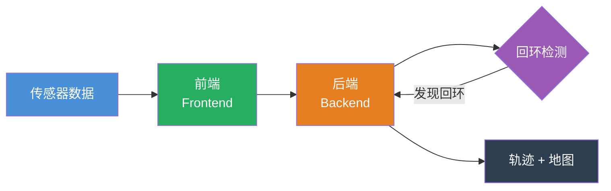
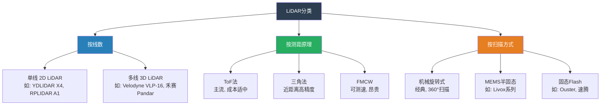
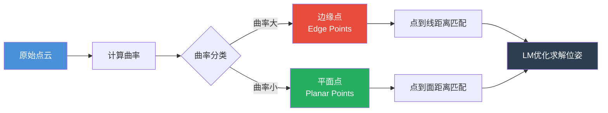
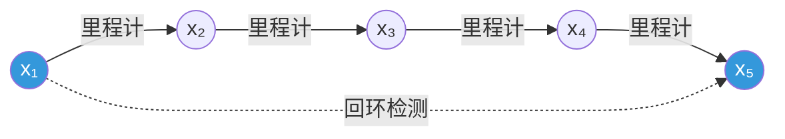
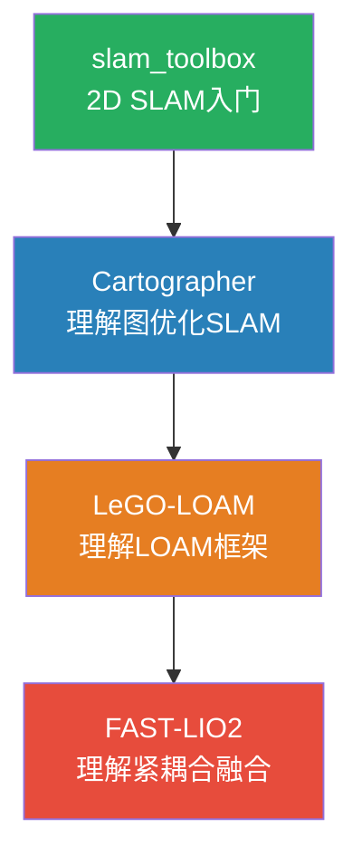
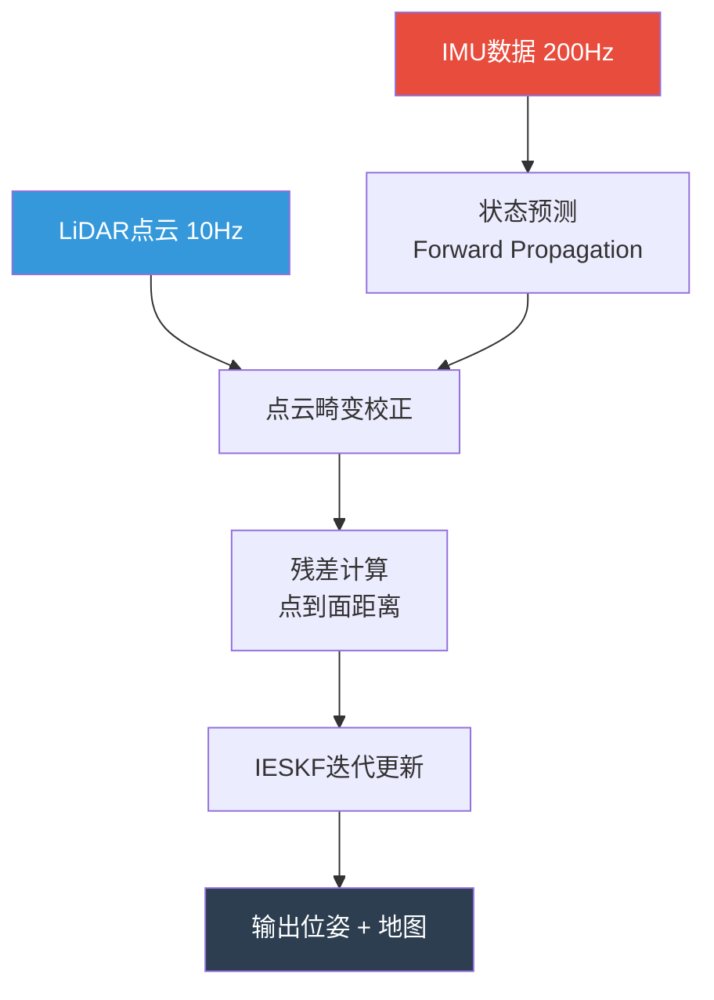
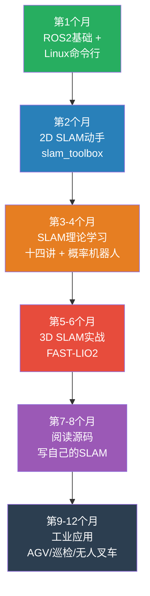

# 激光SLAM入门完全指南 —— 从电气工程师的视角

> 🎯 本指南专为电气工程师和工业控制领域从业者编写，尝试从你熟悉的**控制理论、状态估计、传感器信号处理**等视角，降低激光SLAM的学习门槛。

---

## 目录

- [1. 前言：为什么电气工程师应该学SLAM](#1-前言为什么电气工程师应该学slam)
- [2. SLAM基本概念](#2-slam基本概念)
  - [2.1 什么是SLAM](#21-什么是slam)
  - [2.2 SLAM问题的数学表述](#22-slam问题的数学表述)
  - [2.3 与电机控制的类比理解](#23-与电机控制的类比理解)
- [3. 激光雷达（LiDAR）基础](#3-激光雷达lidar基础)
  - [3.1 LiDAR的工作原理](#31-lidar的工作原理)
  - [3.2 LiDAR的分类与选型](#32-lidar的分类与选型)
  - [3.3 点云数据结构](#33-点云数据结构)
- [4. 数学基础（工程师视角）](#4-数学基础工程师视角)
  - [4.1 刚体变换与齐次坐标](#41-刚体变换与齐次坐标)
  - [4.2 旋转的四种表示法](#42-旋转的四种表示法)
  - [4.3 非线性最小二乘与优化](#43-非线性最小二乘与优化)
- [5. 激光SLAM核心算法](#5-激光slam核心算法)
  - [5.1 前端：点云配准（Scan Matching）](#51-前端点云配准scan-matching)
  - [5.2 后端：图优化与因子图](#52-后端图优化与因子图)
  - [5.3 回环检测（Loop Closure）](#53-回环检测loop-closure)
  - [5.4 主流开源方案对比](#54-主流开源方案对比)
- [6. 传感器融合](#6-传感器融合)
  - [6.1 IMU与LiDAR融合](#61-imu与lidar融合)
  - [6.2 多传感器融合框架](#62-多传感器融合框架)
- [7. 动手实践路线](#7-动手实践路线)
  - [7.1 环境搭建](#71-环境搭建)
  - [7.2 数据集实验](#72-数据集实验)
  - [7.3 仿真平台](#73-仿真平台)
  - [7.4 实物平台搭建](#74-实物平台搭建)
- [8. 常见问题与调试技巧](#8-常见问题与调试技巧)
- [9. 学习资源推荐](#9-学习资源推荐)
- [10. 从工控到SLAM的职业转型建议](#10-从工控到slam的职业转型建议)

---

## 1. 前言：为什么电气工程师应该学SLAM

作为一名电气工程师，你已经掌握了以下**直接可迁移**的技能：

| 你的已有技能 | 在SLAM中的对应 |
|:---|:---|
| 电机FOC控制、伺服驱动 | 机器人运动学、轮式里程计 |
| 编码器信号处理（ABZ、绝对值） | 传感器数据的时间同步与校准 |
| 卡尔曼滤波（用于无传感器FOC） | SLAM中的EKF、UKF状态估计 |
| PID控制与系统辨识 | SLAM后端的非线性最小二乘优化 |
| PLC/嵌入式编程 | ROS、C++/Python SLAM开发 |
| 工业总线（EtherCAT、CAN） | 多传感器数据传输与同步 |

**SLAM（Simultaneous Localization and Mapping，同步定位与建图）** 是移动机器人自主导航的核心技术。随着工业AGV/AMR、无人叉车、巡检机器人等应用的爆发式增长，激光SLAM已成为电气工程师向机器人领域转型的关键技能。

---

## 2. SLAM基本概念

### 2.1 什么是SLAM

SLAM解决的核心问题是：**一个机器人在未知环境中移动时，如何同时估计自身位置并构建环境地图？**

这就像一个"鸡生蛋、蛋生鸡"的问题：
- 要知道自己在哪，需要先有地图
- 要建立地图，需要先知道自己在哪

SLAM的核心思想是**利用运动过程中的约束关系，联合估计机器人轨迹和环境地图**。



### 2.2 SLAM问题的数学表述

SLAM可以形式化地描述为：

**给定**：从时间 $1$ 到 $T$ 的控制输入 $u_{1:T}$ 和观测 $z_{1:T}$

**估计**：机器人轨迹 $x_{1:T}$ 和地图 $m$

在概率框架下，SLAM求解的是后验概率：

$$
p(x_{1:T}, m \mid z_{1:T}, u_{1:T})
$$

### 2.3 与电机控制的类比理解

如果你做过无传感器FOC（Sensorless FOC），你对以下概念一定不陌生：

| 无传感器FOC | 激光SLAM |
|:---|:---|
| 通过电流/电压估计转子位置和速度 | 通过激光点云估计机器人位姿和环境 |
| 使用滑模观测器或EKF | 使用图优化或EKF |
| 需要电机模型（电阻、电感、反电动势） | 需要运动模型和观测模型 |
| 低速时估算困难（反电动势小） | 特征稀疏时定位困难 |

**本质都是状态估计问题**，只是SLAM的状态空间维度和非线性程度更高。

---

## 3. 激光雷达（LiDAR）基础

### 3.1 LiDAR的工作原理

LiDAR（Light Detection And Ranging）通过发射激光束并测量反射回来的时间（ToF，Time of Flight）来计算距离：

$$
d = \frac{c \cdot t}{2}
$$

其中 $c$ 是光速，$t$ 是往返时间，除以2是因为光走了来回。

> 💡 **工程视角**：这与超声波传感器本质相同（都是ToF原理），只是用光代替了声音，精度从厘米级提升到了毫米级。

单线激光雷达扫描一个平面，返回二维的极坐标点 $(r, \theta)$，可以转换为笛卡尔坐标：

$$
\begin{cases}
x = r \cos\theta \\
y = r \sin\theta
\end{cases}
$$

### 3.2 LiDAR的分类与选型



**初学者推荐选型：**

| 型号 | 类型 | 价格（参考） | 适用场景 |
|:---|:---|:---|:---|
| YDLIDAR X4 | 单线 2D | ~¥400 | 2D SLAM入门首选 |
| RPLIDAR A1 | 单线 2D | ~¥600 | ROS兼容好，资料多 |
| Livox Mid-360 | 3D 半固态 | ~¥4000 | 室内外通用，性价比高 |
| RoboSense Helios | 3D 机械式 | ~¥3万+ | 工业级应用 |

### 3.3 点云数据结构

一帧3D激光雷达的点云是一个 $N \times 3$（或 $N \times 4$ 含强度）的矩阵：

```
点云帧 = {
    points: [
        {x: 1.23, y: 0.45, z: -0.12, intensity: 42},
        {x: 1.25, y: 0.43, z: -0.11, intensity: 38},
        ...
    ],
    timestamp: 1715000000123,
    frame_id: "lidar_link"
}
```

一个10Hz的32线LiDAR每秒产生约 **60万个点**，数据处理对算法效率和计算资源有较高要求。

---

## 4. 数学基础（工程师视角）

> 💡 不需要成为数学家，但需要理解**核心概念**和**会查公式**。
>
> 📚 **本文姊妹篇**：《[激光SLAM数学基础详解 —— 从控制工程到状态估计](/posts/lidar-slam-math)》已发布，从DH参数、伺服观测器、系统辨识等你熟悉的知识出发，系统推导SLAM中刚体变换、李群李代数、非线性优化、因子图的全套数学。建议先通读本指南建立整体认知，再深入数学篇啃细节。

### 4.1 刚体变换与齐次坐标

机器人的位姿（Pose）可以用一个 $4 \times 4$ 的齐次变换矩阵表示：

$$
T = \begin{bmatrix}
R_{3\times3} & t_{3\times1} \\
0_{1\times3} & 1
\end{bmatrix} \in SE(3)
$$

其中 $R$ 是旋转矩阵（$SO(3)$），$t$ 是平移向量。

> 🔧 **类比**：这相当于工业机器人的工具坐标系变换——同样的数学，你在机器人标定时已经用过了。

### 4.2 旋转的四种表示法

| 表示法 | 参数数量 | 优点 | 缺点 |
|:---|:---|:---|:---|
| 旋转矩阵 $R$ | 9个（6约束） | 直观，可直接变换 | 冗余参数，需正交化 |
| 欧拉角 $(\phi,\theta,\psi)$ | 3个 | 直观易理解 | 万向节死锁（Gimbal Lock）|
| 轴角 $(\mathbf{n}, \theta)$ | 3个 | 几何意义清晰 | 不便于组合 |
| 四元数 $(w,x,y,z)$ | 4个（1约束） | 无死锁，可平滑插值 | 不直观 |

在SLAM中，**四元数**是最常用的旋转表示。如果你接触过IMU的姿态解算（如Madgwick/Mahony算法），你已经用过四元数了。

> 🔧 **与电机控制类比**：电机FOC中的Clarke/Park变换也是旋转变换，用 $SVPWM$ 的 $\alpha\beta$ 坐标到 $dq$ 坐标的变换本质也是旋转。

### 4.3 非线性最小二乘与优化

SLAM的核心是一个**非线性最小二乘**问题：

$$
\min_{x} \sum_{k} \| e_k(x) \|^2_{\Omega_k}
$$

其中 $e_k(x)$ 是残差（误差），$\Omega_k$ 是信息矩阵（权重）。

求解方法：
- **高斯-牛顿法**（Gauss-Newton）：一阶近似Hessian
- **列文伯格-马夸尔特法**（Levenberg-Marquardt，LM）：阻尼牛顿法
- **Dog-Leg法**：结合最速下降和高斯-牛顿

> 🔧 **类比**：这与系统辨识中最小二乘拟合传递函数类似，只是SLAM中的残差是几何误差而非频域误差。

---

## 5. 激光SLAM核心算法

### 5.1 前端：点云配准（Scan Matching）

前端负责**帧间匹配**——找到两帧点云之间的相对位姿变换。

#### ICP（Iterative Closest Point，迭代最近点）

最经典的点云配准算法：

```
1. 对当前帧每个点，在参考帧中找最近邻点（关联）
2. 计算使对应点距离平方和最小的变换 T
3. 用 T 变换当前帧
4. 重复 1-3 直到收敛
```

**改进变体：**
- **Point-to-Plane ICP**：计算点到平面的距离（收敛更快）
- **GICP**（Generalized ICP）：同时考虑点和面的不确定性
- **NDT**（Normal Distributions Transform）：用高斯分布建模点云

#### 特征法（LOAM系列的核心）

LOAM（Lidar Odometry and Mapping）不直接使用原始点云，而是提取**边缘特征**和**平面特征**：



> 💡 **为什么用特征而不是原始点？** 就像电机控制中你不需要每个PWM周期的原始电流值，而是提取 $i_d, i_q$ 作为特征——特征比原始数据信息密度更高，计算也更高效。

### 5.2 后端：图优化与因子图

SLAM后端将问题建模为**图优化**（Graph Optimization）：

- **节点（Nodes）**：机器人在各时刻的位姿 $x_1, x_2, ..., x_n$
- **边（Edges）**：位姿之间的约束关系
  - **里程计边**：由前端配准得到的连续帧间约束
  - **回环边**：由回环检测得到的非连续帧间约束



后端使用的优化库：
- **GTSAM**（Georgia Tech Smoothing and Mapping）：因子图优化
- **g2o**（General Graph Optimization）：通用图优化
- **Ceres Solver**：Google的非线性最小二乘求解器

### 5.3 回环检测（Loop Closure）

回环检测是SLAM的"**纠错机制**"——当机器人回到之前经过的地方时，识别出"我来过这里"，从而消除累积漂移。

**激光SLAM的回环检测方法：**

1. **Scan-to-Scan匹配**：直接比较两帧点云（计算量大）
2. **Scan Context**（扫描上下文）：将3D点云编码为2D矩阵描述子
3. **基于直方图**：如M2DP、ESF等全局描述子
4. **基于深度学习**：如OverlapNet、LCDNet

> 🔧 **类比**：回环检测相当于电机控制中编码器Z相脉冲的**原点复位**——长期的积分累积误差，需要一个绝对参考来消除。

### 5.4 主流开源方案对比

| 方案 | 传感器 | 特点 | 适用场景 | 入门难度 |
|:---|:---|:---|:---|:---|
| **Cartographer** | 2D/3D LiDAR + IMU | Google出品，实时建图 | 室内、园区 | ⭐⭐ |
| **LOAM** | 3D LiDAR | 经典激光里程计框架 | 室外、结构化环境 | ⭐⭐⭐ |
| **LeGO-LOAM** | 3D LiDAR + IMU | 轻量级，地面优化 | 地面机器人 | ⭐⭐⭐ |
| **FAST-LIO2** | LiDAR + IMU | 紧耦合IESKF | 快速运动、退化环境 | ⭐⭐⭐⭐ |
| **Faster-LIO** | LiDAR + IMU | 基于iVox加速 | 实时性要求高 | ⭐⭐⭐⭐ |
| **HDL-Localization** | 3D LiDAR + 先验地图 | 高精度定位 | 已知地图的定位 | ⭐⭐⭐ |
| **slam_toolbox** | 2D LiDAR | ROS2原生，功能完整 | 室内2D导航 | ⭐⭐ |

**入门推荐路线：**



---

## 6. 传感器融合

### 6.1 IMU与LiDAR融合

纯激光SLAM在以下场景容易失败：
- 快速旋转（点云畸变严重）
- 特征稀疏的环境（长走廊、开阔地）
- 剧烈运动

IMU（惯性测量单元）提供高频（100-1000Hz）的角速度和加速度数据，可以弥补LiDAR低频（10-20Hz）的不足。

**融合方式对比：**

| 融合方式 | 描述 | 代表方案 |
|:---|:---|:---|
| **松耦合** | LiDAR里程计和IMU预积分分别计算，结果再融合 | LIO-SAM |
| **紧耦合** | IMU测量直接参与点云配准的优化 | FAST-LIO2 |

**紧耦合IESKF框架（FAST-LIO2的核心）：**



> 🔧 **类比**：Loosely-coupled（松耦合）就像将伺服驱动器的位置环和速度环分开调试后再联调；Tightly-coupled（紧耦合）则是直接做位置-速度双闭环，信息利用更充分，但调参也更复杂。

### 6.2 多传感器融合框架

现代SLAM系统通常融合多种传感器：

| 传感器 | 频率 | 作用 |
|:---|:---|:---|
| LiDAR | 10-20Hz | 提供精确几何约束 |
| IMU | 100-1000Hz | 高频状态预测 + 重力对齐 |
| 轮式里程计 | 50-100Hz | 提供速度先验（与你的编码器经验直接相关）|
| GPS/RTK | 1-10Hz | 全局位置修正（户外） |
| 相机 | 30-60Hz | 视觉特征 + 回环检测 |

多传感器融合的本质是**多速率、多源的异步状态估计**问题，与你熟悉的运动控制中的多环级联是同一个数学本质。

---

## 7. 动手实践路线

### 7.1 环境搭建

#### Step 1：安装ROS 2

推荐使用 **ROS 2 Humble**（Ubuntu 22.04）或 **ROS 2 Jazzy**（Ubuntu 24.04）：

```bash
# Ubuntu 22.04 安装 ROS 2 Humble
sudo apt update && sudo apt install curl gnupg lsb-release
sudo curl -sSL https://raw.githubusercontent.com/ros/rosdistro/master/ros.key \
  -o /usr/share/keyrings/ros-archive-keyring.gpg

echo "deb [arch=$(dpkg --print-architecture) signed-by=/usr/share/keyrings/ros-archive-keyring.gpg] \
  http://packages.ros.org/ros2/ubuntu $(lsb_release -cs) main" | \
  sudo tee /etc/apt/sources.list.d/ros2.list > /dev/null

sudo apt update
sudo apt install ros-humble-desktop python3-colcon-common-extensions
```

#### Step 2：安装必备工具

```bash
# SLAM相关工具包
sudo apt install ros-humble-slam-toolbox
sudo apt install ros-humble-cartographer ros-humble-cartographer-ros
sudo apt install ros-humble-navigation2 ros-humble-nav2-bringup

# 点云处理库
sudo apt install ros-humble-pcl-ros ros-humble-pcl-conversions
sudo apt install libpcl-dev

# 可视化
sudo apt install ros-humble-rviz2
```

#### Step 3：创建SLAM工作空间

```bash
mkdir -p ~/slam_ws/src
cd ~/slam_ws
colcon build --symlink-install
echo "source ~/slam_ws/install/setup.bash" >> ~/.bashrc
```

### 7.2 数据集实验

在实际购买硬件之前，先用公开数据集动手实验：

| 数据集 | 内容 | 场景 | 下载 |
|:---|:---|:---|:---|
| **KITTI** | 车载LiDAR+相机+GPS | 城市道路 | [www.cvlibs.net/datasets/kitti](http://www.cvlibs.net/datasets/kitti) |
| **M2DGR** | 地面机器人多传感器 | 室内外混合 | [github.com/SJTU-ViSYS/M2DGR](https://github.com/SJTU-ViSYS/M2DGR) |
| **NTU VIRAL** | 无人机LiDAR+IMU+相机 | 室内外 | [ntu-aris.github.io/ntu_viral](https://ntu-aris.github.io/ntu_viral) |
| **MulRan** | 车载雷达+LiDAR | 城市 | [sites.google.com/view/mulran](https://sites.google.com/view/mulran) |

**推荐入门实验**：
1. 用 M2DGR 数据集运行 FAST-LIO2，观察建图效果
2. 用 KITTI 数据集运行 LeGO-LOAM，理解特征提取
3. 用自己录制的 bag 文件在室内环境跑 Cartographer

### 7.3 仿真平台

仿真可以让你在没有硬件的情况下快速迭代：

| 仿真器 | 特点 | 推荐度 |
|:---|:---|:---|
| **Gazebo + ROS 2** | 经典，物理引擎完善 | ⭐⭐⭐⭐⭐ |
| **Isaac Sim** | NVIDIA出品，视觉效果好 | ⭐⭐⭐⭐ |
| **CoppeliaSim** | 易上手，API友好 | ⭐⭐⭐ |
| **Webots** | 开源，跨平台 | ⭐⭐⭐ |

**入门仿真实验：**

```bash
# 在 Gazebo 中用 TurtleBot3 跑 2D SLAM
sudo apt install ros-humble-turtlebot3-gazebo
export TURTLEBOT3_MODEL=waffle

# 启动仿真 + SLAM
ros2 launch turtlebot3_gazebo turtlebot3_world.launch.py
ros2 launch slam_toolbox online_async_launch.py
```

### 7.4 实物平台搭建

当你掌握了基础算法后，建议搭建一个实物平台：

**低成本入门方案（总预算 ~¥2000）：**

| 组件 | 推荐型号 | 参考价格 |
|:---|:---|:---|
| 底盘 | 差速底盘（带编码器电机） | ¥400-800 |
| 2D LiDAR | YDLIDAR X4 或 RPLIDAR A1 | ¥400-600 |
| 主控 | Raspberry Pi 4B/5 或 Jetson Nano | ¥400-800 |
| IMU | MPU6050 或 ICM-20948 | ¥30-80 |
| 电机驱动 | L298N 或 TB6612 | ¥30-60 |
| 电池 | 12V 锂电池组 | ¥100-200 |

> 🔧 **你的优势**：电机选型、编码器接线、电池管理、EMC——这些对电气工程师来说都是基本功，能省下大量踩坑时间。

---

## 8. 常见问题与调试技巧

### 8.1 点云畸变（Motion Distortion）

**现象**：建图时墙壁弯曲、直线变弧线

**原因**：LiDAR扫描过程中机器人发生了移动，同一帧内不同点的"激光头位置"不同。

**解决**：
- 用IMU对每帧点云做运动补偿（deskew）
- 降低机器人运动速度
- 提高LiDAR扫描频率（如Livox的非重复扫描模式）

### 8.2 退化问题（Degeneracy）

**现象**：在长走廊、隧道等几何特征单一的环境中，沿走廊方向的估计不确定度急剧增大。

**检测方法**：计算优化问题的Hessian矩阵条件数或特征值——如果最小特征值接近零，说明该方向约束不足。

**解决**：
- 引入IMU提供先验约束
- 引入轮式里程计提供速度约束
- 使用视觉特征补充几何约束

> 🔧 **类比**：退化就像电机低速运行时反电动势太小导致无传感器FOC估算发散——解决方案都是引入额外信息源（高频注入法 ↔ IMU/轮速计）。

### 8.3 坐标系混乱

**常见错误**：TF树配置不对，传感器数据在错误坐标系下。

```bash
# 检查 TF 树是否正确
ros2 run tf2_tools view_frames
```

确保理解以下坐标系关系：
- `map` → `odom` → `base_link` → `lidar_link`
- `map` 是全局固定坐标系
- `odom` 是里程计原点的浮动坐标系

### 8.4 建图效果差的排查清单

1. ☐ LiDAR数据是否正常（检查 `ros2 topic echo /scan`）
2. ☐ TF树是否正确（`view_frames`）
3. ☐ 传感器时间戳是否同步
4. ☐ IMU标定是否准确（零偏、尺度因子）
5. ☐ LiDAR安装是否水平（检查地面点云是否水平）
6. ☐ 参数配置是否适合当前环境

---

## 9. 学习资源推荐

### 必读教材

| 资源 | 说明 |
|:---|:---|
| **《视觉SLAM十四讲》高翔** | 中文SLAM入门圣经，数学推导详尽 |
| **《概率机器人》Thrun** | SLAM理论基石，贝叶斯滤波框架 |
| **《State Estimation for Robotics》Barfoot** | 状态估计与李群李代数，进阶必读 |

### 在线课程

| 课程 | 平台 |
|:---|:---|
| **Cyrill Stachniss 的 SLAM 课程** | [YouTube](https://www.youtube.com/playlist?list=PLgnQpQtFTOGQrZ4O5QzbIHgl3b1JHimN_) |
| **深蓝学院：激光SLAM理论与实践** | 深蓝学院 |
| **ROS 2 官方教程** | [docs.ros.org](https://docs.ros.org/en/humble/Tutorials.html) |

### 必读论文

| 论文 | 核心贡献 |
|:---|:---|
| **LOAM** (Zhang, 2014) | 激光里程计与建图分离的经典框架 |
| **LeGO-LOAM** (Shan, 2018) | 轻量级地面优化LOAM |
| **FAST-LIO2** (Xu, 2022) | 紧耦合IESKF，计算效率极高 |
| **Cartographer** (Hess, 2016) | Google的实时2D/3D SLAM |
| **GTSAM** (Dellaert, 2012) | 因子图与平滑建图 |

### 开源代码仓库

| 仓库 | 链接 |
|:---|:---|
| FAST-LIO | [github.com/hku-mars/FAST_LIO](https://github.com/hku-mars/FAST_LIO) |
| Faster-LIO | [github.com/gaoxiang12/faster-lio](https://github.com/gaoxiang12/faster-lio) |
| LIO-SAM | [github.com/TixiaoShan/LIO-SAM](https://github.com/TixiaoShan/LIO-SAM) |
| Slam-Toolbox | [github.com/SteveMacenski/slam_toolbox](https://github.com/SteveMacenski/slam_toolbox) |

### 社区

- **中文社区**：泡泡机器人SLAM（微信公众号）、计算机视觉life
- **英文社区**：ROS Discourse、r/ROS (Reddit)
- **论文跟踪**：arxiv.org 搜索 cs.RO + SLAM

---

## 10. 从工控到SLAM的职业转型建议

### 你的核心优势

作为电气工程师转型SLAM，你有一个天然优势：**硬件+软件的交叉背景**。

大多数SLAM算法工程师只懂软件，对硬件底层的信号链、传感器特性、通信协议和实时系统一知半解。而你可以做到**全栈**——从传感器选型、电路设计到嵌入式部署和算法优化。

### 推荐学习路线



### 目标岗位

| 岗位 | 核心技能 |
|:---|:---|
| **SLAM算法工程师** | C++、多视图几何、非线性优化 |
| **机器人定位算法工程师** | 传感器融合、卡尔曼滤波、LiDAR定位 |
| **自动驾驶感知工程师** | 点云处理、多传感器标定 |
| **AGV导航工程师** | 路径规划、运动控制、ROS导航栈 |

### 最后的话

> 从PLC到ROS，从梯形图到因子图，从PID到GTSAM——我理解这条路看起来很陡峭。但请记住，**卡尔曼滤波**你已经做过（无传感器FOC），**坐标变换**你已经用过（机器人标定），**传感器信号处理**你每天都在做。SLAM只是把这些你已经掌握的技能，组合到了一个更大的框架里。
>
> 不需要一口气学完所有理论，**先跑通一个demo，看到点云变成地图的那一刻，你就会上瘾。**

---

> 📝 *本文基于作者的学习经验整理，如有更新会持续迭代。欢迎在评论区交流！*
