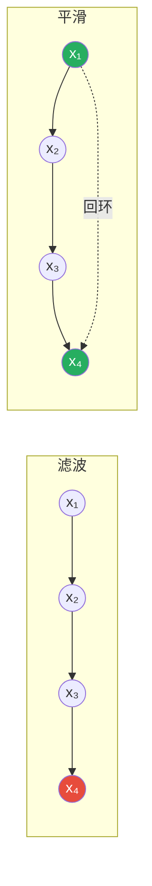
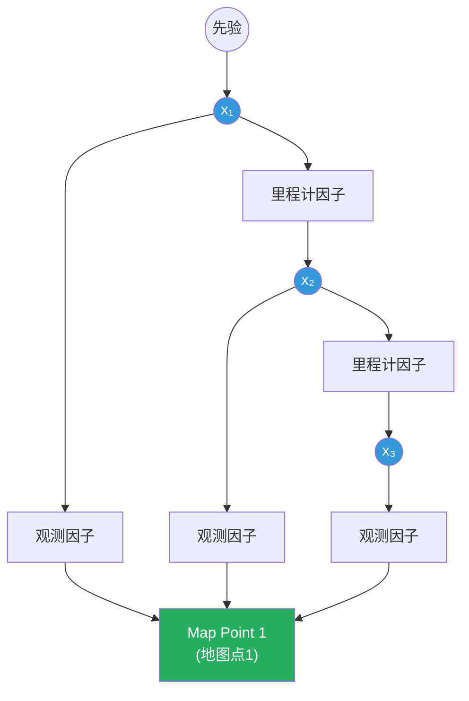
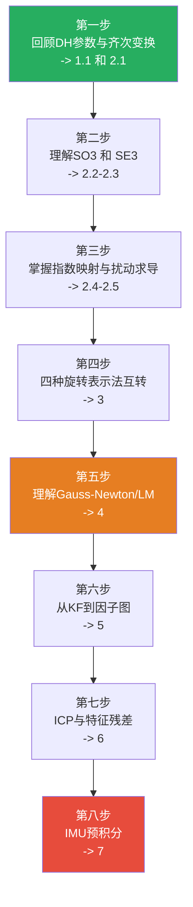

# 激光SLAM数学基础详解 —— 从控制工程到状态估计

> 🎓 本文件为《激光SLAM入门完全指南》的数学姊妹篇。假设你已经熟悉PLC编程、伺服电机控制、工业机械臂运动学（DH参数）和基本的自动控制原理，本文将从这些你已掌握的知识出发，系统性地建立激光SLAM所需的数学体系。

---

## 目录

- [1. 前置知识回顾：你已经会的东西](#1-前置知识回顾你已经会的东西)
  - [1.1 工业机械臂运动学 → 刚体变换](#11-工业机械臂运动学--刚体变换)
  - [1.2 伺服控制中的观测器 → 状态估计](#12-伺服控制中的观测器--状态估计)
  - [1.3 PID调参与系统辨识 → 非线性优化](#13-pid调参与系统辨识--非线性优化)
- [2. 刚体变换：从DH参数到SE(3)](#2-刚体变换从dh参数到se3)
  - [2.1 齐次变换矩阵回顾](#21-齐次变换矩阵回顾)
  - [2.2 旋转群 SO(3) 与刚体变换群 SE(3)](#22-旋转群-so3-与刚体变换群-se3)
  - [2.3 李代数 so(3) 与 se(3)](#23-李代数-so3-与-se3)
  - [2.4 指数映射与对数映射](#24-指数映射与对数映射)
  - [2.5 扰动模型：左扰动与右扰动](#25-扰动模型左扰动与右扰动)
- [3. 旋转的四种参数化：你至少用过两种](#3-旋转的四种参数化你至少用过两种)
  - [3.1 欧拉角：最直觉但也最危险](#31-欧拉角最直觉但也最危险)
  - [3.2 轴角表示：与伺服电机同源](#32-轴角表示与伺服电机同源)
  - [3.3 四元数：SLAM的事实标准](#33-四元数slam的事实标准)
  - [3.4 四种表示法的互转公式](#34-四种表示法的互转公式)
- [4. 非线性最小二乘：从PID到Gauss-Newton](#4-非线性最小二乘从pid到gauss-newton)
  - [4.1 问题形式化](#41-问题形式化)
  - [4.2 梯度下降法的几何直觉](#42-梯度下降法的几何直觉)
  - [4.3 高斯-牛顿法](#43-高斯-牛顿法)
  - [4.4 列文伯格-马夸尔特法](#44-列文伯格-马夸尔特法)
  - [4.5 鲁棒核函数：排除野值](#45-鲁棒核函数排除野值)
- [5. 状态估计：从卡尔曼滤波到因子图](#5-状态估计从卡尔曼滤波到因子图)
  - [5.1 你熟悉的卡尔曼滤波](#51-你熟悉的卡尔曼滤波)
  - [5.2 扩展卡尔曼滤波 EKF](#52-扩展卡尔曼滤波-ekf)
  - [5.3 迭代扩展卡尔曼滤波 IESKF](#53-迭代扩展卡尔曼滤波-ieskf)
  - [5.4 从滤波到平滑：为什么SLAM用图优化](#54-从滤波到平滑为什么slam用图优化)
  - [5.5 因子图与最大后验估计 MAP](#55-因子图与最大后验估计-map)
- [6. 点云配准的数学本质](#6-点云配准的数学本质)
  - [6.1 ICP的数学推导](#61-icp的数学推导)
  - [6.2 点到线的残差 Jacobian](#62-点到线的残差-jacobian)
  - [6.3 点到面的残差 Jacobian](#63-点到面的残差-jacobian)
- [7. IMU预积分：两个EKF之间的桥梁](#7-imu预积分两个ekf之间的桥梁)
  - [7.1 IMU运动模型](#71-imu运动模型)
  - [7.2 预积分的核心思想](#72-预积分的核心思想)
  - [7.3 预积分噪声传播](#73-预积分噪声传播)
- [8. 图优化与稀疏性](#8-图优化与稀疏性)
  - [8.1 SLAM问题的信息矩阵结构](#81-slam问题的信息矩阵结构)
  - [8.2 舒尔补与边缘化](#82-舒尔补与边缘化)
- [9. 关键公式速查卡](#9-关键公式速查卡)
- [10. 推荐阅读顺序](#10-推荐阅读顺序)

---

## 1. 前置知识回顾：你已经会的东西

在深入SLAM的数学之前，让我们先确认你已经掌握的基础——这些就是从工控到SLAM的"**知识桥梁**"。

### 1.1 工业机械臂运动学 → 刚体变换

如果你用DH参数标定过六轴机械臂，你每天都在做这样的事：

```
末端位姿 = T_01 × T_12 × T_23 × T_34 × T_45 × T_56
```

每一个 $T_{i-1,i}$ 都是一个 $4 \times 4$ 的齐次变换矩阵，由4个DH参数 $(a, \alpha, d, \theta)$ 决定。这个 $T$ 矩阵**就是SLAM中最核心的数学对象**。

> 🔑 **关键洞察**：机械臂的正运动学是**已知的**链式变换（DH参数来自机械设计），而SLAM是**未知的**链式变换（位姿需要从传感器数据中估计）。数学工具完全相同，区别只在于变换矩阵是已知还是未知。

### 1.2 伺服控制中的观测器 → 状态估计

| 伺服控制 | SLAM |
|:---|:---|
| 通过电流/电压 → 估计转子位置 $\hat{\theta}$、速度 $\hat{\omega}$ | 通过激光点云/IMU → 估计机器人位姿 $\hat{T}$、速度 $\hat{v}$ |
| Luenberger观测器、滑模观测器 | EKF、IESKF、图优化 |
| 状态方程：$\dot{\mathbf{x}} = A\mathbf{x} + B\mathbf{u}$ | 运动方程：$\mathbf{x}_k = f(\mathbf{x}_{k-1}, \mathbf{u}_k) + \mathbf{w}_k$ |
| 输出方程：$\mathbf{y} = C\mathbf{x}$ | 观测方程：$\mathbf{z}_k = h(\mathbf{x}_k) + \mathbf{v}_k$ |

SLAM的状态估计和你在无传感器FOC中做的观测器设计，**在贝叶斯框架下是同一个问题的不同实例**。

### 1.3 PID调参与系统辨识 → 非线性优化

| 你做过的事 | SLAM中的对应 |
|:---|:---|
| 用最小二乘法拟合被控对象的传递函数 | 用高斯-牛顿法拟合机器人的运动轨迹 |
| 用Ziegler-Nichols法整定PID参数 | 用LM法优化SLAM后端图 |
| 代价函数：跟踪误差的平方积分（ISE） | 代价函数：所有观测残差的马氏距离平方和 |

> 🔑 **关键洞察**：系统辨识中你最小化的是"模型输出与实测输出的差异"，SLAM中你最小化的是"预测位姿与观测约束的差异"。都是**非线性最小二乘**，只是SLAM的规模大几个数量级（可能需要优化上万个变量）。

---

## 2. 刚体变换：从DH参数到SE(3)

### 2.1 齐次变换矩阵回顾

你对这个矩阵一定不陌生——它就是DH参数的矩阵形式：

$$
T = \begin{bmatrix}
R_{3\times3} & \mathbf{t}_{3\times1} \\
\mathbf{0}_{1\times3} & 1
\end{bmatrix}
= \begin{bmatrix}
r_{11} & r_{12} & r_{13} & t_x \\
r_{21} & r_{22} & r_{23} & t_y \\
r_{31} & r_{32} & r_{33} & t_z \\
0 & 0 & 0 & 1
\end{bmatrix}
$$

其中 $R$ 是旋转矩阵，$\mathbf{t} = [t_x, t_y, t_z]^T$ 是平移向量。

**在机械臂中**：$T$ 表示相邻连杆之间的坐标变换。
**在SLAM中**：$T$ 表示机器人从世界坐标系到自身坐标系的变换（即**位姿**），通常记作 $T_{wb}$（world → body）或 $T_{wl}$（world → lidar）。

### 2.2 旋转群 SO(3) 与刚体变换群 SE(3)

SLAM中最基本的两个**李群**（Lie Group）：

$$
SO(3) = \{ R \in \mathbb{R}^{3\times3} \mid R^TR = I,\ \det(R) = 1 \}
$$

$$
SE(3) = \left\{ T = \begin{bmatrix} R & \mathbf{t} \\ \mathbf{0}^T & 1 \end{bmatrix} \in \mathbb{R}^{4\times4} \mid R \in SO(3),\ \mathbf{t} \in \mathbb{R}^3 \right\}
$$

> 💡 **群**意味着：两个旋转矩阵相乘仍是旋转矩阵（封闭性），存在单位元 $I$，每个元素有逆元。这保证了位姿变换在数学上是自洽的——你不会因为连续变换而"跑出"合法位姿空间。

**在机械臂中你已经用过群的性质**：多个DH矩阵连乘结果仍是齐次变换矩阵，这就是群的封闭性。

### 2.3 李代数 so(3) 与 se(3)

> 🎯 这是SLAM数学中最需要理解的概念，也是连接控制工程与SLAM的关键桥梁。

**为什么需要李代数？**

旋转矩阵 $R$ 有9个元素但只有3个自由度——6个约束条件（$R^TR = I$）。如果你直接用9个变量去优化，每步迭代后都需要用SVD或Gram-Schmidt强制正交化，计算量大且容易出错。

**李代数的优雅之处**：用恰好3个自由变量（或6个，对应SE(3)）来表示旋转/位姿，并且在这个表示下可以直接做加法（这在向量空间中很自然，但在流形上需要特殊处理）。

#### so(3)：旋转的李代数

对于旋转矩阵 $R \in SO(3)$，其李代数 $\boldsymbol{\phi} \in \mathfrak{so}(3) \cong \mathbb{R}^3$ 定义为一个**三维向量**，对应的**反对称矩阵**为：

$$
\boldsymbol{\phi}^{\wedge} = \begin{bmatrix}
0 & -\phi_3 & \phi_2 \\
\phi_3 & 0 & -\phi_1 \\
-\phi_2 & \phi_1 & 0
\end{bmatrix} \in \mathfrak{so}(3)
$$

这里 $\wedge$（hat）算子将3维向量映射为 $3\times3$ 反对称矩阵。

> 🔧 **工程类比**：在电机控制中，三相电流 $(i_a, i_b, i_c)$ 可以通过Clarke变换映射到 $\alpha\beta$ 二维空间，减少冗余。李代数做了类似的事——将9个参数（含6个约束）的旋转矩阵，映射到恰好3个自由度的参数空间。

**so(3)的物理意义**：$\boldsymbol{\phi} = \theta\mathbf{n}$，其中 $\mathbf{n}$ 是旋转轴（单位向量），$\theta$ 是旋转角度。这与**伺服电机的轴角控制**完全一致——你给伺服发一个旋转轴和旋转角度的指令，本质上就是在使用李代数的轴角表示。

#### se(3)：位姿的李代数

对于 $T \in SE(3)$，其李代数 $\boldsymbol{\xi} \in \mathfrak{se}(3) \cong \mathbb{R}^6$ 定义为一个六维向量：

$$
\boldsymbol{\xi} = \begin{bmatrix} \boldsymbol{\rho} \\ \boldsymbol{\phi} \end{bmatrix} \in \mathbb{R}^6
$$

对应的矩阵形式为：

$$
\boldsymbol{\xi}^{\wedge} = \begin{bmatrix}
\boldsymbol{\phi}^{\wedge} & \boldsymbol{\rho} \\
\mathbf{0}^T & 0
\end{bmatrix} \in \mathfrak{se}(3)
$$

其中 $\boldsymbol{\rho} \in \mathbb{R}^3$ 对应平移部分，$\boldsymbol{\phi} \in \mathbb{R}^3$ 对应旋转部分。

> 🔧 **与机械臂关节空间的类比**：六轴机械臂的关节向量 $\mathbf{q} = [\theta_1, ..., \theta_6]^T$ 也是一种最小参数化（6个关节角度 → 末端6-DOF位姿）。se(3) 的6个参数 $[\rho_x, \rho_y, \rho_z, \phi_x, \phi_y, \phi_z]^T$ 扮演了同样的角色——它们是位姿的"最小坐标"。

### 2.4 指数映射与对数映射

指数映射（$\exp$）将李代数映射回李群：

$$
R = \exp(\boldsymbol{\phi}^{\wedge}) = \sum_{n=0}^{\infty} \frac{1}{n!}(\boldsymbol{\phi}^{\wedge})^n
$$

幸运的是，这个无穷级数有闭合形式——**罗德里格斯公式**（Rodrigues' Formula）：

$$
\exp(\boldsymbol{\phi}^{\wedge}) = I + \frac{\sin\theta}{\theta}\boldsymbol{\phi}^{\wedge} + \frac{1-\cos\theta}{\theta^2}(\boldsymbol{\phi}^{\wedge})^2
$$

其中 $\theta = \|\boldsymbol{\phi}\|$ 是旋转角度。

> 🔑 如果你做过工业机器人的**工具坐标系标定**（TCP标定），你本质上就是在求解一个 $\exp(\boldsymbol{\xi}^{\wedge})$ 形式的变换。

对数映射（$\log$）是反方向：从旋转矩阵 $R$ 恢复旋转向量 $\boldsymbol{\phi}$：

$$
\theta = \arccos\left(\frac{\operatorname{tr}(R) - 1}{2}\right), \quad \boldsymbol{\phi} = \frac{\theta}{2\sin\theta}\begin{bmatrix} R_{32} - R_{23} \\ R_{13} - R_{31} \\ R_{21} - R_{12} \end{bmatrix}
$$

**记忆口诀**：
- $\exp$：从3参数（轴角）→ 9参数（旋转矩阵），信息"展开"
- $\log$：从9参数（旋转矩阵）→ 3参数（轴角），信息"压缩"

### 2.5 扰动模型：左扰动与右扰动

在SLAM优化中，我们需要对位姿求导数。由于 $SE(3)$ 不是向量空间，不能直接做 $\frac{\partial f(T)}{\partial T}$。解决方案是**在李代数上施加微小扰动**。

**左扰动模型**（在全局坐标系施加扰动）：

$$
\frac{\partial (T\mathbf{p})}{\partial \delta\boldsymbol{\xi}} = \lim_{\delta\boldsymbol{\xi}\to 0} \frac{\exp(\delta\boldsymbol{\xi}^{\wedge})T\mathbf{p} - T\mathbf{p}}{\delta\boldsymbol{\xi}}
$$

**右扰动模型**（在局部坐标系施加扰动）：

$$
\frac{\partial (T\mathbf{p})}{\partial \delta\boldsymbol{\xi}} = \lim_{\delta\boldsymbol{\xi}\to 0} \frac{T\exp(\delta\boldsymbol{\xi}^{\wedge})\mathbf{p} - T\mathbf{p}}{\delta\boldsymbol{\xi}}
$$

> 🔧 **工程直觉**：左扰动 = 你在世界坐标系中"推"了机器人一把；右扰动 = 你在机器人自身坐标系中"推"了它一把。两者等价，但实际计算中通常选择使 Jacobian 形式更简单的那一种。

实际求导结果（左扰动，对3D点 $\mathbf{p}$ 变换）：

$$
\frac{\partial (T\mathbf{p})}{\partial \delta\boldsymbol{\xi}} = \begin{bmatrix} I_{3\times3} & -(R\mathbf{p})^{\wedge} \end{bmatrix}_{3\times6}
$$

这是一个 $3 \times 6$ 的矩阵，在后续的优化中会反复出现。

---

## 3. 旋转的四种参数化：你至少用过两种

### 3.1 欧拉角：最直觉但也最危险

欧拉角用三个角度 $(\phi, \theta, \psi)$ 表示旋转，对应绕三个轴的依次旋转。在工业机器人中，这对应**RPY角**（Roll-Pitch-Yaw）或**ZYZ欧拉角**。

**优点**：直观——每个角度都有明确的物理意义。

**致命缺陷：万向节死锁（Gimbal Lock）**

当第二个旋转角 $\theta = \pm 90°$ 时，第一个和第三个旋转轴重合，丢失一个自由度。在SLAM中这会导致优化在特定姿态下发散。

> 🔧 如果你用过IMU（MPU6050等），你一定遇到过欧拉角的 pitch 在 ±90° 时 yaw 角突然跳变的问题——这就是万向节死锁。**SLAM中基本不使用欧拉角做优化变量。**

### 3.2 轴角表示：与伺服电机同源

轴角表示用一个单位向量 $\mathbf{n}$（旋转轴）和一个标量 $\theta$（旋转角度）来表示旋转：

$$
(\mathbf{n}, \theta), \quad \|\mathbf{n}\| = 1
$$

这与伺服电机的控制指令完全一致——你给伺服驱动器发的就是"绕某个轴转多少角度"。

在SLAM中，轴角表示就是**李代数 $\boldsymbol{\phi} = \theta\mathbf{n}$**。

### 3.3 四元数：SLAM的事实标准

四元数 $\mathbf{q} = [q_w, q_x, q_y, q_z]^T = [q_w, \mathbf{q}_v]^T$ 是SLAM中最常用的旋转表示，原因：

1. **无奇异性**：没有万向节死锁
2. **紧凑**：4个参数（1个约束 $\|\mathbf{q}\|=1$），比9个参数的旋转矩阵少
3. **可平滑插值**：SLERP球面线性插值

**如果你做过IMU姿态解算**（如用Madgwick或Mahony算法融合加速度计和陀螺仪），你已经在用四元数了——姿态解算的输出就是四元数。

四元数 $\mathbf{q}$ 对应的旋转矩阵为：

$$
R(\mathbf{q}) = \begin{bmatrix}
1-2(q_y^2+q_z^2) & 2(q_x q_y - q_w q_z) & 2(q_x q_z + q_w q_y) \\
2(q_x q_y + q_w q_z) & 1-2(q_x^2+q_z^2) & 2(q_y q_z - q_w q_x) \\
2(q_x q_z - q_w q_y) & 2(q_y q_z + q_w q_x) & 1-2(q_x^2+q_y^2)
\end{bmatrix}
$$

四元数更新（用角速度 $\boldsymbol{\omega}$）：

$$
\dot{\mathbf{q}} = \frac{1}{2} \mathbf{q} \otimes \begin{bmatrix} 0 \\ \boldsymbol{\omega} \end{bmatrix}
$$

其中 $\otimes$ 是四元数乘法。这与IMU的陀螺仪数据融合直接对应。

### 3.4 四种表示法的互转公式

```mermaid
graph LR
    RM[旋转矩阵 R<br/>9参数, 6约束]
    EA[欧拉角<br/>3参数]
    AA[轴角 φ=θn<br/>3参数]
    Q[四元数 q<br/>4参数, 1约束]
    
    RM <-->|Rodrigues / 取反对称| AA
    RM <-->|公式见上| Q
    AA <-->|θ=‖φ‖, n=φ/θ| EA
    Q <-->|q=[cos⁡θ/2, n·sin⁡θ/2]| AA
    
    style RM fill:#e74c3c,color:#fff
    style AA fill:#2980b9,color:#fff
    style Q fill:#27ae60,color:#fff
```

**SLAM中的使用惯例**：

| 场景 | 使用哪种表示 | 原因 |
|:---|:---|:---|
| 存储位姿 | 四元数 + 平移向量 | 紧凑、无奇点 |
| 优化变量 | 李代数 $\mathfrak{se}(3)$ | 无约束、可自由加减 |
| 变换点云 | 旋转矩阵 $R$（从四元数转换） | 计算高效 |
| 导数计算 | 李代数扰动 | 线性化方便 |
| 可视化/调试 | 欧拉角（RPY） | 人类可读 |

---

## 4. 非线性最小二乘：从PID到Gauss-Newton

### 4.1 问题形式化

SLAM后端优化可以统一写为一个**非线性最小二乘**问题：

$$
\hat{\mathbf{x}} = \arg\min_{\mathbf{x}} \sum_{k=1}^{K} \|\mathbf{e}_k(\mathbf{x})\|^2_{\boldsymbol{\Omega}_k}
$$

其中：
- $\mathbf{x}$：所有待优化变量（机器人位姿序列 + 地图点/特征）
- $\mathbf{e}_k(\mathbf{x})$：第 $k$ 个残差（预测值 - 观测值）
- $\|\mathbf{e}\|^2_{\boldsymbol{\Omega}} = \mathbf{e}^T \boldsymbol{\Omega} \mathbf{e}$：马氏距离平方
- $\boldsymbol{\Omega}_k$：信息矩阵（协方差矩阵的逆，表示对该观测的置信度）

> 🔧 **与系统辨识的类比**：你在辨识电机传递函数时，最小化的是 $\sum(y_{\text{实测}} - y_{\text{模型}})^2$。SLAM做的是同一件事，只是残差 $\mathbf{e}_k$ 是几何残差（点到线距离、点到面距离）而非时间序列残差。

### 4.2 梯度下降法的几何直觉

将目标函数记为 $F(\mathbf{x}) = \sum \|\mathbf{e}_k(\mathbf{x})\|^2$。

**最速下降法（一阶方法）**：

$$
\mathbf{x}_{i+1} = \mathbf{x}_i - \alpha \nabla F(\mathbf{x}_i)
$$

- 每次沿负梯度方向走一步
- 在远离极小值时收敛快，接近极小值时"之字形"震荡
- 这就是PID控制中"纯比例控制"的数学本质——按误差的方向调整

**牛顿法（二阶方法）**：

$$
\mathbf{x}_{i+1} = \mathbf{x}_i - H^{-1} \nabla F
$$

其中 $H = \nabla^2 F$ 是Hessian矩阵。牛顿法收敛速度是二阶的（二次收敛），但需要计算和求逆Hessian——在SLAM中Hessian可能是一个 $10^5 \times 10^5$ 的矩阵。

### 4.3 高斯-牛顿法

高斯-牛顿法（Gauss-Newton, GN）是SLAM优化的**主力算法**。其核心思想是：用 Jacobian 来近似 Hessian，避免直接计算二阶导。

对每个残差 $\mathbf{e}_k(\mathbf{x})$ 做一阶泰勒展开：

$$
\mathbf{e}_k(\mathbf{x} + \Delta\mathbf{x}) \approx \mathbf{e}_k(\mathbf{x}) + J_k(\mathbf{x}) \Delta\mathbf{x}
$$

其中 $J_k = \frac{\partial \mathbf{e}_k}{\partial \mathbf{x}}$ 是残差的 Jacobian。

代入目标函数：

$$
\begin{aligned}
F(\mathbf{x} + \Delta\mathbf{x}) &\approx \sum_k \|\mathbf{e}_k + J_k \Delta\mathbf{x}\|^2_{\Omega_k} \\
&= \sum_k (\mathbf{e}_k + J_k \Delta\mathbf{x})^T \Omega_k (\mathbf{e}_k + J_k \Delta\mathbf{x}) \\
&= F(\mathbf{x}) + 2\mathbf{b}^T \Delta\mathbf{x} + \Delta\mathbf{x}^T H \Delta\mathbf{x}
\end{aligned}
$$

其中：
- $\mathbf{b} = \sum_k J_k^T \Omega_k \mathbf{e}_k$
- $H = \sum_k J_k^T \Omega_k J_k$（**近似的Hessian**，省去了二阶导项）

令导数 $\frac{\partial F}{\partial \Delta\mathbf{x}} = 0$，得到**正规方程**：

$$
H \Delta\mathbf{x} = -\mathbf{b}
$$

解出增量 $\Delta\mathbf{x}$，然后更新：

$$
\mathbf{x}_{i+1} = \mathbf{x}_i + \Delta\mathbf{x}
$$

> 🔑 **为什么叫"高斯-牛顿"？** 高斯提出了用最小二乘法拟合观测数据的思想（正态分布的MLE），牛顿提出了用二阶泰勒展开迭代求解非线性方程的方法。两者结合 = Gauss-Newton。

### 4.4 列文伯格-马夸尔特法

GN法的问题是：当初始值离极小值太远时，一阶近似可能不准确，导致迭代发散。

**LM法**在GN的正规方程中加入阻尼项：

$$
(H + \lambda I) \Delta\mathbf{x} = -\mathbf{b}
$$

- 当 $\lambda$ 很小 → LM ≈ GN（接近极小值，信任二次近似）
- 当 $\lambda$ 很大 → LM ≈ 最速下降法（远离极小值，信任一阶梯度的方向）

> 🔧 **与控制工程的完美类比**：LM法的阻尼因子 $\lambda$ 就像PID控制器的**自适应增益调度**（Gain Scheduling）——在远离目标时用大增益（大步长），接近目标时用小增益（小步长），避免过冲。

**LM法的伪代码：**

```
1. 初始化 λ = 0.01（或其他小值）
2. 计算 H, b, 当前代价 F_cur
3. 解 (H + λI)Δx = -b
4. 计算新代价 F_new
5. 如果 F_new < F_cur：接受更新, λ = λ / 10（增加信任）
6. 如果 F_new ≥ F_cur：拒绝更新, λ = λ × 10（减少信任）, 回到步骤3
7. 重复直到收敛
```

Ceres Solver 和 g2o 中都内置了LM法的实现，在SLAM实践中你通常不需要手写这段代码——但你需要理解 $\lambda$ 的含义来合理设置初始值和调整策略。

### 4.5 鲁棒核函数：排除野值

在真实传感器数据中，总会有错误匹配（outliers）。一个野值就可以拉偏整个优化结果。

**鲁棒核函数** $\rho(\cdot)$ 用增长更慢的函数代替二次代价：

$$
F(\mathbf{x}) = \sum_k \rho(\|\mathbf{e}_k\|^2_{\Omega_k})
$$

常用核函数：

| 核函数 | 公式 | 特点 |
|:---|:---|:---|
| **Huber** | $\rho(e) = \begin{cases} e^2/2 & |e|\le\delta \\ \delta(|e|-\delta/2) & |e|>\delta \end{cases}$ | 小误差二次，大误差线性 |
| **Cauchy** | $\rho(e) = \frac{c^2}{2}\log(1+(e/c)^2)$ | 平滑过渡 |
| **Tukey** | $\rho(e) = \begin{cases} \frac{c^2}{6}(1-[1-(e/c)^2]^3) & |e|\le c \\ c^2/6 & |e|>c \end{cases}$ | 大误差完全截断 |

> 🔧 **工程上的类比**：鲁棒核函数就是SLAM优化中的"**死区+限幅**"。就像你在PLC程序中设置偏差死区（避免微小波动引起频繁调节）和输出限幅（防止积分饱和），核函数对小幅残差正常响应，对大幅残差（错误匹配）降低甚至消除其影响。

---

## 5. 状态估计：从卡尔曼滤波到因子图

### 5.1 你熟悉的卡尔曼滤波

卡尔曼滤波（KF）你一定不陌生——无论是从自动控制原理课程，还是在无传感器FOC的实际应用中。

标准KF的两个步骤：

**预测（Prediction）**：

$$
\begin{aligned}
\hat{\mathbf{x}}_{k|k-1} &= F_k \hat{\mathbf{x}}_{k-1|k-1} + B_k \mathbf{u}_k \\
P_{k|k-1} &= F_k P_{k-1|k-1} F_k^T + Q_k
\end{aligned}
$$

**更新（Update）**：

$$
\begin{aligned}
K_k &= P_{k|k-1} H_k^T (H_k P_{k|k-1} H_k^T + R_k)^{-1} \\
\hat{\mathbf{x}}_{k|k} &= \hat{\mathbf{x}}_{k|k-1} + K_k (\mathbf{z}_k - H_k \hat{\mathbf{x}}_{k|k-1}) \\
P_{k|k} &= (I - K_k H_k) P_{k|k-1}
\end{aligned}
$$

> 🎯 如果你做过速度环+位置环的级联控制，对"预测-校正"的递推结构应该非常亲切——卡尔曼滤波本质上就是一个具有统计最优增益的"自适应观测器"。

### 5.2 扩展卡尔曼滤波 EKF

标准KF要求系统是线性的。但SLAM中的运动模型（旋转）和观测模型（针孔投影/点云配准）都是非线性的。

**EKF的思路**：在当前估计点做一阶泰勒展开，将非线性系统**局部线性化**：

运动模型：$\mathbf{x}_k \approx f(\hat{\mathbf{x}}_{k-1}, \mathbf{u}_k) + F_k(\mathbf{x}_{k-1} - \hat{\mathbf{x}}_{k-1}) + \mathbf{w}_k$

观测模型：$\mathbf{z}_k \approx h(\hat{\mathbf{x}}_{k|k-1}) + H_k(\mathbf{x}_k - \hat{\mathbf{x}}_{k|k-1}) + \mathbf{v}_k$

其中 $F_k = \frac{\partial f}{\partial \mathbf{x}}\big|_{\hat{\mathbf{x}}_{k-1}}$，$H_k = \frac{\partial h}{\partial \mathbf{x}}\big|_{\hat{\mathbf{x}}_{k|k-1}}$

然后用和线性KF**完全相同的公式**做预测和更新，只是用 $F_k, H_k$ 代替 $F, H$。

**EKF在SLAM中的历史地位**：早期SLAM（2000年代）几乎全是EKF-SLAM。但EKF有两个致命问题：
1. **线性化误差累积**：一阶近似在强非线性下不准确
2. **计算复杂度 $O(N^2)$**：协方差矩阵随路标点数量平方增长

### 5.3 迭代扩展卡尔曼滤波 IESKF

**IESKF** 是FAST-LIO2的核心算法。它在EKF的基础上做了一个关键的改进：**在更新步骤内部进行多次迭代**。

标准EKF的更新步骤只做一次线性化。IESKF在更新时：

```
1. 初始: x̂ = x̂_{k|k-1}
2. 在当前 x̂ 处计算 H，做 EKF 更新得到新 x̂'
3. 如果 x̂' 和 x̂ 差异够大: x̂ ← x̂', 回到步骤2
4. 否则接受 x̂' 作为 x̂_{k|k}
```

> 🔧 **与控制工程的类比**：EKF就像在额定工作点附近做小信号线性化（你分析Buck变换器时做的一样）；IESKF则是在每次采样后**重新寻找工作点**再做线性化——相当于自适应线性化。

**为什么FAST-LIO2选择IESKF而不是图优化？** 因为IESKF的 **计算速度为 $O(1)$**（每帧），而图优化的复杂度随轨迹长度增长。对于高速运动的无人机/手持设备，IESKF的低延迟是决定性的。

### 5.4 从滤波到平滑：为什么SLAM用图优化

**滤波**（Filtering）：只估计**当前**状态，$p(\mathbf{x}_k \mid \mathbf{z}_{1:k}, \mathbf{u}_{1:k})$

**平滑**（Smoothing）：估计**全部历史**状态，$p(\mathbf{x}_{1:k} \mid \mathbf{z}_{1:k}, \mathbf{u}_{1:k})$



滤波只保留最后一个状态（红色），之前的状态被**边缘化**（Marginalization）了。当一个回环约束从 $x_4$ 指向 $x_1$ 时，滤波器无法"回到过去"修正 $x_1$ 的估计。

而平滑保留整个轨迹，当回环检测触发时，可以**反向传播**，修正整个轨迹。

这正是为什么**现代SLAM几乎全部使用图优化**（Graph-based / Smoothing approach）而非滤波。

### 5.5 因子图与最大后验估计 MAP

SLAM问题在概率框架下表述为**最大后验估计**（MAP）：

$$
\hat{\mathbf{x}} = \arg\max_{\mathbf{x}} p(\mathbf{x} \mid \mathbf{z}, \mathbf{u})
$$

利用贝叶斯公式：

$$
p(\mathbf{x} \mid \mathbf{z}, \mathbf{u}) \propto p(\mathbf{x}_0) \cdot \prod_k p(\mathbf{x}_k \mid \mathbf{x}_{k-1}, \mathbf{u}_k) \cdot \prod_k p(\mathbf{z}_k \mid \mathbf{x}_k)
$$

三部分分别对应：
- $p(\mathbf{x}_0)$：**先验因子**（初始位姿的置信度）
- $p(\mathbf{x}_k \mid \mathbf{x}_{k-1}, \mathbf{u}_k)$：**里程计因子**（运动模型）
- $p(\mathbf{z}_k \mid \mathbf{x}_k)$：**观测因子**（激光/视觉观测）

假设高斯噪声，取负对数后MAP等价于我们熟悉的最小二乘：

$$
\hat{\mathbf{x}} = \arg\min_{\mathbf{x}} \left( \|\mathbf{e}_0\|^2_{\Sigma_0} + \sum_k \|\mathbf{e}_k^{\text{odom}}\|^2_{\Sigma_k} + \sum_k \|\mathbf{e}_k^{\text{obs}}\|^2_{\Sigma_k} \right)
$$

**因子图**（Factor Graph）是这种概率模型的图形化表示：



- **圆圈**：变量节点（待估计的位姿和地图点）
- **方块**：因子节点（约束，即残差项）
- **边**：变量和因子之间的依赖关系

---

## 6. 点云配准的数学本质

### 6.1 ICP的数学推导

给定两帧点云：源点云 $\mathcal{S} = \{\mathbf{s}_i\}$，目标点云 $\mathcal{T} = \{\mathbf{t}_j\}$。

**目标**：找到最优刚体变换 $T = (R, \mathbf{p})$ 使得：

$$
\min_{R,\mathbf{p}} \sum_{i} \| R\mathbf{s}_i + \mathbf{p} - \mathbf{t}_{\text{match}(i)} \|^2
$$

ICPP的求解分两步：

**Step 1——关联（Correspondence）**：对每个源点 $\mathbf{s}_i$，找目标点云中最近的 $\mathbf{t}_{\text{match}(i)}$。这通常用kd-tree加速。

**Step 2——求解变换**：固定关联后，问题退化为一个**解析可解**的问题。

去中心化：

$$
\bar{\mathbf{s}} = \frac{1}{N}\sum_i \mathbf{s}_i, \quad \bar{\mathbf{t}} = \frac{1}{N}\sum_i \mathbf{t}_{\text{match}(i)}
$$

$$
\mathbf{s}_i' = \mathbf{s}_i - \bar{\mathbf{s}}, \quad \mathbf{t}_i' = \mathbf{t}_{\text{match}(i)} - \bar{\mathbf{t}}
$$

定义互协方差矩阵：

$$
W = \sum_i \mathbf{t}_i' (\mathbf{s}_i')^T
$$

对 $W$ 做SVD：$W = U\Sigma V^T$，则最优旋转为：

$$
\boxed{R^* = U \begin{bmatrix} 1 & 0 & 0 \\ 0 & 1 & 0 \\ 0 & 0 & \det(UV^T) \end{bmatrix} V^T}
$$

最优平移为：

$$
\boxed{\mathbf{p}^* = \bar{\mathbf{t}} - R^*\bar{\mathbf{s}}}
$$

> 🎯 这个问题的解析解被称为**Orthogonal Procrustes Problem**。如果你做过机器人手眼标定（求解 $AX=XB$），你会发现数学结构非常相似——都是在SVD框架下求解最优刚体变换。

### 6.2 点到线的残差 Jacobian

在LOAM系列算法中，边缘特征使用**点到线距离**作为残差。

给定边缘点 $\mathbf{p}^L$（LiDAR坐标系），匹配的线由参考帧中的两个边缘点 $\mathbf{p}_a, \mathbf{p}_b$ 定义（已变换到世界坐标系）。

将 $\mathbf{p}^L$ 变换到世界坐标系：$\mathbf{p}^W = R\mathbf{p}^L + \mathbf{t}$

点到线的距离（残差）：

$$
e_{\text{edge}} = \frac{\| (\mathbf{p}^W - \mathbf{p}_a) \times (\mathbf{p}^W - \mathbf{p}_b) \|}{\| \mathbf{p}_a - \mathbf{p}_b \|}
$$

这个残差关于位姿 $T = (R, \mathbf{t})$ 的 Jacobian 是：

$$
\frac{\partial e_{\text{edge}}}{\partial \delta\boldsymbol{\xi}} = \frac{\partial e_{\text{edge}}}{\partial \mathbf{p}^W} \cdot \frac{\partial \mathbf{p}^W}{\partial \delta\boldsymbol{\xi}}
$$

其中 $\frac{\partial \mathbf{p}^W}{\partial \delta\boldsymbol{\xi}} = [I \mid -(R\mathbf{p}^L)^{\wedge}]$ 就是我们之前推导的扰动 Jacobian。

> 💡 实际代码中你不需要手推这些 Jacobian——Ceres Solver 的 **AutoDiff**（自动微分）可以自动计算。但理解推导过程有助于你debug优化不收敛的问题。

### 6.3 点到面的残差 Jacobian

平面特征使用**点到平面距离**：

给定平面点 $\mathbf{p}^L$，参考帧中的平面由三个共面点 $\mathbf{p}_a, \mathbf{p}_b, \mathbf{p}_c$ 定义。

平面法向量：$\mathbf{n} = \frac{(\mathbf{p}_b - \mathbf{p}_a) \times (\mathbf{p}_c - \mathbf{p}_a)}{\|(\mathbf{p}_b - \mathbf{p}_a) \times (\mathbf{p}_c - \mathbf{p}_a)\|}$

点到面的距离：

$$
e_{\text{plane}} = \mathbf{n}^T (\mathbf{p}^W - \mathbf{p}_a)
$$

这个残差的 Jacobian：

$$
\frac{\partial e_{\text{plane}}}{\partial \delta\boldsymbol{\xi}} = \mathbf{n}^T \begin{bmatrix} I & -(R\mathbf{p}^L)^{\wedge} \end{bmatrix}
$$

**点到面ICP为什么比点到点ICP收敛更快？**

点到点ICP只有在两帧点云已经很接近时才能收敛。点到面ICP利用平面法向量提供了额外的几何约束——即使点在平面内滑动，代价函数也不增加，这允许优化在切线方向"自由移动"以找到更好的匹配。这就像在光滑曲面上做梯度下降，可以利用曲面的几何结构加速收敛。

---

## 7. IMU预积分：两个EKF之间的桥梁

### 7.1 IMU运动模型

IMU测量模型（你用过MPU6050/ICM20948的话一定熟悉）：

$$
\begin{aligned}
\tilde{\boldsymbol{\omega}}_t &= \boldsymbol{\omega}_t + \mathbf{b}_g + \boldsymbol{\eta}_g \quad &\text{（陀螺仪）} \\
\tilde{\mathbf{a}}_t &= R_{wb}^T(\mathbf{a}_w - \mathbf{g}_w) + \mathbf{b}_a + \boldsymbol{\eta}_a \quad &\text{（加速度计）}
\end{aligned}
$$

其中 $\mathbf{b}_g, \mathbf{b}_a$ 是零偏（bias），$\boldsymbol{\eta}$ 是高斯白噪声。

连续时间运动方程：

$$
\begin{aligned}
\dot{R}_{wb} &= R_{wb} \boldsymbol{\omega}^{\wedge} \\
\dot{\mathbf{p}}_{wb} &= \mathbf{v}_{wb} \\
\dot{\mathbf{v}}_{wb} &= \mathbf{a}_w
\end{aligned}
$$

### 7.2 预积分的核心思想

**问题**：LiDAR 10Hz，IMU 200Hz。在两次LiDAR扫描之间，IMU产生了20个测量值。如果每次优化都从头积分这20个测量值，效率太低。

**预积分的解决方案**：将两次LiDAR关键帧之间的IMU测量"压缩"为一个**相对运动增量**：

$$
\begin{aligned}
\Delta R_{ij} &= R_i^T R_j = \prod_{k=i}^{j-1} \exp((\tilde{\boldsymbol{\omega}}_k - \mathbf{b}_g - \boldsymbol{\eta}_{gd}) \Delta t) \\
\Delta \mathbf{v}_{ij} &= R_i^T(\mathbf{v}_j - \mathbf{v}_i - \mathbf{g}\Delta t_{ij}) \\
\Delta \mathbf{p}_{ij} &= R_i^T(\mathbf{p}_j - \mathbf{p}_i - \mathbf{v}_i\Delta t_{ij} - \frac{1}{2}\mathbf{g}\Delta t_{ij}^2)
\end{aligned}
$$

关键性质：$\Delta R_{ij}, \Delta \mathbf{v}_{ij}, \Delta \mathbf{p}_{ij}$ **不依赖于** $R_i, \mathbf{v}_i, \mathbf{p}_i$！所以当优化调整 $i$ 时刻的位姿时，**不需要重新计算预积分**——只需要调整 bias 变化带来的修正。

> 🔧 **工程直觉**：预积分就像你调试伺服驱动时，将高频的电流环（IMU）和低频的位置环（LiDAR）解耦——电流环内部用高速采样做积分，只在位置环采样时刻汇报"净增量"。

### 7.3 预积分噪声传播

预积分量受IMU噪声影响，不确定性随时间累积。噪声协方差的传播：

$$
\Sigma_{ij} \approx \sum_{k=i}^{j-1} A_{j-1,k+1} \Sigma_\eta A_{j-1,k+1}^T \cdot \Delta t
$$

当你需要在因子图中使用预积分约束时，$\Sigma_{ij}^{-1}$ 就是该约束的**信息矩阵**——不确定性越大的方向，权重越小。这正是卡尔曼滤波中协方差矩阵在SLAM中的体现。

---

## 8. 图优化与稀疏性

### 8.1 SLAM问题的信息矩阵结构

SLAM的图优化问题中，信息矩阵 $H$ 具有特殊的**稀疏结构**：

```
变量: [x₁ x₂ x₃ ... xₙ | m₁ m₂ ... mₘ]
       ← 位姿变量 →    ← 地图变量 →

H = [ H_xx  H_xm ]
    [ H_mx  H_mm ]
```

- $H_{xx}$：位姿-位姿约束（带状稀疏，因为每帧只和相邻帧有约束）
- $H_{mm}$：地图-地图约束（对角块稀疏）
- $H_{xm}$：位姿-地图约束（稀疏，因为每帧只观测到局部地图）

这种稀疏性是SLAM能被实时求解的根本原因。

> 🔧 **类比**：这就像PLC的扫描周期——你不需要每次扫描都更新所有I/O点，只需要更新有变化的点。图优化的稀疏求解器（如CHOLMOD）利用了同样的"局部性"原则。

### 8.2 舒尔补与边缘化

利用 $H_{mm}$ 是块对角的性质，可以用**舒尔补**（Schur Complement）消去地图变量：

$$
(H_{xx} - H_{xm} H_{mm}^{-1} H_{mx}) \Delta\mathbf{x}_x = \mathbf{b}_x - H_{xm} H_{mm}^{-1} \mathbf{b}_m
$$

这大大减小了需要求解的线性系统规模（从 $n+m$ 降到 $n$）。

**边缘化（Marginalization）** 是舒尔补的概率版本——当你需要丢弃旧的状态但保留其信息时使用。这保持了图优化的计算复杂度不随时间无限增长。

---

## 9. 关键公式速查卡

| 公式 | 表达式 | 用途 |
|:---|:---|:---|
| 罗德里格斯公式 | $\exp(\phi^{\wedge}) = I + \frac{\sin\theta}{\theta}\phi^{\wedge} + \frac{1-\cos\theta}{\theta^2}(\phi^{\wedge})^2$ | 轴角 → 旋转矩阵 |
| SE(3)扰动Jacobian | $\frac{\partial(T\mathbf{p})}{\partial\delta\boldsymbol{\xi}} = [I \mid -(R\mathbf{p})^{\wedge}]$ | 优化中求导 |
| 四元数→旋转矩阵 | 见 §3.3 | 姿态存储 |
| 高斯-牛顿正规方程 | $(J^T\Omega J)\Delta\mathbf{x} = -J^T\Omega\mathbf{e}$ | 位姿优化 |
| LM正规方程 | $(J^T\Omega J + \lambda I)\Delta\mathbf{x} = -J^T\Omega\mathbf{e}$ | 带阻尼的位姿优化 |
| ICP最优旋转(SVD) | $R^* = U \text{diag}(1,1,\det(UV^T)) V^T$ | 点云配准 |
| 四元数运动学 | $\dot{\mathbf{q}} = \frac{1}{2}\mathbf{q}\otimes[0,\boldsymbol{\omega}]^T$ | IMU姿态传播 |
| 预积分（旋转） | $\Delta R_{ij} = \prod_k \exp((\tilde{\boldsymbol{\omega}}_k - \mathbf{b}_g)\Delta t)$ | 帧间IMU约束 |

---

## 10. 推荐阅读顺序



**学习建议**：

1. **不要试图一次读完**。每天消化1-2节，在纸上亲手推导关键公式（特别是罗德里格斯公式和GN正规方程）。
2. **先理解几何直觉，再补代数推导**。李群李代数需要时间"沉淀"——建议反复看 §2.3-2.5。
3. **结合代码学习**。读FAST-LIO2源码时对照本文 §5.3 和 §7，看IESKF和预积分如何落地。
4. **动手实验**。用Ceres Solver写一个最小二乘demo（比如拟合一个圆），感受 $J^T J$ 的结构。

---

> 📝 *本文与《激光SLAM入门完全指南》互为补充——前者偏工程实践，本文偏数学原理。建议先通读入门指南建立整体认知，再回到本文深入数学细节。*
>
> *核心参考文献：《视觉SLAM十四讲》高翔（第3-6讲）、《State Estimation for Robotics》Barfoot（第7章）。*
