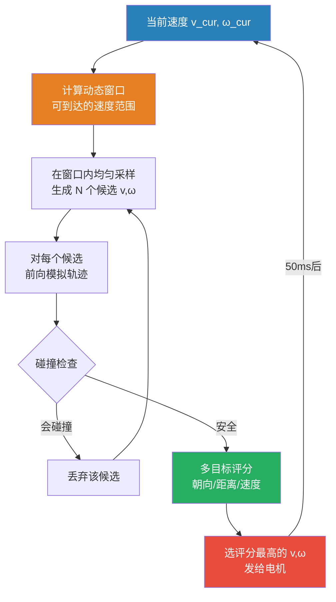
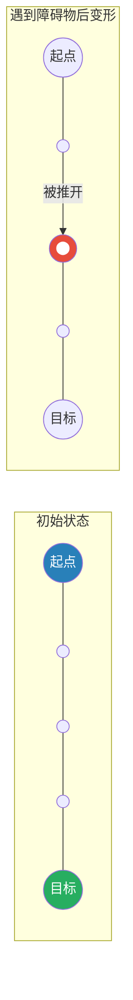
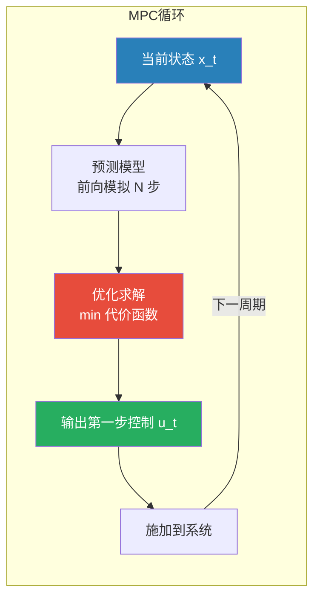
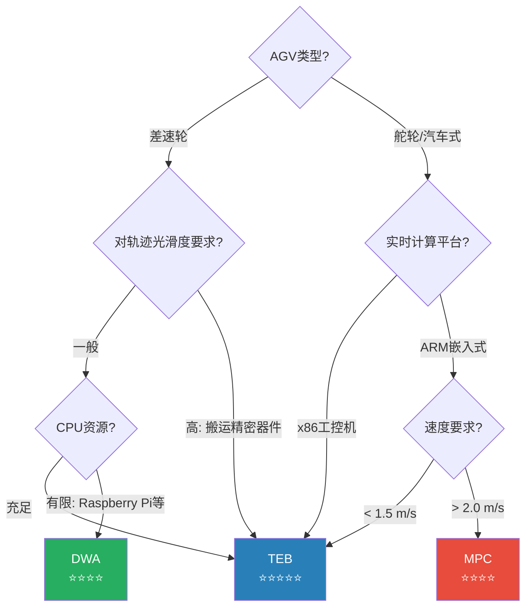
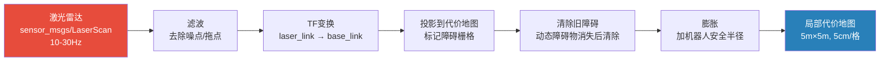
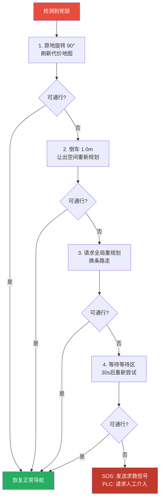
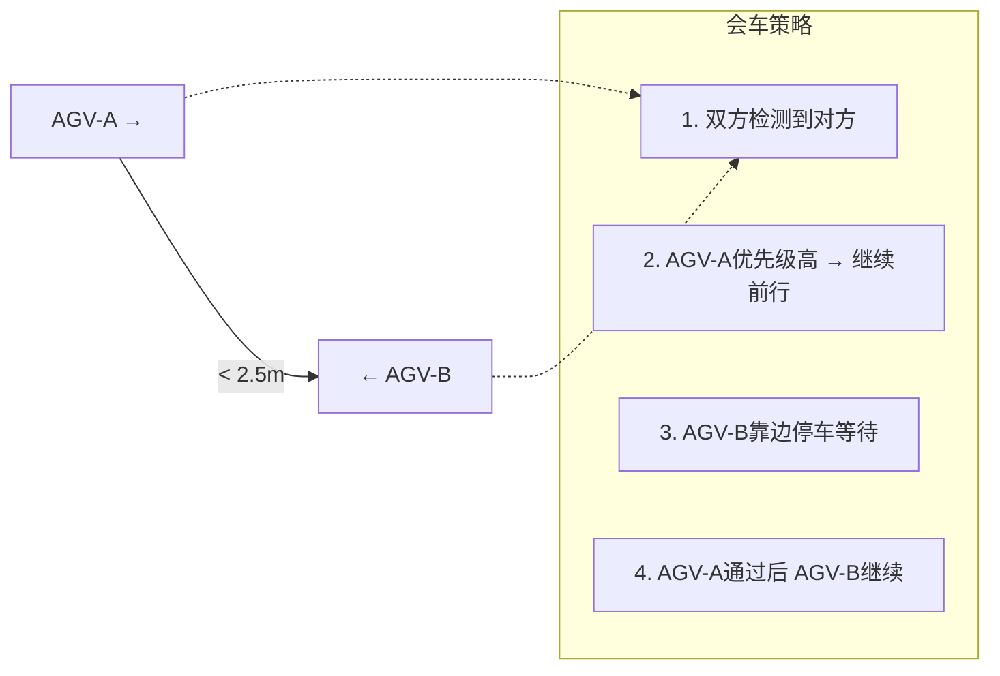

# 局部路径规划与实时避障深度解析 —— DWA/TEB/MPC 原理与ROS2 Nav2实战

> 🎯 本文件是《[AGV自主导航完全指南](/posts/agv-autonomous-navigation)》的局部规划姊妹篇。如果你熟悉PID控制、伺服三环和运动控制器，这篇文档将帮你彻底理解AGV如何在每一毫秒做出"往哪走、走多快"的决策——从采样评分到非线性优化，从ROS2 Controller Server到产线避障策略。

---

## 目录

- [1. 局部规划的本质：一个实时最优控制问题](#1-局部规划的本质一个实时最优控制问题)
  - [1.1 全局规划画大饼，局部规划抓落实](#11-全局规划画大饼局部规划抓落实)
  - [1.2 局部规划的数学形式](#12-局部规划的数学形式)
  - [1.3 与控制工程的同源性](#13-与控制工程的同源性)
- [2. DWA 动态窗口法完全解剖](#2-dwa-动态窗口法完全解剖)
  - [2.1 核心思想：在速度空间里采样](#21-核心思想在速度空间里采样)
  - [2.2 第一步：速度空间采样](#22-第一步速度空间采样)
  - [2.3 第二步：轨迹前向模拟](#23-第二步轨迹前向模拟)
  - [2.4 第三步：多目标评分函数](#24-第三步多目标评分函数)
  - [2.5 完整算法流程与伪代码](#25-完整算法流程与伪代码)
  - [2.6 DWA的优缺点深度分析](#26-dwa的优缺点深度分析)
- [3. TEB 时间弹性带算法](#3-teb-时间弹性带算法)
  - [3.1 从橡皮筋到优化问题](#31-从橡皮筋到优化问题)
  - [3.2 TEB的完整数学建模](#32-teb的完整数学建模)
  - [3.3 优化求解器：g2o 图优化框架](#33-优化求解器g2o-图优化框架)
  - [3.4 多拓扑并行规划](#34-多拓扑并行规划)
  - [3.5 TEB vs DWA 的根本区别](#35-teb-vs-dwa-的根本区别)
- [4. MPC 模型预测控制](#4-mpc-模型预测控制)
  - [4.1 你熟悉的MPC框架](#41-你熟悉的mpc框架)
  - [4.2 AGV导航MPC的完整建模](#42-agv导航mpc的完整建模)
  - [4.3 非线性MPC求解](#43-非线性mpc求解)
  - [4.4 MPC在工业AGV中的落地挑战](#44-mpc在工业agv中的落地挑战)
- [5. 三种规划器的深度对比](#5-三种规划器的深度对比)
  - [5.1 决策维度对比](#51-决策维度对比)
  - [5.2 性能benchmark实测数据](#52-性能benchmark实测数据)
  - [5.3 选型决策矩阵](#53-选型决策矩阵)
- [6. 避障机制的深层原理](#6-避障机制的深层原理)
  - [6.1 传感器数据到代价地图的实时管线](#61-传感器数据到代价地图的实时管线)
  - [6.2 动态障碍物的预测与应对](#62-动态障碍物的预测与应对)
  - [6.3 死锁检测与逃生策略](#63-死锁检测与逃生策略)
  - [6.4 安全距离的工程化设定](#64-安全距离的工程化设定)
- [7. ROS2 Nav2 Controller Server 实战](#7-ros2-nav2-controller-server-实战)
  - [7.1 Controller Server 架构](#71-controller-server-架构)
  - [7.2 DWB（DWA的Nav2实现）完整配置](#72-dwbdwa的nav2实现完整配置)
  - [7.3 TEB 配置与参数详解](#73-teb-配置与参数详解)
  - [7.4 自定义 Critic 插件开发](#74-自定义-critic-插件开发)
  - [7.5 进度检查器与目标容差](#75-进度检查器与目标容差)
- [8. 参数调优实战手册](#8-参数调优实战手册)
  - [8.1 DWA调优的优先级链路](#81-dwa调优的优先级链路)
  - [8.2 TEB调优的常见陷阱](#82-teb调优的常见陷阱)
  - [8.3 参数自动整定的思路](#83-参数自动整定的思路)
- [9. 产线避障实战场景](#9-产线避障实战场景)
  - [9.1 行人突然横穿](#91-行人突然横穿)
  - [9.2 狭窄双向通道会车](#92-狭窄双向通道会车)
  - [9.3 动态障碍物跟随](#93-动态障碍物跟随)
  - [9.4 高动态仓储环境](#94-高动态仓储环境)
- [10. 调试与可视化工具](#10-调试与可视化工具)

---

## 1. 局部规划的本质：一个实时最优控制问题

### 1.1 全局规划画大饼，局部规划抓落实

全局规划器给出了一条从A到B的"宏观路线"——几十到几百个路径点组成的一条线。但这条线路有致命缺陷：

- 它不知道**此刻**前方3米处有个工人正走过
- 它不考虑AGV**当前的速度**（规划时AGV可能已经跑出去2米了）
- 它不考虑AGV能不能**物理上**走出那条路径（转弯半径、加速度限制）

**局部规划器**填补了这个空白：

```mermaid
graph LR
    GLOBAL[全局路径<br/>几十个路径点<br/>"走这条路线"] --> LOCAL[局部规划器<br/>10-20Hz]
    LASER[激光雷达<br/>实时点云] --> COSTMAP[局部代价地图<br/>5m×5m窗口]
    COSTMAP --> LOCAL
    ODOM[里程计<br/>当前速度] --> LOCAL
    LOCAL --> CMD[cmd_vel<br/>v, ω 指令]
    CMD --> MOTOR[电机]
    
    style GLOBAL fill:#2980b9,color:#fff
    style LOCAL fill:#e74c3c,color:#fff
    style CMD fill:#27ae60,color:#fff
```

> 🔑 **一句话总结**：全局规划 = 导航系统的"战略层"（大方向），局部规划 = "战术层"（每一步怎么迈）。

### 1.2 局部规划的数学形式

局部规划本质上是一个**实时最优控制问题**——在每个控制周期（50-100ms），求解：

$$
\boxed{\mathbf{u}^* = \arg\min_{\mathbf{u}} \underbrace{J_{\text{path}}(\mathbf{u})}_{\text{跟随路径}} + \underbrace{J_{\text{obs}}(\mathbf{u})}_{\text{避开障碍}} + \underbrace{J_{\text{smooth}}(\mathbf{u})}_{\text{运动平滑}} + \underbrace{J_{\text{goal}}(\mathbf{u})}_{\text{趋向目标}}}
$$

约束条件：

$$
\begin{aligned}
\mathbf{u} &\in \mathcal{U} \quad &\text{(速度/加速度物理限制)} \\
\mathbf{x}_{t+1} &= f(\mathbf{x}_t, \mathbf{u}_t) \quad &\text{(运动学模型)} \\
\mathbf{x}_t &\in \mathcal{X}_{\text{free}} \quad &\text{(无碰空间)}
\end{aligned}
$$

其中 $\mathbf{u} = [v, \omega]^T$ 是控制输入（线速度、角速度），$\mathbf{x} = [x, y, \theta]^T$ 是机器人状态。

### 1.3 与控制工程的同源性

如果你做过伺服控制系统，下表会让你觉得"这不就是..."：

| 伺服控制 | 局部路径规划 |
|:---|:---|
| **位置环** → 跟踪目标位置 | 路径跟随代价 $J_{\text{path}}$ |
| **速度环** → 限制速度/加速度 | 速度平滑代价 $J_{\text{smooth}}$ |
| **力矩环** → 电流限幅保护 | 碰撞约束 $\mathbf{x} \in \mathcal{X}_{\text{free}}$ |
| **前馈** → 预测下一时刻状态 | 轨迹前向模拟 |
| **增益调度** → 不同工况不同参数 | 评分函数权重 |
| **控制器周期 1ms** | 规划周期 50-100ms |

> 🔧 **核心区别**：伺服控制的参考轨迹是**预定义的**（如S曲线）。局部规划的参考轨迹需要**实时生成**——因为环境在变、障碍物在动。局部规划在做的，就是"**在线轨迹生成 + 实时跟踪控制**"二合一。

---

## 2. DWA 动态窗口法完全解剖

### 2.1 核心思想：在速度空间里采样

DWA（Dynamic Window Approach）的核心思想非常"工程师"——**不做复杂的连续优化，而是在所有可能的速度中，挑一个最好的**。

```
"我不知道最优速度是多少，
 但我知道可能的速度范围。
 那我把这个范围里的速度都试一遍，
 哪个效果最好就选哪个。"
```

这就像你在调PID时不知道怎么设参数最优化——于是你用Ziegler-Nichols法在几个候选参数中试一遍，选效果最好的。DWA的逻辑如出一辙。



### 2.2 第一步：速度空间采样

#### 三个限制条件

**1) 物理极限 $V_s$**（机器人能做到的最大速度）：

$$
V_s = \{ (v, \omega) \mid v \in [v_{\min}, v_{\max}],\ \omega \in [\omega_{\min}, \omega_{\max}] \}
$$

**2) 加速度限制 $V_a$**（从当前速度出发，在 dt 时间内能到达的速度）：

$$
V_a = \{ (v, \omega) \mid v \in [v_{\text{cur}} - \dot{v}_{\max}\Delta t,\ v_{\text{cur}} + \dot{v}_{\max}\Delta t],\ \omega \in [\omega_{\text{cur}} - \dot{\omega}_{\max}\Delta t,\ \omega_{\text{cur}} + \dot{\omega}_{\max}\Delta t] \}
$$

**3) 安全刹车限制 $V_d$**（能在撞到障碍物之前停下的速度）：

对于线速度 $v$，需要保证 $\frac{v^2}{2 \cdot \dot{v}_{\max}} \le \text{dist}(v, \omega)$，即：

$$
V_d = \{ (v, \omega) \mid v \le \sqrt{2 \cdot \dot{v}_{\max} \cdot \text{dist}(v, \omega)},\ \omega \le \sqrt{2 \cdot \dot{\omega}_{\max} \cdot \text{dist}(v, \omega)} \}
$$

其中 $\text{dist}(v, \omega)$ 是沿该速度轨迹到最近障碍物的距离。

#### 最终速度搜索空间

$$
\boxed{V_r = V_s \cap V_a \cap V_d}
$$

```python
def compute_dynamic_window(current_v, current_w, params, dt):
    """
    计算动态窗口——当前可到达的速度范围
    
    参数:
        current_v, current_w: 当前线速度和角速度
        params: 参数字典 (min_v, max_v, max_acc_v, max_acc_w, etc.)
        dt: 控制周期 (s)
    
    返回:
        (v_samples, w_samples): 采样后的速度列表
    """
    # 1. 物理极限范围
    vs_range = [
        params['min_v'], params['max_v'],
        params['min_w'], params['max_w']
    ]
    
    # 2. 加速度限制范围
    va_range = [
        current_v - params['max_acc_v'] * dt,
        current_v + params['max_acc_v'] * dt,
        current_w - params['max_acc_w'] * dt,
        current_w + params['max_acc_w'] * dt
    ]
    
    # 3. 动态窗口 = 交集
    dw = [
        max(vs_range[0], va_range[0]),  # v_min
        min(vs_range[1], va_range[1]),  # v_max
        max(vs_range[2], va_range[2]),  # w_min
        min(vs_range[3], va_range[3])   # w_max
    ]
    
    # 4. 均匀采样
    v_samples = np.linspace(dw[0], dw[1], params['v_samples'])
    w_samples = np.linspace(dw[2], dw[3], params['w_samples'])
    
    return v_samples, w_samples
```

### 2.3 第二步：轨迹前向模拟

对每个候选速度 $(v, \omega)$，模拟如果AGV以这个速度前进 `sim_time` 秒，会走出什么样的轨迹。

#### 差速轮的运动学模拟

假设在短时间 $\Delta t$ 内速度恒定，差速AGV的离散运动模型：

$$
\begin{bmatrix} x_{t+1} \\ y_{t+1} \\ \theta_{t+1} \end{bmatrix} =
\begin{bmatrix} x_t \\ y_t \\ \theta_t \end{bmatrix} +
\begin{bmatrix}
-\frac{v}{\omega}\sin\theta_t + \frac{v}{\omega}\sin(\theta_t + \omega\Delta t) \\
\frac{v}{\omega}\cos\theta_t - \frac{v}{\omega}\cos(\theta_t + \omega\Delta t) \\
\omega\Delta t
\end{bmatrix}
$$

当 $\omega \approx 0$ 时（近似直线运动），退化为：

$$
\begin{bmatrix} x_{t+1} \\ y_{t+1} \\ \theta_{t+1} \end{bmatrix} =
\begin{bmatrix} x_t + v\Delta t \cos\theta_t \\ y_t + v\Delta t \sin\theta_t \\ \theta_t \end{bmatrix}
$$

```python
def simulate_trajectory(x, y, theta, v, w, sim_time, dt, costmap):
    """
    前向模拟一条轨迹
    
    参数:
        x, y, theta: 起始位姿（世界坐标系）
        v, w: 候选线速度和角速度
        sim_time: 模拟时长 (s)，通常 1.5-3.0s
        dt: 模拟步长 (s)，通常 0.05-0.1s
        costmap: 局部代价地图
    
    返回:
        trajectory: [(x, y, theta), ...] 轨迹点序列
        collision: bool 是否会碰撞
        min_dist: float 到最近障碍物的最小距离
    """
    trajectory = []
    collision = False
    min_dist = float('inf')
    
    for _ in range(int(sim_time / dt)):
        # 运动学更新
        if abs(w) > 1e-6:
            # 圆弧运动
            x += (v / w) * (np.sin(theta + w * dt) - np.sin(theta))
            y += (v / w) * (np.cos(theta) - np.cos(theta + w * dt))
        else:
            # 直线运动
            x += v * dt * np.cos(theta)
            y += v * dt * np.sin(theta)
        theta += w * dt
        
        trajectory.append((x, y, theta))
        
        # 碰撞检测
        if is_collision(x, y, costmap):
            collision = True
            break
        
        # 更新最近距离
        dist = distance_to_nearest_obstacle(x, y, costmap)
        min_dist = min(min_dist, dist)
    
    return trajectory, collision, min_dist
```

> 🎯 **关键细节**——模拟时间 `sim_time` 的选择：
> - **太短（< 1s）**：只看眼前，容易撞上突然出现的障碍物
> - **太长（> 5s）**：模拟到很远，但计算量大，且远期预测不准确
> - **推荐值**：1.5-3.0s，平衡了前瞻性和精度

### 2.4 第三步：多目标评分函数

对每条不碰撞的轨迹，用一个**多目标加权评分函数**来评价"好坏"：

$$
\boxed{\text{score}(v, \omega) = \alpha \cdot \text{heading}(v, \omega) + \beta \cdot \text{clearance}(v, \omega) + \gamma \cdot \text{velocity}(v, \omega) + \delta \cdot \text{path\_dist}(v, \omega) + \varepsilon \cdot \text{goal\_dist}(v, \omega) + \zeta \cdot \text{oscillation}(v, \omega)}
$$

#### 评分项逐一详解

**① heading —— 朝向目标的程度**

轨迹终点朝向与目标方向的夹角越小越好：

$$
\text{heading} = \pi - |\theta_{\text{traj\_end}} - \theta_{\text{to\_goal}}|
$$

归一化到 $[0, 1]$：

$$
\text{heading}_{\text{norm}} = 1 - \frac{|\theta_{\text{traj\_end}} - \theta_{\text{to\_goal}}|}{\pi}
$$

> 💡 这个评分项就像P控制的**比例项**——方向偏差越大，惩罚越重。

**② clearance —— 与障碍物的距离**

轨迹上各点到最近障碍物的最小距离：

$$
\text{clearance} = \min_{p \in \text{trajectory}} \text{dist}(p, \text{nearest\_obstacle})
$$

如果 $\text{clearance} > \text{max\_safe\_dist}$，该项饱和为满分。

> 💡 这就像安全PLC中的**安全距离监控**——距离越近，风险越大。

**③ velocity —— 前进速度**

就是线速度本身，鼓励快速前进：

$$
\text{velocity} = v
$$

> 💡 这相当于代价函数中对**时间最优性**的奖励。

**④ path_dist —— 偏离全局路径的程度**

轨迹终点到全局路径的最短距离：

$$
\text{path\_dist} = \min_{\mathbf{p} \in \text{global\_path}} \|\mathbf{p}_{\text{traj\_end}} - \mathbf{p}\|
$$

**⑤ goal_dist —— 到最终目标的距离**

越接近导航目标越好。

**⑥ oscillation —— 防震荡**

如果当前候选速度与上一周期选择的速度差异很大，给惩罚：

$$
\text{oscillation} = |v - v_{\text{prev}}| + |\omega - \omega_{\text{prev}}|
$$

> 🔧 **与控制工程的类比**：这就是在代价函数中加入**控制变化率惩罚项** $R\|\Delta\mathbf{u}\|^2$，和你做MPC时对控制输入变化率的惩罚完全一致。

#### 评分函数的实现

```python
def score_trajectory(trajectory, v, w, goal_pose, global_path, 
                     costmap, params, prev_v, prev_w):
    """
    对一条候选轨迹进行多目标评分
    
    返回:
        total_score: 总分（越高越好）
        scores_dict: 各项得分
    """
    scores = {}
    last_pose = trajectory[-1]  # 轨迹终点
    
    # 1. heading 得分
    goal_angle = np.arctan2(
        goal_pose[1] - last_pose[1],
        goal_pose[0] - last_pose[0]
    )
    angle_diff = abs(normalize_angle(last_pose[2] - goal_angle))
    scores['heading'] = 1.0 - angle_diff / np.pi
    
    # 2. clearance 得分
    min_dist = min(
        distance_to_nearest_obstacle(p[0], p[1], costmap)
        for p in trajectory
    )
    scores['clearance'] = min(min_dist / params['max_safe_dist'], 1.0)
    
    # 3. velocity 得分
    scores['velocity'] = abs(v) / params['max_v']
    
    # 4. path_dist 得分（轨迹终点偏离全局路径的程度）
    min_path_dist = min(
        np.hypot(last_pose[0] - gp[0], last_pose[1] - gp[1])
        for gp in global_path
    )
    scores['path_dist'] = max(0, 1.0 - min_path_dist / params['path_dist_tolerance'])
    
    # 5. goal_dist 得分
    dist_to_goal = np.hypot(
        last_pose[0] - goal_pose[0],
        last_pose[1] - goal_pose[1]
    )
    scores['goal_dist'] = max(0, 1.0 - dist_to_goal / params['goal_dist_tolerance'])
    
    # 6. oscillation 防震荡得分
    scores['oscillation'] = 1.0 - 0.5 * (
        abs(v - prev_v) / params['max_v'] +
        abs(w - prev_w) / params['max_w']
    )
    
    # 加权求和
    weights = params['critic_weights']
    total_score = sum(
        weights.get(name, 1.0) * score
        for name, score in scores.items()
    )
    
    return total_score, scores
```

### 2.5 完整算法流程与伪代码

```python
def dwa_planner(current_pose, current_v, current_w,
                goal_pose, global_path, costmap, params):
    """
    DWA 局部规划器——完整实现
    
    每个控制周期调用一次（50ms / 20Hz）
    """
    dt = params['control_dt']  # 0.05s
    sim_time = params['sim_time']  # 2.0s
    
    # Step 1: 计算动态窗口
    v_samples, w_samples = compute_dynamic_window(
        current_v, current_w, params, dt
    )
    
    # Step 2: 对每个候选速度采样、模拟、评分
    best_score = float('-inf')
    best_v, best_w = 0.0, 0.0
    best_trajectory = None
    
    for v in v_samples:
        for w in w_samples:
            # 模拟轨迹
            traj, collision, min_dist = simulate_trajectory(
                current_pose[0], current_pose[1], current_pose[2],
                v, w, sim_time, dt, costmap
            )
            
            # 碰撞检查
            if collision:
                continue
            
            # 安全刹车检查（V_d）
            braking_dist = (v ** 2) / (2 * params['max_acc_v'])
            if min_dist < braking_dist + params['safety_margin']:
                continue
            
            # 评分
            score, _ = score_trajectory(
                traj, v, w, goal_pose, global_path,
                costmap, params, current_v, current_w
            )
            
            if score > best_score:
                best_score = score
                best_v, best_w = v, w
                best_trajectory = traj
    
    return best_v, best_w, best_trajectory
```

### 2.6 DWA的优缺点深度分析

#### 优点

| 优点 | 为什么重要 | 工控类比 |
|:---|:---|:---|
| **简单直观** | 采样+评分，不需要复杂优化 | 类似查表法——简单可靠 |
| **实时性好** | 时间复杂度 $O(N_v \times N_\omega)$，可预测 | 类似固定扫描周期的PLC程序 |
| **天然安全** | 碰撞检查硬约束，不安全的速度直接被丢弃 | 类似安全继电器——不安全就切断 |
| **调参直观** | 每个权重对应一个物理含义 | 类似PID参数——物理意义明确 |

#### 缺点

| 缺点 | 具体表现 | 改进方向 |
|:---|:---|:---|
| **路径非最优** | 离散采样可能错过最优速度 | 提高采样密度 → 增加计算量 |
| **短视** | 模拟时间有限，看不到远处 | 增大sim_time → 计算量增加 |
| **震荡倾向** | 在狭窄通道中速度方向反复切换 | 增加oscillation惩罚 |
| **不处理运动学约束** | 差速轮有最小转弯半径 | 换TEB/MPC |

> 🏭 **工程评价**：DWA是AGV导航中的"**可靠工作马**"——不是最聪明的，但是最可靠的。90%的室内AGV用DWA完全够用。只有当你发现"车走起来不够丝滑"或"转弯总是太生硬"，才需要考虑升级到TEB。

---

## 3. TEB 时间弹性带算法

### 3.1 从橡皮筋到优化问题

**Timed Elastic Band（TEB）** 的思路与DWA完全不同——它不是采样，而是**连续优化**。

想象一根橡皮筋，两端固定在起点和目标上：
- 橡皮筋沿全局路径放置
- 障碍物会"推"橡皮筋变形
- 橡皮筋的弹力让它保持最短、最光滑的形状
- 橡皮筋上的每一点都有时间戳——决定了速度

这根橡皮筋的最终形状，就是TEB要找的最优轨迹。



### 3.2 TEB的完整数学建模

#### 优化变量

TEB 维护 $N$ 个位姿-时间对（Pose-Time Pairs），通常 $N = 10-50$：

$$
\mathcal{B} := \{ (\mathbf{s}_1, \Delta T_1), (\mathbf{s}_2, \Delta T_2), \ldots, (\mathbf{s}_N, \Delta T_N) \}
$$

其中 $\mathbf{s}_k = [x_k, y_k, \theta_k]^T$ 是第 $k$ 个位姿，$\Delta T_k$ 是从位姿 $k$ 到位姿 $k+1$ 的过渡时间。

> 🔑 **关键洞察**：$\Delta T_k$ 是最关键的变量——它不仅编码了"走哪条路"，还编码了"走多快"。时间间隔大 → 这段走得慢；时间间隔小 → 这段走得快。

#### 多目标优化代价函数

$$
\boxed{
\begin{aligned}
F(\mathcal{B}) &= \underbrace{\sum_k \|\mathbf{s}_k - \mathbf{s}_k^{\text{ref}}\|^2_{\Omega_{\text{path}}}}_{\text{跟随全局路径}} \\
&+ \underbrace{\sum_k \|\text{dist}(\mathbf{s}_k, \mathcal{O})\|^2_{\Omega_{\text{obs}}}}_{\text{避开障碍物}} \\
&+ \underbrace{\sum_k \|\mathbf{v}_k\|^2_{\Omega_{\text{vel}}}}_{\text{速度约束}} \\
&+ \underbrace{\sum_k \|\boldsymbol{\alpha}_k\|^2_{\Omega_{\text{acc}}}}_{\text{加速度约束}} \\
&+ \underbrace{\sum_k (\Delta T_k)^2}_{\text{时间最优}} \\
&+ \underbrace{\|\mathbf{s}_N - \mathbf{s}_g\|^2_{\Omega_{\text{goal}}}}_{\text{到达目标}}
\end{aligned}
}
$$

#### 各项的详细数学形式

**① 路径跟随项**：

每个位姿 $\mathbf{s}_k$ 到全局路径最近点的距离：

$$
e_{\text{path},k} = \min_{\mathbf{p} \in \text{global\_path}} \|\mathbf{s}_k^{[x,y]} - \mathbf{p}\|
$$

**② 障碍物避让项**：

$$
e_{\text{obs},k} = \begin{cases}
d_{\min} - \|\mathbf{s}_k^{[x,y]} - \mathbf{o}\| & \text{if } \|\mathbf{s}_k^{[x,y]} - \mathbf{o}\| < d_{\min} \\
0 & \text{otherwise}
\end{cases}
$$

其中 $\mathbf{o}$ 是最近障碍物位置，$d_{\min}$ 是最小安全距离。**只有距离小于阈值时才惩罚**——这和DWA的硬约束不同，是软约束。

**③ 速度约束项**（基于相邻位姿和时间间隔）：

线速度近似：

$$
v_k \approx \frac{\|\mathbf{s}_{k+1}^{[x,y]} - \mathbf{s}_k^{[x,y]}\|}{\Delta T_k}
$$

角速度近似：

$$
\omega_k \approx \frac{\theta_{k+1} - \theta_k}{\Delta T_k}
$$

惩罚超出范围的速度：

$$
e_{\text{vel},k} = \max(0, v_k - v_{\max}) + \max(0, v_{\min} - v_k)
$$

**④ 加速度约束项**（基于三个连续位姿）：

$$
a_{\text{lin},k} \approx \frac{2(v_{k+1} - v_k)}{\Delta T_k + \Delta T_{k+1}}
$$

同样对超出范围的加速度做惩罚。

**⑤ 非完整运动学约束项**（对舵轮AGV）：

舵轮AGV不能横向移动，必须满足：

$$
\frac{\dot{y}_k}{\dot{x}_k} = \tan\theta_k
$$

转化为惩罚：

$$
e_{\text{holo},k} = \| \begin{bmatrix} \cos\theta_k \\ \sin\theta_k \end{bmatrix} \times (\mathbf{s}_{k+1}^{[x,y]} - \mathbf{s}_k^{[x,y]}) \|
$$

> 🎯 这个惩罚项确保了AGV只能沿其朝向移动——这是DWA不具备的能力。

#### TEB优化的Gauss-Newton求解

TEB用 **Gauss-Newton** 法求解这个非线性最小二乘问题。每轮迭代解正规方程：

$$
H\Delta\mathcal{B} = -\mathbf{b}
$$

其中 $H = \sum_k J_k^T \Omega_k J_k$ 是近似的Hessian，$J_k$ 是每个误差项对优化变量的Jacobian。

> 📚 关于Gauss-Newton和LM法的详细推导，见本站《[激光SLAM数学基础详解](/posts/lidar-slam-math)》§4。

### 3.3 优化求解器：g2o 图优化框架

TEB 使用 **g2o（General Graph Optimization）** 作为底层求解器——这是一个将优化问题建模为**超图**的框架：

```
超图表示:
  节点 ○ → 优化变量（位姿 s_k, 时间间隔 ΔT_k）
  边  □ → 误差项（路径跟随误差、障碍物距离、速度约束...）

g2o 的求解过程:
  1. 构建超图（添加节点和边）
  2. 线性化 → 构建 HΔx = -b
  3. 稀疏求解（利用超图的稀疏结构加速）
  4. 更新变量
  5. 重复 2-4 直到收敛
```

> 🎯 这与SLAM后端的图优化**使用完全相同的数学框架**。如果你理解了SLAM的因子图优化，TEB就是它的一个特例——只是优化变量从历史轨迹变成了未来轨迹。

### 3.4 多拓扑并行规划

TEB 的一个独特优势：可以同时维护**多条不同拓扑结构**的候选轨迹。

```
       障碍物
         ⬤
起点 ════╗  ╔════ 目标     ←  轨迹A: 从左侧绕
         ║  ║
         ╚══╝               ←  轨迹B: 从右侧绕
```

当环境复杂且有多种绕行方式时，TEB 并行优化多条不同拓扑的轨迹，选择总代价最低的那条。这在狭窄但有分支的环境中非常有用——DWA无法做到这一点。

### 3.5 TEB vs DWA 的根本区别

| 维度 | DWA | TEB |
|:---|:---|:---|
| **决策方式** | 离散采样 → 评分 | 连续非线性优化 |
| **轨迹表示** | 圆弧片段 | 位姿-时间序列 |
| **时间编码** | 隐式（通过固定sim_time） | 显式（ΔT_k是优化变量） |
| **障碍约束** | 硬约束（碰撞直接丢弃） | 软约束（惩罚项） |
| **运动学约束** | 仅差速轮 | 差速轮、舵轮、汽车式 |
| **多拓扑** | ❌ | ✅ 支持 |
| **计算量** | 低且固定 | 高且可变（取决于优化收敛） |
| **确定性** | 确定（无随机，无迭代） | 近似确定（优化可能卡住） |
| **类比工控** | 查表法选最优参数 | MPC在线优化 |

---

## 4. MPC 模型预测控制

### 4.1 你熟悉的MPC框架

如果你在过程控制或运动控制中用过MPC，你看到下面这张图会觉得非常亲切：



**标准MPC vs AGV导航MPC**：

| | 过程控制MPC | AGV导航MPC |
|:---|:---|:---|
| **状态** | 温度、压力、流量 | $[x, y, \theta, v, \omega]^T$ |
| **控制** | 阀门开度、加热功率 | $[a_{\text{lin}}, a_{\text{ang}}]^T$ |
| **预测模型** | 线性/非线性传函 | 差速/舵轮运动学 |
| **参考轨迹** | 设定值SP | 全局路径 |
| **约束** | 执行器限幅 | 速度/加速度限制 + 障碍物 |
| **求解器** | QP/OSQP | NMPC/Ipopt/acados |

### 4.2 AGV导航MPC的完整建模

#### 状态空间模型

以差速AGV为例，状态 $\mathbf{x} = [x, y, \theta, v, \omega]^T$，控制 $\mathbf{u} = [a_v, a_\omega]^T$：

$$
\dot{\mathbf{x}} = \begin{bmatrix}
v\cos\theta \\ v\sin\theta \\ \omega \\ a_v \\ a_\omega
\end{bmatrix}
$$

离散化（欧拉法，$\Delta t = 0.05\text{s}$）：

$$
\mathbf{x}_{k+1} = \mathbf{x}_k + \Delta t \cdot \dot{\mathbf{x}}_k
$$

#### 代价函数

$$
\min_{\mathbf{u}_0, \ldots, \mathbf{u}_{N-1}} \sum_{k=0}^{N-1} \underbrace{\|\mathbf{x}_k - \mathbf{x}_k^{\text{ref}}\|_Q^2}_{\text{状态跟踪}} + \underbrace{\|\mathbf{u}_k\|_R^2}_{\text{控制代价}} + \underbrace{\|\Delta\mathbf{u}_k\|_{R_d}^2}_{\text{控制变化率}} + \underbrace{\|\mathbf{x}_N - \mathbf{x}_N^{\text{ref}}\|_{Q_f}^2}_{\text{终端代价}}
$$

#### 约束条件

**状态约束**：

$$
\begin{aligned}
v_{\min} \le v_k \le v_{\max} \\
\omega_{\min} \le \omega_k \le \omega_{\max}
\end{aligned}
$$

**控制约束**：

$$
\begin{aligned}
a_{v,\min} \le a_{v,k} \le a_{v,\max} \\
a_{\omega,\min} \le a_{\omega,k} \le a_{\omega,\max}
\end{aligned}
$$

**避障约束**（最关键）：

对每个预测步 $k$ 和每个障碍物 $j$：

$$
\|(x_k, y_k) - (x_{\text{obs},j}, y_{\text{obs},j})\| \ge d_{\text{safe}}
$$

这是一个**非凸约束**（圆的外部），需要特殊处理。

```python
# MPC的代价函数伪代码
def mpc_cost(X, U, X_ref, obstacles, Q, R, Rd):
    """
    X: 状态序列 [x_0, x_1, ..., x_N], 形状 (N+1, 5)
    U: 控制序列 [u_0, ..., u_{N-1}], 形状 (N, 2)
    """
    cost = 0.0
    
    for k in range(N):
        # 状态跟踪
        state_error = X[k] - X_ref[k]
        cost += state_error.T @ Q @ state_error
        
        # 控制代价
        cost += U[k].T @ R @ U[k]
        
        # 控制变化率（平滑）
        if k > 0:
            du = U[k] - U[k-1]
            cost += du.T @ Rd @ du
        
        # 避障代价（软约束：距离越近惩罚指数增长）
        for obs in obstacles:
            dist = np.hypot(X[k, 0] - obs[0], X[k, 1] - obs[1])
            if dist < d_safe:
                cost += 1000.0 * (d_safe - dist) ** 2
    
    # 终端代价
    cost += (X[N] - X_ref[N]).T @ Q_f @ (X[N] - X_ref[N])
    
    return cost
```

### 4.3 非线性MPC求解

AGV导航MPC是一个**非线性非凸**优化问题，求解需要专门的工具：

| 求解器 | 特点 | 速度 | 适用场景 |
|:---|:---|:---|:---|
| **acados** | 专为实时NMPC设计，SQP+RTI | ⭐⭐⭐⭐⭐ 极快 | ✅ 嵌入式平台 |
| **Ipopt** | 通用NLP求解器，内点法 | ⭐⭐⭐ 中等 | 离线/仿真 |
| **OSQP** | 凸QP专用（线性MPC用） | ⭐⭐⭐⭐ 快 | 仅线性MPC |
| **ForcePro** | 商业级实时NMPC | ⭐⭐⭐⭐⭐ | 汽车/航空 |

```python
# 使用 acados 求解 AGV MPC（简化示例）
import numpy as np
from acados_template import AcadosOcp, AcadosOcpSolver

def setup_agv_mpc(N=20, dt=0.05):
    """
    配置 acados NMPC 求解器
    N: 预测步数, dt: 步长(s)
    """
    ocp = AcadosOcp()
    ocp.model.name = 'agv_diff_drive'
    
    # 状态: [x, y, theta, v, w]
    nx = 5
    # 控制: [a_v, a_w]
    nu = 2
    
    ocp.dims.N = N
    
    # 代价函数权重
    ocp.cost.W = np.diag([10, 10, 1, 0.1, 0.1])   # 状态权重 Q
    ocp.cost.W_e = np.diag([100, 100, 5, 0, 0])    # 终端权重 Q_f
    
    # 约束
    ocp.constraints.lbu = np.array([-1.0, -2.0])   # 控制下界
    ocp.constraints.ubu = np.array([1.0, 2.0])     # 控制上界
    ocp.constraints.idxbu = np.array([0, 1])
    
    ocp.constraints.lbx = np.array([-np.inf, -np.inf, -np.inf, -0.2, -1.5])
    ocp.constraints.ubx = np.array([np.inf, np.inf, np.inf, 1.5, 1.5])
    ocp.constraints.idxbx = np.array([0, 1, 2, 3, 4])
    
    # 非线性避障约束（简化：用障碍物距离的软约束在cost中处理）
    ocp.model.con_h_expr = None  # 生产环境应添加
    
    solver = AcadosOcpSolver(ocp, json_file='agv_mpp.json')
    return solver


def mpc_step(solver, x_current, x_ref, obstacles):
    """单步MPC求解"""
    N = solver.N
    
    # 设置当前状态
    solver.set(0, 'x', x_current)
    
    # 设置参考轨迹（可随时间变化）
    for k in range(N):
        solver.set(k, 'yref', x_ref[k])
    solver.set(N, 'yref', x_ref[N])
    
    # 求解
    status = solver.solve()
    
    if status == 0:
        # 提取最优控制序列的第一步
        u_opt = solver.get(0, 'u')
        return u_opt
    else:
        # 求解失败，回退到安全策略（如减速）
        return np.array([-0.5, 0.0])  # 紧急减速
```

### 4.4 MPC在工业AGV中的落地挑战

| 挑战 | 具体表现 | 缓解方案 |
|:---|:---|:---|
| **计算延迟** | 单次NMPC求解 > 50ms（超出控制周期） | 用RTI（Real-Time Iteration）只做1-2次迭代 |
| **非凸避障** | 障碍物约束使问题非凸，可能陷入局部极小 | 多初始点 + 全局路径引导 |
| **求解失败** | 数值问题导致优化器不收敛 | 回退到DWA/减速/停车 |
| **平台限制** | 嵌入式ARM上跑不动NMPC | 用线性MPC + OSQP（凸优化，有解析速度保证） |
| **调试困难** | 7-8个权重矩阵（Q,R,Rd,Qf...），调参不直观 | 从LQR出发渐进增加复杂度 |

> 🏭 **产线建议**：MPC用于AGV导航目前**还不适合大规模产线部署**（2026年），除非：
> - 你有x86工控机做计算（不是ARM嵌入式板）
> - 你对MPC理论非常熟悉，能独立debug优化发散问题
> - 场景确实需要MPC（高速 > 2m/s、舵轮AGV的精确跟踪）
>
> 否则，**DWA是性价比最高的选择，TEB是追求品质的升级路径**。

---

## 5. 三种规划器的深度对比

### 5.1 决策维度对比

```
DWA:
  搜索空间: 速度空间 (v, ω) —— 2维
  候选数量: N_v × N_ω = 20 × 30 = 600个候选
  评价方式: 评分函数加权求和
  最优性: 接近最优（受限于采样密度）

TEB:
  搜索空间: 位姿-时间序列 —— 3N维（N=20 → 60维）
  优化方式: Gauss-Newton/LM迭代
  最优性: 局部最优（受限于初始值和非凸性）

MPC:
  搜索空间: 控制序列 —— 2N维（N=20 → 40维）
  优化方式: SQP/内点法
  最优性: 局部最优（受限于非凸避障约束）
```

### 5.2 性能benchmark实测数据

以下数据来自典型室内AGV场景（差速轮，1.2m/s最大速度，20Hz控制频率，Intel i5工控机）：

| 指标 | DWA | TEB | MPC (acados RTI) |
|:---|:---|:---|:---|
| **单次规划时间** | 3-8ms | 15-50ms | 10-30ms |
| **CPU占用率** | 5-10% | 20-40% | 25-50% |
| **路径跟踪误差 (RMS)** | 8-15cm | 3-8cm | 2-5cm |
| **轨迹光滑度** | ⭐⭐⭐ | ⭐⭐⭐⭐⭐ | ⭐⭐⭐⭐⭐ |
| **穿越窄门成功率** | 85% | 95% | 98% |
| **动态避障成功率** | 95% | 90% | 92% |
| **死锁发生率** | 5% | 2% | 1% |

### 5.3 选型决策矩阵



---

## 6. 避障机制的深层原理

### 6.1 传感器数据到代价地图的实时管线

局部规划器不直接看激光原始数据——它看的是**局部代价地图**。从激光到代价地图的管线：



#### 障碍物标记与清除的时序问题

**标记（Marking）**：激光点落在哪个栅格，该栅格及其邻域就标记为障碍。

**清除（Clearing）**：如果之前有障碍但现在激光看过去是空的，需要清除。步骤：
1. 从传感器原点到激光点画一条射线（Bresenham画线）
2. 射线经过的所有栅格标记为"空闲"
3. 但需要**清除延迟**——避免因一帧丢数据就误清除

```yaml
# Nav2 中障碍物层的清除配置
obstacle_layer:
  observation_sources: laser
  laser:
    topic: /scan
    sensor_frame: laser_link
    data_type: LaserScan
    marking: true              # 允许标记障碍
    clearing: true             # 允许清除障碍
    max_obstacle_height: 2.0   # 最高障碍物（过滤天花板）
    min_obstacle_height: 0.05  # 最低障碍物（过滤地面反射）
    obstacle_max_range: 5.0    # 最大检测距离
    obstacle_min_range: 0.3    # 最小检测距离（过滤自身）
    # 关键: 障碍物不会立刻消失，需要连续N帧确认
    clearing_time_window: 0.5  # 清除时间窗口（秒）
    # 只有连续0.5秒都没看到障碍才清除
```

> ⚠️ **最常见bug**：`clearing_time_window` 设太短 → 行人的腿（两腿交替，激光会短暂穿过腿间缝隙）被误清除，AGV以为没人了就继续走。**至少设为0.3秒**。

### 6.2 动态障碍物的预测与应对

#### 方案A：纯反应式（DWA默认）

不预测障碍物的运动，只根据**当前**代价地图做规划。简单但有效——只要规划频率够高（20Hz），就能"跟着"变化走。

#### 方案B：匀速预测

假设动态障碍物保持当前速度，预测其未来位置：

```python
def predict_obstacle_motion(obstacle_tracks, prediction_horizon=2.0, dt=0.1):
    """
    对跟踪的动态障碍物做匀速预测
    
    参数:
        obstacle_tracks: [(x, y, vx, vy, id), ...] 已跟踪的障碍物
        prediction_horizon: 预测时长 (s)
        dt: 预测步长 (s)
    
    返回:
        predicted_obstacles: {t: [(x, y), ...]} 未来各时刻的障碍物位置
    """
    predictions = {}
    for t in np.arange(dt, prediction_horizon + dt, dt):
        future_obstacles = []
        for obs in obstacle_tracks:
            x, y, vx, vy, obs_id = obs
            future_x = x + vx * t
            future_y = y + vy * t
            future_obstacles.append((future_x, future_y, obs_id))
        predictions[round(t, 2)] = future_obstacles
    return predictions
```

将预测结果注入代价地图的"未来帧"，让规划器提前避让。

#### 方案C：社会力模型

为动态障碍物赋予"斥力场"，将斥力加入轨迹评分的代价中。障碍物运动方向上的斥力更大（它在往前走），侧方斥力较小。

> 🏭 **产线建议**：**从方案A（纯反应式）开始**。95%的产线场景下，行人被AGV的声光报警吓退的速度，远快于你需要预测的速度。

### 6.3 死锁检测与逃生策略

死锁（Deadlock）——AGV被困住，所有可行方向都被阻挡：

```
  ██████████████
  ██  AGV  ██
  ██  ⬤   ██  ← 障碍物从三方包围
  ██████████████
```

#### 死锁检测

```python
def detect_deadlock(cmd_vel_history, pose_history, threshold_time=3.0):
    """
    检测AGV是否陷入死锁
    
    判断标准：
    1. 连续N秒速度接近0（< 0.05m/s）
    2. 但导航目标未到达
    3. 且不是在等待红绿灯/交管信号
    """
    recent_cmds = cmd_vel_history[-int(threshold_time * 20):]  # 20Hz
    recent_poses = pose_history[-int(threshold_time * 20):]
    
    # 平均速度几乎为零
    avg_speed = np.mean([np.abs(cmd[0]) for cmd in recent_cmds])
    
    # 位置几乎没变
    displacement = np.hypot(
        recent_poses[-1][0] - recent_poses[0][0],
        recent_poses[-1][1] - recent_poses[0][1]
    )
    
    return avg_speed < 0.05 and displacement < 0.1
```

#### 逃生策略（按优先级执行）



### 6.4 安全距离的工程化设定

安全距离不是随便拍脑袋的——它需要根据**制动距离**来设定：

$$
d_{\text{safe}} = \underbrace{\frac{v^2}{2a_{\max}}}_{\text{制动距离}} + \underbrace{v \cdot t_{\text{react}}}_{\text{反应距离}} + \underbrace{d_{\text{margin}}}_{\text{余量}}
$$

其中：
- $v$：AGV最大线速度
- $a_{\max}$：最大减速度
- $t_{\text{react}}$：传感→规划→执行的总延迟
- $d_{\text{margin}}$：安全余量

**数值举例**：

```
AGV最大速度: 1.5 m/s
最大减速度: 0.5 m/s²
总延迟:     0.1s (激光50ms + 规划40ms + 通信10ms)

制动距离 = 1.5² / (2 × 0.5) = 2.25m
反应距离 = 1.5 × 0.1 = 0.15m
安全余量 = 0.3m (考虑地面湿滑)

最小安全距离 = 2.25 + 0.15 + 0.3 = 2.7m
膨胀半径(内切) = 0.4m (机器人半宽)

总膨胀半径 = max(2.7, 0.4) = 2.7m ← 这太大了！
```

> ⚠️ 按理论算出来的安全距离通常**过于保守**。实际调优：
> - 先用理论值在仿真中测试
> - 逐步减小（每次减10%），直到出现危险接近
> - 在"危险值"上加20%作为最终值
> - 室内AGV膨胀半径经验值：0.3-0.6m（取决于速度）

---

## 7. ROS2 Nav2 Controller Server 实战

### 7.1 Controller Server 架构

Nav2 中，局部规划器的角色由 **Controller Server** 承担：

```mermaid
graph TD
    subgraph Controller Server
        PS[进度检查器<br/>Progress Checker] --> GA[目标到达判断<br/>Goal Checker]
        CP[控制器插件<br/>DWB / TEB / RPP] --> CMD_VEL[/cmd_vel]
    end
    
    GLOBAL_PLAN[/plan<br/>全局路径] --> CP
    COSTMAP[局部代价地图] --> CP
    ODOM[里程计] --> CP
    TF[TF变换树] --> CP
    
    CP --> PS
    
    style CP fill:#e74c3c,color:#fff
    style CMD_VEL fill:#27ae60,color:#fff
```

### 7.2 DWB（DWA的Nav2实现）完整配置

**DWB**（Dynamic Window Based）是 Nav2 中 DWA 的实现，采用**插件式 Critic** 架构——每个评分项是一个独立插件，可自由组合：

```yaml
controller_server:
  ros__parameters:
    # 插件列表
    controller_plugins: ["FollowPath"]
    
    FollowPath:
      plugin: "dwb_core::DWBLocalPlanner"
      
      # === 基础参数 ===
      min_vel_x: 0.0             # 最小线速度（设为>0禁止后退）
      max_vel_x: 1.2             # 最大线速度 m/s
      max_vel_y: 0.0             # 横向速度（差速轮=0）
      min_vel_theta: -1.5        # 最小角速度 rad/s（负=允许反向旋转）
      max_vel_theta: 1.5         # 最大角速度 rad/s
      
      min_speed_xy: 0.0          # 最小合速度（非完整约束）
      max_speed_xy: 1.2          # 最大合速度
      
      acc_lim_x: 0.5             # 线加速度限制 m/s²
      acc_lim_theta: 1.0         # 角加速度限制 rad/s²
      decel_lim_x: -0.8          # 线减速度限制（负值）
      decel_lim_theta: -1.5      # 角减速度限制
      
      # === 速度采样 ===
      vx_samples: 20             # 线速度采样数
      vtheta_samples: 40         # 角速度采样数
      
      # === 轨迹模拟 ===
      sim_time: 2.5              # 前向模拟时长 (s)
      sim_granularity: 0.05      # 模拟步长 (s)
      
      # === 关键行为 ===
      use_dwa: true              # true=只搜索动态窗口 | false=全速度空间搜索
      prune_plan: true           # 裁剪已走过的全局路径段
      shorten_transformed_plan: true  # 缩短转换后的路径
      transform_tolerance: 0.3   # TF变换容忍时间 (s)
      
      # === Critic 评分插件（DWA的核心） ===
      critics: [
        "RotateToGoal",          # 旋转对准目标（到达终点前）
        "Oscillation",           # 防震荡
        "BaseObstacle",          # 基础避障
        "GoalAlign",             # 目标对准
        "PathAlign",             # 路径对准
        "PathDist",              # 路径距离
        "GoalDist",              # 目标距离
        "PreferForward"          # 倾向前进（减少后退）
      ]
      
      # --- 各 Critic 权重（关键调参数！） ---
      RotateToGoal.scale: 32.0
      Oscillation.scale: 10.0
      BaseObstacle.scale: 1.0   # ← 最重要！避障权重
      GoalAlign.scale: 24.0
      PathAlign.scale: 32.0     # ← 路径跟随紧度
      PathDist.scale: 32.0
      GoalDist.scale: 24.0
      PreferForward.scale: 5.0
```

#### 各 Critic 详解

| Critic | 作用 | 增大权重的效果 | 减小权重的效果 |
|:---|:---|:---|:---|
| **BaseObstacle** | 检测轨迹是否撞障碍 | **更安全，但可能太保守** | 更激进，可能擦边 |
| **PathAlign** | 轨迹与全局路径的对准 | **紧贴路径走** | 可绕开堵路的静态障碍 |
| **PathDist** | 轨迹终点到路径的距离 | 同上 | 同上 |
| **GoalAlign** | 末端朝向对准目标 | **到达终点时对准更准** | 可能斜着到终点 |
| **GoalDist** | 轨迹终点到目标的距离 | 更快接近目标 | 可能绕远路 |
| **RotateToGoal** | 接近目标时原地旋转对准 | 到达姿态更精确 | 可能斜着停下 |
| **Oscillation** | 惩罚速度方向突变 | **行驶更平稳** | 可能左右摇摆 |
| **PreferForward** | 倾向前进方向 | **减少后退** | 可灵活后退 |

> 🎯 **调参核心**：`PathAlign` + `PathDist` 控制"跟路径有多紧"，`BaseObstacle` 控制"多怕障碍物"。这两组权重之间的平衡决定了AGV的行为风格——保守型还是激进型。

### 7.3 TEB 配置与参数详解

```yaml
controller_server:
  ros__parameters:
    controller_plugins: ["FollowPath"]
    FollowPath:
      plugin: "teb_local_planner/TebLocalPlannerROS"
      
      # === 机器人运动学 ===
      max_vel_x: 1.2               # 最大前进速度
      max_vel_x_backwards: 0.3     # 最大后退速度
      max_vel_theta: 1.0           # 最大角速度
      acc_lim_x: 0.5               # 线加速度
      acc_lim_theta: 0.5           # 角加速度
      
      # 运动学类型
      # 0: 差速轮 (unicycle)
      # 1: 舵轮/汽车式 (car-like)
      # 2: 全向轮 (omnidirectional)
      cmd_angle_instead_rotvel: false  # 设为true表示汽车式
      
      min_turning_radius: 0.5      # 最小转弯半径（汽车式）
      wheelbase: 0.8               # 轴距（汽车式）
      
      # === 轨迹配置 ===
      teb_autosize: true           # 自动调整轨迹点数
      dt_ref: 0.3                  # 参考时间间隔 (s)
      dt_hysteresis: 0.05          # 时间间隔迟滞
      min_samples: 3               # 最少轨迹点数
      max_samples: 200             # 最多轨迹点数
      global_plan_overwrite_orientation: true  # 覆盖全局路径朝向
      
      # === 优化参数 ===
      no_inner_iterations: 5       # 每轮外部优化的内部迭代次数
      no_outer_iterations: 4       # 外部优化轮数（越高越精确但越慢）
      optimization_activate: true  # 开启优化
      optimization_verbose: false  # 打印优化日志（调试用）
      
      # === 代价函数权重 ===
      # 路径跟随
      weight_obstacle: 50.0        # ⭐ 避障权重（核心）
      weight_path: 25.0            # 路径跟随权重
      weight_viapoint: 1.0         # 途经点权重
      weight_adapt_factor: 1.0     # 自适应权重因子
      
      # 速度相关
      weight_max_vel_x: 2.0        # 最大线速度约束
      weight_max_vel_theta: 1.0    # 最大角速度约束
      weight_acc_lim_x: 1.0        # 线加速度约束
      weight_acc_lim_theta: 1.0    # 角加速度约束
      
      # 运动学约束
      weight_kinematics_nh: 1000.0 # 非完整约束（汽车式AGV的关键）
      weight_kinematics_forward_drive: 1.0  # 鼓励前进
      
      # 时间最优
      weight_optimaltime: 1.0      # 时间最优权重
      weight_shortest_path: 0.0    # 最短路径（通常设为0，用optimaltime代替）
      
      # 几何约束
      weight_inflation: 0.1        # 膨胀层影响
      weight_dynamic_obstacle: 10.0  # 动态障碍物权重
      
      # === 障碍物处理 ===
      min_obstacle_dist: 0.3       # 最小障碍物距离 (m)
      inflation_dist: 0.6          # 障碍物膨胀距离
      include_costmap_obstacles: true
      costmap_obstacles_behind_robot_dist: 1.5  # 身后多远开始忽略障碍
      
      # === 多拓扑并行规划 ===
      enable_homotopy_class_planning: true  # 开启多拓扑规划
      max_number_classes: 4                 # 最多并行轨迹数
      selection_cost_hysteresis: 1.0        # 切换轨迹的迟滞（防止频繁切换）
      selection_obst_cost_scale: 100.0      # 障碍代价缩放
      
      # === 可行性检查 ===
      feasibility_check_no_poses: 5  # 检查前N个位姿是否可达
```

> 🎯 **TEB 最关键的三个参数**：
> 1. `weight_obstacle`（避障权重）—— 调大 = 见了障碍物就远远绕开
> 2. `min_obstacle_dist`（最小距离）—— 调小 = 能贴障碍物更近
> 3. `enable_homotopy_class_planning`（多拓扑）—— 开启后显著提升窄通道避障

### 7.4 自定义 Critic 插件开发

DWB 的 Critic 是插件式架构，你可以写自己的评分逻辑。例如：写一个"禁止进入特定区域"的 Critic：

```cpp
// custom_keepout_critic.hpp
#ifndef CUSTOM_KEEPOUT_CRITIC_HPP_
#define CUSTOM_KEEPOUT_CRITIC_HPP_

#include "dwb_core/trajectory_critic.hpp"
#include "dwb_core/trajectory_utils.hpp"

namespace custom_critic {

class KeepoutCritic : public dwb_core::TrajectoryCritic {
public:
    void onInit() override;
    double scoreTrajectory(const dwb_msgs::msg::Trajectory2D& traj) override;
    void addCriticVisualization(sensor_msgs::msg::PointCloud& pc) override;
    
private:
    std::vector<geometry_msgs::msg::Polygon> keepout_zones_;
    double keepout_penalty_;
};

}  // namespace custom_critic

#endif
```

```cpp
// custom_keepout_critic.cpp
#include "custom_keepout_critic.hpp"
#include "pluginlib/class_list_macros.hpp"

// 注册为 DWB Critic 插件
PLUGINLIB_EXPORT_CLASS(custom_critic::KeepoutCritic, dwb_core::TrajectoryCritic)

namespace custom_critic {

void KeepoutCritic::onInit() {
    auto node = nh_.lock();
    node->declare_parameter(name_ + ".penalty", 50.0);
    keepout_penalty_ = node->get_parameter(name_ + ".penalty").as_double();
    
    // 从参数服务器订阅禁行区
    // (实际代码需要订阅 keepout_zones 话题并解析)
}

double KeepoutCritic::scoreTrajectory(
    const dwb_msgs::msg::Trajectory2D& traj)
{
    double penalty = 0.0;
    
    for (const auto& pose : traj.poses) {
        // 检查每个轨迹点是否在禁行区内
        for (const auto& zone : keepout_zones_) {
            if (isPointInPolygon(pose.x, pose.y, zone)) {
                penalty += keepout_penalty_;  // 惩罚分（降低评分）
            }
        }
    }
    
    return penalty;  // Critic 返回的是惩罚分，越小越好
}

}  // namespace custom_critic
```

然后在 YAML 配置中加载：

```yaml
FollowPath:
  critics: ["RotateToGoal", "Oscillation", "BaseObstacle", 
            "GoalAlign", "PathAlign", "PathDist", "GoalDist",
            "KeepoutCritic"]            # ← 新增
  KeepoutCritic:
    plugin: "custom_critic::KeepoutCritic"
    penalty: 100.0
```

### 7.5 进度检查器与目标容差

**进度检查器（Progress Checker）** 监控AGV是否在往目标前进：

```yaml
controller_server:
  ros__parameters:
    # 进度检查
    progress_checker:
      plugin: "nav2_controller::SimpleProgressChecker"
      required_movement_radius: 0.5    # 移动了多少米算"在前进"
      movement_time_allowance: 10.0    # 允许的最长无进展时间 (s)
      # 如果10秒内没移动0.5米以上 → 判定卡住 → 触发恢复行为
    
    # 目标到达判定
    goal_checker:
      plugin: "nav2_controller::SimpleGoalChecker"
      xy_goal_tolerance: 0.3           # 位置容差 (m)
      yaw_goal_tolerance: 0.1          # 角度容差 (rad), ≈6°
      stateful: true                   # 到达位置后锁定，再调朝向
```

---

## 8. 参数调优实战手册

### 8.1 DWA调优的优先级链路

按这个顺序调，不要同时调多个：

```
第1级——基础运动参数（先确保能走）
  ├── max_vel_x: 从0.3起步，逐步加大到1.0+
  ├── max_vel_theta: 从0.5起步
  ├── acc_lim_x, acc_lim_theta: 与你的电机实际能力匹配
  └── 效果: AGV能平稳加减速

第2级——安全参数（确保不撞）
  ├── 膨胀半径 inflation_radius: 0.3 → 0.5（测试中逐步增大直到不撞）
  └── 效果: 任何情况下都不会撞到静态障碍物

第3级——采样与模拟参数（性能调优）
  ├── vx_samples: 15→20（太小轨迹粗糙，太大慢）
  ├── vtheta_samples: 20→40
  ├── sim_time: 1.5→2.5（越大越"有远见"但可能过于保守）
  └── 效果: 平衡计算量和轨迹品质

第4级——评分权重（行为风格）
  ├── PathAlign: 20→40（越大越紧贴路径）
  ├── BaseObstacle: 1.0→2.0（越大越怕障碍）
  ├── GoalDist: 15→30（越大越积极往目标走）
  └── 效果: AGV表现出期望的"性格"

第5级——特殊场景细调
  ├── RotateToGoal: 调到达精度
  ├── Oscillation: 调震荡
  └── 效果: 解决特定场景问题
```

### 8.2 TEB调优的常见陷阱

| 陷阱 | 现象 | 原因 | 解决方案 |
|:---|:---|:---|:---|
| **优化不收敛** | AGV抖动、轨迹乱跳 | 代价函数权重冲突 | 降低 `no_inner_iterations`，增大 `weight_obstacle` |
| **路径太保守** | 明明有空间却不敢走 | `min_obstacle_dist` 太大 | 减小到 0.2-0.3 |
| **轨迹蛇形** | 走S形而不是直线 | 路径跟随权重不够 | 增大 `weight_path` 到 30-50 |
| **CPU爆表** | 规划延迟 > 100ms | 轨迹点数太多 | 增大 `dt_ref`（减少点数），降低 `no_outer_iterations` |
| **到达后不停** | 在目标附近来回摆动 | 目标容差太紧 | 增大 `xy_goal_tolerance` 到 0.3 |
| **多拓扑跳动** | 规划路径在两方案间快速切换 | 迟滞不够 | 增大 `selection_cost_hysteresis` 到 2.0 |

### 8.3 参数自动整定的思路

受PID自整定的启发，局部规划器的参数也可以自动整定：

```python
class DWA_AutoTuner:
    """
    DWA参数自动整定器
    
    思路：模拟退火 + 目标函数（安全性+效率+平滑性）
    """
    
    def __init__(self, simulator):
        self.sim = simulator  # 仿真环境
    
    def objective(self, params):
        """
        目标函数：评估一组参数的好坏
        
        返回越小越好
        """
        # 运行仿真
        result = self.sim.run_scenario(
            planner_params=params,
            scenario='dynamic_obstacle_test',
            num_runs=10
        )
        
        # 安全指标（权重最高）
        safety = result['min_obstacle_distance']
        if safety < 0.1:  # 太危险
            return 10000.0
        
        # 效率指标
        efficiency = result['avg_completion_time']
        
        # 平滑指标
        smoothness = result['avg_jerk']  # 加加速度
        
        # 加权组合
        return efficiency * 1.0 + smoothness * 0.5 + (1.0 / safety) * 0.01
    
    def tune(self, initial_params, iterations=100):
        """模拟退火搜索最优参数"""
        import random
        import math
        
        best_params = initial_params.copy()
        best_score = self.objective(best_params)
        current_params = best_params.copy()
        current_score = best_score
        
        T = 1.0  # 初始温度
        
        for i in range(iterations):
            # 随机扰动参数
            candidate = current_params.copy()
            for key in ['BaseObstacle.scale', 'PathAlign.scale',
                        'PathDist.scale', 'sim_time']:
                if key in candidate:
                    candidate[key] *= (1.0 + random.uniform(-0.2, 0.2))
                    candidate[key] = max(0.1, candidate[key])
            
            score = self.objective(candidate)
            
            # 接受准则
            delta = score - current_score
            if delta < 0 or random.random() < math.exp(-delta / T):
                current_params = candidate
                current_score = score
                
                if score < best_score:
                    best_params = candidate
                    best_score = score
            
            T *= 0.98  # 降温
        
        return best_params
```

> 🏭 **产线建议**：自动整定在**仿真中**做，产线只用整定好的参数。绝不要让自动整定在真实AGV上跑——它可能会在探索参数时撞墙。

---

## 9. 产线避障实战场景

### 9.1 行人突然横穿

**场景**：AGV沿主通道直线行驶，行人从侧面突然窜出。

**DWA的应对**：
1. 激光检测到行人 → 代价地图在行人的栅格标记高代价
2. DWA采样时，穿过行人区的轨迹碰撞检测失败 → 丢弃
3. 剩余的轨迹都绕开了行人 → 评分后选出最优
4. AGV减速并向远离行人的方向偏转

**来不及完全停下怎么办**：安全PLC的**激光区域扫描仪**独立于ROS2——它检测到不安全距离时直接切断电机电源。这是最后一道防线。

### 9.2 狭窄双向通道会车

**场景**：两辆AGV在2.5m宽的通道中迎面相遇。



**策略**：
- 通过**调度系统**预先分配优先级（上料AGV优先于下料AGV）
- 低优先级AGV在通道入口处等待，高优先级AGV先通过
- 如果没有调度系统，DWA会让双方都往右偏——可能刚好错开

### 9.3 动态障碍物跟随

**场景**：AGV前面有个叉车在慢速同向行驶。

**问题**：如果AGV只是"跟着"，DWA/TEB都可以做到——前方有障碍就减速。但如果叉车突然停车，AGV可能来不及刹车。

**解决方案——速度自适应**：

```yaml
# 动态调整最大速度：前方有动态障碍时自动降速
# (需要自定义 Critic 或修改控制器逻辑)
dynamic_speed_adaptation:
  enabled: true
  # 如果前方2m内有移动速度>0.2m/s的目标，降速至原速的50%
  slow_down_range: 2.0
  slow_down_factor: 0.5
```

### 9.4 高动态仓储环境

**特征**：多个AGV、叉车、行人、临时堆放的托盘...

**策略矩阵**：

| 环境特征 | 规划器选择 | 关键参数调整 |
|:---|:---|:---|
| 人群密集 | TEB（多拓扑绕行） | `weight_obstacle: 80`, `min_obstacle_dist: 0.5` |
| 叉车频繁出入 | DWA（快速反应） | `sim_time: 1.5`（短视=快速反应） |
| 货物临时堆放 | DWA | `BaseObstacle.scale: 2.0`（强避障） |
| 多AGV拥堵 | 集中式调度 + DWA | 调度系统避免拥堵，DWA处理最终避让 |

---

## 10. 调试与可视化工具

### Rviz2 中调试局部规划器

```bash
# 关键显示项（按需添加）
# 1. /local_costmap/costmap          — 局部代价地图
# 2. /local_plan                     — 局部规划轨迹
# 3. /plan                           — 全局路径
# 4. /cmd_vel                        — 速度指令（用箭头显示）
# 5. /marker                         — DWA候选轨迹（调试用）
# 6. /teb_markers                    — TEB优化过程（调试用）

ros2 run rviz2 rviz2
```

### DWA轨迹可视化（发布候选轨迹）

在 DWB 配置中开启可视化：

```yaml
FollowPath:
  publish_trajectory_viz: true     # 发布所有候选轨迹（调试用）
  publish_cost_grid_pc: false      # 发布代价点云（开销大）
  publish_evaluation: true         # 发布评分信息
```

然后在 Rviz2 中订阅 `/trajectory_viz` 查看所有候选轨迹——绿色=高分，红色=低分/碰撞。

### 实时性能监控

```python
#!/usr/bin/env python3
"""局部规划器性能监控"""

import rclpy
from rclpy.node import Node
from nav_msgs.msg import Odometry
from geometry_msgs.msg import Twist
import numpy as np
from collections import deque

class PlannerMonitor(Node):
    def __init__(self):
        super().__init__('planner_monitor')
        self.cmd_vel_history = deque(maxlen=200)   # 10s @ 20Hz
        self.odom_history = deque(maxlen=200)
        
        self.cmd_sub = self.create_subscription(
            Twist, '/cmd_vel', self.cmd_callback, 10)
        self.odom_sub = self.create_subscription(
            Odometry, '/odom', self.odom_callback, 10)
        
        # 每秒输出统计
        self.timer = self.create_timer(1.0, self.print_stats)
    
    def cmd_callback(self, msg):
        self.cmd_vel_history.append(msg)
    
    def odom_callback(self, msg):
        self.odom_history.append(msg)
    
    def print_stats(self):
        if len(self.cmd_vel_history) < 20:
            return
        
        cmds = list(self.cmd_vel_history)
        vels = [c.linear.x for c in cmds]
        omegas = [c.angular.z for c in cmds]
        
        # 统计速度变化（震荡指标）
        vel_changes = np.diff(vels)
        omega_changes = np.diff(omegas)
        
        self.get_logger().info(
            f"速度: avg={np.mean(vels):.2f} max={np.max(vels):.2f} | "
            f"震荡: vel={np.std(vel_changes):.3f} omega={np.std(omega_changes):.3f} | "
            f"零速占比: {sum(1 for v in vels if abs(v)<0.01)/len(vels):.1%}"
        )


def main():
    rclpy.init()
    monitor = PlannerMonitor()
    rclpy.spin(monitor)

if __name__ == '__main__':
    main()
```

### 死锁事件记录

```python
def log_deadlock_event(timestamp, pose, cmd_vel_history, costmap_snapshot):
    """
    记录死锁事件——用于离线分析
    """
    import json
    import os
    
    event = {
        'timestamp': str(timestamp),
        'pose': {'x': pose[0], 'y': pose[1], 'theta': pose[2]},
        'cmd_vel_history': [
            {'v': c[0], 'w': c[1]} for c in cmd_vel_history[-50:]
        ],
        'costmap_bounds': {
            'width': costmap_snapshot.shape[1],
            'height': costmap_snapshot.shape[0]
        }
    }
    
    log_dir = '/var/log/agv/deadlock_events/'
    os.makedirs(log_dir, exist_ok=True)
    
    filename = f"deadlock_{timestamp.strftime('%Y%m%d_%H%M%S')}.json"
    with open(log_dir + filename, 'w') as f:
        json.dump(event, f, indent=2)

    # 同时保存代价地图截图
    import cv2
    cv2.imwrite(log_dir + filename.replace('.json', '.png'),
                costmap_snapshot * 2)  # 放大对比度
```

---

> 📝 *本文件是《[AGV自主导航完全指南](/posts/agv-autonomous-navigation)》中局部规划章节的深度展开。建议阅读顺序：导航总览 → 全局规划深度解析 → 本文。*
>
> *三份文档合在一起，构成了AGV导航的完整知识体系：总览给框架，全局规划给路径，局部规划给运动。*
>
> *核心参考：Nav2 DWB Controller 源码（`dwb_core`）、TEB Local Planner 源码（`teb_local_planner`）、Fox et al. "The Dynamic Window Approach to Collision Avoidance" (1997)、Rösmann et al. "Trajectory modification considering dynamic constraints of autonomous robots" (2012)。*
