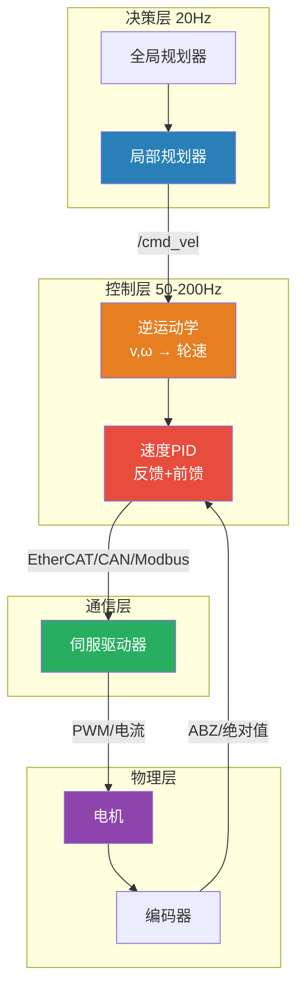
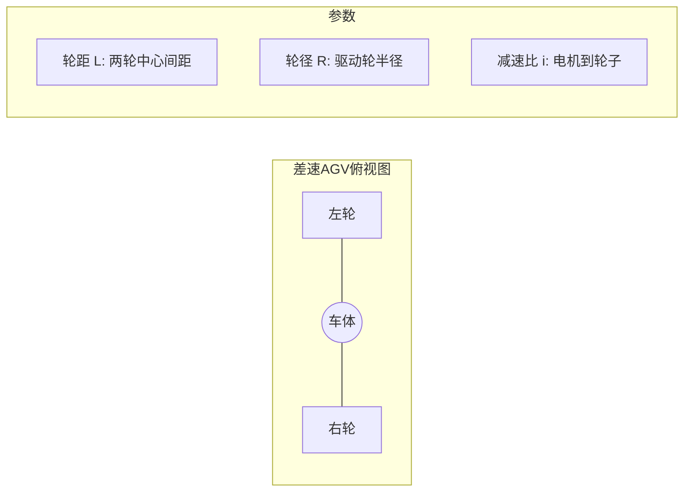
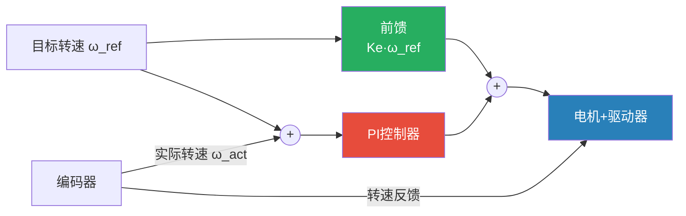
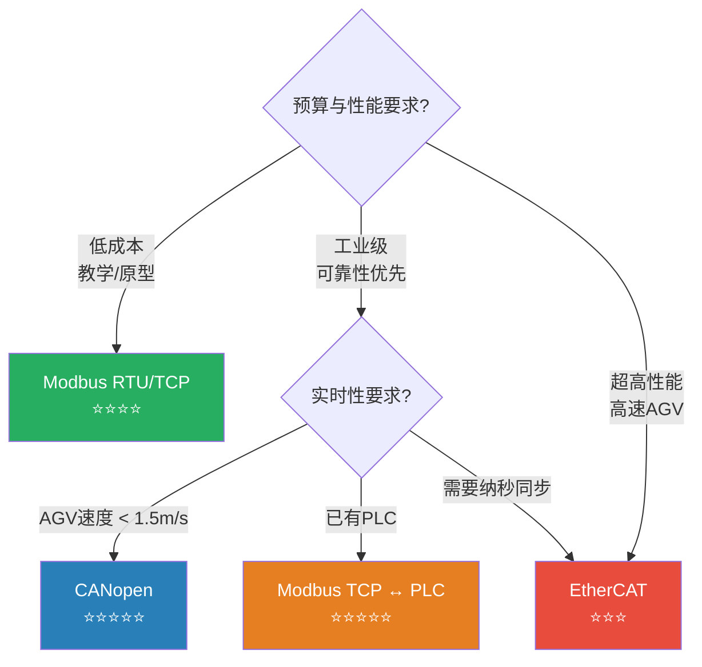
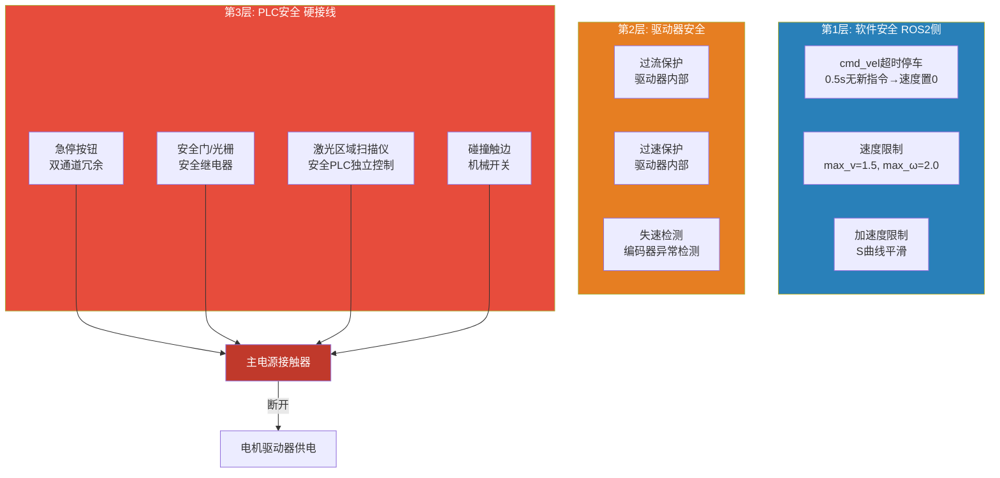

# AGV运动控制深度解析 —— 从cmd_vel到电机指令的完整链路

> ⚡ 这是你最熟悉的领域。如果你调过伺服、写过PLC运动控制程序、整定过PID三环——这篇文档将帮你把ROS2导航栈算出来的 `/cmd_vel`，精准高效地变成电机轴上的真实转动。从运动学到硬件通信，从PID整定到安全联锁，全链路打通。

---

## 目录

- [1. 运动控制在导航栈中的位置](#1-运动控制在导航栈中的位置)
  - [1.1 最后一公里的问题](#11-最后一公里的问题)
  - [1.2 输入什么、输出什么](#12-输入什么输出什么)
  - [1.3 你已有的技能直接可迁移](#13-你已有的技能直接可迁移)
- [2. 底盘运动学模型](#2-底盘运动学模型)
  - [2.1 差速轮：最经典的AGV底盘](#21-差速轮最经典的agv底盘)
  - [2.2 舵轮/汽车式：有转弯半径的约束](#22-舵轮汽车式有转弯半径的约束)
  - [2.3 麦克纳姆轮：全向移动的利器](#23-麦克纳姆轮全向移动的利器)
  - [2.4 四种底盘的选型对比](#24-四种底盘的选型对比)
- [3. 逆运动学：cmd_vel到轮速](#3-逆运动学cmd_vel到轮速)
  - [3.1 差速轮逆运动学](#31-差速轮逆运动学)
  - [3.2 舵轮逆运动学](#32-舵轮逆运动学)
  - [3.3 麦克纳姆轮逆运动学](#33-麦克纳姆轮逆运动学)
  - [3.4 速度平滑与限幅](#34-速度平滑与限幅)
- [4. 电机速度闭环控制](#4-电机速度闭环控制)
  - [4.1 速度环PID：你每天都在做的事](#41-速度环pid你每天都在做的事)
  - [4.2 前馈+反馈：提高跟踪精度](#42-前馈反馈提高跟踪精度)
  - [4.3 电流环：驱动器内部的事](#43-电流环驱动器内部的事)
  - [4.4 位置环：什么时候需要](#44-位置环什么时候需要)
  - [4.5 完整的级联控制架构](#45-完整的级联控制架构)
- [5. ROS2 ros2_control 框架实战](#5-ros2-ros2_control-框架实战)
  - [5.1 ros2_control 架构总览](#51-ros2_control-架构总览)
  - [5.2 硬件接口类型详解](#52-硬件接口类型详解)
  - [5.3 手写一个差速AGV的硬件接口](#53-手写一个差速agv的硬件接口)
  - [5.4 URDF 配置与控制器管理](#54-urdf-配置与控制器管理)
  - [5.5 ros2_control 完整启动文件](#55-ros2_control-完整启动文件)
- [6. 工业总线通信实战](#6-工业总线通信实战)
  - [6.1 CANopen：伺服驱动器的标准语言](#61-canopen伺服驱动器的标准语言)
  - [6.2 EtherCAT：高性能实时以太网](#62-ethercat高性能实时以太网)
  - [6.3 Modbus RTU/TCP：最简单的PLC对接](#63-modbus-rtutcp最简单的plc对接)
  - [6.4 脉冲+方向：步进电机的经典控制](#64-脉冲方向步进电机的经典控制)
  - [6.5 模拟量 ±10V：老派但可靠](#65-模拟量-10v老派但可靠)
  - [6.6 通信方案的选型决策](#66-通信方案的选型决策)
- [7. 里程计计算与发布](#7-里程计计算与发布)
  - [7.1 从编码器到里程计](#71-从编码器到里程计)
  - [7.2 里程计消息的标准格式](#72-里程计消息的标准格式)
  - [7.3 里程计的标定](#73-里程计的标定)
- [8. 调试与性能分析](#8-调试与性能分析)
  - [8.1 速度跟踪精度的测量](#81-速度跟踪精度的测量)
  - [8.2 通信延迟的量化](#82-通信延迟的量化)
  - [8.3 常见故障排查](#83-常见故障排查)
- [9. 安全架构设计](#9-安全架构设计)
  - [9.1 安全层级划分](#91-安全层级划分)
  - [9.2 PLC安全逻辑实现](#92-plc安全逻辑实现)
  - [9.3 功能安全认证要点](#93-功能安全认证要点)

---

## 1. 运动控制在导航栈中的位置

### 1.1 最后一公里的问题

导航栈算出了完美的路径、局部规划器给出了最优的速度指令——但如果电机执行不到位，前面所有的算法都是纸上谈兵。



> 🔑 **一句话总结**：运动控制 = 导航的"手和脚"。算得好没用，执行得准才算数。

### 1.2 输入什么、输出什么

```
输入端:
  /cmd_vel (geometry_msgs/Twist)
    ├── linear.x:  目标线速度 (m/s),    范围 ±1.5
    ├── linear.y:  横向速度 (m/s),      差速轮=0, 麦克纳姆轮用
    ├── linear.z:  垂直速度 (m/s),      AGV不用
    ├── angular.x: 横滚角速度 (rad/s),  AGV不用
    ├── angular.y: 俯仰角速度 (rad/s),  AGV不用
    └── angular.z: 偏航角速度 (rad/s),  范围 ±2.0
    更新频率: 10-50Hz (取决于局部规划器)

输出端:
  电机实际运动:
    ├── 速度模式: 目标转速 (rpm) → 驱动器速度环
    ├── 位置模式: 目标位置 (脉冲) → 驱动器位置环
    ├── 力矩模式: 目标电流 (A) → 驱动器力矩环
    └── 直接PWM: 占空比 (%) → H桥/MOSFET
```

### 1.3 你已有的技能直接可迁移

| 你会的 | 在AGV运动控制中的对应 |
|:---|:---|
| 伺服驱动器参数配置（汇川/台达/西门子） | 配置速度环/位置环PI参数 |
| PLC运动控制指令（MC_MoveVelocity等） | ros2_control 控制器切换 |
| 绝对值/增量编码器接线与信号处理 | 里程计数据采集与滤波 |
| 电机选型（功率/扭矩/惯量匹配） | AGV驱动电机+减速机选型 |
| EMC/接地/屏蔽 | AGV电气柜布线（电机线对编码器的干扰） |
| 安全继电器回路/急停 | AGV安全PLC架构 |
| 变频器参数调试 | 直流无刷驱动器参数配置 |

> 💡 **你不需要从头学**：过去你用PLC的 AO 模块输出 ±10V 控制伺服转速，现在换成了 ROS2 → CANopen → 驱动器——信号路径变了，但速度环PI的本质没变。

---

## 2. 底盘运动学模型

### 2.1 差速轮：最经典的AGV底盘

**结构**：两个独立驱动的主动轮 + 若干从动万向轮。



**正运动学（轮速 → 车体速度）**：

$$
\boxed{
\begin{bmatrix} v \\ \omega \end{bmatrix} =
\begin{bmatrix} \frac{R}{2} & \frac{R}{2} \\[4pt] \frac{R}{L} & -\frac{R}{L} \end{bmatrix}
\begin{bmatrix} \omega_L \\ \omega_R \end{bmatrix}
}
$$

展开：

$$
v = \frac{R}{2}(\omega_L + \omega_R), \quad \omega = \frac{R}{L}(\omega_L - \omega_R)
$$

**直觉**：
- $\omega_L = \omega_R$ → 直线运动（$\omega = 0$）
- $\omega_L = -\omega_R$ → 原地旋转（$v = 0$）
- $\omega_L \neq \omega_R$ → 圆弧运动

**逆运动学（车体速度 → 轮速）**：

$$
\boxed{
\begin{bmatrix} \omega_L \\ \omega_R \end{bmatrix} =
\frac{1}{R}
\begin{bmatrix} 1 & \frac{L}{2} \\[4pt] 1 & -\frac{L}{2} \end{bmatrix}
\begin{bmatrix} v \\ \omega \end{bmatrix}
}
$$

### 2.2 舵轮/汽车式：有转弯半径的约束

**结构**：一个（或多个）可转向的驱动轮 + 固定从动轮。

```
      前端
   ←── ◯ ──→  转向驱动轮（舵轮）
        |
  [──── ────] 车身
        |
    ◯   ◯     固定从动轮
```

**运动学模型（自行车模型，Bicycle Model）**：

$$
\begin{aligned}
\dot{x} &= v \cos(\theta + \delta) \\
\dot{y} &= v \sin(\theta + \delta) \\
\dot{\theta} &= \frac{v}{L} \sin\delta
\end{aligned}
$$

其中 $\delta$ 是前轮转向角，$L$ 是轴距。

**最小转弯半径**：

$$
\boxed{R_{\min} = \frac{L}{\tan\delta_{\max}}}
$$

例如：$L = 0.8\text{m}$，$\delta_{\max} = 35°$，则 $R_{\min} = 0.8 / \tan 35° \approx 1.14\text{m}$。

> ⚠️ **关键约束**：舵轮AGV不能原地旋转！这意味着DWA等局部规划器必须配置最小转弯半径。Nav2 TEB通过 `min_turning_radius` 参数处理此约束。

**逆运动学（舵轮）**：

转向角：$\delta = \arctan\left(\frac{L \cdot \omega}{v}\right)$（当 $v > 0$）

驱动轮转速：$\omega_{\text{wheel}} = \frac{v}{R \cdot \cos\delta}$

### 2.3 麦克纳姆轮：全向移动的利器

**结构**：四个独立驱动的麦克纳姆轮（轮缘有小滚子，呈45°排列）。

```
前视图:
  ◯ ───────── ◯    轮1(左前) 轮2(右前)
  │           │    滚子方向: \  /
  │    AGV    │
  │           │    滚子方向: /  \
  ◯ ───────── ◯    轮4(左后) 轮3(右后)
```

**逆运动学（标准四轮麦克纳姆）**：

$$
\boxed{
\begin{bmatrix} \omega_1 \\ \omega_2 \\ \omega_3 \\ \omega_4 \end{bmatrix} =
\frac{1}{R}
\begin{bmatrix}
1 & -1 & -(L_x + L_y) \\
1 & 1 & (L_x + L_y) \\
1 & 1 & -(L_x + L_y) \\
1 & -1 & (L_x + L_y)
\end{bmatrix}
\begin{bmatrix} v_x \\ v_y \\ \omega \end{bmatrix}
}
$$

其中 $L_x$ 是轮子到中心的半宽，$L_y$ 是半长。

> 🎯 **优势**：可以同时做纵向、横向和旋转运动——真正的全向移动。但代价是驱动轮×4、控制更复杂、对地面平整度更敏感。

### 2.4 四种底盘的选型对比

| | 差速轮 | 舵轮 | 麦克纳姆轮 | 履带式 |
|:---|:---|:---|:---|:---|
| **电机数量** | 2 | 1-2 驱动 + 1-2 转向 | 4 | 2 |
| **控制复杂度** | ⭐⭐ 低 | ⭐⭐⭐ 中 | ⭐⭐⭐⭐ 高 | ⭐⭐ 低 |
| **运动能力** | 前进+原地旋转 | 类似汽车 | **全向移动** | 前进+差速转弯 |
| **地面要求** | 一般 | 一般 | **高**（需平整） | 低（可越野） |
| **定位精度** | ⭐⭐⭐ 好 | ⭐⭐⭐⭐ 很好 | ⭐⭐⭐ 好 | ⭐⭐ 打滑严重 |
| **负载能力** | ⭐⭐⭐ | ⭐⭐⭐⭐ | ⭐⭐⭐ | ⭐⭐⭐⭐⭐ |
| **成本** | ¥2000-5000 | ¥5000-15000 | ¥8000-20000 | ¥3000-8000 |
| **推荐场景** | ✅ 室内仓储 | 重载/高速 | 精密对接 | 户外/粗糙地面 |

> 🏭 **产线建议**：90% 的室内AGV用**差速轮**就够了。差速轮 = 最简单的机械结构 + 最成熟的控制算法 + 最低成本。

---

## 3. 逆运动学：cmd_vel到轮速

### 3.1 差速轮逆运动学

这是你写控制器时的核心代码：

```python
#!/usr/bin/env python3
"""
差速轮逆运动学模块
输入: (v_body, omega_body) — 车体坐标系下的目标速度
输出: (left_rpm, right_rpm) — 左右轮目标转速
"""

import numpy as np


class DifferentialDriveKinematics:
    """
    差速轮运动学
    
    参数:
        wheel_radius:   轮子半径 (m)
        wheel_base:     轮距 (m)，两驱动轮中心之间的距离
        gear_ratio:     减速比 (电机轴转速 / 轮子转速)
    """
    
    def __init__(self, wheel_radius=0.075, wheel_base=0.50, gear_ratio=20.0):
        self.R = wheel_radius      # 轮径 75mm
        self.L = wheel_base        # 轮距 500mm
        self.i = gear_ratio        # 减速比 20:1
        
        # 预计算逆运动学矩阵
        # [ωL]   1  [ 1   L/2 ] [v  ]
        # [ωR] = ─ [ 1  -L/2 ] [ω  ]
        #         R
        self.inv_kinematics = (1.0 / self.R) * np.array([
            [1.0,  self.L / 2.0],
            [1.0, -self.L / 2.0]
        ])
    
    def cmd_vel_to_wheel_speed(self, v, omega):
        """
        车体速度 → 轮子角速度 (rad/s)
        
        参数:
            v:     目标线速度 (m/s)
            omega: 目标角速度 (rad/s)
        
        返回:
            (omega_L, omega_R): 左右轮角速度 (rad/s)
        """
        wheel_omega = self.inv_kinematics @ np.array([v, omega])
        return wheel_omega[0], wheel_omega[1]
    
    def cmd_vel_to_motor_rpm(self, v, omega):
        """
        车体速度 → 电机转速 (rpm)
        """
        omega_L, omega_R = self.cmd_vel_to_wheel_speed(v, omega)
        
        # 电机转速 = 轮子角速度 × 减速比 × (60 / 2π)
        motor_rpm_L = omega_L * self.i * 60.0 / (2.0 * np.pi)
        motor_rpm_R = omega_R * self.i * 60.0 / (2.0 * np.pi)
        
        return motor_rpm_L, motor_rpm_R
    
    def cmd_vel_to_motor_angular(self, v, omega):
        """
        车体速度 → 电机角速度 (rad/s) — 用于ros2_control VelocityInterface
        """
        omega_L, omega_R = self.cmd_vel_to_wheel_speed(v, omega)
        return omega_L * self.i, omega_R * self.i
    
    def wheel_speed_to_cmd_vel(self, omega_L, omega_R):
        """
        轮子角速度 → 车体速度（正运动学，用于里程计计算）
        """
        v = self.R / 2.0 * (omega_L + omega_R)
        omega = self.R / self.L * (omega_L - omega_R)
        return v, omega


# ============================================================
#  使用示例
# ============================================================
if __name__ == '__main__':
    kinematics = DifferentialDriveKinematics(
        wheel_radius=0.075,   # 75mm 轮径
        wheel_base=0.50,      # 500mm 轮距
        gear_ratio=20.0       # 20:1 减速比
    )
    
    # ROS2 cmd_vel 典型输入
    v, omega = 1.0, 0.5  # 1m/s 前进, 0.5rad/s 左转
    
    rpm_L, rpm_R = kinematics.cmd_vel_to_motor_rpm(v, omega)
    print(f"目标线速度: {v} m/s, 目标角速度: {omega} rad/s")
    print(f"左轮电机目标转速: {rpm_L:.0f} rpm")
    print(f"右轮电机目标转速: {rpm_R:.0f} rpm")
    # 输出:
    # 目标线速度: 1.0 m/s, 目标角速度: 0.5 rad/s
    # 左轮电机目标转速: 2912 rpm
    # 右轮电机目标转速: 2184 rpm
    
    # 验证：逆运动学 → 正运动学 是否一致
    omega_L, omega_R = kinematics.cmd_vel_to_wheel_speed(v, omega)
    v_back, omega_back = kinematics.wheel_speed_to_cmd_vel(omega_L, omega_R)
    print(f"验证: v={v_back:.4f}, omega={omega_back:.4f}")
    # 输出: 验证: v=1.0000, omega=0.5000 ✓
```

### 3.2 舵轮逆运动学

```python
class SteeringDriveKinematics:
    """
    舵轮（自行车模型）运动学
    
    参数:
        wheel_radius: 轮子半径 (m)
        wheel_base:   轴距 (m)
        max_steer_angle: 最大转向角 (rad)
    """
    
    def __init__(self, wheel_radius=0.10, wheel_base=0.80,
                 max_steer_angle=np.deg2rad(35)):
        self.R = wheel_radius
        self.L = wheel_base
        self.max_steer = max_steer_angle
        self.gear_ratio = 1.0
    
    def cmd_vel_to_steering(self, v, omega):
        """
        车体速度 → 转向角 + 驱动转速
        
        返回:
            steer_angle: 转向角 (rad), 左转为正
            wheel_rpm:   驱动轮转速 (rpm)
        """
        if abs(v) < 1e-6:
            # 原地转向（车不动，只转轮子）——汽车式做不到
            # 实际需要先有速度才能转向
            return 0.0, 0.0
        
        # 转向角 = arctan(L * ω / v)
        steer_angle = np.arctan(self.L * omega / v)
        
        # 限幅
        steer_angle = np.clip(steer_angle, -self.max_steer, self.max_steer)
        
        # 驱动轮沿前进方向的速度 = v / cos(steer_angle)
        wheel_v = v / np.cos(steer_angle)
        wheel_rpm = wheel_v / self.R * 60.0 / (2.0 * np.pi) * self.gear_ratio
        
        return steer_angle, wheel_rpm
```

### 3.3 麦克纳姆轮逆运动学

```python
class MecanumDriveKinematics:
    """
    四轮麦克纳姆轮运动学
    
    轮编号:
        前左=1, 前右=2, 后右=3, 后左=4
    
    参数:
        wheel_radius: 轮子半径 (m)
        lx: 轮子到中心 X 方向距离 (m)
        ly: 轮子到中心 Y 方向距离 (m)
    """
    
    def __init__(self, wheel_radius=0.05, lx=0.25, ly=0.35):
        self.R = wheel_radius
        self.lx = lx
        self.ly = ly
        self.l_sum = lx + ly
        
        # 预计算逆运动学矩阵
        # [ω1]        [ 1  -1  -l_sum ] [vx]
        # [ω2] = 1/R  [ 1   1   l_sum ] [vy]
        # [ω3]        [ 1   1  -l_sum ] [ω ]
        # [ω4]        [ 1  -1   l_sum ]
        self.inv_kinematics = (1.0 / self.R) * np.array([
            [1.0, -1.0, -self.l_sum],
            [1.0,  1.0,  self.l_sum],
            [1.0,  1.0, -self.l_sum],
            [1.0, -1.0,  self.l_sum]
        ])
    
    def cmd_vel_to_wheel_speeds(self, vx, vy, omega):
        """
        车体速度 → 四个轮子的角速度 (rad/s)
        """
        return self.inv_kinematics @ np.array([vx, vy, omega])
```

### 3.4 速度平滑与限幅

局部规划器的输出可能"跳跃"——上一帧 `v=0.5`，下一帧 `v=1.2`。直接发给电机会造成冲击。

```python
class VelocitySmoother:
    """
    速度平滑器：对cmd_vel做加速度限制和急动度限制
    
    类比: 伺服驱动器的 S 曲线加减速
    """
    
    def __init__(self, max_acc=0.5, max_decel=0.8, max_jerk=2.0, dt=0.05):
        """
        参数:
            max_acc:   最大线加速度 (m/s²)
            max_decel: 最大线减速度 (m/s²)
            max_jerk:  最大急动度 (m/s³)
            dt:        控制周期 (s)
        """
        self.max_acc = max_acc
        self.max_decel = max_decel
        self.max_jerk = max_jerk
        self.dt = dt
        
        self.current_v = 0.0
        self.current_omega = 0.0
        self.current_acc = 0.0
    
    def smooth(self, target_v, target_omega):
        """
        平滑目标速度
        
        返回:
            (smoothed_v, smoothed_omega): 平滑后的速度指令
        """
        # --- 线速度平滑 ---
        v_error = target_v - self.current_v
        desired_acc = v_error / self.dt
        
        # 加速度限幅
        if target_v >= 0 and self.current_v >= 0:
            acc_limit = self.max_acc if v_error >= 0 else -self.max_decel
        else:
            acc_limit = self.max_acc
        
        desired_acc = np.clip(desired_acc, -abs(acc_limit), abs(acc_limit))
        
        # 急动度限幅
        acc_change = desired_acc - self.current_acc
        acc_change = np.clip(acc_change, -self.max_jerk * self.dt, 
                             self.max_jerk * self.dt)
        actual_acc = self.current_acc + acc_change
        
        self.current_v += actual_acc * self.dt
        self.current_acc = actual_acc
        
        # --- 角速度平滑（同样的逻辑） ---
        omega_error = target_omega - self.current_omega
        desired_alpha = omega_error / self.dt
        desired_alpha = np.clip(desired_alpha, -2.0, 2.0)  # 角加速度限幅
        self.current_omega += desired_alpha * self.dt
        
        return self.current_v, self.current_omega
```

> 🔧 **类比**：这个 VelocitySmoother 就是伺服驱动器中 **S曲线加减速** 的实现——限制加速度（加加速度）以确保运动平滑、减少机械冲击。

---

## 4. 电机速度闭环控制

### 4.1 速度环PID：你每天都在做的事

ROS2给出来的是**目标速度**（m/s），你需要确保轮子**实际转速**跟上目标。

```python
class MotorVelocityPID:
    """
    电机速度环 PID 控制器
    
    这是你最熟悉的控制结构——
    和你调伺服驱动器速度环时用的是完全一样的算法
    
    离散形式（位置式PID）:
        u(k) = Kp·e(k) + Ki·Σe(k)·dt + Kd·(e(k)-e(k-1))/dt
    
    递推形式（增量式PID，推荐用于嵌入式）:
        Δu(k) = Kp·[e(k)-e(k-1)] + Ki·e(k)·dt + Kd·[e(k)-2e(k-1)+e(k-2)]/dt
    """
    
    def __init__(self, kp=0.5, ki=0.1, kd=0.01, 
                 output_min=-1000, output_max=1000, dt=0.01):
        """
        参数:
            kp, ki, kd:   PID 增益
            output_min/max: 输出限幅（如 PWM 占空比 ±1000‰）
            dt:          采样周期 (s)
        """
        self.kp = kp
        self.ki = ki
        self.kd = kd
        self.output_min = output_min
        self.output_max = output_max
        self.dt = dt
        
        # 状态
        self.integral = 0.0
        self.prev_error = 0.0
        self.prev_prev_error = 0.0
        
        # 积分分离阈值
        self.integral_separation_threshold = 0.3  # 误差>30%时积分分离
    
    def update(self, target_rpm, actual_rpm):
        """
        计算控制输出
        
        参数:
            target_rpm: 目标转速 (rpm)
            actual_rpm: 实际转速 (rpm) — 来自编码器
        
        返回:
            output: 控制输出（如 PWM 占空比或模拟量值）
        """
        error = target_rpm - actual_rpm
        
        # 比例项
        p_term = self.kp * error
        
        # 积分项（带积分分离 + 积分限幅）
        if abs(error) < self.integral_separation_threshold * abs(target_rpm):
            self.integral += error * self.dt
            # 积分限幅
            self.integral = np.clip(
                self.integral, 
                self.output_min / (self.ki + 1e-9),
                self.output_max / (self.ki + 1e-9)
            )
        else:
            self.integral *= 0.9  # 积分泄漏（缓慢清空）
        
        i_term = self.ki * self.integral
        
        # 微分项（用前一周期误差，减少噪声放大）
        d_term = self.kd * (error - self.prev_error) / self.dt
        
        # 总输出
        output = p_term + i_term + d_term
        
        # 输出限幅
        output = np.clip(output, self.output_min, self.output_max)
        
        # 更新历史
        self.prev_prev_error = self.prev_error
        self.prev_error = error
        
        return output
    
    def reset(self):
        """重置PID状态（停车后重新启动前调用）"""
        self.integral = 0.0
        self.prev_error = 0.0
        self.prev_prev_error = 0.0
```

#### 速度环PID的整定方法（与伺服调参一致）

```python
def auto_tune_velocity_pid(motor_driver, encoder, test_signal='step'):
    """
    速度环PID自动整定
    
    方法1——阶跃响应法（Ziegler-Nichols）:
        1. Ki=0, Kd=0, 逐步增大Kp直到振荡
        2. 记录临界增益 Ku 和振荡周期 Tu
        3. Kp=0.6Ku, Ki=1.2Ku/Tu, Kd=0.075Ku*Tu
    
    方法2——继电反馈法（更安全，不会飞车）:
        输出在 ±h 之间切换，测量极限环的幅值和周期
    """
    pass  # 实现略——和你调伺服时用的方法完全一样
```

> 🎯 **经验值**：AGV直流无刷电机（带减速机）速度环PI参数的经验值：
> - Kp: 0.3 - 1.5（取决于惯量）
> - Ki: 0.05 - 0.3（消除稳态误差）
> - Kd: 0（速度环一般不需要微分项）

### 4.2 前馈+反馈：提高跟踪精度

纯反馈控制总有滞后——PID是先看到误差才纠正。加上**前馈**，可以根据目标速度直接计算输出：

```python
class MotorVelocityControllerFF:
    """
    前馈 + 反馈 速度控制器
    
    前馈基于电机模型: V = Ke·ω + I·R
    反馈用PI纠正模型误差和干扰
    """
    
    def __init__(self, kp=0.3, ki=0.1, 
                 ke=0.05,    # 反电动势常数 (V/rpm)
                 r=1.0,      # 绕组电阻 (Ω)
                 dt=0.01):
        self.pid = MotorVelocityPID(kp=kp, ki=ki, kd=0.0, dt=dt)
        self.ke = ke  # 反电动势常数
        self.r = r    # 电阻
    
    def update(self, target_rpm, actual_rpm, load_current=0.0):
        """
        前馈 + 反馈控制
        
        前馈项: 根据目标转速预估所需电压
        反馈项: PI纠正偏差
        """
        # 前馈: V_ff = Ke * ω_target + I_load * R
        ff_output = self.ke * target_rpm + load_current * self.r
        
        # 反馈: PI纠正剩余偏差
        fb_output = self.pid.update(target_rpm, actual_rpm)
        
        return ff_output + fb_output
```



> 🔧 **与伺服驱动的类比**：前馈就是你调伺服时的**速度前馈**（Velocity Feedforward, VFF）——在速度模式下，将加速度折算为力矩前馈加到电流环输入端。这里的前馈是反电动势补偿——最简单的电机模型。

### 4.3 电流环：驱动器内部的事

对于AGV，**电流环（力矩环）通常在伺服驱动器内部完成**，你不需要自己实现。但你需要理解它如何影响运动控制：

| 环 | 频率 | 你在哪里接触 | 在AGV中的角色 |
|:---|:---|:---|:---|
| **电流环** | 10-50kHz | 驱动器内部 | 你只需设定电流限制（驱动器参数） |
| **速度环** | 1-5kHz | 驱动器内部 **或** 你的ROS2节点 | 这是你的主战场 |
| **位置环** | 100-1000Hz | 驱动器内部 **或** 你的ROS2节点 | AGV一般不需要 |

**你需要在驱动器上配置的关键参数**：

```
汇川SV660N / 台达ASDA-A2 等常见驱动器的参数:

P2-00: 速度环比例增益     — 直接影响速度跟踪
P2-02: 速度环积分时间     — 消除稳态误差
P2-04: 速度前馈增益       — 响应速度
P2-15: 速度检测滤波器     — 平滑编码器信号
P2-17: 转矩限制           — 保护电机和机械
P1-01: 控制模式           — 0=位置, 1=速度, 2=力矩
P1-44: 电子齿轮比分子     — 脉冲当量
P1-45: 电子齿轮比分母
```

### 4.4 位置环：什么时候需要

大多数AGV导航场景下**不需要位置环**——速度控制足够。但以下场景需要：

- **高精度对接**（±2mm以内）：如与传送带/料架的精确对接
- **舵轮转向角度控制**：转向角需要精确的位置控制
- **举升/下降机构**：叉车式AGV的货叉位置

```python
class CascadedPositionVelocityController:
    """
    位置-速度级联控制
    
    外环(位置环) → 输出目标速度
    内环(速度环) → 输出电机驱动信号
    """
    
    def __init__(self, pos_kp=2.0, pos_ki=0.5, pos_kd=0.0,
                 vel_kp=0.5, vel_ki=0.1, dt=0.01):
        self.pos_pid = MotorVelocityPID(
            kp=pos_kp, ki=pos_ki, kd=pos_kd, 
            output_min=-1.5, output_max=1.5,  # 输出目标速度 m/s
            dt=dt
        )
        self.vel_pid = MotorVelocityPID(
            kp=vel_kp, ki=vel_ki, kd=0.0, dt=dt
        )
    
    def update(self, target_pos, actual_pos, actual_vel):
        """
        位置环 → 速度环 → 电机输出
        
        参数:
            target_pos: 目标位置 (编码器计数或mm)
            actual_pos: 实际位置
            actual_vel: 实际速度
        
        返回:
            电机驱动信号
        """
        # 外环: 位置 → 目标速度
        target_vel = self.pos_pid.update(target_pos, actual_pos)
        
        # 内环: 速度 → 电机输出
        motor_output = self.vel_pid.update(target_vel, actual_vel)
        
        return motor_output, target_vel
```

> 🔧 **这就是你熟悉的伺服三环控制：位置环（最外层） → 速度环（中间层） → 电流环（最内层）。**

### 4.5 完整的级联控制架构

```mermaid
graph TD
    CMD[/cmd_vel<br/>v_ref, ω_ref<br/>20Hz] --> SMOOTH[速度平滑器<br/>S曲线加减速]
    SMOOTH --> IK[逆运动学<br/>v,ω → ω_L, ω_R]
    IK --> PID_L[速度PID<br/>左轮]
    IK --> PID_R[速度PID<br/>右轮]
    
    PID_L -->|目标电流/力矩| DRV_L[左驱动器<br/>电流环 50kHz]
    PID_R -->|目标电流/力矩| DRV_R[右驱动器<br/>电流环 50kHz]
    
    DRV_L --> MOTOR_L[左电机]
    DRV_R --> MOTOR_R[右电机]
    
    MOTOR_L --> ENC_L[左编码器]
    MOTOR_R --> ENC_R[右编码器]
    
    ENC_L -->|转速反馈| PID_L
    ENC_R -->|转速反馈| PID_R
    
    ENC_L --> ODOM[里程计计算]
    ENC_R --> ODOM
    ODOM -->|/odom| NAV[导航栈]
    
    style CMD fill:#2980b9,color:#fff
    style IK fill:#e67e22,color:#fff
    style PID_L fill:#e74c3c,color:#fff
    style DRV_L fill:#27ae60,color:#fff
    style MOTOR_L fill:#8e44ad,color:#fff
```

---

## 5. ROS2 ros2_control 框架实战

### 5.1 ros2_control 架构总览

`ros2_control` 是 ROS2 中连接"算法"和"硬件"的标准框架：

```mermaid
graph TD
    subgraph 算法层 ROS2
        NAV[导航栈<br/>/cmd_vel] --> CB[DifferentialDriveController<br/>差速驱动控制器]
    end
    
    subgraph ros2_control 框架
        CM[Controller Manager<br/>控制器管理器] --> CB
        CB -->|VelocityCommand| HI[硬件接口<br/>Hardware Interface]
        RM[Resource Manager<br/>资源管理器] --> HI
    end
    
    subgraph 硬件抽象层
        HI -->|write()| COMM[通信驱动<br/>CAN/EtherCAT/串口]
        COMM --> HW[物理硬件<br/>电机驱动器]
        HW -->|read()| COMM
        COMM -->|编码器/状态| HI
    end
    
    style CB fill:#e74c3c,color:#fff
    style HI fill:#e67e22,color:#fff
    style HW fill:#27ae60,color:#fff
```

### 5.2 硬件接口类型详解

ros2_control 定义了多种标准硬件接口（Hardware Interface），你在实现硬件驱动时声明你的设备支持哪些：

| 接口类型 | 命令含义 | 状态含义 | 使用场景 |
|:---|:---|:---|:---|
| `velocity` | 目标角速度 (rad/s) | 实际角速度 (rad/s) | ✅ AGV速度模式（最常用） |
| `position` | 目标位置 (rad) | 实际位置 (rad) | 舵轮转向、举升机构 |
| `effort` | 目标力矩/电流 (Nm/A) | 实际力矩/电流 | 力矩控制、力反馈 |
| `gpio` | 数字输出 | 数字输入 | 急停、使能、限位开关 |

对于差速AGV，最常用的是 **velocity** 接口——控制器发目标转速，驱动器自己闭环。

### 5.3 手写一个差速AGV的硬件接口

以下是一个完整的 ros2_control 硬件接口实现，通过 Modbus RTU 控制两个伺服驱动器：

```cpp
// diff_drive_agv_hardware.hpp
#ifndef DIFF_DRIVE_AGV_HARDWARE_HPP_
#define DIFF_DRIVE_AGV_HARDWARE_HPP_

#include "hardware_interface/system_interface.hpp"
#include "hardware_interface/handle.hpp"
#include "hardware_interface/hardware_info.hpp"
#include "hardware_interface/types/hardware_interface_return_values.hpp"
#include "rclcpp/rclcpp.hpp"

#include <modbus/modbus.h>  // libmodbus
#include <vector>
#include <string>

namespace diff_drive_agv {

class DiffDriveAGVHardware : public hardware_interface::SystemInterface {
public:
    // ========== 生命周期 ==========
    hardware_interface::CallbackReturn on_init(
        const hardware_interface::HardwareInfo& info) override;
    
    hardware_interface::CallbackReturn on_configure(
        const rclcpp_lifecycle::State& previous_state) override;
    
    hardware_interface::CallbackReturn on_activate(
        const rclcpp_lifecycle::State& previous_state) override;
    
    hardware_interface::CallbackReturn on_deactivate(
        const rclcpp_lifecycle::State& previous_state) override;
    
    // ========== 数据导出/导入（声明接口） ==========
    std::vector<hardware_interface::StateInterface> export_state_interfaces() override;
    std::vector<hardware_interface::CommandInterface> export_command_interfaces() override;
    
    // ========== 核心循环 ==========
    hardware_interface::return_type read(
        const rclcpp::Time& time, const rclcpp::Duration& period) override;
    
    hardware_interface::return_type write(
        const rclcpp::Time& time, const rclcpp::Duration& period) override;

private:
    // Modbus 上下文
    modbus_t* modbus_ctx_;
    
    // 硬件状态（从驱动器读取）
    struct {
        double left_velocity;    // 左轮角速度 (rad/s)
        double right_velocity;   // 右轮角速度 (rad/s)
        double left_position;    // 左轮位置 (rad)
        double right_position;   // 右轮位置 (rad)
        int16_t left_current;    // 左电机电流 (0.01A)
        int16_t right_current;   // 右电机电流 (0.01A)
        uint16_t left_status;    // 左驱动器状态字
        uint16_t right_status;   // 右驱动器状态字
    } hw_state_;
    
    // 硬件命令（发送到驱动器）
    struct {
        double left_velocity;    // 左轮目标角速度 (rad/s)
        double right_velocity;   // 右轮目标角速度 (rad/s)
    } hw_command_;
    
    // 通信配置
    std::string modbus_port_;       // "/dev/ttyUSB0"
    int modbus_baudrate_;           // 115200
    int left_drive_id_;             // Modbus 从站地址
    int right_drive_id_;
    int gear_ratio_;                // 减速比
    int encoder_resolution_;        // 编码器线数
    
    // 物理参数
    double wheel_radius_;           // 轮径 (m)
    
    // 辅助函数
    bool read_drive_registers(int drive_id, uint16_t start_addr, 
                              int num_regs, uint16_t* dest);
    bool write_drive_register(int drive_id, uint16_t addr, uint16_t value);
    bool write_drive_registers(int drive_id, uint16_t start_addr,
                               int num_regs, const uint16_t* src);
};

}  // namespace diff_drive_agv

#endif  // DIFF_DRIVE_AGV_HARDWARE_HPP_
```

```cpp
// diff_drive_agv_hardware.cpp (核心实现)
#include "diff_drive_agv_hardware.hpp"

namespace diff_drive_agv {

hardware_interface::CallbackReturn DiffDriveAGVHardware::on_init(
    const hardware_interface::HardwareInfo& info)
{
    if (hardware_interface::SystemInterface::on_init(info) !=
        hardware_interface::CallbackReturn::SUCCESS) {
        return hardware_interface::CallbackReturn::ERROR;
    }
    
    // 从 URDF/参数读取配置
    modbus_port_ = info_.hardware_parameters["modbus_port"];
    modbus_baudrate_ = std::stoi(info_.hardware_parameters["modbus_baudrate"]);
    left_drive_id_ = std::stoi(info_.hardware_parameters["left_drive_id"]);
    right_drive_id_ = std::stoi(info_.hardware_parameters["right_drive_id"]);
    gear_ratio_ = std::stoi(info_.hardware_parameters["gear_ratio"]);
    encoder_resolution_ = std::stoi(
        info_.hardware_parameters["encoder_resolution"]);
    wheel_radius_ = std::stod(info_.hardware_parameters["wheel_radius"]);
    
    // 初始化状态和命令
    hw_state_ = {};
    hw_command_ = {};
    
    RCLCPP_INFO(rclcpp::get_logger("DiffDriveAGVHardware"),
                "硬件接口初始化完成 (port=%s)", modbus_port_.c_str());
    return hardware_interface::CallbackReturn::SUCCESS;
}

hardware_interface::CallbackReturn DiffDriveAGVHardware::on_configure(
    const rclcpp_lifecycle::State& /*previous_state*/)
{
    // 打开 Modbus 连接
    modbus_ctx_ = modbus_new_rtu(
        modbus_port_.c_str(), modbus_baudrate_, 'N', 8, 1);
    
    if (modbus_ctx_ == nullptr) {
        RCLCPP_ERROR(rclcpp::get_logger("DiffDriveAGVHardware"),
                     "无法创建 Modbus 上下文");
        return hardware_interface::CallbackReturn::ERROR;
    }
    
    // 设置 Modbus 超时
    modbus_set_response_timeout(modbus_ctx_, 0, 50000);  // 50ms
    modbus_set_error_recovery(modbus_ctx_, 
        MODBUS_ERROR_RECOVERY_LINK | MODBUS_ERROR_RECOVERY_PROTOCOL);
    
    if (modbus_connect(modbus_ctx_) == -1) {
        RCLCPP_ERROR(rclcpp::get_logger("DiffDriveAGVHardware"),
                     "Modbus 连接失败: %s", modbus_strerror(errno));
        modbus_free(modbus_ctx_);
        return hardware_interface::CallbackReturn::ERROR;
    }
    
    RCLCPP_INFO(rclcpp::get_logger("DiffDriveAGVHardware"),
                "Modbus 已连接 (%s, %d bps)", 
                modbus_port_.c_str(), modbus_baudrate_);
    
    return hardware_interface::CallbackReturn::SUCCESS;
}

hardware_interface::CallbackReturn DiffDriveAGVHardware::on_activate(
    const rclcpp_lifecycle::State& /*previous_state*/)
{
    // 使能两个驱动器
    // 写控制字: 0x0001 = 使能, 先写0x0006再写0x0007再写0x000F
    uint16_t enable_sequence[] = {0x0006, 0x0007, 0x000F};
    for (auto cmd : enable_sequence) {
        write_drive_register(left_drive_id_, 0x6040, cmd);   // 控制字
        write_drive_register(right_drive_id_, 0x6040, cmd);
        usleep(50000);  // 等50ms让驱动器状态机转换
    }
    
    RCLCPP_INFO(rclcpp::get_logger("DiffDriveAGVHardware"), "驱动器已使能");
    return hardware_interface::CallbackReturn::SUCCESS;
}

hardware_interface::CallbackReturn DiffDriveAGVHardware::on_deactivate(
    const rclcpp_lifecycle::State& /*previous_state*/)
{
    // 急停: 控制字写0x0000(快速停机)
    write_drive_register(left_drive_id_, 0x6040, 0x0000);
    write_drive_register(right_drive_id_, 0x6040, 0x0000);
    
    RCLCPP_INFO(rclcpp::get_logger("DiffDriveAGVHardware"), "驱动器已停止");
    return hardware_interface::CallbackReturn::SUCCESS;
}

std::vector<hardware_interface::StateInterface>
DiffDriveAGVHardware::export_state_interfaces()
{
    std::vector<hardware_interface::StateInterface> state_interfaces;
    
    // 声明两个关节的状态接口（velocity）
    state_interfaces.emplace_back(
        hardware_interface::StateInterface(
            "left_wheel_joint", "velocity", &hw_state_.left_velocity));
    state_interfaces.emplace_back(
        hardware_interface::StateInterface(
            "right_wheel_joint", "velocity", &hw_state_.right_velocity));
    
    // 也声明位置接口（用于里程计）
    state_interfaces.emplace_back(
        hardware_interface::StateInterface(
            "left_wheel_joint", "position", &hw_state_.left_position));
    state_interfaces.emplace_back(
        hardware_interface::StateInterface(
            "right_wheel_joint", "position", &hw_state_.right_position));
    
    return state_interfaces;
}

std::vector<hardware_interface::CommandInterface>
DiffDriveAGVHardware::export_command_interfaces()
{
    std::vector<hardware_interface::CommandInterface> command_interfaces;
    
    // 声明两个关节的命令接口（velocity）
    command_interfaces.emplace_back(
        hardware_interface::CommandInterface(
            "left_wheel_joint", "velocity", &hw_command_.left_velocity));
    command_interfaces.emplace_back(
        hardware_interface::CommandInterface(
            "right_wheel_joint", "velocity", &hw_command_.right_velocity));
    
    return command_interfaces;
}

hardware_interface::return_type DiffDriveAGVHardware::read(
    const rclcpp::Time& /*time*/, const rclcpp::Duration& period)
{
    // ================================================================
    //  从两个驱动器读取编码器速度和位置
    //  驱动器 Modbus 寄存器映射（假设）:
    //    0x3000: 实际速度 (rpm, INT16)
    //    0x3002: 实际位置低16位 (encoder counts)
    //    0x3003: 实际位置高16位
    //    0x3004: 实际电流 (0.01A, INT16)
    //    0x6041: 状态字
    // ================================================================
    
    uint16_t regs[6];
    
    // 读左驱动器
    modbus_set_slave(modbus_ctx_, left_drive_id_);
    if (modbus_read_registers(modbus_ctx_, 0x3000, 5, regs) == 5) {
        // 速度: rpm → rad/s (电机轴)
        int16_t raw_rpm = (int16_t)regs[0];
        hw_state_.left_velocity = raw_rpm * 2.0 * M_PI / 60.0 / gear_ratio_;
        
        // 位置: 32bit encoder count → rad
        int32_t raw_pos = ((int32_t)regs[2] << 16) | regs[1];
        hw_state_.left_position = raw_pos * 2.0 * M_PI / 
            (encoder_resolution_ * 4) / gear_ratio_;
        
        hw_state_.left_current = (int16_t)regs[3];
        hw_state_.left_status = regs[4];
    } else {
        RCLCPP_WARN(rclcpp::get_logger("DiffDriveAGVHardware"),
                    "左驱动器读取失败");
    }
    
    // 读右驱动器
    modbus_set_slave(modbus_ctx_, right_drive_id_);
    if (modbus_read_registers(modbus_ctx_, 0x3000, 5, regs) == 5) {
        int16_t raw_rpm = (int16_t)regs[0];
        hw_state_.right_velocity = raw_rpm * 2.0 * M_PI / 60.0 / gear_ratio_;
        
        int32_t raw_pos = ((int32_t)regs[2] << 16) | regs[1];
        hw_state_.right_position = raw_pos * 2.0 * M_PI / 
            (encoder_resolution_ * 4) / gear_ratio_;
        
        hw_state_.right_current = (int16_t)regs[3];
        hw_state_.right_status = regs[4];
    }
    
    return hardware_interface::return_type::OK;
}

hardware_interface::return_type DiffDriveAGVHardware::write(
    const rclcpp::Time& /*time*/, const rclcpp::Duration& /*period*/)
{
    // ================================================================
    //  将目标速度写入两个驱动器
    //  命令寄存器: 0x2000 = 目标速度 (rpm, INT16)
    // ================================================================
    
    // 左轮: rad/s → rpm (电机轴)
    int16_t left_target_rpm = static_cast<int16_t>(
        hw_command_.left_velocity * 60.0 / (2.0 * M_PI) * gear_ratio_);
    
    // 右轮: rad/s → rpm
    int16_t right_target_rpm = static_cast<int16_t>(
        hw_command_.right_velocity * 60.0 / (2.0 * M_PI) * gear_ratio_);
    
    // 写左驱动器
    modbus_set_slave(modbus_ctx_, left_drive_id_);
    if (modbus_write_register(modbus_ctx_, 0x2000, 
        static_cast<uint16_t>(left_target_rpm)) != 1) {
        RCLCPP_WARN(rclcpp::get_logger("DiffDriveAGVHardware"),
                    "左驱动器写入失败");
    }
    
    // 写右驱动器
    modbus_set_slave(modbus_ctx_, right_drive_id_);
    if (modbus_write_register(modbus_ctx_, 0x2000,
        static_cast<uint16_t>(right_target_rpm)) != 1) {
        RCLCPP_WARN(rclcpp::get_logger("DiffDriveAGVHardware"),
                    "右驱动器写入失败");
    }
    
    return hardware_interface::return_type::OK;
}

}  // namespace diff_drive_agv

// 导出插件
#include "pluginlib/class_list_macros.hpp"
PLUGINLIB_EXPORT_CLASS(
    diff_drive_agv::DiffDriveAGVHardware,
    hardware_interface::SystemInterface)
```

### 5.4 URDF 配置与控制器管理

```xml
<!-- agv.urdf.xacro -->
<?xml version="1.0"?>
<robot xmlns:xacro="http://www.ros.org/wiki/xacro" name="agv_diff_drive">

  <!-- 物理参数宏 -->
  <xacro:property name="wheel_radius" value="0.075"/>
  <xacro:property name="wheel_base" value="0.50"/>
  
  <!-- ros2_control 标签 -->
  <ros2_control name="AGVDiffDriveSystem" type="system">
    <hardware>
      <plugin>diff_drive_agv::DiffDriveAGVHardware</plugin>
      
      <!-- 硬件参数——传给硬件接口的 on_init() -->
      <param name="modbus_port">/dev/ttyUSB0</param>
      <param name="modbus_baudrate">115200</param>
      <param name="left_drive_id">1</param>
      <param name="right_drive_id">2</param>
      <param name="gear_ratio">20</param>
      <param name="encoder_resolution">2500</param>
      <param name="wheel_radius">0.075</param>
    </hardware>
    
    <!-- 左轮关节 -->
    <joint name="left_wheel_joint">
      <command_interface name="velocity"/>   <!-- 速度命令 -->
      <state_interface name="velocity"/>     <!-- 速度状态 -->
      <state_interface name="position"/>     <!-- 位置状态（里程计用） -->
    </joint>
    
    <!-- 右轮关节 -->
    <joint name="right_wheel_joint">
      <command_interface name="velocity"/>
      <state_interface name="velocity"/>
      <state_interface name="position"/>
    </joint>
  </ros2_control>

  <!-- 机械结构（用于可视化） -->
  <link name="base_link"/>
  <link name="left_wheel_link"/>
  <link name="right_wheel_link"/>
  
  <joint name="left_wheel_joint" type="continuous">
    <parent link="base_link"/>
    <child link="left_wheel_link"/>
    <origin xyz="0 ${wheel_base/2} 0"/>
    <axis xyz="0 1 0"/>
  </joint>
  
  <joint name="right_wheel_joint" type="continuous">
    <parent link="base_link"/>
    <child link="right_wheel_link"/>
    <origin xyz="0 ${-wheel_base/2} 0"/>
    <axis xyz="0 1 0"/>
  </joint>
  
</robot>
```

```yaml
# controller_manager.yaml —— 控制器管理器配置
controller_manager:
  ros__parameters:
    update_rate: 50  # 控制频率 50Hz
    
    # 加载差速驱动控制器
    diff_drive_controller:
      type: diff_drive_controller/DiffDriveController
    
    # 加载关节状态广播器
    joint_state_broadcaster:
      type: joint_state_broadcaster/JointStateBroadcaster

# 差速驱动控制器参数
diff_drive_controller:
  ros__parameters:
    # 关节名（与 URDF 中 joint name 一致）
    left_wheel_names: ["left_wheel_joint"]
    right_wheel_names: ["right_wheel_joint"]
    
    # 运动学参数（与 Python 逆运动学模块一致）
    wheel_separation: 0.50    # 轮距 (m)
    wheel_radius: 0.075       # 轮径 (m)
    
    # 车轮数量（用于里程计计算）
    wheels_per_side: 1
    
    # 速度限制
    linear.x.max_velocity: 1.5
    linear.x.min_velocity: -1.5
    angular.z.max_velocity: 2.0
    angular.z.min_velocity: -2.0
    
    # 里程计发布
    publish_rate: 50.0        # 发布频率
    odom_frame_id: odom
    base_frame_id: base_link
    pose_covariance_diagonal: [0.001, 0.001, 0.001, 0.001, 0.001, 0.01]
    twist_covariance_diagonal: [0.001, 0.001, 0.001, 0.001, 0.001, 0.01]
    
    # 命令超时（超时自动停车）
    cmd_vel_timeout: 0.5      # 超过0.5秒无新cmd_vel → 停车
    use_stamped_vel: false    # 使用非时间戳的cmd_vel
```

### 5.5 ros2_control 完整启动文件

```python
# launch/agv_base.launch.py
from launch import LaunchDescription
from launch_ros.actions import Node
from launch.actions import DeclareLaunchArgument
from launch.substitutions import LaunchConfiguration


def generate_launch_description():
    # 声明参数
    use_sim = LaunchConfiguration('use_sim', default='false')
    
    # ros2_control 节点 —— 加载硬件接口 + 控制器管理器
    control_node = Node(
        package='controller_manager',
        executable='ros2_control_node',
        parameters=[
            # 机器人描述（URDF）
            {'robot_description': open('urdf/agv.urdf').read()},
            # 控制器配置
            'config/controller_manager.yaml',
        ],
        output='screen',
    )
    
    # 关节状态广播器 —— 将关节状态发布到 /joint_states
    joint_state_broadcaster = Node(
        package='controller_manager',
        executable='spawner',
        arguments=['joint_state_broadcaster'],
        output='screen',
    )
    
    # 差速驱动控制器 —— 订阅 /cmd_vel，输出关节速度命令
    diff_drive_controller = Node(
        package='controller_manager',
        executable='spawner',
        arguments=['diff_drive_controller'],
        output='screen',
    )
    
    return LaunchDescription([
        control_node,
        joint_state_broadcaster,
        diff_drive_controller,
    ])
```

---

## 6. 工业总线通信实战

### 6.1 CANopen：伺服驱动器的标准语言

CANopen 是工业伺服驱动器最常用的通信协议（CiA 402）。汇川、台达、西门子等主流品牌都支持。

**关键对象字典（Object Dictionary）**：

| 索引 | 子索引 | 名称 | 说明 |
|:---|:---|:---|:---|
| `0x6040` | 00 | 控制字（Controlword） | 控制驱动器状态机 |
| `0x6041` | 00 | 状态字（Statusword） | 读取驱动器状态 |
| `0x6060` | 00 | 操作模式 | 1=位置, 3=速度, 4=力矩 |
| `0x60FF` | 00 | 目标速度 | 速度模式下的目标转速 |
| `0x606C` | 00 | 实际速度 | 编码器测得的实际转速 |
| `0x6064` | 00 | 实际位置 | 编码器位置 |
| `0x607A` | 00 | 目标位置 | 位置模式下的目标位置 |

**CANopen NMT 状态机（与你的驱动器完全一致）**：

```
INIT → PRE-OPERATIONAL → (START REMOTE NODE) → OPERATIONAL
                            ↑                      ↓
                            └── (STOP REMOTE NODE)──┘
```

```python
#!/usr/bin/env python3
"""
CANopen 控制差速AGV两个驱动器
使用 canopen 库 (pip install canopen)
"""

import canopen
import time
import struct


class CANopenDiffDrive:
    """通过 CANopen 控制差速AGV"""
    
    def __init__(self, channel='can0', bustype='socketcan'):
        # 创建 CANopen 网络
        self.network = canopen.Network()
        self.network.connect(channel=channel, bustype=bustype)
        
        # 创建两个驱动器节点
        self.left_drive = self.network.add_node(1, 'EDS/left_drive.eds')
        self.right_drive = self.network.add_node(2, 'EDS/right_drive.eds')
    
    def enable_drives(self):
        """
        使能驱动器（CiA 402 状态机流程）
        
        流程: 
          NMT: Reset → Pre-Operational
          NMT: Start Remote Node (→ Operational)
          Controlword: 0x06 → 0x07 → 0x0F (Shutdown → Switch On → Enable)
        """
        for drive, name in [(self.left_drive, "左"), (self.right_drive, "右")]:
            # NMT 复位
            drive.nmt.state = 'RESET'
            time.sleep(0.5)
            drive.nmt.state = 'OPERATIONAL'
            time.sleep(0.1)
            
            # 设置为速度模式 (CiA 402)
            drive.sdo[0x6060].raw = 3  # 3 = Profile Velocity Mode
            time.sleep(0.05)
            
            # 使能序列
            drive.sdo[0x6040].raw = 0x0006  # Shutdown
            time.sleep(0.05)
            drive.sdo[0x6040].raw = 0x0007  # Switch On Disabled
            time.sleep(0.05)
            drive.sdo[0x6040].raw = 0x000F  # Enable Operation
            time.sleep(0.05)
            
            # 检查状态字 bit0-6 应为 0x27 (Operation Enabled)
            status = drive.sdo[0x6041].raw
            if (status & 0x006F) != 0x0027:
                raise RuntimeError(f"{name}驱动器使能失败! 状态字: {status:#06x}")
            print(f"{name}驱动器使能成功")
    
    def set_velocity(self, left_rpm, right_rpm):
        """
        设置左右轮目标速度
        
        参数:
            left_rpm, right_rpm: 目标转速 (rpm)
        """
        # 通过 SDO 写目标速度
        # 注意: SDO 较慢 (~10ms), 高频控制应使用 PDO
        self.left_drive.sdo[0x60FF].raw = int(left_rpm)
        self.right_drive.sdo[0x60FF].raw = int(right_rpm)
    
    def read_velocity(self):
        """读取左右轮实际速度"""
        left_vel = self.left_drive.sdo[0x606C].raw  # 单位: rpm
        right_vel = self.right_drive.sdo[0x606C].raw
        return left_vel, right_vel
    
    def emergency_stop(self):
        """急停"""
        self.left_drive.sdo[0x6040].raw = 0x0000   # Disable Voltage
        self.right_drive.sdo[0x6040].raw = 0x0000
    
    def disconnect(self):
        self.network.disconnect()


# ============================================================
#  使用 PDO 实现高频控制（50Hz+）
#  因为 SDO 访问太慢 (~10ms)，高频控制必须用 PDO (~1ms)
# ============================================================
class CANopenHighSpeedControl:
    """使用 PDO 实现高频速度控制"""
    
    def __init__(self, channel='can0'):
        self.network = canopen.Network()
        self.network.connect(channel=channel, bustype='socketcan')
        
        self.left_drive = self.network.add_node(1, 'EDS/left_drive.eds')
        self.right_drive = self.network.add_node(2, 'EDS/right_drive.eds')
        
        # 配置 RPDO1 映射: 目标速度 (0x60FF)
        # RPDO1 默认 COB-ID: 0x200 + node_id (TPDO1=0x180+node_id)
        self.left_drive.rpdo[1].clear()
        self.left_drive.rpdo[1].add_variable(0x60FF, 0x00)  # Target Velocity
        self.left_drive.rpdo[1].enabled = True
        
        self.right_drive.rpdo[1].clear()
        self.right_drive.rpdo[1].add_variable(0x60FF, 0x00)
        self.right_drive.rpdo[1].enabled = True
        
        # 配置 TPDO1 映射: 实际速度 + 实际位置
        # (略)
    
    def set_velocity_pdo(self, left_rpm, right_rpm):
        """
        通过 PDO 高速设置速度（~1ms延迟）
        """
        # RPDO1 数据: 目标速度 (INT32, 小端)
        left_data = struct.pack('<i', int(left_rpm))
        right_data = struct.pack('<i', int(right_rpm))
        
        self.left_drive.rpdo[1].raw = left_data
        self.right_drive.rpdo[1].raw = right_data
        
        # 发送 PDO（同步触发）
        self.network.sync.transmit()
```

### 6.2 EtherCAT：高性能实时以太网

EtherCAT（Ethernet for Control Automation Technology）是高性能AGV的首选总线。

**与CANopen的关键区别**：

| | CANopen | EtherCAT |
|:---|:---|:---|
| **物理层** | CAN 总线 (1Mbps) | 以太网 (100Mbps) |
| **拓扑** | 总线型 | 菊花链/环形 |
| **延迟** | ~1ms (PDO) | ~50μs |
| **同步精度** | 10-100μs | <1μs（分布式时钟） |
| **成本** | ⭐⭐ 低 | ⭐⭐⭐⭐ 高 |
| **适合场景** | 低速AGV (< 1m/s) | ✅ 高速AGV / 多轴同步 |

**使用 IgH EtherCAT Master + ROS2**：

```cpp
// EtherCAT 硬件接口（基于 ros2_control + IgH EtherCAT Master）
// 使用 ethercat_hardware 或 igh_ethercat 实现

// 关键: 通过 PDO 映射实现高频控制
// 将目标速度映射到驱动器的 RxPDO
// 将实际速度和位置映射到驱动器的 TxPDO
```

> 🏭 **产线建议**：对于速度 < 1.5m/s 的室内AGV，**Modbus RTU/TCP 或 CANopen 完全够用**。EtherCAT 的额外成本和复杂度只有在以下场景才值当：高速AGV（> 2m/s）、多轴高精度同步（如舵轮AGV同时控制驱动和转向）、或已有EtherCAT主站基础设施。

### 6.3 Modbus RTU/TCP：最简单的PLC对接

Modbus 是最容易实现的工业协议——几乎所有PLC都支持。

```python
#!/usr/bin/env python3
"""
Modbus RTU 控制差速AGV
使用 minimalmodbus 库 (pip install minimalmodbus)
"""

import minimalmodbus
import time


class ModbusRTUDiffDrive:
    """
    通过 Modbus RTU (RS485) 控制两个伺服驱动器
    
    驱动器寄存器映射（与驱动器厂家约定）：
      地址 0x2000 (40001): 目标转速 (rpm, INT16, 有符号)
      地址 0x2001 (40002): 控制字 (bit0=使能, bit1=方向, bit7=故障复位)
      地址 0x3000 (30001): 实际转速 (rpm, INT16)
      地址 0x3001 (30002): 状态字
      地址 0x3002 (30003): 实际位置低16位
      地址 0x3003 (30004): 实际位置高16位
    """
    
    def __init__(self, port='/dev/ttyUSB0', baudrate=115200):
        # 左驱动器 (从站ID=1)
        self.left = minimalmodbus.Instrument(port, 1)
        self.left.serial.baudrate = baudrate
        self.left.serial.timeout = 0.05   # 50ms
        self.left.mode = minimalmodbus.MODE_RTU
        
        # 右驱动器 (从站ID=2)
        self.right = minimalmodbus.Instrument(port, 2)
        self.right.serial.baudrate = baudrate
        self.right.serial.timeout = 0.05
        self.right.mode = minimalmodbus.MODE_RTU
        
        self._enabled = False
    
    def enable(self):
        """使能驱动器"""
        # 控制字 bit0 = 1 (使能)
        self.left.write_register(0x2001, 0x0001)
        self.right.write_register(0x2001, 0x0001)
        time.sleep(0.1)
        self._enabled = True
    
    def disable(self):
        """禁能驱动器（自由停车）"""
        self.left.write_register(0x2001, 0x0000)
        self.right.write_register(0x2001, 0x0000)
        self._enabled = False
    
    def set_velocity(self, left_rpm, right_rpm):
        """
        设置目标转速
        
        参数:
            left_rpm:  左电机目标转速 (-3000 ~ 3000 rpm)
            right_rpm: 右电机目标转速
        """
        if not self._enabled:
            return
        
        # 写目标转速寄存器
        self.left.write_register(0x2000, int(left_rpm), signed=True)
        self.right.write_register(0x2000, int(right_rpm), signed=True)
    
    def read_velocity(self):
        """读取实际转速"""
        try:
            left_vel = self.left.read_register(0x3000, signed=True)   # rpm
            right_vel = self.right.read_register(0x3000, signed=True)
            return left_vel, right_vel
        except Exception as e:
            print(f"Modbus读取失败: {e}")
            return 0, 0
    
    def read_position(self):
        """读取编码器位置 (32位, 两个寄存器拼接)"""
        left_lo = self.left.read_register(0x3002)   # 低16位
        left_hi = self.left.read_register(0x3003)   # 高16位
        right_lo = self.right.read_register(0x3002)
        right_hi = self.right.read_register(0x3003)
        
        left_pos = (left_hi << 16) | left_lo
        right_pos = (right_hi << 16) | right_lo
        
        # 处理有符号32位
        if left_pos > 0x7FFFFFFF:
            left_pos -= 0x100000000
        if right_pos > 0x7FFFFFFF:
            right_pos -= 0x100000000
        
        return left_pos, right_pos
    
    def emergency_stop(self):
        """急停"""
        self.left.write_register(0x2001, 0x0000)
        self.right.write_register(0x2001, 0x0000)
        self._enabled = False


# ============================================================
#  使用示例: 将 cmd_vel 转换为 Modbus 指令
# ============================================================
if __name__ == '__main__':
    from diff_drive_kinematics import DifferentialDriveKinematics
    
    kinematics = DifferentialDriveKinematics(
        wheel_radius=0.075, wheel_base=0.50, gear_ratio=20.0
    )
    
    drive = ModbusRTUDiffDrive(port='/dev/ttyUSB0')
    drive.enable()
    
    # 接收 ROS2 cmd_vel (实际中通过订阅 /cmd_vel)
    v, omega = 0.5, 0.2  # 0.5m/s, 左转
    
    # 逆运动学
    left_rpm, right_rpm = kinematics.cmd_vel_to_motor_rpm(v, omega)
    
    # 发给驱动器
    drive.set_velocity(left_rpm, right_rpm)
    
    # 读取反馈
    actual_left, actual_right = drive.read_velocity()
    print(f"目标: L={left_rpm:.0f} R={right_rpm:.0f} rpm")
    print(f"实际: L={actual_left} R={actual_right} rpm")
```

### 6.4 脉冲+方向：步进电机的经典控制

对于用步进电机的低成本AGV（教学/实验平台），常见的是脉冲+方向控制：

```python
class StepPulseGenerator:
    """
    步进电机脉冲发生器
    
    使用 Raspberry Pi 的 GPIO 或 STM32 定时器输出脉冲
    
    参数:
        steps_per_rev: 步进电机每转步数 (如 200 × 16细分数 = 3200)
        gear_ratio: 减速比
        wheel_radius: 轮径 (m)
    """
    
    def __init__(self, steps_per_rev=3200, gear_ratio=20.0, wheel_radius=0.05):
        self.steps_per_rev = steps_per_rev
        self.gear_ratio = gear_ratio
        self.wheel_radius = wheel_radius
    
    def rpm_to_pulse_freq(self, rpm):
        """
        转速 (rpm) → 脉冲频率 (Hz)
        
        freq = rpm × 减速比 × 步数/转 / 60
        """
        return abs(rpm) * self.gear_ratio * self.steps_per_rev / 60.0
    
    def set_motor_speed(self, motor, target_rpm):
        """
        设置步进电机速度
        
        实际实现需要配置硬件定时器的频率和方向引脚
        """
        freq = self.rpm_to_pulse_freq(target_rpm)
        direction = target_rpm >= 0
        
        # 伪代码（实际使用RPi.GPIO或PIGPIO）:
        # motor.set_frequency(freq)
        # motor.set_direction(direction)
```

### 6.5 模拟量 ±10V：老派但可靠

很多老款伺服驱动器只接受模拟量 ±10V 作为速度指令。在ROS2时代，通过模拟量输出模块中转：

```python
class AnalogVelocityController:
    """
    通过模拟量输出模块控制伺服驱动器
    0V = 0rpm, ±10V = ±额定转速
    """
    
    def __init__(self, dac_device='/dev/spidev0.0', rated_rpm=3000):
        self.rated_rpm = rated_rpm
        self.dac = DACDevice(dac_device)
    
    def set_motor_velocity(self, motor_channel, target_rpm):
        """
        rpm → 模拟量电压
        """
        voltage = (target_rpm / self.rated_rpm) * 10.0  # ±10V
        voltage = max(-10.0, min(10.0, voltage))
        
        # 通过 SPI DAC (如 MCP4922) 或 Modbus AO 输出
        self.dac.set_voltage(motor_channel, voltage)
```

### 6.6 通信方案的选型决策

| 方案 | 延迟 | 可靠性 | 成本 | 实现难度 | 推荐场景 |
|:---|:---|:---|:---|:---|:---|
| **Modbus RTU** | 10-50ms | ⭐⭐⭐ | ¥30 | ⭐ | ✅ 教学/原型 |
| **Modbus TCP** | 5-20ms | ⭐⭐⭐⭐ | ¥50 | ⭐ | ✅ 与PLC对接 |
| **CANopen** | 1-5ms | ⭐⭐⭐⭐ | ¥100 | ⭐⭐⭐ | ✅ 工业AGV首选 |
| **EtherCAT** | 50-200μs | ⭐⭐⭐⭐⭐ | ¥500+ | ⭐⭐⭐⭐⭐ | 高速/多轴同步 |
| **脉冲+方向** | <1ms | ⭐⭐⭐ | ¥20 | ⭐⭐ | 教学实验 |
| **PWM直接控制** | <1ms | ⭐⭐ | ¥10 | ⭐ | 玩具级 |



---

## 7. 里程计计算与发布

### 7.1 从编码器到里程计

里程计（Odometry）是SLAM定位的**核心输入**——你的编码器数据质量直接影响整个导航栈。

```python
#!/usr/bin/env python3
"""
里程计计算与发布节点
从编码器数据计算AGV的位姿变化，并发布 /odom 话题
"""

import rclpy
from rclpy.node import Node
from nav_msgs.msg import Odometry
from geometry_msgs.msg import Twist, Quaternion, TransformStamped
import tf2_ros
import numpy as np
import math


class OdometryPublisher(Node):
    def __init__(self):
        super().__init__('odometry_publisher')
        
        # 参数
        self.wheel_radius = 0.075    # 轮径 (m)
        self.wheel_base = 0.50      # 轮距 (m)
        self.encoder_resolution = 2500  # 编码器线数 × 4倍频
        self.gear_ratio = 20.0
        
        # 位姿累积
        self.x = 0.0
        self.y = 0.0
        self.theta = 0.0
        
        # 上一次编码器读数
        self.last_left_count = 0
        self.last_right_count = 0
        self.last_time = self.get_clock().now()
        
        # 发布者
        self.odom_pub = self.create_publisher(Odometry, '/odom', 10)
        
        # TF 广播器 (odom → base_link)
        self.tf_broadcaster = tf2_ros.TransformBroadcaster(self)
        
        # 定时器 — 50Hz
        self.timer = self.create_timer(0.02, self.update_odometry)
        
        self.get_logger().info("里程计节点已启动")
    
    def update_odometry(self):
        """
        每个定时器周期调用:
        1. 读取编码器（这里用仿真的编码器数据，实际要从驱动器读取）
        2. 计算增量
        3. 更新位姿
        4. 发布 /odom 和 TF
        """
        # 读取编码器计数（实际代码中这里调用硬件接口）
        # left_count, right_count = hardware.read_encoder_counts()
        # 这里用仿真数据代替
        left_count = self.last_left_count + 100  # 模拟增量
        right_count = self.last_right_count + 100
        
        current_time = self.get_clock().now()
        dt = (current_time - self.last_time).nanoseconds / 1e9
        
        # 防止 dt 为0
        if dt < 1e-6:
            return
        
        # 计算编码器增量
        delta_left = left_count - self.last_left_count
        delta_right = right_count - self.last_right_count
        
        # 编码器计数 → 轮子角位移 (rad)
        counts_per_rev = self.encoder_resolution * 4  # 4倍频
        delta_theta_L = delta_left * 2.0 * math.pi / counts_per_rev / self.gear_ratio
        delta_theta_R = delta_right * 2.0 * math.pi / counts_per_rev / self.gear_ratio
        
        # 轮子位移 → 车体位移
        delta_s_L = delta_theta_L * self.wheel_radius
        delta_s_R = delta_theta_R * self.wheel_radius
        
        # 车体中心位移
        delta_s = (delta_s_L + delta_s_R) / 2.0
        delta_theta = (delta_s_R - delta_s_L) / self.wheel_base
        
        # 速度
        v = delta_s / dt
        omega = delta_theta / dt
        
        # 更新位姿（一阶近似）
        delta_x = delta_s * math.cos(self.theta + delta_theta / 2.0)
        delta_y = delta_s * math.sin(self.theta + delta_theta / 2.0)
        
        self.x += delta_x
        self.y += delta_y
        self.theta += delta_theta
        
        # 角度归一化到 [-π, π]
        self.theta = math.atan2(math.sin(self.theta), math.cos(self.theta))
        
        # --- 发布 Odometry 消息 ---
        odom_msg = Odometry()
        odom_msg.header.stamp = current_time.to_msg()
        odom_msg.header.frame_id = 'odom'
        odom_msg.child_frame_id = 'base_link'
        
        # 位姿
        odom_msg.pose.pose.position.x = self.x
        odom_msg.pose.pose.position.y = self.y
        odom_msg.pose.pose.position.z = 0.0
        
        # 朝向（欧拉角 → 四元数）
        q = self._euler_to_quaternion(0, 0, self.theta)
        odom_msg.pose.pose.orientation = q
        
        # 位姿协方差（表示不确定性）
        # 对角线: [x, y, z, roll, pitch, yaw]
        odom_msg.pose.covariance[0] = 0.001   # x 方差
        odom_msg.pose.covariance[7] = 0.001   # y 方差
        odom_msg.pose.covariance[14] = 1000000.0  # z (无)
        odom_msg.pose.covariance[21] = 1000000.0  # roll (无)
        odom_msg.pose.covariance[28] = 1000000.0  # pitch (无)
        odom_msg.pose.covariance[35] = 0.01   # yaw 方差
        
        # 速度
        odom_msg.twist.twist.linear.x = v
        odom_msg.twist.twist.angular.z = omega
        
        # 速度协方差
        odom_msg.twist.covariance[0] = 0.001
        odom_msg.twist.covariance[7] = 0.001
        odom_msg.twist.covariance[35] = 0.01
        
        self.odom_pub.publish(odom_msg)
        
        # --- 发布 TF (odom → base_link) ---
        tf_msg = TransformStamped()
        tf_msg.header.stamp = current_time.to_msg()
        tf_msg.header.frame_id = 'odom'
        tf_msg.child_frame_id = 'base_link'
        tf_msg.transform.translation.x = self.x
        tf_msg.transform.translation.y = self.y
        tf_msg.transform.rotation = q
        
        self.tf_broadcaster.sendTransform(tf_msg)
        
        # 保存状态
        self.last_left_count = left_count
        self.last_right_count = right_count
        self.last_time = current_time
    
    @staticmethod
    def _euler_to_quaternion(roll, pitch, yaw):
        q = Quaternion()
        cy = math.cos(yaw * 0.5)
        sy = math.sin(yaw * 0.5)
        cp = math.cos(pitch * 0.5)
        sp = math.sin(pitch * 0.5)
        cr = math.cos(roll * 0.5)
        sr = math.sin(roll * 0.5)
        
        q.w = cr * cp * cy + sr * sp * sy
        q.x = sr * cp * cy - cr * sp * sy
        q.y = cr * sp * cy + sr * cp * sy
        q.z = cr * cp * sy - sr * sp * cy
        return q


def main():
    rclpy.init()
    node = OdometryPublisher()
    rclpy.spin(node)
    rclpy.shutdown()


if __name__ == '__main__':
    main()
```

### 7.2 里程计消息的标准格式

`nav_msgs/Odometry` 的关键字段：

```
header:
  stamp: 时间戳        # 编码器采样时刻，不是发布时刻
  frame_id: "odom"     # 父坐标系
child_frame_id: "base_link"  # 子坐标系

pose.pose.position: (x, y, z)       # odom中的位置
pose.pose.orientation: (x, y, z, w) # odom中的姿态(四元数)
pose.covariance: 6×6矩阵             # 位姿不确定性

twist.twist.linear: (vx, vy, vz)    # odom中的线速度
twist.twist.angular: (wx, wy, wz)   # odom中的角速度
twist.covariance: 6×6矩阵            # 速度不确定性
```

### 7.3 里程计的标定

里程计误差来自两方面：**轮径误差**和**轮距误差**。

```python
class OdometryCalibrator:
    """
    里程计标定工具
    
    方法1——直线行走标定轮径:
        让AGV走精确N米, 比较编码器算出的距离和真实距离
    
    方法2——原地旋转标定轮距:
        让AGV原地旋转精确N圈, 比较编码器算出的角度和真实角度
    """
    
    def calibrate_wheel_radius(self, measured_distance, encoder_distance,
                               current_radius):
        """
        轮径标定
        
        参数:
            measured_distance:  实际行走距离 (m) — 用卷尺量
            encoder_distance:   编码器算出的距离 (m)
            current_radius:     当前轮径设定值 (m)
        
        返回:
            calibrated_radius: 标定后的轮径 (m)
        """
        scale_factor = measured_distance / encoder_distance
        return current_radius * scale_factor
    
    def calibrate_wheel_base(self, measured_angle_deg, encoder_angle_deg,
                             current_base):
        """
        轮距标定
        
        参数:
            measured_angle_deg:  实际旋转角度 (°) — 用激光/全站仪量
            encoder_angle_deg:   编码器算出的角度 (°)
            current_base:        当前轮距设定值 (m)
        
        返回:
            calibrated_base: 标定后的轮距 (m)
        """
        scale_factor = encoder_angle_deg / measured_angle_deg
        return current_base * scale_factor


# 使用示例
calibrator = OdometryCalibrator()

# 标定轮径: 让AGV直走10m
new_radius = calibrator.calibrate_wheel_radius(
    measured_distance=10.0,        # 实际走了10m
    encoder_distance=9.85,         # 编码器算出来9.85m
    current_radius=0.075           # 原来设的轮径75mm
)
print(f"标定后轮径: {new_radius*1000:.1f}mm")
# 输出: 标定后轮径: 76.1mm (原来设75mm偏小)

# 标定轮距: 让AGV原地旋转10圈
new_base = calibrator.calibrate_wheel_base(
    measured_angle_deg=3600,       # 实际转了10圈 = 3600°
    encoder_angle_deg=3630,        # 编码器算出来3630°(多转了)
    current_base=0.50              # 原来设的轮距500mm
)
print(f"标定后轮距: {new_base*1000:.1f}mm")
# 输出: 标定后轮距: 504.2mm (原来设500mm偏小)
```

---

## 8. 调试与性能分析

### 8.1 速度跟踪精度的测量

```python
#!/usr/bin/env python3
"""
速度跟踪性能测试
发送阶跃/正弦 cmd_vel，记录编码器反馈，计算跟踪误差
"""

import rclpy
from rclpy.node import Node
from geometry_msgs.msg import Twist
from nav_msgs.msg import Odometry
import csv
import time
import numpy as np


class VelocityTrackerTester(Node):
    def __init__(self):
        super().__init__('velocity_tracker_tester')
        
        self.cmd_pub = self.create_publisher(Twist, '/cmd_vel', 10)
        self.odom_sub = self.create_subscription(
            Odometry, '/odom', self.odom_callback, 10)
        
        # 数据记录
        self.data = []  # [(t, cmd_v, cmd_w, actual_v, actual_w)]
        self.test_phase = 0
        self.test_start_time = None
    
    def odom_callback(self, msg):
        if self.test_start_time is None:
            return
        t = (self.get_clock().now() - self.test_start_time).nanoseconds / 1e9
        self.data.append((
            t,
            self.current_cmd_v, self.current_cmd_w,
            msg.twist.twist.linear.x,
            msg.twist.twist.angular.z
        ))
    
    def run_step_test(self):
        """阶跃响应测试"""
        self.test_start_time = self.get_clock().now()
        
        # 阶段1: 静止 (0-1s)
        self._send_cmd(0.0, 0.0)
        time.sleep(1.0)
        
        # 阶段2: 阶跃到 0.5 m/s (1-3s)
        self._send_cmd(0.5, 0.0)
        time.sleep(2.0)
        
        # 阶段3: 阶跃到 1.0 m/s (3-5s)
        self._send_cmd(1.0, 0.0)
        time.sleep(2.0)
        
        # 阶段4: 阶跃到 0.0 (5-6s)
        self._send_cmd(0.0, 0.0)
        time.sleep(1.0)
        
        self._analyze_and_save('step_response.csv')
    
    def _send_cmd(self, v, w):
        self.current_cmd_v = v
        self.current_cmd_w = w
        msg = Twist()
        msg.linear.x = v
        msg.angular.z = w
        self.cmd_pub.publish(msg)
    
    def _analyze_and_save(self, filename):
        """分析并保存结果"""
        with open(filename, 'w', newline='') as f:
            writer = csv.writer(f)
            writer.writerow(['time', 'cmd_v', 'cmd_w', 'actual_v', 'actual_w'])
            writer.writerows(self.data)
        
        # 计算跟踪误差
        errors = [abs(d[1] - d[3]) for d in self.data if d[0] > 1.5]  # 跳过初始段
        rmse = np.sqrt(np.mean(np.array(errors) ** 2))
        
        print(f"速度跟踪 RMSE: {rmse:.4f} m/s")
```

### 8.2 通信延迟的量化

```python
def measure_communication_latency():
    """
    测量通信延迟（往返时间）
    
    方法: 发送命令 → 读取反馈 → 计算时间差
    """
    import time
    
    latencies = []
    
    for _ in range(100):
        t0 = time.perf_counter()
        # 发送速度命令
        drive.set_velocity(500, 500)
        # 读取反馈（阻塞直到数据回来）
        left_vel, right_vel = drive.read_velocity()
        t1 = time.perf_counter()
        
        latencies.append((t1 - t0) * 1000)  # ms
    
    avg = np.mean(latencies)
    std = np.std(latencies)
    max_lat = np.max(latencies)
    
    print(f"通信延迟: avg={avg:.1f}ms, std={std:.1f}ms, max={max_lat:.1f}ms")
    
    # 对导航系统的影响:
    # 延迟 < 10ms: 无影响
    # 延迟 10-50ms: 控制频率需降低
    # 延迟 > 50ms: 不可接受，需要换通信方案
```

### 8.3 常见故障排查

| 故障现象 | 可能原因 | 排查方法 |
|:---|:---|:---|
| **电机不转** | 使能未开启/控制字错误 | 用驱动器调试软件查看状态字 |
| **电机抖动** | 速度环Kp过大/编码器干扰 | 减小Kp；检查编码器屏蔽接地 |
| **速度不一致** | 左右轮径或减速比不对称 | 分别标定左右轮径 |
| **里程计漂移严重** | 轮距标定不准/轮子打滑 | 重做轮距标定 |
| **通信超时** | 总线终端电阻未装/波特率不匹配 | 检查终端电阻（CAN/RS485必须） |
| **启动时猛冲** | 加速度限制未配置 | 检查速度平滑器是否启用 |
| **满速上不去** | 电源电压跌落/电流限制过低 | 检查电池电压和驱动器电流限制 |

---

## 9. 安全架构设计

### 9.1 安全层级划分



> 🏭 **铁律**：第3层（PLC硬安全）必须独立于第1层和第2层运行。即使ROS2 IPC死机、驱动器固件跑飞，按下急停按钮必须能切断电机动力电源。

### 9.2 PLC安全逻辑实现

```iecst
// ================================================================
//  AGV 安全 PLC 程序（结构化文本 ST）
//  功能: 独立于ROS2的安全监控与紧急停车
//  平台: Codesys / TwinCAT / 西门子 TIA Portal
// ================================================================

PROGRAM AGV_SafetyLogic
VAR
    // --- 安全输入 ---
    eStopButton1: SAFEBOOL;          // 急停按钮1（双通道）
    eStopButton2: SAFEBOOL;          // 急停按钮2（双通道）
    safetyDoor: SAFEBOOL;            // 安全门
    laserScannerZone1: SAFEBOOL;     // 激光扫描仪 安全区1
    laserScannerZone2: SAFEBOOL;     // 激光扫描仪 安全区2
    bumperLeft: BOOL;                // 碰撞触边左
    bumperRight: BOOL;               // 碰撞触边右
    
    // --- 与ROS2 IPC的通信 ---
    ros2_heartbeat: BOOL;            // ROS2 心跳信号
    ros2_emergency_request: BOOL;    // ROS2 发出紧急停车请求
    
    // --- 安全输出 ---
    mainContactor: SAFEBOOL;         // 主电源接触器
    motorEnable: SAFEBOOL;           // 电机使能
    warningLight: BOOL;              // 警示灯
    sirenHorn: BOOL;                 // 蜂鸣器
    
    // --- 定时器 ---
    tonHeartbeat: TON;               // 心跳超时定时器
    tonStartupDelay: TON;            // 上电延时
    
    // --- 状态 ---
    eSafetyState: (BOOTING, NORMAL, WARNING, ESTOP, RECOVERING);
    heartbeatTimeout: TIME := T#500MS;  // 心跳超时 500ms
END_VAR

// ============================================================
//  主逻辑
// ============================================================
CASE eSafetyState OF
    BOOTING:
        // 上电后自检
        tonStartupDelay(IN := TRUE, PT := T#2S);
        IF tonStartupDelay.Q THEN
            eSafetyState := NORMAL;
        END_IF;
    
    NORMAL:
        // 检查急停按钮（双通道一致）
        IF NOT eStopButton1 OR NOT eStopButton2 THEN
            eSafetyState := ESTOP;
            
        // 检查安全门/光栅
        ELSIF NOT safetyDoor THEN
            eSafetyState := ESTOP;
            
        // 检查激光安全区
        ELSIF NOT laserScannerZone1 THEN
            eSafetyState := ESTOP;
            
        // 检查碰撞触边
        ELSIF bumperLeft OR bumperRight THEN
            eSafetyState := ESTOP;
            
        // 检查 ROS2 心跳
        ELSIF NOT ros2_heartbeat THEN
            tonHeartbeat(IN := TRUE, PT := heartbeatTimeout);
            IF tonHeartbeat.Q THEN
                eSafetyState := ESTOP;
            END_IF;
        ELSE
            tonHeartbeat(IN := FALSE);
        END_IF;
        
        // 正常状态: 接触器闭合, 电机使能
        mainContactor := TRUE;
        motorEnable := TRUE;
        warningLight := FALSE;
        sirenHorn := FALSE;
    
    ESTOP:
        // 紧急停止: 断开主接触器
        mainContactor := FALSE;
        motorEnable := FALSE;
        warningLight := TRUE;   // 警示灯闪烁
        sirenHorn := TRUE;       // 蜂鸣
        
        // 等待所有急停信号恢复
        IF eStopButton1 AND eStopButton2 AND safetyDoor
           AND laserScannerZone1 AND NOT bumperLeft AND NOT bumperRight
           AND ros2_heartbeat THEN
            eSafetyState := RECOVERING;
        END_IF;
    
    RECOVERING:
        // 恢复: 需要人工确认复位
        mainContactor := FALSE;
        motorEnable := FALSE;
        warningLight := FALSE;
        sirenHorn := FALSE;
        
        // 等待复位按钮(此处略)
        // IF resetButton THEN
        //     eSafetyState := BOOTING;
        // END_IF;
END_CASE;

// 急停状态时切断一切
IF eSafetyState = ESTOP THEN
    mainContactor := FALSE;
    motorEnable := FALSE;
END_IF;
```

### 9.3 功能安全认证要点

如果你的AGV要出口到欧美市场，需要关注功能安全认证：

| 标准 | 适用范围 | 核心要求 |
|:---|:---|:---|
| **ISO 13849-1** | 机械安全——控制系统安全相关部件 | PL (Performance Level) a-e |
| **IEC 61508** | 功能安全——通用 | SIL (Safety Integrity Level) 1-4 |
| **ISO 3691-4** | 无人驾驶工业车辆 | AGV专用安全要求 |
| **EN 1525** | 无人驾驶工业车辆安全 | 欧盟旧标准（逐渐被ISO 3691-4取代） |

**与你的电气工程经验的关联**：
- 你熟悉的**安全继电器回路**（急停→安全继电器→接触器）是实现PL c/d的基础
- 双通道冗余急停 = 架构类别3（Cat. 3）
- 安全PLC + 安全编码器 = 架构类别4（Cat. 4, PL e）

---

> 📝 *本文件是AGV导航知识体系的"底盘"——前五篇文档讲了SLAM建图、全局规划、局部规划，本文讲如何把这些变成真实的运动。建议按顺序阅读：SLAM入门 → 数学基础 → 导航总览 → 全局规划 → 局部规划 → 运动控制。*
>
> *你作为电气工程师，本文覆盖的知识是你最得心应手的部分。从编码器到PID、从Modbus到EtherCAT、从安全继电器到PLC——这些才是让AGV真正动起来的基石。算法再漂亮，电机不转一切都是零。*

---

## 附录：关键公式速查卡

| 公式 | 表达式 | 用途 |
|:---|:---|:---|
| 差速轮逆运动学 | $\omega_L = \frac{1}{R}(v + \frac{L}{2}\omega),\ \omega_R = \frac{1}{R}(v - \frac{L}{2}\omega)$ | cmd_vel → 轮速 |
| 差速轮正运动学 | $v = \frac{R}{2}(\omega_L+\omega_R),\ \omega = \frac{R}{L}(\omega_L-\omega_R)$ | 轮速 → 里程计 |
| 舵轮转向角 | $\delta = \arctan(L\omega / v)$ | cmd_vel → 转向角 |
| 舵轮最小转弯半径 | $R_{\min} = L / \tan\delta_{\max}$ | 运动学约束 |
| 位置式PID | $u(k) = K_p e(k) + K_i \sum e(k)dt + K_d \frac{e(k)-e(k-1)}{dt}$ | 速度闭环 |
| 增量式PID | $\Delta u(k) = K_p\Delta e(k) + K_i e(k)dt + K_d\frac{\Delta^2 e(k)}{dt}$ | 嵌入式PID |
| 编码器→位移 | $\Delta s = \frac{\Delta\text{counts}}{\text{PPR} \times 4 \times i} \times 2\pi R$ | 里程计计算 |
| 安全距离 | $d_{\text{safe}} = \frac{v^2}{2a_{\max}} + v \cdot t_{\text{react}} + d_{\text{margin}}$ | 安全膨胀半径 |
