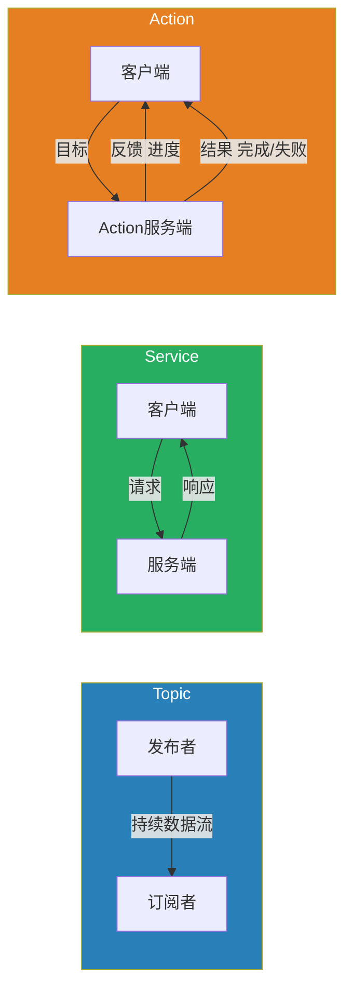
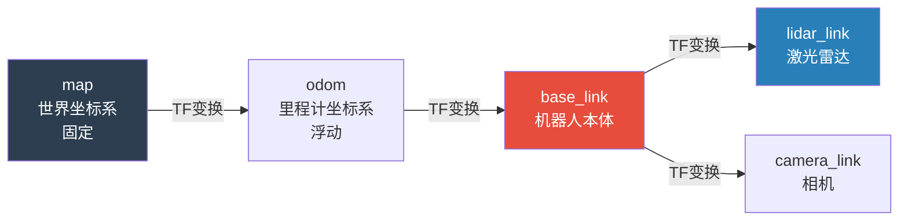
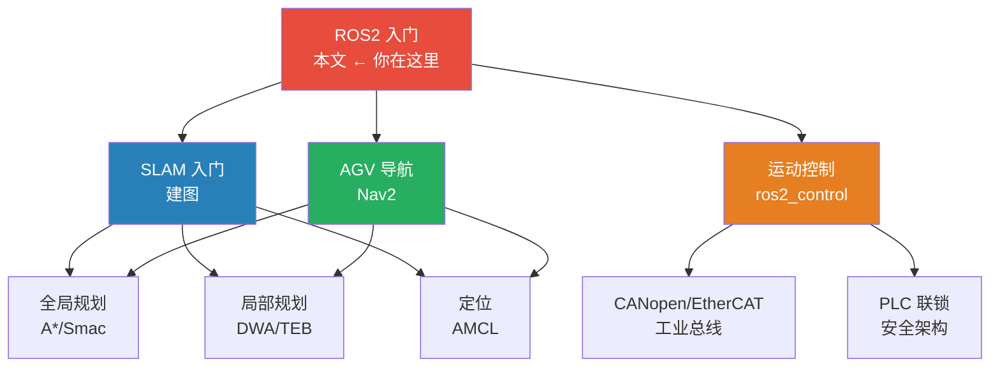

# ROS2 入门完全指南 —— 从PLC工程师的视角

> 🔰 如果你熟悉PLC梯形图、结构化文本、Modbus通信和工业总线，但面对ROS2的"节点/话题/服务/行动"一头雾水——这篇教程就是为你写的。我们用你最熟悉的工控概念来理解ROS2，并用实际代码让AGV动起来。

---

## 目录

- [1. 什么是ROS2？为什么AGV要用它？](#1-什么是ros2为什么agv要用它)
  - [1.1 ROS2 = 机器人领域的"IEC 61131-3"](#11-ros2--机器人领域的iec-61131-3)
  - [1.2 ROS1 vs ROS2：为什么要升级](#12-ros1-vs-ros2为什么要升级)
  - [1.3 工控系统 vs ROS2系统的直观对比](#13-工控系统-vs-ros2系统的直观对比)
- [2. 核心概念：用PLC类比秒懂](#2-核心概念用plc类比秒懂)
  - [2.1 节点 Node = FB 功能块](#21-节点-node--fb-功能块)
  - [2.2 话题 Topic = 全局变量 + 生产者消费者](#22-话题-topic--全局变量--生产者消费者)
  - [2.3 服务 Service = 功能块调用（有返回值的RPC）](#23-服务-service--功能块调用有返回值的rpc)
  - [2.4 行动 Action = 异步任务（长时间运行的功能块）](#24-行动-action--异步任务长时间运行的功能块)
  - [2.5 参数 Parameter = 断电保持寄存器](#25-参数-parameter--断电保持寄存器)
  - [2.6 TF2 坐标变换 = 机器人坐标系管理](#26-tf2-坐标变换--机器人坐标系管理)
  - [2.7 核心概念总览图](#27-核心概念总览图)
- [3. 环境搭建](#3-环境搭建)
  - [3.1 安装 ROS2 Humble](#31-安装-ros2-humble)
  - [3.2 配置开发环境](#32-配置开发环境)
  - [3.3 创建工作空间](#33-创建工作空间)
- [4. 你的第一个ROS2程序](#4-你的第一个ros2程序)
  - [4.1 Python 版：发布者与订阅者](#41-python-版发布者与订阅者)
  - [4.2 C++ 版：发布者与订阅者](#42-c-版发布者与订阅者)
  - [4.3 编译与运行](#43-编译与运行)
- [5. 核心通信机制实战](#5-核心通信机制实战)
  - [5.1 话题 Topic：AGV的速度指令](#51-话题-topicagv的速度指令)
  - [5.2 服务 Service：请求地图服务器加载地图](#52-服务-service请求地图服务器加载地图)
  - [5.3 行动 Action：导航到目标点](#53-行动-action导航到目标点)
  - [5.4 什么时候用哪种通信？](#54-什么时候用哪种通信)
- [6. Launch 文件：一键启动整个系统](#6-launch-文件一键启动整个系统)
  - [6.1 Launch 文件的结构](#61-launch-文件的结构)
  - [6.2 参数传递与条件启动](#62-参数传递与条件启动)
- [7. 常用工具与调试技巧](#7-常用工具与调试技巧)
  - [7.1 ros2 topic——查看和操作话题](#71-ros2-topic查看和操作话题)
  - [7.2 ros2 node——管理节点](#72-ros2-node管理节点)
  - [7.3 ros2 bag——录制与回放数据](#73-ros2-bag录制与回放数据)
  - [7.4 rqt_graph——可视化节点关系图](#74-rqt_graph可视化节点关系图)
  - [7.5 Rviz2——3D可视化](#75-rviz23d可视化)
- [8. 从零搭建AGV控制项目](#8-从零搭建agv控制项目)
  - [8.1 项目结构](#81-项目结构)
  - [8.2 里程计发布节点](#82-里程计发布节点)
  - [8.3 电机驱动节点（订阅cmd_vel）](#83-电机驱动节点订阅cmd_vel)
  - [8.4 Launch 一键启动](#84-launch-一键启动)
- [9. 调试与故障排除](#9-调试与故障排除)
  - [9.1 最常见的10个错误](#91-最常见的10个错误)
  - [9.2 编译问题排查](#92-编译问题排查)
  - [9.3 运行时问题排查](#93-运行时问题排查)
- [10. 下一步学什么](#10-下一步学什么)

---

## 1. 什么是ROS2？为什么AGV要用它？

### 1.1 ROS2 = 机器人领域的"IEC 61131-3"

如果说 **IEC 61131-3**（LD/FBD/ST/SFC/IL）是工业自动化领域的标准编程框架，那 **ROS2** 就是机器人领域的标准软件框架。

| 工控领域 | 机器人领域 |
|:---|:---|
| **IEC 61131-3** 定义了PLC的编程语言 | **ROS2** 定义了机器人的软件架构 |
| **Codesys / TwinCAT** 是IDE | **ROS2 + colcon** 是构建系统 |
| **PLCopen Motion Control** 定义了运动控制FB | **ros2_control** 定义了硬件抽象接口 |
| **OPC UA / Modbus** 是通信标准 | **DDS** 是通信中间件（ROS2底层） |
| **HMI / SCADA** 是人机界面 | **Rviz2** 是3D可视化 |

> 💡 **一句话理解ROS2**：ROS2是一个**分布式、模块化、实时通信**的软件框架，让机器人的各个功能模块（传感器驱动、SLAM、导航、控制）能够以"搭积木"的方式组合在一起，通过标准化的消息接口互相通信。

### 1.2 ROS1 vs ROS2：为什么要升级

如果你听说过ROS1但不知为什么现在都用ROS2：

| | ROS1 | ROS2 |
|:---|:---|:---|
| **通信中间件** | TCPROS/UDPROS（自研） | DDS（工业标准，实时） |
| **操作系统** | 仅 Ubuntu | Ubuntu / Windows / macOS |
| **实时性** | ❌ 不支持 | ✅ 支持实时 |
| **多机器人** | ⚠️ 需要一个 Master | ✅ 完全分布式，无 Master |
| **安全性** | ❌ 无加密 | ✅ DDS-Security |
| **嵌入式** | ❌ 不适合 | ✅ 支持 micro-ROS |
| **Python版本** | Python 2.7 | Python 3 |
| **生命周期管理** | ❌ 无 | ✅ 节点有状态机 |
| **工业应用** | ⚠️ 学术为主 | ✅ 工业级 |

> 🎯 **简单说**：ROS1是学术原型，ROS2是工业产品。AGV、无人叉车、巡检机器人这些产线场景，**必须用ROS2**。

### 1.3 工控系统 vs ROS2系统的直观对比

```
PLC 控制系统架构:
┌─────────────────────────────────┐
│  PLC (Codesys / TIA Portal)     │
│  ┌──────┐ ┌──────┐ ┌──────┐   │
│  │ OB1  │ │ FB1  │ │ FB2  │   │
│  │ 主程序│ │ 功能块│ │ 功能块│   │
│  └──────┘ └──────┘ └──────┘   │
│       │         │         │      │
│  ─────┴─────────┴─────────┴──   │
│         全局变量区(DB)           │
│  ────────────────────────────   │
│         通信接口                 │
│    Modbus / ProfiNet / EtherCAT │
└─────────────────────────────────┘
         │  │  │
    ┌────┘  │  └────┐
    ▼       ▼       ▼
  伺服   传感器   HMI


ROS2 系统架构:
┌─────────────────────────────────┐
│  ROS2 网络 (DDS)                │
│                                 │
│  ┌──────────┐  ┌──────────┐    │
│  │  Node 1  │  │  Node 2  │    │
│  │ SLAM建图  │  │ 导航规划  │    │
│  └────┬─────┘  └────┬─────┘    │
│       │ 发布/订阅     │          │
│  ─────┴──────┬───────┴──────    │
│          Topic 话题             │
│        /scan, /map, /cmd_vel   │
│  ────────────────────────────   │
│          Service / Action       │
│        (请求/响应, 异步任务)     │
└─────────────────────────────────┘
         │  │  │
    ┌────┘  │  └────┐
    ▼       ▼       ▼
  LiDAR   电机    工控机
```

---

## 2. 核心概念：用PLC类比秒懂

### 2.1 节点 Node = FB 功能块

**PLC类比**：一个Node就像一个PLC中的**功能块（FB）实例**——它有输入、有输出、有自己的内部逻辑。

```python
# ROS2 Node = 一个独立运行的程序模块
# 就像PLC中的一个功能块 FB_MotorControl

import rclpy
from rclpy.node import Node

class MotorControlNode(Node):
    """
    电机控制节点
    类比: PLC 中的 FB_MotorControl
    """
    def __init__(self):
        super().__init__('motor_control')  # 节点名 = FB实例名
        
        # 定时器 = 循环中断 OB35 (50ms)
        self.timer = self.create_timer(0.05, self.cyclic_logic)
    
    def cyclic_logic(self):
        """每个周期执行的逻辑 = OB35"""
        self.get_logger().info('执行控制逻辑...')
```

**关键特性**：
- 每个Node是一个独立的**进程**（可以分布在不同的计算机上）
- Node之间通过话题/服务/行动通信
- 一个AGV系统通常有10-20个Node同时运行

### 2.2 话题 Topic = 全局变量 + 生产者消费者

**PLC类比**：Topic就像是PLC的**全局数据块（DB）**——但它是单向的、异步的。

```
PLC:                               ROS2:
DB100.DBD0 := 电机转速              /motor_speed 话题
                                    ├── 发布者 Publisher (生产者)
所有FB都可以读写这个DB                └── 订阅者 Subscriber (消费者)

区别: DB可以任意读写                Topic只管发布，不管谁订阅
```

```python
# === 发布者 Publisher ===
# 类比: 将数据写入 DB100.DBD0
from std_msgs.msg import Float32

class SpeedPublisher(Node):
    def __init__(self):
        super().__init__('speed_publisher')
        # 创建发布者: 话题名='/motor_speed', 消息类型=Float32, 队列=10
        self.publisher = self.create_publisher(Float32, '/motor_speed', 10)
        self.timer = self.create_timer(0.1, self.publish_speed)
    
    def publish_speed(self):
        msg = Float32()
        msg.data = 1500.0  # 1500 rpm
        self.publisher.publish(msg)
        self.get_logger().info(f'发布速度: {msg.data} rpm')


# === 订阅者 Subscriber ===
# 类比: 从 DB100.DBD0 读取数据
class SpeedSubscriber(Node):
    def __init__(self):
        super().__init__('speed_subscriber')
        # 创建订阅者
        self.subscription = self.create_subscription(
            Float32, '/motor_speed', self.on_speed_received, 10)
    
    def on_speed_received(self, msg):
        """收到新数据时自动调用 = 类似 OB 中断"""
        self.get_logger().info(f'收到速度: {msg.data} rpm')
```

**关键概念——消息类型（Message Type）**：

ROS2中每个话题有严格的数据类型，就像PLC中的 `INT`、`REAL`、`ARRAY`：

| 常用消息类型 | 包含字段 | 类比PLC类型 | 用途 |
|:---|:---|:---|:---|
| `std_msgs/Float32` | `float32 data` | `REAL` | 单个浮点数 |
| `std_msgs/String` | `string data` | `STRING` | 文本 |
| `std_msgs/Bool` | `bool data` | `BOOL` | 布尔值 |
| `geometry_msgs/Twist` | `Vector3 linear, Vector3 angular` | `STRUCT` | 速度指令 |
| `sensor_msgs/LaserScan` | `float32[] ranges, ...` | `ARRAY OF REAL` | 激光数据 |
| `nav_msgs/Odometry` | `Pose pose, Twist twist, float64[36] covariance` | 复杂结构体 | 里程计 |
| `nav_msgs/Path` | `PoseStamped[] poses` | `ARRAY OF STRUCT` | 路径 |

### 2.3 服务 Service = 功能块调用（有返回值的RPC）

**PLC类比**：Service就像是调用一个功能块并**等待它返回结果**——请求/响应模式。

```
PLC:                                ROS2:
FB_Calculate(IN:=input, OUT=>result) Client → Request → Server → Response → Client
                                    (服务端可以有多个客户端调用)
```

```python
# === 服务端 Server ===
# 类比: 一个可以被调用的功能块

from example_interfaces.srv import AddTwoInts

class AddTwoIntsServer(Node):
    def __init__(self):
        super().__init__('add_server')
        # 创建服务: 服务名='/add', 服务类型=AddTwoInts
        self.srv = self.create_service(AddTwoInts, '/add', self.on_add_request)
    
    def on_add_request(self, request, response):
        """
        收到请求 → 处理 → 返回响应
        类比: FB 的输入 IN → 执行 → 输出 OUT
        """
        response.sum = request.a + request.b
        self.get_logger().info(f'{request.a} + {request.b} = {response.sum}')
        return response


# === 客户端 Client ===
class AddTwoIntsClient(Node):
    def __init__(self):
        super().__init__('add_client')
        self.client = self.create_client(AddTwoInts, '/add')
        
        # 等待服务可用
        while not self.client.wait_for_service(timeout_sec=1.0):
            self.get_logger().info('等待服务 /add ...')
    
    def call_add(self, a, b):
        """同步调用服务"""
        request = AddTwoInts.Request()
        request.a = a
        request.b = b
        
        future = self.client.call_async(request)
        rclpy.spin_until_future_complete(self, future)
        
        return future.result().sum
```

**Topic vs Service 的区别**：

| | Topic 话题 | Service 服务 |
|:---|:---|:---|
| **通信模式** | 单向发布/订阅 | 请求/响应 |
| **类比PLC** | 全局变量广播 | FB调用 |
| **连续性** | 持续发布（如传感器数据） | 一次性请求 |
| **接收者** | 多个订阅者 | 一个客户端 |
| **返回值** | ❌ 无 | ✅ 有 |

### 2.4 行动 Action = 异步任务（长时间运行的功能块）

**PLC类比**：Action就像是PLC中一个**长时间运行的功能块**——你启动它，它花一段时间执行，执行过程中不断汇报进度，最终返回成功或失败。

```
场景: AGV从A点导航到B点（需要30秒）

Topic:   不适合——"目标点"不是持续数据流，是离散指令
Service: 不适合——导航需要30秒，Service必须阻塞等待30秒
Action: ✅ 完美——发送目标→收到反馈(走了50%了)→最终收到结果(到达或失败)
```

```python
# === Action 客户端 ===
# 类比: PLC 调用 MC_MoveAbsolute，等待 Done 信号

from nav2_msgs.action import NavigateToPose
from rclpy.action import ActionClient

class NavigateToPoseClient(Node):
    def __init__(self):
        super().__init__('navigate_client')
        self.action_client = ActionClient(self, NavigateToPose, 'navigate_to_pose')
    
    def send_goal(self, x, y):
        """发送导航目标"""
        goal = NavigateToPose.Goal()
        goal.pose.header.frame_id = 'map'
        goal.pose.pose.position.x = x
        goal.pose.pose.position.y = y
        goal.pose.pose.orientation.w = 1.0  # 朝向
        
        self.action_client.wait_for_server()
        
        # 异步发送目标
        send_future = self.action_client.send_goal_async(
            goal,
            feedback_callback=self.on_feedback  # 执行过程中的进度回调
        )
        send_future.add_done_callback(self.on_goal_response)
    
    def on_feedback(self, feedback_msg):
        """执行过程中的进度反馈——类似 MC_MoveAbsolute 的 Busy 信号"""
        distance_remaining = feedback_msg.feedback.distance_remaining
        self.get_logger().info(f'还剩 {distance_remaining:.1f}m')
    
    def on_goal_response(self, future):
        """目标是否被接受——类似 MC_MoveAbsolute 的 Active 信号"""
        goal_handle = future.result()
        if not goal_handle.accepted:
            self.get_logger().error('目标被拒绝!')
            return
        self.get_logger().info('目标已接受, 开始导航')
        goal_handle.get_result_async().add_done_callback(self.on_result)
    
    def on_result(self, future):
        """最终结果——类似 MC_MoveAbsolute 的 Done/Error 信号"""
        result = future.result().result
        self.get_logger().info(f'导航完成!')
```

**三种通信方式对比**：



### 2.5 参数 Parameter = 断电保持寄存器

**PLC类比**：Parameter就像PLC的**断电保持寄存器**（如西门子的DB块、三菱的D寄存器）——存储配置值，系统重启后仍然保留。

```python
class AGVControllerNode(Node):
    def __init__(self):
        super().__init__('agv_controller')
        
        # 声明参数（带默认值）
        self.declare_parameter('max_speed', 1.5)       # 最大速度 m/s
        self.declare_parameter('wheel_radius', 0.075)  # 轮径 m
        self.declare_parameter('wheel_base', 0.50)     # 轮距 m
        
        # 读取参数
        self.max_speed = self.get_parameter('max_speed').value
        self.wheel_radius = self.get_parameter('wheel_radius').value
```

**在启动时通过YAML文件或命令行修改参数**：

```yaml
# config/agv_params.yaml
agv_controller:
  ros__parameters:
    max_speed: 1.2
    wheel_radius: 0.08
    wheel_base: 0.52
```

```bash
# 命令行运行时修改参数
ros2 run agv_pkg agv_controller --ros-args -p max_speed:=1.0
```

### 2.6 TF2 坐标变换 = 机器人坐标系管理

**PLC类比**：TF2就像是机器人控制系统中的**坐标系管理**——类似你给六轴机械臂做的工具坐标系标定。

```
工业机械臂:                          ROS2 TF2:
Base(基座) ← DH参数 → Tool(工具)     map → odom → base_link → lidar_link
(通过正运动学链式计算)                (通过TF树发布各坐标系关系)
```



> 🔑 **理解TF2**：你知道的工业机器人"工具坐标系标定 + 工件坐标系标定"，本质上就是TF树上的两个静态变换。ROS2的TF2把这个概念标准化和动态化了。

### 2.7 核心概念总览图

```
        ┌──────────────────────────────────────────────┐
        │              ROS2 核心概念                    │
        │                                              │
        │  ┌────────┐     ┌────────┐     ┌────────┐   │
        │  │ Node A │     │ Node B │     │ Node C │   │
        │  │ 建图   │     │ 导航   │     │ 控制   │   │
        │  └───┬────┘     └───┬────┘     └───┬────┘   │
        │      │              │               │        │
        │      ├─── Topic ────┤               │        │
        │      │  (/scan,     │               │        │
        │      │   /map)      │               │        │
        │      │              ├─── Topic ─────┤        │
        │      │              │  (/cmd_vel)   │        │
        │      │              │               │        │
        │      ├── Service ──►│               │        │
        │      │  (请求地图)   │               │        │
        │      │              │               │        │
        │      │              ├── Action ────►│        │
        │      │              │ (导航到目标)   │        │
        │      │              │               │        │
        └──────┴──────────────┴───────────────┴────────┘
```

---

## 3. 环境搭建

### 3.1 安装 ROS2 Humble

ROS2 Humble Hawksbill 是当前推荐的LTS版本（支持到2027年），基于Ubuntu 22.04。

```bash
# ============================================================
#  第一步: 设置 locale 为 UTF-8
# ============================================================
sudo apt update && sudo apt install locales
sudo locale-gen en_US en_US.UTF-8
sudo update-locale LC_ALL=en_US.UTF-8 LANG=en_US.UTF-8
export LANG=en_US.UTF-8

# ============================================================
#  第二步: 添加 ROS2 仓库
# ============================================================
sudo apt install software-properties-common
sudo add-apt-repository universe

# 添加 ROS2 GPG 密钥
sudo curl -sSL https://raw.githubusercontent.com/ros/rosdistro/master/ros.key \
  -o /usr/share/keyrings/ros-archive-keyring.gpg

# 添加 ROS2 软件源
echo "deb [arch=$(dpkg --print-architecture) \
  signed-by=/usr/share/keyrings/ros-archive-keyring.gpg] \
  http://packages.ros.org/ros2/ubuntu $(. /etc/os-release && echo $UBUNTU_CODENAME) main" \
  | sudo tee /etc/apt/sources.list.d/ros2.list > /dev/null

# ============================================================
#  第三步: 安装 ROS2 Humble
# ============================================================
sudo apt update

# 安装桌面完整版（推荐）—— 含 Rviz2, rqt, demo
sudo apt install ros-humble-desktop

# 或者只安装基础版（无GUI）
# sudo apt install ros-humble-ros-base
```

### 3.2 配置开发环境

```bash
# ============================================================
#  安装开发工具
# ============================================================
sudo apt install ros-dev-tools

# Python 依赖
sudo apt install python3-pip python3-colcon-common-extensions

# C++ 依赖
sudo apt install build-essential cmake git

# ============================================================
#  设置环境变量（写入 ~/.bashrc）
# ============================================================
echo "source /opt/ros/humble/setup.bash" >> ~/.bashrc
source ~/.bashrc

# ============================================================
#  验证安装
# ============================================================
# 运行一个 talker 节点
ros2 run demo_nodes_cpp talker

# 打开另一个终端，运行 listener
ros2 run demo_nodes_py listener
# 看到 "Hello World" 说明安装成功！
```

### 3.3 创建工作空间

ROS2 的工作空间（Workspace）是你存放所有项目代码的地方——类比PLC项目文件夹。

```bash
# ============================================================
#  创建工作空间目录结构
# ============================================================
mkdir -p ~/agv_ws/src
cd ~/agv_ws

# 目录结构:
# agv_ws/
# ├── src/           ← 源代码（包都在这里）
# ├── build/         ← 编译中间文件（自动生成）
# ├── install/       ← 编译结果（自动生成）
# └── log/           ← 编译日志（自动生成）

# ============================================================
#  创建你的第一个包（Python）
# ============================================================
cd ~/agv_ws/src
ros2 pkg create --build-type ament_python my_first_pkg \
  --dependencies rclpy std_msgs

# 包结构:
# my_first_pkg/
# ├── my_first_pkg/     ← Python 源码
# │   └── __init__.py
# ├── package.xml       ← 包描述文件
# ├── setup.py          ← Python 安装配置
# └── setup.cfg

# ============================================================
#  创建 C++ 包
# ============================================================
ros2 pkg create --build-type ament_cmake my_cpp_pkg \
  --dependencies rclcpp std_msgs

# ============================================================
#  编译工作空间
# ============================================================
cd ~/agv_ws
colcon build --symlink-install
# --symlink-install: Python文件用符号链接（修改后不需重新编译）

# 每次编译后别忘了 source!
echo "source ~/agv_ws/install/setup.bash" >> ~/.bashrc
source ~/.bashrc
```

---

## 4. 你的第一个ROS2程序

### 4.1 Python 版：发布者与订阅者

```python
# ============================================================
# 文件: ~/agv_ws/src/my_first_pkg/my_first_pkg/talker.py
# 作用: 每秒发布一次Hello消息
# ============================================================

import rclpy
from rclpy.node import Node
from std_msgs.msg import String


class TalkerNode(Node):
    """
    一个简单的发布者
    类比: PLC中向全局变量写入数据的FB
    """
    def __init__(self):
        super().__init__('talker')  # 节点名
        
        # 创建发布者
        self.publisher = self.create_publisher(
            String,       # 消息类型
            '/chatter',   # 话题名
            10            # 队列大小（缓冲10条消息）
        )
        
        # 创建定时器——每1秒调用一次
        self.timer = self.create_timer(1.0, self.timer_callback)
        self.count = 0
        
        self.get_logger().info('Talker 节点已启动!')
    
    def timer_callback(self):
        """定时器回调——每秒发布一条消息"""
        msg = String()
        msg.data = f'Hello AGV! 第 {self.count} 次'
        self.publisher.publish(msg)
        self.get_logger().info(f'发布: "{msg.data}"')
        self.count += 1


def main(args=None):
    rclpy.init(args=args)            # 初始化ROS2（必须先调用）
    node = TalkerNode()              # 创建节点实例
    rclpy.spin(node)                 # 进入事件循环（类似PLC的扫描循环）
    node.destroy_node()              # 销毁节点
    rclpy.shutdown()                 # 关闭ROS2


if __name__ == '__main__':
    main()
```

```python
# ============================================================
# 文件: ~/agv_ws/src/my_first_pkg/my_first_pkg/listener.py
# 作用: 订阅并打印消息
# ============================================================

import rclpy
from rclpy.node import Node
from std_msgs.msg import String


class ListenerNode(Node):
    """
    一个简单的订阅者
    类比: PLC中从全局变量读取数据的FB
    """
    def __init__(self):
        super().__init__('listener')
        
        # 创建订阅者
        self.subscription = self.create_subscription(
            String,        # 消息类型
            '/chatter',    # 话题名（必须与发布者一致！）
            self.on_message_received,  # 回调函数
            10             # 队列大小
        )
        
        self.get_logger().info('Listener 节点已启动! 等待消息...')
    
    def on_message_received(self, msg):
        """收到消息时自动调用——类似中断OB"""
        self.get_logger().info(f'收到: "{msg.data}"')


def main(args=None):
    rclpy.init(args=args)
    node = ListenerNode()
    rclpy.spin(node)
    node.destroy_node()
    rclpy.shutdown()


if __name__ == '__main__':
    main()
```

**修改 `setup.py` 注册入口点**：

```python
# ~/agv_ws/src/my_first_pkg/setup.py
from setuptools import setup
import os
from glob import glob

package_name = 'my_first_pkg'

setup(
    name=package_name,
    version='0.0.0',
    packages=[package_name],
    data_files=[
        ('share/' + package_name, ['package.xml']),
        # 如果有 launch 文件, 添加:
        # (os.path.join('share', package_name, 'launch'), glob('launch/*.py')),
    ],
    install_requires=['setuptools'],
    zip_safe=True,
    maintainer='your_name',
    maintainer_email='your@email.com',
    description='My first ROS2 package',
    license='MIT',
    tests_require=['pytest'],
    
    # ★ 关键: 注册入口点（可执行程序名 = 包名.文件名:主函数名）
    entry_points={
        'console_scripts': [
            'talker = my_first_pkg.talker:main',
            'listener = my_first_pkg.listener:main',
        ],
    },
)
```

### 4.2 C++ 版：发布者与订阅者

```cpp
// ============================================================
// 文件: ~/agv_ws/src/my_cpp_pkg/src/talker.cpp
// ============================================================

#include <chrono>
#include <functional>
#include <memory>
#include <string>

#include "rclcpp/rclcpp.hpp"
#include "std_msgs/msg/string.hpp"

using namespace std::chrono_literals;

class TalkerNode : public rclcpp::Node {
public:
    TalkerNode() : Node("talker_cpp"), count_(0) {
        // 创建发布者
        publisher_ = this->create_publisher<std_msgs::msg::String>("/chatter", 10);
        
        // 创建定时器——500ms
        timer_ = this->create_wall_timer(
            500ms, std::bind(&TalkerNode::timer_callback, this));
        
        RCLCPP_INFO(this->get_logger(), "Talker C++ 节点已启动!");
    }

private:
    void timer_callback() {
        auto msg = std_msgs::msg::String();
        msg.data = "Hello AGV! 第 " + std::to_string(count_++) + " 次";
        publisher_->publish(msg);
        RCLCPP_INFO(this->get_logger(), "发布: '%s'", msg.data.c_str());
    }
    
    rclcpp::Publisher<std_msgs::msg::String>::SharedPtr publisher_;
    rclcpp::TimerBase::SharedPtr timer_;
    size_t count_;
};

int main(int argc, char* argv[]) {
    rclcpp::init(argc, argv);
    rclcpp::spin(std::make_shared<TalkerNode>());
    rclcpp::shutdown();
    return 0;
}
```

```cmake
# ~/agv_ws/src/my_cpp_pkg/CMakeLists.txt
cmake_minimum_required(VERSION 3.8)
project(my_cpp_pkg)

# 默认使用 C++17
if(CMAKE_COMPILER_IS_GNUCXX OR CMAKE_CXX_COMPILER_ID MATCHES "Clang")
  add_compile_options(-Wall -Wextra -Wpedantic)
endif()

find_package(ament_cmake REQUIRED)
find_package(rclcpp REQUIRED)
find_package(std_msgs REQUIRED)

# 编译 talker
add_executable(talker_cpp src/talker.cpp)
ament_target_dependencies(talker_cpp rclcpp std_msgs)

# 安装可执行文件
install(TARGETS talker_cpp
  DESTINATION lib/${PROJECT_NAME})

ament_package()
```

### 4.3 编译与运行

```bash
# ============================================================
#  编译
# ============================================================
cd ~/agv_ws
colcon build --symlink-install

# 如果只想编译某个包:
# colcon build --packages-select my_first_pkg

# ============================================================
#  运行（需要先 source 环境）
# ============================================================
source ~/agv_ws/install/setup.bash

# 终端1: 运行 talker
ros2 run my_first_pkg talker

# 终端2: 运行 listener
ros2 run my_first_pkg listener
```

---

## 5. 核心通信机制实战

### 5.1 话题 Topic：AGV的速度指令

```python
# ============================================================
#  发布 cmd_vel (速度指令)
#  这是AGV导航中最核心的话题！
# ============================================================

from geometry_msgs.msg import Twist

class CmdVelPublisher(Node):
    """向AGV发送速度指令"""
    def __init__(self):
        super().__init__('cmd_vel_publisher')
        self.publisher = self.create_publisher(Twist, '/cmd_vel', 10)
        self.timer = self.create_timer(0.05, self.send_velocity)  # 20Hz
    
    def send_velocity(self):
        msg = Twist()
        msg.linear.x = 0.5    # 前进 0.5 m/s
        msg.angular.z = 0.2   # 左转 0.2 rad/s
        self.publisher.publish(msg)
```

```bash
# 手动发送 cmd_vel（调试用）
ros2 topic pub /cmd_vel geometry_msgs/msg/Twist \
  "{linear: {x: 0.5}, angular: {z: 0.0}}" -r 10

# 查看当前 cmd_vel
ros2 topic echo /cmd_vel

# 查看话题列表
ros2 topic list

# 查看话题信息
ros2 topic info /cmd_vel
```

### 5.2 服务 Service：请求地图服务器加载地图

```python
# ============================================================
#  调用地图服务器的加载地图服务
# ============================================================

from nav2_msgs.srv import LoadMap

class MapLoaderClient(Node):
    def __init__(self):
        super().__init__('map_loader_client')
        self.client = self.create_client(LoadMap, '/map_server/load_map')
        
        while not self.client.wait_for_service(timeout_sec=1.0):
            self.get_logger().info('等待地图服务...')
    
    def load_map(self, map_url):
        request = LoadMap.Request()
        request.map_url = map_url  # 如 '/home/user/map.yaml'
        
        future = self.client.call_async(request)
        rclpy.spin_until_future_complete(self, future)
        
        response = future.result()
        if response.result == LoadMap.Response().RESULT_SUCCESS:
            self.get_logger().info('地图加载成功!')
        else:
            self.get_logger().error('地图加载失败!')
```

```bash
# 查看所有服务
ros2 service list

# 查看服务类型
ros2 service type /map_server/load_map

# 手动调用服务
ros2 service call /map_server/load_map nav2_msgs/srv/LoadMap \
  "{map_url: '/home/user/map.yaml'}"
```

### 5.3 行动 Action：导航到目标点

```python
# ============================================================
#  发送导航目标（Action示例——已在§2.4给出完整代码）
# ============================================================

# 简化版——只发目标，不等结果
from nav2_msgs.action import NavigateToPose
from rclpy.action import ActionClient

def send_nav_goal(x, y):
    """发送导航目标并等待完成"""
    client = ActionClient(node, NavigateToPose, 'navigate_to_pose')
    client.wait_for_server()
    
    goal = NavigateToPose.Goal()
    goal.pose.header.frame_id = 'map'
    goal.pose.pose.position.x = x
    goal.pose.pose.position.y = y
    goal.pose.pose.orientation.w = 1.0
    
    future = client.send_goal_async(goal)
    rclpy.spin_until_future_complete(node, future)
    
    goal_handle = future.result()
    if not goal_handle.accepted:
        return False
    
    result_future = goal_handle.get_result_async()
    rclpy.spin_until_future_complete(node, result_future)
    
    return result_future.result().status == 4  # 4 = SUCCEEDED
```

```bash
# 查看所有 Action
ros2 action list

# 手动发送导航目标
ros2 action send_goal /navigate_to_pose nav2_msgs/action/NavigateToPose \
  "{pose: {header: {frame_id: 'map'}, pose: {position: {x: 5.0, y: 3.0}}}}"
```

### 5.4 什么时候用哪种通信？

| 场景 | 使用 | 原因 |
|:---|:---|:---|
| 激光雷达数据（持续10Hz） | **Topic** | 持续数据流，多个消费者 |
| 里程计数据（持续50Hz） | **Topic** | 持续发布位置和速度 |
| 电机速度指令（持续20Hz） | **Topic** | 控制指令是持续流 |
| 请求加载地图 | **Service** | 一次性请求，需要确认 |
| 查询电池电量 | **Service** | 请求/响应模式 |
| 导航到目标点（需要30s） | **Action** | 长时间执行，需进度反馈 |
| 充电对接（需要10s精确控制） | **Action** | 需反馈和取消能力 |
| 紧急停止 | **Topic + Service** | Topic快速广播 + Service确认 |

---

## 6. Launch 文件：一键启动整个系统

### 6.1 Launch 文件的结构

Launch文件就像PLC的**启动配置**——一次性启动所有需要的节点，加载参数，配置通信。

```python
# ============================================================
# 文件: ~/agv_ws/src/my_first_pkg/launch/agv_bringup.launch.py
# 作用: 一键启动AGV的所有基础节点
# ============================================================

from launch import LaunchDescription
from launch_ros.actions import Node
from launch.actions import DeclareLaunchArgument
from launch.substitutions import LaunchConfiguration


def generate_launch_description():
    """
    返回 LaunchDescription —— 描述要启动的所有节点和参数
    
    类比: PLC 中加载所有功能块实例
    """
    
    # 声明启动参数
    use_sim_arg = DeclareLaunchArgument(
        'use_sim',
        default_value='false',
        description='是否使用仿真模式'
    )
    
    # 节点1: 电机控制节点
    motor_control_node = Node(
        package='agv_control',         # 包名
        executable='motor_control',    # 可执行文件名
        name='motor_control_node',     # 节点实例名
        output='screen',               # 日志输出到屏幕
        parameters=[                   # 加载参数文件
            {'max_speed': 1.5},
            {'wheel_radius': 0.075},
        ]
    )
    
    # 节点2: 里程计节点
    odometry_node = Node(
        package='agv_control',
        executable='odometry_publisher',
        name='odometry_node',
        output='screen',
    )
    
    # 节点3: 激光雷达驱动（条件启动——仅真实硬件时启动）
    lidar_node = Node(
        package='ydlidar_ros2_driver',
        executable='ydlidar_ros2_driver_node',
        name='lidar_node',
        output='screen',
        condition=LaunchConfiguration('use_sim') == 'false',
        # 仅当 use_sim=false 时才启动此节点
    )
    
    # 返回启动描述
    return LaunchDescription([
        use_sim_arg,
        motor_control_node,
        odometry_node,
        lidar_node,
    ])
```

```bash
# 启动 launch 文件
ros2 launch my_first_pkg agv_bringup.launch.py

# 带参数启动
ros2 launch my_first_pkg agv_bringup.launch.py use_sim:=true
```

### 6.2 参数传递与条件启动

```python
# 更多 launch 技巧

from launch.substitutions import LaunchConfiguration, PythonExpression
from launch.conditions import IfCondition, UnlessCondition

# 条件节点
debug_node = Node(
    package='agv_control',
    executable='debug_monitor',
    condition=IfCondition(LaunchConfiguration('debug')),
    # 仅当 debug:=true 时启动
)

# 参数替换
node = Node(
    package='agv_control',
    executable='motor_control',
    parameters=[{
        'max_speed': LaunchConfiguration('max_speed'),  # 从启动参数获取
    }]
)

# 启动时也可加载 YAML 参数文件
node_with_yaml = Node(
    package='agv_control',
    executable='motor_control',
    parameters=['config/agv_params.yaml'],  # 加载 YAML
)
```

---

## 7. 常用工具与调试技巧

### 7.1 ros2 topic——查看和操作话题

```bash
# ============================================================
#  查看所有话题
# ============================================================
ros2 topic list                    # 所有话题
ros2 topic list -t                 # 带消息类型

# ============================================================
#  查看话题内容
# ============================================================
ros2 topic echo /cmd_vel           # 实时显示消息
ros2 topic echo /scan --once       # 只显示一条
ros2 topic echo /odom --no-arr     # 不展开数组（激光数据很大）

# ============================================================
#  查看话题信息
# ============================================================
ros2 topic info /cmd_vel           # 发布者、订阅者数量、消息类型

# ============================================================
#  手动发布消息（调试神器）
# ============================================================
# 发布速度指令
ros2 topic pub /cmd_vel geometry_msgs/msg/Twist \
  "{linear: {x: 0.5}, angular: {z: 0.0}}"

# 持续发布（10Hz）
ros2 topic pub -r 10 /cmd_vel geometry_msgs/msg/Twist \
  "{linear: {x: 0.3}, angular: {z: 0.0}}"

# ============================================================
#  查看消息频率
# ============================================================
ros2 topic hz /scan               # 查看激光雷达发布频率
ros2 topic hz /cmd_vel            # 查看控制指令频率

# ============================================================
#  查看消息带宽
# ============================================================
ros2 topic bw /scan               # 查看话题带宽（字节/秒）
```

### 7.2 ros2 node——管理节点

```bash
# 查看所有运行中的节点
ros2 node list

# 查看节点信息（订阅了哪些话题、发布了哪些话题）
ros2 node info /motor_control_node

# 查看节点的参数
ros2 param list /motor_control_node
ros2 param get /motor_control_node max_speed
ros2 param set /motor_control_node max_speed 1.0
```

### 7.3 ros2 bag——录制与回放数据

`ros2 bag` 就像PLC的**数据记录（Data Logging）**——录制所有话题数据，之后可以回放分析。

```bash
# ============================================================
#  录制数据
# ============================================================
# 录制所有话题
ros2 bag record -a -o my_session

# 录制指定话题
ros2 bag record /scan /cmd_vel /odom -o agv_test

# ============================================================
#  回放数据（用于离线调试算法）
# ============================================================
ros2 bag play agv_test/

# 回放并查看
ros2 bag play agv_test/ --rate 0.5  # 0.5倍速回放

# ============================================================
#  查看 bag 文件信息
# ============================================================
ros2 bag info agv_test/
```

> 🔑 **实用场景**：录一段AGV实际运行的数据（激光+里程计+cmd_vel），回家后在笔记本电脑上回放，离线调试SLAM和导航算法——不需要把AGV搬回家。

### 7.4 rqt_graph——可视化节点关系图

```bash
# 启动 rqt_graph —— 看节点和话题的拓扑关系
rqt_graph

# 或者用 ROS2 专用版本
ros2 run rqt_graph rqt_graph
```

**rqt_graph 显示的效果**：

```
┌──────────┐     /scan     ┌──────────┐
│  LiDAR   │──────────────►│  SLAM    │
│  Node    │               │  Node    │
└──────────┘               └────┬─────┘
                                │  /map
                                ▼
                          ┌──────────┐
                          │  Nav2    │
                          │  Planner │
                          └────┬─────┘
                               │  /cmd_vel
                               ▼
                         ┌──────────┐
                         │  Motor   │
                         │  Driver  │
                         └──────────┘
```

### 7.5 Rviz2——3D可视化

```bash
# 启动 Rviz2
rviz2

# 或者带配置文件启动
rviz2 -d ~/agv_ws/src/agv_bringup/rviz/agv_view.rviz
```

**Rviz2 中可以显示**：
- 静态地图（Map）
- 激光雷达点云（LaserScan）
- 机器人模型（RobotModel）
- 全局路径（Path）
- 局部代价地图（Costmap）
- TF坐标轴
- 粒子滤波的粒子云

---

## 8. 从零搭建AGV控制项目

### 8.1 项目结构

```
~/agv_ws/src/agv_control/
├── package.xml                 # 包描述
├── setup.py                    # Python安装配置
├── setup.cfg
├── config/
│   └── agv_params.yaml         # 参数文件
├── launch/
│   └── agv_bringup.launch.py   # 启动文件
└── agv_control/
    ├── __init__.py
    ├── odometry_publisher.py   # 里程计发布节点
    ├── motor_driver.py         # 电机驱动节点
    └── kinematics.py           # 运动学计算模块
```

### 8.2 里程计发布节点

```python
# ============================================================
# 文件: agv_control/odometry_publisher.py
# 作用: 从编码器数据计算并发布里程计
# 这是 AGV 定位的基础数据源！
# ============================================================

import rclpy
from rclpy.node import Node
from nav_msgs.msg import Odometry
from geometry_msgs.msg import Quaternion
import tf2_ros
import math
import numpy as np


class OdometryPublisher(Node):
    """
    里程计发布节点
    
    输入: 左右轮编码器数据 (实际项目中从硬件接口读取)
    输出: /odom 话题 (nav_msgs/Odometry) + TF (odom→base_link)
    """
    
    def __init__(self):
        super().__init__('odometry_publisher')
        
        # 物理参数
        self.declare_parameter('wheel_radius', 0.075)
        self.declare_parameter('wheel_base', 0.50)
        self.declare_parameter('encoder_resolution', 2500)
        self.declare_parameter('gear_ratio', 20.0)
        
        self.wheel_radius = self.get_parameter('wheel_radius').value
        self.wheel_base = self.get_parameter('wheel_base').value
        
        # 位姿累积
        self.x = 0.0
        self.y = 0.0
        self.theta = 0.0
        
        # 发布者
        self.odom_pub = self.create_publisher(Odometry, '/odom', 10)
        
        # TF 广播器
        self.tf_broadcaster = tf2_ros.TransformBroadcaster(self)
        
        # 编码器模拟（实际中从硬件读取）
        self.left_count = 0
        self.right_count = 0
        
        # 定时器 —— 50Hz
        self.timer = self.create_timer(0.02, self.update)
        self.last_time = self.get_clock().now()
        
        self.get_logger().info('里程计节点已启动 (50Hz)')
    
    def _read_encoders(self):
        """
        读取编码器——实际代码中对接硬件
        
        这里用模拟数据:
        AGV以0.3m/s直线前进
        """
        # 模拟: 0.02秒内，以0.3m/s前进
        dt = 0.02
        v = 0.3
        dist = v * dt  # 0.006m
        
        # 转换为编码器脉冲
        counts_per_rev = 2500 * 4  # 4倍频
        revs = dist / (2 * math.pi * self.wheel_radius) * 20  # 轮转圈数×减速比
        counts = int(revs * counts_per_rev)
        
        self.left_count += counts
        self.right_count += counts
        
        return self.left_count, self.right_count
    
    def update(self):
        """每20ms调用一次"""
        # 读编码器
        left_count, right_count = self._read_encoders()
        
        current_time = self.get_clock().now()
        dt = (current_time - self.last_time).nanoseconds / 1e9
        
        if dt < 1e-6:
            return
        
        # 计算增量（简化——这里直接用名义值）
        # 实际代码需要根据encoder_resolution和gear_ratio换算
        delta_left = 0.006 / self.wheel_radius   # rad
        delta_right = 0.006 / self.wheel_radius
        
        delta_s = (delta_left + delta_right) * self.wheel_radius / 2.0
        delta_theta = (delta_right - delta_left) * self.wheel_radius / self.wheel_base
        
        # 更新位姿
        self.x += delta_s * math.cos(self.theta + delta_theta / 2.0)
        self.y += delta_s * math.sin(self.theta + delta_theta / 2.0)
        self.theta += delta_theta
        
        # 发布里程计消息
        self._publish_odometry(current_time, dt, delta_s, delta_theta)
        
        self.last_time = current_time
    
    def _publish_odometry(self, current_time, dt, delta_s, delta_theta):
        """发布 Odometry 消息"""
        odom = Odometry()
        odom.header.stamp = current_time.to_msg()
        odom.header.frame_id = 'odom'
        odom.child_frame_id = 'base_link'
        
        # 位置
        odom.pose.pose.position.x = self.x
        odom.pose.pose.position.y = self.y
        
        # 朝向（欧拉角→四元数）
        odom.pose.pose.orientation = self._yaw_to_quaternion(self.theta)
        
        # 速度
        odom.twist.twist.linear.x = delta_s / dt
        odom.twist.twist.angular.z = delta_theta / dt
        
        # 协方差（表示不确定性）
        odom.pose.covariance[0] = 0.001   # x
        odom.pose.covariance[7] = 0.001   # y
        odom.pose.covariance[35] = 0.01   # yaw
        
        self.odom_pub.publish(odom)
        
        # 发布 TF
        from geometry_msgs.msg import TransformStamped
        tf_msg = TransformStamped()
        tf_msg.header.stamp = current_time.to_msg()
        tf_msg.header.frame_id = 'odom'
        tf_msg.child_frame_id = 'base_link'
        tf_msg.transform.translation.x = self.x
        tf_msg.transform.translation.y = self.y
        tf_msg.transform.rotation = odom.pose.pose.orientation
        
        self.tf_broadcaster.sendTransform(tf_msg)
    
    @staticmethod
    def _yaw_to_quaternion(yaw):
        q = Quaternion()
        q.z = math.sin(yaw / 2.0)
        q.w = math.cos(yaw / 2.0)
        return q


def main():
    rclpy.init()
    node = OdometryPublisher()
    rclpy.spin(node)
    rclpy.shutdown()


if __name__ == '__main__':
    main()
```

### 8.3 电机驱动节点（订阅cmd_vel）

```python
# ============================================================
# 文件: agv_control/motor_driver.py
# 作用: 订阅 /cmd_vel, 执行逆运动学, 驱动电机
# ============================================================

import rclpy
from rclpy.node import Node
from geometry_msgs.msg import Twist
import math


class MotorDriverNode(Node):
    """
    电机驱动节点
    
    输入: /cmd_vel (线速度, 角速度)
    输出: 电机指令 (实际中通过 Modbus/CAN/GPIO 发送)
    """
    
    def __init__(self):
        super().__init__('motor_driver')
        
        # 物理参数
        self.declare_parameter('wheel_radius', 0.075)
        self.declare_parameter('wheel_base', 0.50)
        self.declare_parameter('gear_ratio', 20.0)
        self.declare_parameter('max_motor_rpm', 3000)
        
        self.wheel_radius = self.get_parameter('wheel_radius').value
        self.wheel_base = self.get_parameter('wheel_base').value
        self.gear_ratio = self.get_parameter('gear_ratio').value
        self.max_motor_rpm = self.get_parameter('max_motor_rpm').value
        
        # 订阅 cmd_vel
        self.cmd_vel_sub = self.create_subscription(
            Twist, '/cmd_vel', self.on_cmd_vel_received, 10)
        
        # 定时器 —— 检查 cmd_vel 是否超时（安全机制）
        self.last_cmd_time = self.get_clock().now()
        self.watchdog_timer = self.create_timer(0.1, self.watchdog_check)
        
        self.get_logger().info('电机驱动节点已启动, 等待 /cmd_vel ...')
        self.get_logger().info(f'轮径={self.wheel_radius}m, 轮距={self.wheel_base}m')
    
    def on_cmd_vel_received(self, msg):
        """
        收到速度指令
        
        这是整个导航栈的最终输出——把它变成电机转动！
        """
        self.last_cmd_time = self.get_clock().now()
        
        v = msg.linear.x    # 线速度 m/s
        omega = msg.angular.z  # 角速度 rad/s
        
        # 逆运动学: (v, ω) → (ω_L, ω_R)
        left_wheel_rad_s = (v + omega * self.wheel_base / 2.0) / self.wheel_radius
        right_wheel_rad_s = (v - omega * self.wheel_base / 2.0) / self.wheel_radius
        
        # 轮速 (rad/s) → 电机转速 (rpm)
        left_motor_rpm = left_wheel_rad_s * self.gear_ratio * 60.0 / (2.0 * math.pi)
        right_motor_rpm = right_wheel_rad_s * self.gear_ratio * 60.0 / (2.0 * math.pi)
        
        # 限幅
        left_motor_rpm = max(-self.max_motor_rpm, min(self.max_motor_rpm, left_motor_rpm))
        right_motor_rpm = max(-self.max_motor_rpm, min(self.max_motor_rpm, right_motor_rpm))
        
        # ★ 这里写入实际的电机驱动代码 ★
        # drive.set_left_rpm(left_motor_rpm)
        # drive.set_right_rpm(right_motor_rpm)
        
        self.get_logger().info(
            f'cmd_vel: v={v:.2f} ω={omega:.2f} → '
            f'左={left_motor_rpm:.0f}rpm 右={right_motor_rpm:.0f}rpm'
        )
    
    def watchdog_check(self):
        """
        看门狗: 如果超过0.5秒没有收到新的 cmd_vel, 强制停车
        
        这是安全关键功能——ROS2挂了不能让AGV继续乱跑
        """
        dt = (self.get_clock().now() - self.last_cmd_time).nanoseconds / 1e9
        if dt > 0.5:
            # 超时! 紧急停车
            # drive.emergency_stop()
            self.get_logger().warn(f'cmd_vel 超时 {dt:.1f}s, 紧急停车!', throttle_duration_sec=1.0)


def main():
    rclpy.init()
    node = MotorDriverNode()
    rclpy.spin(node)
    rclpy.shutdown()


if __name__ == '__main__':
    main()
```

### 8.4 Launch 一键启动

```python
# 文件: agv_control/launch/agv_bringup.launch.py

from launch import LaunchDescription
from launch_ros.actions import Node

def generate_launch_description():
    return LaunchDescription([
        Node(
            package='agv_control',
            executable='odometry_publisher',
            name='odometry_node',
            output='screen',
        ),
        Node(
            package='agv_control',
            executable='motor_driver',
            name='motor_driver_node',
            output='screen',
            parameters=[{
                'wheel_radius': 0.075,
                'wheel_base': 0.50,
                'gear_ratio': 20.0,
                'max_motor_rpm': 3000,
            }]
        ),
    ])
```

```bash
# 一键启动AGV基础控制
ros2 launch agv_control agv_bringup.launch.py

# 然后手动发速度指令测试
ros2 topic pub /cmd_vel geometry_msgs/msg/Twist \
  "{linear: {x: 0.3}, angular: {z: 0.0}}"
```

---

## 9. 调试与故障排除

### 9.1 最常见的10个错误

| # | 错误信息 | 原因 | 解决方法 |
|:---|:---|:---|:---|
| 1 | `package not found` | 没有 source setup.bash | `source ~/agv_ws/install/setup.bash` |
| 2 | `node already exists` | 同名节点已在运行 | 换个名字或 kill 旧节点 |
| 3 | `topic not found` | 拼写错误或无发布者 | `ros2 topic list` 确认话题名 |
| 4 | `message type mismatch` | 发布者和订阅者类型不一致 | 确认两边使用相同的消息类型 |
| 5 | `cannot import` | Python路径问题 | 检查 `setup.py` 的 `entry_points` |
| 6 | `executable not found` | 没编译或没注册 | `colcon build` 后重新 source |
| 7 | `QoS mismatch` | QoS配置不一致 | 用 `--qos-profile` 或改代码 |
| 8 | `wait_for_server timeout` | 服务/行动服务器没启动 | 检查服务器是否正常运行 |
| 9 | `segmentation fault` | C++ 内存问题 | 检查指针使用、用 `gdb` 调试 |
| 10 | `DDS communication error` | 网络/防火墙问题 | 检查 `ROS_DOMAIN_ID`、关闭防火墙 |

### 9.2 编译问题排查

```bash
# 清理编译缓存（解决问题: "找不到刚写的代码"）
rm -rf ~/agv_ws/build ~/agv_ws/install
cd ~/agv_ws && colcon build --symlink-install

# 查看编译输出（带详细信息）
colcon build --event-handlers console_direct+

# 只编译修改过的包
colcon build --packages-select my_pkg --symlink-install

# 测试编译（不安装）
colcon build --packages-select my_pkg --cmake-target tests
```

### 9.3 运行时问题排查

```bash
# ============================================================
#  检查整个系统是否正常
# ============================================================

# 1. 查看所有节点是否启动
ros2 node list

# 2. 检查话题是否有数据
ros2 topic hz /scan       # 激光数据在发布吗？
ros2 topic hz /odom       # 里程计在发布吗？
ros2 topic hz /cmd_vel    # 速度指令在发布吗？

# 3. 检查TF树是否正确
ros2 run tf2_tools view_frames
# 会生成 frames.pdf —— 查看坐标系关系

# 4. 查看话题内容确认数据格式
ros2 topic echo /odom --once | head -20

# 5. 检查参数
ros2 param list
ros2 param get /motor_driver_node wheel_radius
```

---

## 10. 下一步学什么

现在你已经掌握了ROS2的核心概念和基本操作，推荐的进阶路线：



**如果你已经有了本教程的基础，接下来可以按以下路径学习：**

| 顺序 | 主题 | 本站对应文档 |
|:---|:---|:---|
| 1 | 激光SLAM建图 | 《[激光SLAM入门完全指南](/posts/lidar-slam-guide)》 |
| 2 | SLAM数学原理 | 《[激光SLAM数学基础详解](/posts/lidar-slam-math)》 |
| 3 | AGV导航全栈 | 《[AGV自主导航完全指南](/posts/agv-autonomous-navigation)》 |
| 4 | 全局路径规划 | 《[全局路径规划深度解析](/posts/global-path-planning)》 |
| 5 | 局部路径规划 | 《[局部路径规划深度解析](/posts/local-path-planning)》 |
| 6 | 运动控制 | 《[AGV运动控制深度解析](/posts/motion-control)》 |
| 7 | 行为调度 | 《[AGV行为调度与状态机深度解析](/posts/behavior-scheduling)》 |
| 8 | 手眼标定 | 《[工业机械臂手眼标定完全教程](/posts/hand-eye-calibration)》 |

**推荐的外部资源**：

- **ROS2 官方教程**：[docs.ros.org/en/humble/Tutorials.html](https://docs.ros.org/en/humble/Tutorials.html)
- **Nav2 官方文档**：[navigation.ros.org](https://navigation.ros.org/)
- **ROS2 Control 文档**：[control.ros.org](https://control.ros.org/)
- **BehaviorTree.CPP**：[behaviortree.dev](https://www.behaviortree.dev/)

---

> 📝 *本教程是本站AGV知识体系的入口。ROS2是所有这些高级功能的基础——搞懂了节点/话题/服务/行动，后面的SLAM、导航、控制就都能理解了。*
>
> *记住一句话：**ROS2不是在替代PLC，而是在补充PLC**。PLC管硬实时和安全，ROS2管复杂算法和传感器融合。两者通过Modbus/EtherCAT/OPC UA协作，这恰恰是你作为电气工程师的最大优势。*
